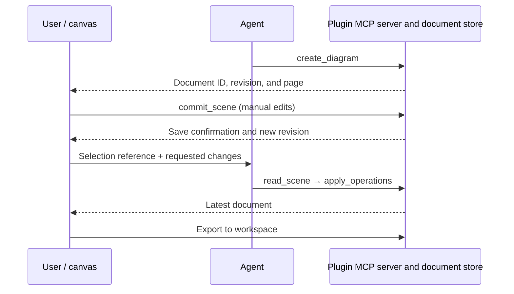
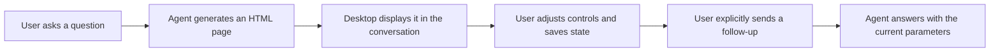

# UI Plugin: Capabilities, Development, Debugging, and Examples

[简体中文](UI_PLUGIN.md) | English

Start with Excalidraw to see how UI Plugins let the Agent and the user edit and save the same content. This guide covers capabilities implemented in the current source, supported APIs, installation and debugging, and five examples. Follow these links to get started:

- [Try the Excalidraw demo](#featured-example-excalidraw)
- [Explore Gen UI examples, interfaces, and use cases](#gen-ui-interactive-answers-generated-on-demand)
- [Develop and debug a plugin](#development-and-debugging)
- [Look up page APIs](#page-api-reference)
- [Add a UI to your plugin](#adding-a-ui-to-your-plugin)
- [Explore the other examples](#other-example-plugins)

This guide focuses on testing plugins with the host in the main repository. Plugin development and builds take place in the separate `zcode-plugins` repository.

## What UI Plugins Can Do

A UI Plugin adds an interactive page to an ordinary plugin. The Agent can call tools to create or modify content, while users work directly with canvases, forms, or file lists and send selections or results back to the conversation. The page communicates with the host through MCP Apps; the plugin's MCP server manages application data.

Registration, installation, enabling, and updates follow the ordinary plugin workflow. Pages use the official `@modelcontextprotocol/ext-apps` SDK. They do not need a separate ZCode Plugin SDK or a development guide plugin. The current plugin repository pins the page SDK to `2.0.0` and the MCP server SDK to `1.29.0`. Check the SDK major version when reading upstream examples; the repository lockfile determines the installed versions.

| Capability                               | User experience                                                                                  | Development entry point                                      |
| ---------------------------------------- | ------------------------------------------------------------------------------------------------ | ------------------------------------------------------------ |
| Interactive tool results                 | Create canvases, display charts, or fill in forms                                                | MCP tool `_meta.ui.resourceUri` + an HTML resource           |
| Session side panels                      | Open an editor manually, then use subsequent tools to edit the same document                     | Manifest `ui.surfaces` and tool `_meta.ui.surface`           |
| Page calls to the plugin server          | Click buttons to refresh data, save documents, or perform actions                                | `app.callServerTool()`                                       |
| Collaboration with the main conversation | Reference a selection or send the next message with a user action                                | `updateModelContext()` / `sendMessage()`                     |
| Model calls within the App               | Keep model responses inside the plugin's own UI                                                  | `createSamplingMessage()`                                    |
| Model calls to page tools                | Work with editor state owned by a live page                                                      | `registerTool()` or `onlisttools` + `oncalltool`             |
| Page state and resource updates          | Retain a page when moving it, restore its view after recreation, and subscribe to server changes | Live page retention, widgetState, and resource subscriptions |

Interactive pages currently run in **local workspaces in ZCode Desktop**. Web, mobile, and remote workspaces retain ordinary MCP tool records; interactive panels are not supported on those paths yet. Plugin pages and Gen UI use different loading and communication protocols, so their APIs are not interchangeable.

## Featured Example: Excalidraw

Excalidraw demonstrates a drawing workflow that stays editable: the Agent creates a draft, the user adjusts the layout, and the Agent makes further changes to a selection. The canvas remains a document rather than a single generated image.

### Visual Walkthrough: From Canvas to Conversation

These screenshots show a differential-equation learning example in the English UI: create a canvas, reference a selection, and ask a follow-up with that context.

**1. Turn a question into an editable canvas**

Ask, "Draw a differential equation for me. I am learning and want to understand it quickly." The Agent draws the concepts, solution steps, and slope field on an Excalidraw canvas. The explanation and canvas appear side by side; shapes and text remain editable, and the document can be saved and exported.


**2. Reference a selection to focus the conversation**

Select the slope-field elements, open the context menu, and choose **Reference selection in chat**. The plugin adds information about those elements to the conversation context so the user can discuss a specific part of the diagram.


**3. Ask a follow-up with the selected context**

Once **Plugin context** appears in the composer, type "What does the direction of the arrows mean?" and send the message. Referencing a selection first adds pending context; when the user sends the question, the Agent receives both the question and the selection information to identify the relevant part of the canvas.


### Five-Minute Demo

After installing and enabling `excalidraw`, open a new session in a local desktop workspace:

1. Ask: "Use Excalidraw to draw an architecture diagram with an API, a cache, and a database. Show the request direction." The model calls `create_diagram`, and an editable canvas opens in the side panel.
2. Move nodes or change their colors and text, then wait for the page to show that the document is saved. This means the backend has confirmed the save.
3. Select the cache node, open its context menu, and choose the action to reference the selection in the conversation. Ask: "Replace the selected cache with two nodes, keeping the rest of the layout." With no elements selected, you can reference the entire diagram.
4. The Agent uses `read_scene` to get the latest version, then calls `apply_operations` with stable element IDs without redrawing the whole canvas. User edits and tool edits share the current page's undo/redo history.
5. Click the canvas title to switch or import documents. Use the export action to save `.excalidraw`, PNG, or SVG files to the workspace. Overwriting an existing file requires an explicit overwrite choice.



### Excalidraw Tools

These are the plugin's own MCP tools, separate from the general page APIs described later. App-only tools are not exposed in the model's tool list.

| Tool               | Caller     | Purpose and key parameters                                                                                 |
| ------------------ | ---------- | ---------------------------------------------------------------------------------------------------------- |
| `create_diagram`   | Model, App | Create a canvas with `title` and `elements`; returns the document ID and revision                          |
| `open_diagram`     | Model, App | Open a saved document by `id`, or import a workspace `.excalidraw` file by `path`; supply one or the other |
| `read_scene`       | Model, App | Read the current revision and element summaries; use `elementIds` to restrict the selection                |
| `apply_operations` | Model, App | Add, update, or remove elements by ID; supply `expectedRevision` and `operationId`                         |
| `export_diagram`   | Model, App | Export a native `.excalidraw` file with revision checking; overwriting requires `overwrite: true`          |
| `commit_scene`     | App only   | Submit the full editing draft with revision conflict checking                                              |
| `list_diagrams`    | App only   | List documents in the current workspace                                                                    |
| `save_copy`        | App only   | Save a draft or imported content as a new document                                                         |
| `save_image`       | App only   | Write a PNG or SVG rendered by the page to the workspace                                                   |

Documents are stored in SQLite inside the plugin data directory and isolated by workspace. A revision conflict preserves the page's draft so the user can save a copy or reload. Retries of the same operation reuse its `operationId`. `widgetState` stores view information only; it cannot replace the document store.

Each document currently supports up to 5,000 elements and 6 MiB. The editor and fonts ship with the plugin and do not depend on a CDN. Undo history belongs to the current live editor and does not survive application restarts. Real-time multi-user collaboration, system clipboard access, and cloud sharing are not currently provided.

## Gen UI: Interactive Answers Generated on Demand

Gen UI (generative UI) lets the Agent create an HTML / JavaScript page for the current question and embed it directly in the conversation. Move sliders, switch conditions, select items, and observe the results, then ask a follow-up with the current parameters. Each page is generated on demand without first creating and installing a plugin for it.

### Gen UI in Pictures

These screenshots show a generated capability demo in Chinese. Its tabs and content illustrate how a page can be built; they are not fixed application screens. Click an image to view it at full size.

| Components and content                                                                                                                                                                                   | Controls and calculations                                                                                                                                                                                |
| -------------------------------------------------------------------------------------------------------------------------------------------------------------------------------------------------------- | -------------------------------------------------------------------------------------------------------------------------------------------------------------------------------------------------------- |
| <a href="docs/images/gen-ui/components.png"></a> | <a href="docs/images/gen-ui/controls.png"></a> |
| Organize an answer into a browsable panel with summary cards, progress, tables, and icons.                                                                                                               | Compare calculated results by changing the growth rate, compound-growth toggle, and baseline option.                                                                                                     |

| Charts and comparisons                                                                                                                                                           | Calendar and schedule                                                                                                                                                                             |
| -------------------------------------------------------------------------------------------------------------------------------------------------------------------------------- | ------------------------------------------------------------------------------------------------------------------------------------------------------------------------------------------------- |
| <a href="docs/images/gen-ui/charts.png"></a> | <a href="docs/images/gen-ui/calendar.png"></a> |
| Compare P50 / P95 trends with lines and percentiles with bars. The charts use example data.                                                                                      | `viz-calendar` lays out events by time and supports viewing their details. This is a schedule demo within the page.                                                                               |

| State and follow-ups                                                                                                                                                                                        | Design previews and adjustments                                                                                                                                                                |
| ----------------------------------------------------------------------------------------------------------------------------------------------------------------------------------------------------------- | ---------------------------------------------------------------------------------------------------------------------------------------------------------------------------------------------- |
| <a href="docs/images/gen-ui/state.png"></a> | <a href="docs/images/gen-ui/design.png"></a> |
| Organize preferences and parameters into a `modelContent` / `privateContent` snapshot. The view shows unsaved state; the page can save it and provide a button to ask a follow-up.                          | Use `viz-carousel` to compare player designs and Tweak to adjust styles. This is a UI prototype.                                                                                               |

In a ZCode Desktop session that supports Gen UI, try requests like these. The Agent generates the controls and interactions for the task:

| Scenario             | Example prompt                                                                                                                                   | How to interact                                                                                 |
| -------------------- | ------------------------------------------------------------------------------------------------------------------------------------------------ | ----------------------------------------------------------------------------------------------- |
| Understand a concept | "Use Gen UI to explain sine waves. Let me adjust amplitude and frequency with sliders and watch the curve change."                               | Adjust parameters and compare curves to understand how variables relate                         |
| Explore an algorithm | "Use Gen UI to demonstrate binary search, with a target input, single-step execution, and the current search range highlighted."                 | Change the input, step forward, and reset to inspect each stage                                 |
| Refine a design      | "Use Gen UI to create a course card with Tweak controls for corner radius, colors, and layout density, then refine it using my chosen settings." | Preview style changes immediately, then explicitly submit adjustments for the Agent to continue |



### Capabilities and Page Interfaces

| Capability                          | Current behavior                                                                                                                                     |
| ----------------------------------- | ---------------------------------------------------------------------------------------------------------------------------------------------------- |
| Interaction inside the conversation | Pages appear after the answer completes and can contain charts, forms, simulators, and lightweight prototypes                                        |
| Expand and share                    | Expand or collapse the preview and copy the current view as an image; expanding and collapsing retain the same live page                             |
| State and follow-ups                | Pages can save control state and send a follow-up after user interaction; changing controls or saving state alone does not start an Agent turn       |
| Tweak controls                      | When a page registers controls, the host provides sliders, colors, toggles, and choices, with reset, original-state preview, and explicit submission |

Generated pages use the Gen UI interface injected by the host:

| Interface                                                       | Purpose                                                                                                                                   |
| --------------------------------------------------------------- | ----------------------------------------------------------------------------------------------------------------------------------------- |
| `window.zcode.widgetState`                                      | Read saved page state; the initial value may be `null`                                                                                    |
| `window.zcode.setWidgetState({ modelContent, privateContent })` | Replace the entire JSON state snapshot, up to 16 KiB combined; only `modelContent` enters the next model context                          |
| `window.zcode.sendFollowUpMessage({ prompt, title })`           | Send a follow-up; `title` is optional. Confirmation is required without a valid user gesture, and stale or read-only sessions cannot send |
| `zcode:set_globals`                                             | Listen for state or theme updates and read the new values from the event's `detail.globals`                                               |

The desktop host supplies the Agent with a dedicated output directory for the current session. Generated HTML is saved there and loaded by the host, outside the project workspace; page state is isolated by workspace and session. The host injects the page bridge, so authors do not create another MCP Apps connection. Gen UI pages do not expose `callTool`, MCP resource reads, Node, or arbitrary file access. Use a UI Plugin when operations need a plugin server.

### Choosing Between Gen UI and UI Plugins

| Aspect            | Gen UI                                                                                         | UI Plugin                                                                           |
| ----------------- | ---------------------------------------------------------------------------------------------- | ----------------------------------------------------------------------------------- |
| Origin            | The Agent generates a page for the current question                                            | Developers maintain and publish a plugin that users install and enable              |
| Best fit          | Concept explanations, interactive charts, simulators, temporary calculators, and UI prototypes | Reusable editors, file tools, and applications with business data                   |
| Page capabilities | Gen UI state, follow-up, and Tweak interfaces                                                  | MCP Apps APIs plus plugin MCP tools and resources, within host support              |
| Data ownership    | The host manages generated files and session page state                                        | The plugin server manages application files or databases; the page manages its view |

The Excalidraw screenshots above show a **UI Plugin**. Use **Gen UI** for a page with adjustable parameters generated around the current question. Develop a UI Plugin to distribute a reusable tool with server operations and document management. Both may expose `window.zcode`, but their methods and state structures differ and are not interchangeable. See [Development and Debugging](#development-and-debugging) and the [Page API Reference](#page-api-reference) for UI Plugin details.

Implementation and page examples: [Gen UI contract](packages/ui/src/gen-ui/CONTRACT.md), [page API examples](apps/zcode-cli/packages/visualize-plugin/skills/visualize/references/api.md), and [Tweak guide](apps/zcode-cli/packages/visualize-plugin/skills/visualize/tweak.md). The desktop integration entry is `node packages/desktop/scripts/gen-ui-e2e.mjs`.

## Other Example Plugins

| Plugin                          | Features and demo prompt                                      | What to learn from it                                                                                         | Current boundaries                                                                                                                                           |
| ------------------------------- | ------------------------------------------------------------- | ------------------------------------------------------------------------------------------------------------- | ------------------------------------------------------------------------------------------------------------------------------------------------------------ |
| **Excalidraw** `excalidraw`     | "Draw a system architecture diagram, then modify a selection" | Canvas editing, autosave, targeted changes, context references, and export; start here for a complete example | Local workspaces; persistent documents are separate from temporary view state                                                                                |
| **OpenPencil** `openpencil`     | "Create designs/landing.fig and add a hero section"           | `.fig` design documents, design tools, selection references, and generating code from designs                 | One live editor per workspace; `.pen` imports are read-only; exports go to `exports/`                                                                        |
| **Blender** `blender`           | "Create a Blender scene, add objects, and render a preview"   | `.blend` scenes, 3D previews, materials, cameras, lights, and render resources                                | Real operations require the Blender engine; the fake engine is for tests only                                                                                |
| **Disk Cleaner** `disk-cleaner` | "Find large files taking up space in Downloads"               | Read-only scans, pagination and filters, candidate selection, plan confirmation, and execution feedback       | Cleanup tools are App-only; confirmed actions move files to Trash and do not permanently delete them                                                         |
| **Showcase** `showcase`         | "Demonstrate all Showcase cases"                              | SC01–SC53 catalogue: resources, messages, state, sampling, page tools, and failure scenarios                  | Cases are classified as directly interactive, assisted, automation-only, or pending; 53 entries do not mean all 53 are implemented or automatically verified |

## Development and Debugging

### Responsibilities of the Two Repositories

| Repository                                                        | Branch           | What to change                                                                 | Where to run or find it                                                   |
| ----------------------------------------------------------------- | ---------------- | ------------------------------------------------------------------------------ | ------------------------------------------------------------------------- |
| [zai-org/ZCode](https://github.com/zai-org/ZCode)                 | `feat/ui-plugin` | Host protocol, side panels and inline views, sandbox, approvals, and lifecycle | `pnpm dev:desktop`                                                        |
| [zai-org/zcode-plugins](https://github.com/zai-org/zcode-plugins) | `feat/ui-plugin` | Plugin manifests, MCP servers, pages, application data, and resource packaging | Sources in `ui-plugins/<name>`; installable artifacts in `plugins/<name>` |

The development and debugging steps in this guide target the `feat/ui-plugin` branch in each repository. **This branch is not yet available in the public ZCode repository.** Once it is ready, check it out from the repository above to test plugins with the host.

The shell examples below target macOS / Linux. Replace both paths with your own checkouts. Use Node.js `24.14.0` and pnpm `10.33.2`. On Windows, set the same environment variables in PowerShell, then run the corresponding `pnpm` / `node` commands in each repository.

### First Run: Install Only the Plugins You Want to Test

```sh
ZCODE_REPO=/path/to/z-code
PLUGINS_REPO=/path/to/zcode-plugins

# Optional isolated development profile; use the same value for the CLI and desktop.
export ZCODE_DATA_BASE_DIR="$HOME/.zcode-ui-plugin-dev"

# Initialize the main repository once; skip if already done.
cd "$ZCODE_REPO"
pnpm bootstrap

# Build plugins and generate the local catalogue; this does not register or install them.
cd "$PLUGINS_REPO"
pnpm install --frozen-lockfile
pnpm build

# Use the freshly built CLI to install into the same development profile.
cd "$ZCODE_REPO"
node apps/zcode-cli/packages/cli/dist/zcode.cjs plugins marketplace add "$PLUGINS_REPO/dist/local-marketplace" --scope user
node apps/zcode-cli/packages/cli/dist/zcode.cjs plugins install excalidraw@zcode-plugins-local --scope user
node apps/zcode-cli/packages/cli/dist/zcode.cjs plugins enable excalidraw@zcode-plugins-local --scope user
node apps/zcode-cli/packages/cli/dist/zcode.cjs plugins list --json
pnpm dev:desktop
```

Alternatively, open **Plugin Marketplace → Add** in the same desktop instance, add the absolute path to `dist/local-marketplace`, and choose the plugins to install and enable. The default local source name is `zcode-plugins-local`. The official name in the root manifest is reserved, so do not add the repository root directly. `pnpm dev:desktop` starts the host; it does not register plugins automatically.

If you are using an existing desktop client, build the plugin repository and install through the UI as described above. That client must support the features in this guide. When using an installed `zcode` CLI, ensure it uses the same data profile as the desktop app. A new isolated profile also needs its own login or model setup.

### Update Loop After Changes

```sh
cd "$PLUGINS_REPO"
pnpm build
cd "$ZCODE_REPO"
node apps/zcode-cli/packages/cli/dist/zcode.cjs plugins marketplace update zcode-plugins-local
node apps/zcode-cli/packages/cli/dist/zcode.cjs plugins install excalidraw@zcode-plugins-local --scope user
```

Restart the corresponding desktop instance and verify in a new session. Source watching does not automatically copy plugin repository changes into installed plugins. Refreshing a source updates the catalogue; reinstalling updates the installed code. During development, reinstalling the same version copies the files again. Changes to distributed content still require version bumps in the plugin manifest, marketplace entry, and source package.

If you already use another local source name, preserve that identity with `pnpm marketplace:local --name my-local-plugins --output dist/my-local-plugins` and adjust the marketplace name in the commands accordingly. Avoid creating multiple installation identities just to update one source. `python3 scripts/build_dist.py` clears the root `dist/` directory; run `pnpm marketplace:local` afterward to regenerate the local catalogue.

### Validation by Layer

| Layer                                     | Run in            | Command                                                      | What it verifies                                                                                                          |
| ----------------------------------------- | ----------------- | ------------------------------------------------------------ | ------------------------------------------------------------------------------------------------------------------------- |
| Plugin static checks                      | Plugin repository | `pnpm typecheck`, `pnpm lint`, `python3 scripts/validate.py` | Types, code rules, and manifest consistency                                                                               |
| Communication and application unit tests  | Plugin repository | `pnpm test`                                                  | Automated regressions for connection order, revision conflicts, cancellation, and related behavior                        |
| Standalone installable artifacts          | Plugin repository | `pnpm test:artifacts`                                        | Starting built artifacts outside the repository, reading pages/resources, and checking runtime dependencies               |
| Official App/AppBridge page communication | Plugin repository | `pnpm test:pages`                                            | Real SDK handshakes, initial results, themes, and cancellation for Blender, Excalidraw, and OpenPencil                    |
| Excalidraw smoke test                     | Plugin repository | `pnpm --filter @zcode/plugin-excalidraw smoke`               | The actual stdio server and resource interfaces                                                                           |
| Excalidraw browser interactions           | Plugin repository | `pnpm --filter @zcode/plugin-excalidraw test:e2e`            | Real canvas interactions, saving, undo/redo, and cold starts; the test host bridge does not exercise the Electron sandbox |
| Showcase desktop integration              | Main repository   | The `--showcase-only` command below                          | The Agent, sandbox, real page, and session communication in the current source                                            |

Run `pnpm build` before testing pages. Browser tests require Chrome, or Chromium selected through `CHROME_PATH`. Excalidraw browser screenshots default to `excalidraw-e2e` under the system temporary directory; set `EXCALIDRAW_E2E_ARTIFACTS` to choose an output path.

```sh
cd "$ZCODE_REPO"
ZCODE_SHOWCASE_SERVER="$PLUGINS_REPO/plugins/showcase/dist/server.mjs" \
  node packages/desktop/scripts/mcp-apps-host-e2e.mjs --showcase-only
```

The desktop fixture uses a temporary profile and a local model fixture, and prints the results directory at the end. Use the same script with `--retention-only`, `--storage-only`, or `--sampling-only` to test capacity/eviction, stable storage, or sampling respectively. These tests do not replace checks with real system permissions, a real Blender engine, or other operating systems.

### Troubleshooting

| Symptom                                                 | Check first                                                                                                                                                                                      |
| ------------------------------------------------------- | ------------------------------------------------------------------------------------------------------------------------------------------------------------------------------------------------ |
| The plugin does not appear in the marketplace           | Does `plugins marketplace list --json` include the generated local source? Did you add the repository root by mistake? Do the CLI and desktop use the same profile?                              |
| The source is registered but no panel appears           | Check installation and enabled status in `plugins list --json`, confirm this is a local desktop workspace, and verify that `ui.surfaces` references the correct `mcpServers` key and `ui://` URI |
| Code changes still show the old page                    | Run root `pnpm build`, refresh the same source, reinstall the target plugin, and check for an old application instance or session                                                                |
| The panel opens but resources fail                      | Check the installed `dist`, bundled fonts/scripts/WASM, run `test:artifacts` to detect workspace dependencies, and check CSP and resource size limits                                            |
| The handshake runs twice or the initial canvas is empty | Check for two App instances or mixed use of the official App and `window.zcode`; install handlers before connecting and retain the initial result                                                |
| Referencing content does not immediately send a message | `updateModelContext` adds context for the next turn; use `sendMessage` to send a message. Check the plugin context in the composer                                                               |
| Sampling is unavailable or parameters are rejected      | Check the host's `sampling` capability, whether the current task accepts the operation, and whether the parameters belong to the supported subset below                                          |
| Renaming produces two installations                     | A changed plugin ID creates a separate installation. Handle the old installation as needed while preserving its data; do not directly delete its data directory                                  |
| Developer tools show no page logs                       | Start with host errors in the app's Help → Developer Tools. The plugin has a separate guest; use `app.sendLog()` and page tests to capture its diagnostics                                       |

A stdio MCP server must write only protocol messages to stdout and send debug logs to stderr. When diagnosing an issue, record the plugin ID, source name, workspace, resource URI, and reproduction steps. Do not log credentials or complete user documents.

### Declare the Plugin Type in Pull Requests

**Before requesting review of a PR in `zcode-plugins`, you must declare the plugin type in the PR template and list the affected manifest `name` values.** Select exactly one option:

| Option              | Classification rule                                                                                                           |
| ------------------- | ----------------------------------------------------------------------------------------------------------------------------- |
| **UI Plugin**       | An affected plugin provides MCP Apps interactive pages, including `ui.surfaces` panels and tool `_meta.ui.resourceUri` pages  |
| **Standard plugin** | The plugin provides no MCP Apps interactive page; MCP tools alone or a skill that generates Gen UI do not make it a UI Plugin |
| **Not applicable**  | Repository-level documentation, build, or CI changes only, with no installable plugin content changes                         |

Select UI Plugin even when only changing that plugin's docs or skills, or when adding or removing an interactive page. For multiple plugins, list each name and type and select UI Plugin if any is affected. This PR declaration is separate from marketplace `category`; reviewers must confirm it is complete and accurate before approving.

## Adding a UI to Your Plugin

Use the ordinary plugin installation directory and marketplace entry. Source packages that need compilation declare their own `build` script; use an optional `stage` script for additional resources. Here is a minimal page example for the installable manifest, `.zcode-plugin/plugin.json`:

```json
{
  "name": "my-panel",
  "version": "0.1.0",
  "description": "My interactive panel",
  "mcpServers": {
    "app": {
      "type": "stdio",
      "command": "node",
      "args": ["${ZCODE_PLUGIN_ROOT}/dist/server.mjs"],
      "cwd": "${ZCODE_PROJECT_DIR}",
      "env": {
        "ZCODE_WORKSPACE_ROOT": "${ZCODE_PROJECT_DIR}",
        "ZCODE_PLUGIN_DATA": "${ZCODE_PLUGIN_DATA}"
      }
    }
  },
  "ui": {
    "surfaces": [
      {
        "id": "editor",
        "title": { "en": "Editor", "zh-CN": "编辑器" },
        "server": "app",
        "resourceUri": "ui://my-panel/editor.html",
        "availability": "session"
      }
    ]
  }
}
```

The server must register the `ui://my-panel/editor.html` resource and return it as `text/html;profile=mcp-app`. To use this panel for a tool result, set `_meta.ui.resourceUri` and `_meta.ui.surface: "editor"` on the tool definition. `_meta.ui.visibility: ["model", "app"]` allows both model and App calls; use `["app"]` for App-only tools. `ui.surfaces` is optional: tool metadata can still provide an inline page without it.

Locate plugin files with `${ZCODE_PLUGIN_ROOT}`, perform workspace file operations under `${ZCODE_PROJECT_DIR}`, and store persistent data under `${ZCODE_PLUGIN_DATA}`. Define user configuration through manifest `userConfig`, then reference it in the server configuration with `${user_config.<key>}`. Pages perform file operations through the server; they do not access the main application's source or Node APIs directly.

## Page API Reference

The current host implementation and pinned SDK types define the supported behavior. Register event handlers before `connect()`, then read `getHostCapabilities()` after connecting and enable features based on the result. The official API documentation covers the full SDK; the tables below describe what this host supports.

### Official MCP Apps API

| API / event                                                     | Purpose                                                              | ZCode behavior and usage notes                                                                                                                        |
| --------------------------------------------------------------- | -------------------------------------------------------------------- | ----------------------------------------------------------------------------------------------------------------------------------------------------- |
| `new App(info, capabilities, options)`, `connect()`             | Create the page connection and complete the handshake                | Create one App per live page; do not also access `window.zcode`, which can trigger another connection                                                 |
| `getHostVersion()`, `getHostCapabilities()`, `getHostContext()` | Read host information, capabilities, theme, locale, and display mode | Use after connecting; do not infer capabilities from the host version alone                                                                           |
| `ontoolinput`, `ontoolresult`, `ontoolcancelled`                | Receive complete input, results, and cancellation                    | Retain the initial result for UIs that load later so they do not miss the notification                                                                |
| `onhostcontextchanged`                                          | Respond to theme, locale, size, or mode changes                      | Update presentation without repeating application operations                                                                                          |
| `callServerTool({ name, arguments }, options)`                  | Call a tool on the current plugin server                             | Uses the Agent's permissions and approvals; supports cancellation through `options.signal`; returns the actual `CallToolResult`                       |
| `readServerResource({ uri })`                                   | Read resources from the current server                               | Returns MCP `contents`, with binary data as base64; does not grant access to other plugins or arbitrary local files                                   |
| `listServerResources({ cursor })`                               | List server resources with pagination                                | For resource templates, use the `resources/templates/list` request in the next table                                                                  |
| `sendMessage({ role: "user", content })`                        | Send a follow-up message to the main conversation                    | Requires the `message` capability; sends with a user gesture and enters confirmation without one                                                      |
| `updateModelContext({ content, structuredContent })`            | Attach a selection or other context to the next turn                 | Requires `updateModelContext`; context is visible and removable in the composer, does not immediately send a message, and is not persistent storage   |
| `createSamplingMessage(params, { signal })`                     | Call the current task's model from the App                           | Requires `sampling`; accepts text and images within supported limits and returns text; the App supplies conversation history                          |
| `registerTool(name, config, handler)`                           | Expose page tools for model calls                                    | Register before the handshake and declare the App's `tools` capability; tools are registered/revoked with the live page and follow existing approvals |
| `onlisttools`, `oncalltool`, `sendToolListChanged()`            | Manage the page tool catalogue manually                              | An alternative way to implement page tools; the callback's cancellation signal is `extra.mcpReq?.signal`; Showcase has a complete example             |
| `requestDisplayMode({ mode })`                                  | Request a change of display location                                 | `inline` is inline and `fullscreen` uses the side panel; use the returned mode; `pip` currently keeps the existing mode                               |
| `sendSizeChanged({ height })`                                   | Report content height                                                | SDK automatic measurement is available; for manual measurement, measure the content container to avoid feeding viewport height back to the host       |
| `openLink({ url })`                                             | Open an external link through the host                               | Allows only `http:` / `https:`                                                                                                                        |
| `downloadFile({ contents })`                                    | Open a native save dialog                                            | Requires `downloadFile`; accepts embedded resources or resource links from the current server; cancellation or write failure returns `isError: true`  |
| `sendLog({ level, data })`                                      | Send observable page diagnostics                                     | Keep debug logs out of a stdio server's stdout; do not log secrets or user content                                                                    |
| `onteardown`                                                    | Release page listeners and other resources                           | Host teardown has a time limit; do not leave the only save operation until teardown                                                                   |
| `requestTeardown()`                                             | Ask the host to release the page                                     | ZCode currently only logs the request; actual lifecycle follows the card/panel, so this is not a close button                                         |

Sampling uses the task model selected when the request is accepted. It does not read the main conversation history; only history explicitly supplied by the App enters the request. Unsupported parameters such as `temperature`, `tools`, and native audio are rejected, and `includeContext` only supports `none`. Responses and cancellations should not automatically be appended as main conversation turns.

### ZCode Extensions and Low-Level MCP Requests

The `app.request()` calls below use the official App's low-level interface. Validate results with the corresponding schema from `@modelcontextprotocol/core`.

| Interface / field             | Request or declaration                                                                            | Scope                                                                                                                                                                                                                      |
| ----------------------------- | ------------------------------------------------------------------------------------------------- | -------------------------------------------------------------------------------------------------------------------------------------------------------------------------------------------------------------------------- |
| Session view state            | `ui/set-widget-state`, parameters `{ widgetState }`, result `EmptyResultSchema`                   | Check `experimental["zcode/widgetState"]` first; the initial value comes from the same key in hostContext. Stored in host memory only; can restore views within the session, with no guarantee across application restarts |
| Resource template list        | `resources/templates/list`, result `ListResourceTemplatesResultSchema`                            | Lists the current server's MCP templates; do not assume the App has a `listServerResourceTemplates()` helper                                                                                                               |
| Resource subscriptions        | `resources/subscribe` / `resources/unsubscribe`, parameters `{ uri }`, result `EmptyResultSchema` | Check `experimental["zcode/resourceSubscribe"]` first; the server must also support subscriptions                                                                                                                          |
| Resource change notifications | `notifications/resources/updated` / `notifications/resources/list_changed`                        | Register handlers with `setNotificationHandler()` first; reread the resource when its URI is reported                                                                                                                      |
| Current side panel            | `app.getHostCapabilities()?.experimental?.["zcode/surface"]` returns `{ id }`                     | Keep manifest `ui.surfaces[].id` aligned with tool `_meta.ui.surface`                                                                                                                                                      |
| CSP relaxation                | `unsafeEval` and `wasmUnsafeEval` in resource `_meta["zcode/csp"]`                                | Check the support flags returned by `experimental["zcode/csp"]`; this does not grant file or network permissions                                                                                                           |

### Existing `window.zcode` Pages

Existing compatibility pages can continue using these aliases. Prefer the official App for new pages, and use only one of the two connection approaches.

| Category                   | Available members                                                                                                                    |
| -------------------------- | ------------------------------------------------------------------------------------------------------------------------------------ |
| Connection and observation | `ready()`, `subscribe(listener)`; the latter returns an unsubscribe function                                                         |
| Input and host information | `toolInput`, `toolOutput`, `toolResponseMetadata`, `toolCancelled`, `hostInfo`, `hostCapabilities`, `hostContext`, `protocolVersion` |
| Display information        | `theme`, `locale`, `displayMode`, `maxHeight`, `safeArea`, `userAgent`                                                               |
| Tools and resources        | `callTool(name, args)`, `readResource(uri)`, `listResources()`, `listResourceTemplates()`                                            |
| Resource subscriptions     | `subscribeResource(uri)`, `unsubscribeResource(uri)`, `onResourceUpdated(listener)`, `onResourceListChanged(listener)`               |
| Session view state         | `widgetState`, `setWidgetState(state)`                                                                                               |
| Conversation collaboration | `sendFollowUpMessage({ prompt, structuredContent })`, `updateModelContext({ content, structuredContent })`                           |
| Display and files          | `requestDisplayMode({ mode })`, `notifyIntrinsicHeight(height)`, `openExternal({ href })`, `downloadFile(contents)`                  |

The aliases do not provide sampling or page-tool helpers; use the official App for those capabilities. `openExternal` takes `href`, while the official `openLink` takes `url`; do not interchange these parameter names.

### Minimal Page Connection Example

Bundle this page code into the plugin HTML. It is not a script that can connect to the host from an ordinary browser tab.

```ts
import { App } from "@modelcontextprotocol/ext-apps";
import { EmptyResultSchema } from "@modelcontextprotocol/core";

const app = new App(
  { name: "my-panel", version: "0.1.0" },
  { availableDisplayModes: ["inline", "fullscreen"] },
);
let latestResult: unknown;
app.ontoolresult = (result) => {
  latestResult = result.structuredContent;
  document.querySelector("pre")!.textContent = JSON.stringify(latestResult);
};
function applyTheme() {
  document.documentElement.dataset.theme = app.getHostContext()?.theme ?? "light";
}
app.onhostcontextchanged = applyTheme;
await app.connect();
applyTheme();

async function saveViewState(state: unknown) {
  if (!app.getHostCapabilities()?.experimental?.["zcode/widgetState"]) return;
  await app.request(
    { method: "ui/set-widget-state", params: { widgetState: state } },
    EmptyResultSchema,
  );
}
```

The page HTML must provide the `<pre>` element used in the example. Real components should consume any `latestResult` already received when they mount. This code only handles communication; document saving still goes through the plugin server.

## Platform, Data, and Capability Boundaries

| Data / capability                                           | Where it belongs or how to use it                                                                                                                                              |
| ----------------------------------------------------------- | ------------------------------------------------------------------------------------------------------------------------------------------------------------------------------ |
| Application documents, cleanup plans, and scene revisions   | Owned by the plugin server; write files or databases to the plugin data directory and apply application-specific confirmation and recovery rules                               |
| Input, scroll position, and pending requests in a live page | Retained when the same page moves between inline and side panel views; do not reconnect or resend requests                                                                     |
| `widgetState`                                               | A temporary UI snapshot; recreation, manual retry, and process restart have different semantics, so do not promise permanent storage                                           |
| localStorage / IndexedDB                                    | Browser storage under a stable origin can survive process restarts; isolated by plugin identity, workspace, and account. Clearing browser data does not clear plugin documents |
| Network, fonts, WASM, and scripts                           | Prefer bundling resources; external access is constrained by resource CSP. Pages have no Node or arbitrary filesystem access                                                   |
| Native permissions                                          | camera / microphone / geolocation / clipboardWrite require resource declarations and host/system authorization; they are not available by default                              |

HTML resources currently have a **16 MiB** limit, and page resource reads have an **8 MiB** limit; split large pages into resources. Initial tool results also have limits: `structuredContent` 64 KiB, page metadata 16 KiB, and `content` 32 KiB. Oversized fields are omitted and marked; the page should reread complete data from the server.

**Not yet implemented:** full message-content extensions for image-only/resource-link messages, and bidirectional App tool progress (Showcase SC51/SC52). Existing text-with-image messages, resource reads, and model tool row progress do not establish full support for those capabilities.

See the [MCP Apps API](https://apps.extensions.modelcontextprotocol.io/api/) and [Quickstart](https://apps.extensions.modelcontextprotocol.io/api/documents/quickstart.html) for official SDK concepts and interfaces. Host behavior is determined by the current source covered by this guide and actual capability negotiation; this guide does not promise compatibility with a particular released version.

## Host Source Navigation

| Area to inspect                                  | Current source entry point                                                                                                                                                                          |
| ------------------------------------------------ | --------------------------------------------------------------------------------------------------------------------------------------------------------------------------------------------------- |
| Capability declarations                          | [buildPluginUiHostCapabilities.ts](packages/ui/src/plugin-ui/domain/buildPluginUiHostCapabilities.ts)                                                                                               |
| Session messages, context, and widgetState       | [pluginUiInteractionPorts.ts](packages/ui/src/plugin-ui/app/pluginUiInteractionPorts.ts)                                                                                                            |
| Tools, external links, and display modes         | [pluginUiHostAppHandlers.ts](packages/ui/src/plugin-ui/app/pluginUiHostAppHandlers.ts)                                                                                                              |
| Resource subscriptions                           | [pluginUiResourceSubscriptions.ts](packages/ui/src/plugin-ui/app/pluginUiResourceSubscriptions.ts)                                                                                                  |
| Page retention, eviction, and restoration        | [plugin-ui/CONTRACT.md](packages/ui/src/plugin-ui/CONTRACT.md)                                                                                                                                      |
| HTML, resources, and the Host boundary           | [plugin-ui-bridge/CONTRACT.md](packages/services/src/plugin-ui-bridge/CONTRACT.md)                                                                                                                  |
| Electron sandbox and browser storage             | [pluginSandbox/CONTRACT.md](packages/desktop/src/main/pluginSandbox/CONTRACT.md)                                                                                                                    |
| API limits, sampling parameters, and alias types | [MCP Apps contract](packages/shared/src/mcp-apps/contract.ts), [sampling.ts](packages/shared/src/mcp-apps/sampling.ts), [aliasApi.ts](packages/desktop/src/renderer/src/plugin-sandbox/aliasApi.ts) |
| Desktop integration tests                        | [mcp-apps-host-e2e.mjs](packages/desktop/scripts/mcp-apps-host-e2e.mjs)                                                                                                                             |

The five plugins' application source lives in the separate `zcode-plugins` repository, which also provides a root `UI_PLUGIN.en.md`. This repository owns the host and does not copy plugin products into its tree. When host APIs change, update the capability and API tables in both repositories and both languages.
