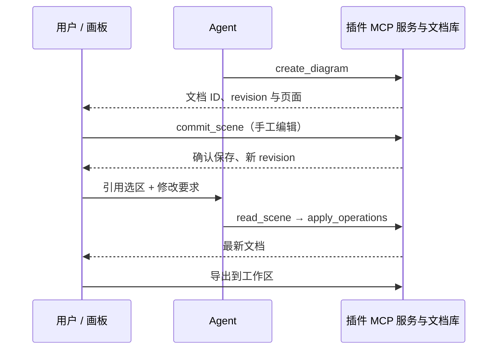
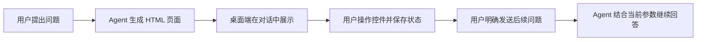

# UI Plugin：能力、开发调试与示例

简体中文 | [English](UI_PLUGIN.en.md)

从 Excalidraw 开始了解 UI Plugin：让 Agent 和用户共同编辑一份可保存的内容。本文覆盖当前源码中的能力、实际可用的 API、安装调试步骤与五个示例，优先按下面的路线阅读。

- [先看 Excalidraw 演示](#重点示例excalidraw)
- [Gen UI：示例、接口与适用场景](#gen-ui按需生成可交互的回答)
- [开发与调试](#开发与调试)
- [页面 API 速查](#页面-api-速查)
- [给自己的插件接入 UI](#给自己的插件接入-ui)
- [其他示例](#其他示例插件)

本篇面向主仓库的宿主联调；插件开发与构建在独立的 `zcode-plugins` 仓库完成。

## UI Plugin 能做什么

UI Plugin 给普通插件增加可交互页面。Agent 可以调用工具创建或修改内容，用户可以直接操作画布、表单、文件列表，再把选区或操作结果交回对话。页面通过 MCP Apps 与宿主通信，业务数据由插件的 MCP 服务管理。

注册、安装、启用和更新沿用普通插件流程。页面使用官方 `@modelcontextprotocol/ext-apps`，不需要单独的 ZCode Plugin SDK，也不要求安装开发指引插件。当前插件仓库锁定页面 SDK `2.0.0`、MCP 服务 SDK `1.29.0`；阅读上游示例时注意 SDK 主版本，实际安装以仓库锁文件为准。

| 能力               | 用户看到的效果                               | 开发入口                                         |
| ------------------ | -------------------------------------------- | ------------------------------------------------ |
| 工具结果带交互页面 | 生成画板、展示图表、填写表单                 | MCP 工具 `_meta.ui.resourceUri` + HTML 资源      |
| 会话侧栏面板       | 手动打开编辑器，后续工具继续操作同一份文档   | 清单 `ui.surfaces`，工具 `_meta.ui.surface`      |
| 页面调用插件服务   | 点击按钮刷新数据、保存文档、执行操作         | `app.callServerTool()`                           |
| 页面与主对话协作   | 引用选区，或由用户点击发送下一条消息         | `updateModelContext()` / `sendMessage()`         |
| App 内模型调用     | 回答留在插件自己的界面                       | `createSamplingMessage()`                        |
| 模型调用页面工具   | 操作只有活页面才拥有的编辑器状态             | `registerTool()` 或 `onlisttools` + `oncalltool` |
| 页面状态与资源更新 | 切换位置保留页面，重建恢复视图，订阅服务变化 | 活页面保留、widgetState、资源订阅                |

交互页面目前用于 **ZCode Desktop 的本地工作区**。Web、手机和远程工作区保留普通 MCP 工具记录，不把这些路径视为已经支持交互面板。插件页面与 Gen UI 的加载和通信协议不同，不能混用两者的 API。

## 重点示例：Excalidraw

Excalidraw 展示的是一套可继续编辑的绘图工作流：Agent 画初稿，用户调整布局，再让 Agent 按选区做局部修改。画布不是一次性图片。

### 图解：从画布回到对话

下面用微分方程学习场景展示完整流程：生成画布、引用选区，再带着上下文继续提问。

**1. 从一个问题生成可编辑画布**

请求“画一个微分方程，我在学习，让我快速能理解”，Agent 将概念、解题步骤和斜率场绘制到 Excalidraw 画布。对话中的解释和侧栏中的画布并排展示，图形与文字可以继续编辑，也可以保存、导出。


**2. 引用选区，把关注点交给 Agent**

框选“斜率地图”这一组元素，右键选择 **引用选区到对话**。插件把选中元素的信息加入对话上下文，用户可以针对图中的某一部分继续交流。


**3. 带着选区继续提问**

输入区出现 **插件上下文** 后，补充“箭头方向是指什么？”，再点击发送。引用选区会先添加待发送的上下文；发送问题时，Agent 才会收到问题和选区信息，理解用户问的是画布中的哪一部分。


### 五分钟演示路线

安装并启用 `excalidraw` 后，在一个桌面本地工作区的新会话里依次操作：

1. 发送：“用 Excalidraw 画一个 API、缓存和数据库的架构图，标出请求方向。”模型调用 `create_diagram`，侧栏打开可编辑画板。
2. 拖动节点、改颜色或文字，等待页面显示“已保存”。这表示后端已确认保存。
3. 选中“缓存”节点，右键选择“引用选区到对话”；发送：“把选中的缓存改成双节点，保留其他布局。”未选中元素时也可以引用整图。
4. Agent 用 `read_scene` 读取最新版本，再用稳定元素 ID 执行 `apply_operations`，无需重画整个画布。用户编辑和工具编辑共用当前页面的撤销/重做。
5. 点击画板标题切换或导入文档；通过“导出”保存 `.excalidraw`、PNG、SVG 到工作区，覆盖已有文件需要明确选择覆盖。



### Excalidraw 工具表

下面是插件自己的 MCP 工具，和后文的通用页面 API 是两个层次。“仅页面”工具不会暴露到模型工具列表。

| 工具               | 调用方     | 用途与关键参数                                                       |
| ------------------ | ---------- | -------------------------------------------------------------------- |
| `create_diagram`   | 模型、页面 | 用 `title`、`elements` 新建画板；返回文档 ID 和版本                  |
| `open_diagram`     | 模型、页面 | 用 `id` 打开已保存文档，或用 `path` 导入工作区 `.excalidraw`；二选一 |
| `read_scene`       | 模型、页面 | 读取当前版本和元素摘要；可用 `elementIds` 限定选区                   |
| `apply_operations` | 模型、页面 | 按元素 ID 增、改、删；携带 `expectedRevision` 与 `operationId`       |
| `export_diagram`   | 模型、页面 | 导出原生 `.excalidraw`；检查版本，覆盖需 `overwrite: true`           |
| `commit_scene`     | 仅页面     | 提交完整编辑草稿，执行版本冲突检查                                   |
| `list_diagrams`    | 仅页面     | 列出当前工作区文档                                                   |
| `save_copy`        | 仅页面     | 将草稿或导入内容另存为新文档                                         |
| `save_image`       | 仅页面     | 将页面渲染的 PNG / SVG 写入工作区                                    |

业务文档在插件数据目录内以 SQLite 保存，按工作区隔离。版本冲突会保留本页草稿，可另存副本或重载；相同操作重试复用 `operationId`。`widgetState` 只保存视图信息，不能代替文档库。

当前每份文档最多 5000 个元素、6 MiB。编辑器和字体随包提供，不依赖 CDN。撤销历史只属于当前活编辑器，不跨应用重启保存；当前未提供多人实时协作、系统剪贴板权限或云分享。

## Gen UI：按需生成可交互的回答

Gen UI（生成式界面）让 Agent 针对当前问题生成 HTML / JavaScript 页面，直接嵌入对话。你可以拖动滑块、切换条件、勾选项目，观察结果，再带着当前参数继续提问。每个页面按需生成，无需先为它创建和安装插件。

### Gen UI 界面示例

下面是一组按需生成的能力演示页面。分组和内容展示了页面可以如何组织，不是应用里的固定界面。点击图片可查看原图。

| 组件与信息组织                                                                                                                                                       | 控件驱动计算                                                                                                                                               |
| -------------------------------------------------------------------------------------------------------------------------------------------------------------------- | ---------------------------------------------------------------------------------------------------------------------------------------------------------- |
| <a href="docs/images/gen-ui/components.png"></a> | <a href="docs/images/gen-ui/controls.png"></a> |
| 用摘要卡片、进度条、表格和图标，把回答组织成可浏览的面板。                                                                                                           | 通过增长率滑块、复利开关和基线选项，对比不同参数下的计算结果。                                                                                             |

| 图表与数据对比                                                                                                                                                         | 日历与日程                                                                                                                                                   |
| ---------------------------------------------------------------------------------------------------------------------------------------------------------------------- | ------------------------------------------------------------------------------------------------------------------------------------------------------------ |
| <a href="docs/images/gen-ui/charts.png"></a> | <a href="docs/images/gen-ui/calendar.png"></a> |
| 折线图对比 P50 / P95 趋势，柱状图展示各分位；图中为示例数据。                                                                                                          | `viz-calendar` 按时间段展示日程，并支持查看事件详情；这里是页面内的日程演示。                                                                                |

| 状态保存与追问                                                                                                                                                                 | 设计预览与调整                                                                                                                                                   |
| ------------------------------------------------------------------------------------------------------------------------------------------------------------------------------ | ---------------------------------------------------------------------------------------------------------------------------------------------------------------- |
| <a href="docs/images/gen-ui/state.png"></a> | <a href="docs/images/gen-ui/design.png"></a> |
| 将偏好和参数组织成 `modelContent` / `privateContent` 快照。画面展示待保存状态；页面可保存参数，再通过按钮发起追问。                                                            | `viz-carousel` 展示多种播放器设计，配合 Tweak 调整样式；这是界面原型。                                                                                           |

在支持 Gen UI 的 ZCode Desktop 会话中，可以直接提出下面这样的请求。具体控件和交互由 Agent 根据任务生成：

| 场景         | 示例提示词                                                                                    | 可以如何交互                                  |
| ------------ | --------------------------------------------------------------------------------------------- | --------------------------------------------- |
| 理解概念     | “用 Gen UI 解释正弦波，让我拖动滑块调整振幅和频率，观察曲线变化。”                            | 调整参数、比较曲线，理解变量之间的关系        |
| 探索算法     | “用 Gen UI 做一个二分查找演示，能输入目标值、单步执行，并标出当前搜索区间。”                  | 修改输入、前进和重置，观察每一步的状态        |
| 调整界面方案 | “用 Gen UI 做一张课程卡片，提供 Tweak 控件调整圆角、配色和布局密度，再按我选的参数继续完善。” | 即时预览样式，明确提交调整后让 Agent 继续修改 |



### 能力与页面接口

| 能力       | 当前行为                                                                                   |
| ---------- | ------------------------------------------------------------------------------------------ |
| 对话内交互 | 页面随回答完成后展示，可包含图表、表单、模拟器和轻量原型                                   |
| 展开与分享 | 可以展开预览、收起，并复制当前界面为图片；展开和收起保留同一个活页面                       |
| 状态与追问 | 页面可保存控件状态，并在用户触发后发送后续问题；仅调整控件或保存状态不会自动启动 Agent     |
| Tweak 调整 | 页面注册控件后，宿主提供滑块、颜色、开关和选项等调整入口，支持重置、原始效果预览和明确提交 |

生成页面使用宿主注入的 Gen UI 接口：

| 接口                                                            | 用途                                                                                  |
| --------------------------------------------------------------- | ------------------------------------------------------------------------------------- |
| `window.zcode.widgetState`                                      | 读取已保存的页面状态，初始值可能为 `null`                                             |
| `window.zcode.setWidgetState({ modelContent, privateContent })` | 替换整个 JSON 状态快照，合计不超过 16 KiB；只有 `modelContent` 会进入下一轮模型上下文 |
| `window.zcode.sendFollowUpMessage({ prompt, title })`           | 发送后续问题，`title` 可选；没有有效用户操作时需要确认，失效或只读会话不能发送        |
| `zcode:set_globals`                                             | 监听状态或主题更新，从事件的 `detail.globals` 读取新值                                |

桌面端会向 Agent 提供当前会话的专用输出目录。生成的 HTML 保存在该目录，由宿主加载，不写入项目工作区；页面状态按工作区和会话隔离。页面桥接由宿主注入，作者不用再创建 MCP Apps 连接。Gen UI 页面不提供 `callTool`、MCP 资源读取、Node 或任意文件访问；需要插件服务执行操作时使用 UI Plugin。

### Gen UI 与 UI Plugin 怎么选

| 对比项   | Gen UI                                           | UI Plugin                                           |
| -------- | ------------------------------------------------ | --------------------------------------------------- |
| 来源     | Agent 围绕当前问题即时生成页面                   | 开发者维护和发布插件，用户安装、启用                |
| 适合什么 | 概念讲解、交互图表、模拟器、临时计算器和界面原型 | 持续使用的编辑器、文件工具和带业务数据的应用        |
| 页面能力 | Gen UI 状态、追问与 Tweak 接口                   | MCP Apps API、插件 MCP 工具与资源，遵循宿主支持范围 |
| 数据归属 | 宿主管理生成文件和会话页面状态                   | 插件服务管理业务文件或数据库，页面管理视图          |

上面的 Excalidraw 截图展示的是 **UI Plugin**。如果需要按当前问题生成一个可调参数的小页面，使用 **Gen UI**；如果要分发一个长期使用、带服务和文档管理的工具，开发 UI Plugin。两者虽都可能出现 `window.zcode`，可用方法和状态结构不同，不能混用。UI Plugin 的开发与 API 见[开发与调试](#开发与调试)和[页面 API 速查](#页面-api-速查)。

实现与页面示例：[Gen UI 契约](packages/ui/src/gen-ui/CONTRACT.md)、[页面 API 示例](apps/zcode-cli/packages/visualize-plugin/skills/visualize/references/api.md)、[Tweak 指南](apps/zcode-cli/packages/visualize-plugin/skills/visualize/tweak.md)。桌面集成验证入口为 `node packages/desktop/scripts/gen-ui-e2e.mjs`。

## 其他示例插件

| 插件                          | 功能与演示指令                                     | 适合参考什么                                                     | 当前边界                                                                            |
| ----------------------------- | -------------------------------------------------- | ---------------------------------------------------------------- | ----------------------------------------------------------------------------------- |
| **Excalidraw** `excalidraw`   | “画一张系统架构图，再按选区修改”                   | 画布、自动保存、局部编辑、上下文引用和导出，建议作为首个完整示例 | 本地工作区；持久文档与临时视图分开                                                  |
| **OpenPencil** `openpencil`   | “新建设计稿 designs/landing.fig，放一个 hero 区块” | `.fig` 设计稿、设计工具、选区引用与按稿生成代码                  | 一个工作区一个活编辑器；`.pen` 只读导入；导出到 `exports/`                          |
| **Blender** `blender`         | “新建一个 Blender 场景，放置物体并渲染预览”        | `.blend` 场景、3D 预览、材质、相机、灯光和渲染资源               | 真实操作需要 Blender 引擎；假引擎仅用于测试                                         |
| **磁盘清理器** `disk-cleaner` | “看看下载目录里哪些大文件占空间”                   | 只读扫描、分页筛选、候选选择、确认计划与执行反馈                 | 清理工具仅供页面使用；确认后移入回收站，不提供永久删除                              |
| **Showcase** `showcase`       | “用 Showcase 演示全部 case”                        | SC01–SC53 目录；资源、消息、状态、sampling、页面工具和失败场景   | 目录项分直接操作、配合操作、自动化专用、待实现；53 项不代表 53 项都已实现或自动验收 |

## 开发与调试

### 两个仓库分别负责什么

| 仓库地址                                                          | 分支             | 修改范围                                       | 运行位置                                                |
| ----------------------------------------------------------------- | ---------------- | ---------------------------------------------- | ------------------------------------------------------- |
| [zai-org/ZCode](https://github.com/zai-org/ZCode)                 | `feat/ui-plugin` | 宿主协议、侧栏和内联展示、沙箱、审批与生命周期 | `pnpm dev:desktop`                                      |
| [zai-org/zcode-plugins](https://github.com/zai-org/zcode-plugins) | `feat/ui-plugin` | 插件清单、MCP 服务、页面、业务数据与资源打包   | `ui-plugins/<name>` 为源码；`plugins/<name>` 为安装产物 |

本文的开发与调试步骤对应两个仓库各自的 `feat/ui-plugin` 分支。**ZCode 公开仓库的该分支目前尚未建好**，待分支准备就绪后再从上述仓库检出并联调。

以下 shell 示例适用于 macOS / Linux，先把两个路径改为自己的检出目录。Node.js 使用 `24.14.0`，pnpm 使用 `10.33.2`。Windows 可在 PowerShell 中设置相同环境变量，再执行各仓库的 `pnpm` / `node` 命令。

### 首次联调：只安装要测的插件

```sh
ZCODE_REPO=/path/to/z-code
PLUGINS_REPO=/path/to/zcode-plugins

# 可选隔离开发配置；后续 CLI 和桌面启动保持同一个值。
export ZCODE_DATA_BASE_DIR="$HOME/.zcode-ui-plugin-dev"

# 主仓库首次初始化；已完成时跳过。
cd "$ZCODE_REPO"
pnpm bootstrap

# 插件仓库：编译并生成本地目录，不会自动注册或安装插件。
cd "$PLUGINS_REPO"
pnpm install --frozen-lockfile
pnpm build

# 主仓库：使用刚构建的 CLI，将插件装进同一个开发配置。
cd "$ZCODE_REPO"
node apps/zcode-cli/packages/cli/dist/zcode.cjs plugins marketplace add "$PLUGINS_REPO/dist/local-marketplace" --scope user
node apps/zcode-cli/packages/cli/dist/zcode.cjs plugins install excalidraw@zcode-plugins-local --scope user
node apps/zcode-cli/packages/cli/dist/zcode.cjs plugins enable excalidraw@zcode-plugins-local --scope user
node apps/zcode-cli/packages/cli/dist/zcode.cjs plugins list --json
pnpm dev:desktop
```

也可以在同一桌面实例的 **插件市场 → 新增** 中添加 `dist/local-marketplace` 的绝对路径，再选插件安装和启用。默认本地来源名是 `zcode-plugins-local`；根清单的官方名称是保留名称，不能直接添加仓库根目录。`pnpm dev:desktop` 只启动宿主，不自动注册插件。

如只用现成桌面客户端，在插件仓库构建后走上述 UI 安装即可；客户端本身需要支持本文功能。使用已安装的 `zcode` CLI 时，确认它和桌面使用同一个数据配置。首次使用隔离配置时，也需在该配置中完成登录或模型设置。

### 修改后的更新循环

```sh
cd "$PLUGINS_REPO"
pnpm build
cd "$ZCODE_REPO"
node apps/zcode-cli/packages/cli/dist/zcode.cjs plugins marketplace update zcode-plugins-local
node apps/zcode-cli/packages/cli/dist/zcode.cjs plugins install excalidraw@zcode-plugins-local --scope user
```

随后重启对应桌面实例，打开新会话验证。源码监听不会把插件仓库的修改自动复制到已安装插件；刷新来源只刷新目录，重新安装才更新代码副本。开发时同版本重装会重新复制；正式分发内容变化仍需升级插件清单、marketplace 和源码包版本。

已有其他本地来源名称时，用 `pnpm marketplace:local --name my-local-plugins --output dist/my-local-plugins` 保持原身份，命令中的市场名也随之调整。不要为了更新同一个本地来源重复创建多个安装身份。`python3 scripts/build_dist.py` 会清空根 `dist/`，之后可执行 `pnpm marketplace:local` 重建本地目录。

### 分层验证

| 层次                        | 在哪里运行 | 命令                                                         | 能证明什么                                                            |
| --------------------------- | ---------- | ------------------------------------------------------------ | --------------------------------------------------------------------- |
| 插件静态检查                | 插件仓库   | `pnpm typecheck`、`pnpm lint`、`python3 scripts/validate.py` | 类型、代码规则和清单一致性                                            |
| 通信与业务单测              | 插件仓库   | `pnpm test`                                                  | 连接顺序、版本冲突、取消等自动化回归                                  |
| 独立安装产物                | 插件仓库   | `pnpm test:artifacts`                                        | 从仓库外启动构建产物、读取页面/资源，检查运行依赖                     |
| 官方 App/AppBridge 页面通信 | 插件仓库   | `pnpm test:pages`                                            | Blender、Excalidraw、OpenPencil 的真实 SDK 握手、初始结果、主题和取消 |
| Excalidraw 冒烟             | 插件仓库   | `pnpm --filter @zcode/plugin-excalidraw smoke`               | 实际 stdio 服务与资源接口                                             |
| Excalidraw 浏览器交互       | 插件仓库   | `pnpm --filter @zcode/plugin-excalidraw test:e2e`            | 真实画布交互、保存、撤销/重做和冷启动；测试宿主桥不等于 Electron 沙箱 |
| Showcase 桌面联调           | 主仓库     | 下方 `--showcase-only` 命令                                  | 当前源码的 Agent、沙箱、真实页面与会话通信                            |

测试页面前先 `pnpm build`；浏览器测试需要 Chrome，或通过 `CHROME_PATH` 指定 Chromium。Excalidraw 浏览器截图默认在系统临时目录的 `excalidraw-e2e`，可用 `EXCALIDRAW_E2E_ARTIFACTS` 指定输出路径。

```sh
cd "$ZCODE_REPO"
ZCODE_SHOWCASE_SERVER="$PLUGINS_REPO/plugins/showcase/dist/server.mjs" \
  node packages/desktop/scripts/mcp-apps-host-e2e.mjs --showcase-only
```

桌面 fixture 使用临时 profile 与本地模型 fixture，末尾输出结果目录。容量/回收、稳定存储、sampling 可分别运行同脚本的 `--retention-only`、`--storage-only`、`--sampling-only`。运行这些测试不会替代具体插件的真实系统权限、真实 Blender 引擎或跨平台验证。

### 常见问题定位

| 现象                        | 先检查                                                                                                                           |
| --------------------------- | -------------------------------------------------------------------------------------------------------------------------------- |
| 插件市场找不到插件          | `plugins marketplace list --json` 中是否有生成的本地来源；是否把仓库根目录误当测试源；CLI 与桌面配置是否一致                     |
| 已登记来源，侧栏仍没有面板  | `plugins list --json` 的安装/启用状态；当前是否是桌面本地工作区；清单的 `ui.surfaces` 是否引用正确 `mcpServers` 键和 `ui://` URI |
| 修改代码后还是旧页面        | 是否执行根 `pnpm build`、刷新同一来源并重装目标插件；是否仍运行旧实例或旧会话                                                    |
| 面板打开但资源失败          | 安装目录是否有 `dist`、离线字体/脚本/WASM；用 `test:artifacts` 排除工作区依赖；检查 CSP 与资源读取上限                           |
| 握手两次或初始画布为空      | 是否创建了两个 App，或官方 App 与 `window.zcode` 混用；是否在连接前安装事件处理器并保留初始结果                                  |
| 点击“引用”没有立刻发消息    | `updateModelContext` 是给下一轮添加上下文，发消息用 `sendMessage`；检查输入区的插件上下文                                        |
| sampling 不可用或参数被拒绝 | 检查宿主是否声明 `sampling`，当前任务是否可操作，以及参数是否属于本文支持子集                                                    |
| 改名后出现两份安装          | 插件 ID 已改变，旧名称和新名称是独立安装；按需处理旧安装，先保留数据，不直接删除插件数据目录                                     |
| 开发者工具没有页面日志      | 应用“帮助 → 开发者工具”首先检查宿主错误；插件有独立 guest，优先用 `app.sendLog()` 和页面测试采集自己的日志                       |

stdio MCP 服务的 stdout 只输出协议消息，调试日志写 stderr。定位时同时记录插件 ID、来源名、工作区、资源 URI 和复现步骤，不记录凭据或完整用户文档。

### 提交 PR 时声明插件类型

**向 `zcode-plugins` 提交 PR 时，必须在 PR 模板中明确声明插件类型，并填写涉及插件的清单 `name`，再发起评审。** 选择且只选择一项：

| 选项                  | 判断标准                                                                                    |
| --------------------- | ------------------------------------------------------------------------------------------- |
| **UI Plugin**         | 涉及的插件提供 MCP Apps 交互页面，包括 `ui.surfaces` 面板和工具 `_meta.ui.resourceUri` 页面 |
| **普通插件（非 UI）** | 插件不提供 MCP Apps 交互页面；仅有 MCP 工具或生成 Gen UI 的 skill 不算 UI Plugin            |
| **不适用**            | 仅仓库级文档、构建或 CI 改动，不涉及可安装插件内容                                          |

即使只改 UI Plugin 的文档或 skill，或者新增、移除交互页面，也选择 UI Plugin。涉及多个插件时分别列出名称与类型，只要包含 UI Plugin 就选择此项。这是 PR 中的类型声明，与市场 `category` 分类独立；评审者批准前必须确认填写完整且准确。

## 给自己的插件接入 UI

沿用普通插件的安装目录与市场条目；需要编译的源码包声明自己的 `build`，额外资源使用可选 `stage`。下面是安装清单 `.zcode-plugin/plugin.json` 的最小页面示例：

```json
{
  "name": "my-panel",
  "version": "0.1.0",
  "description": "我的交互面板",
  "mcpServers": {
    "app": {
      "type": "stdio",
      "command": "node",
      "args": ["${ZCODE_PLUGIN_ROOT}/dist/server.mjs"],
      "cwd": "${ZCODE_PROJECT_DIR}",
      "env": {
        "ZCODE_WORKSPACE_ROOT": "${ZCODE_PROJECT_DIR}",
        "ZCODE_PLUGIN_DATA": "${ZCODE_PLUGIN_DATA}"
      }
    }
  },
  "ui": {
    "surfaces": [
      {
        "id": "editor",
        "title": { "en": "Editor", "zh-CN": "编辑器" },
        "server": "app",
        "resourceUri": "ui://my-panel/editor.html",
        "availability": "session"
      }
    ]
  }
}
```

服务端需要实际注册 `ui://my-panel/editor.html` 资源并返回 `text/html;profile=mcp-app`。让工具结果使用该面板时，在工具定义中设置 `_meta.ui.resourceUri` 和 `_meta.ui.surface: "editor"`；`_meta.ui.visibility: ["model", "app"]` 允许模型与页面调用，仅页面工具使用 `["app"]`。`ui.surfaces` 可省略，此时仍可通过工具元数据提供内联页面。

插件文件使用 `${ZCODE_PLUGIN_ROOT}` 定位，工作区文件操作使用 `${ZCODE_PROJECT_DIR}`，持久数据使用 `${ZCODE_PLUGIN_DATA}`。用户配置通过清单 `userConfig` 定义，并在服务配置里用 `${user_config.<key>}` 引用。页面通过服务执行文件操作，不直接访问主应用源码或 Node API。

## 页面 API 速查

以当前宿主实现和锁定的 SDK 类型为准。先注册事件，再 `connect()`；连接后读取 `getHostCapabilities()`，按返回的能力启用功能。官方 API 文档描述 SDK 的完整表面，宿主支持范围还要看下表。

### 官方 MCP Apps API

| API / 事件                                                      | 用途                                 | ZCode 行为与注意事项                                                                          |
| --------------------------------------------------------------- | ------------------------------------ | --------------------------------------------------------------------------------------------- |
| `new App(info, capabilities, options)`、`connect()`             | 创建页面连接并完成握手               | 每个活页面只建一个 App；不要同时访问会触发另一连接的 `window.zcode`                           |
| `getHostVersion()`、`getHostCapabilities()`、`getHostContext()` | 读取宿主、能力、主题、语言和展示模式 | 在连接完成后使用；不要只按宿主版本号猜能力                                                    |
| `ontoolinput`、`ontoolresult`、`ontoolcancelled`                | 接收完整输入、结果和取消             | 大 UI 延迟加载时，保留初始结果再交给 UI，避免丢通知                                           |
| `onhostcontextchanged`                                          | 响应主题、语言、尺寸或模式变化       | 更新显示；不要因此重复执行业务操作                                                            |
| `callServerTool({ name, arguments }, options)`                  | 调用当前插件服务的工具               | 沿用 Agent 的权限和审批；`options.signal` 可取消；返回真实 `CallToolResult`                   |
| `readServerResource({ uri })`                                   | 读取当前服务的资源                   | 返回 MCP `contents`；二进制是 base64；不能用它访问其他插件或任意本地文件                      |
| `listServerResources({ cursor })`                               | 分页列出服务资源                     | 资源模板列表用后表中的 `resources/templates/list` 请求                                        |
| `sendMessage({ role: "user", content })`                        | 发出主对话后续消息                   | 需要 `message` 能力；有用户手势时发送，无手势时进入确认流程                                   |
| `updateModelContext({ content, structuredContent })`            | 给下一轮对话附加选区等上下文         | 需要 `updateModelContext` 能力；在输入区可见、可删，不立即发消息，不是持久存储                |
| `createSamplingMessage(params, { signal })`                     | App 内调用当前任务模型               | 需要 `sampling` 能力；支持文本与符合限制的图片输入，返回文本；对话历史由 App 提供             |
| `registerTool(name, config, handler)`                           | 页面提供可被模型调用的工具           | 握手前登记；声明 App 的 `tools` 能力；随活页面登记/撤销并遵守既有审批                         |
| `onlisttools`、`oncalltool`、`sendToolListChanged()`            | 手动管理页面工具目录                 | 是另一种页面工具实现方式；取消信号在回调 `extra.mcpReq?.signal` 中；Showcase 提供完整例子     |
| `requestDisplayMode({ mode })`                                  | 请求切换展示位置                     | `inline` 为内联，`fullscreen` 为侧栏；以返回模式为准；`pip` 当前保持原模式                    |
| `sendSizeChanged({ height })`                                   | 报告内容高度                         | 可用 SDK 自动测量；手动测量内容容器，避免把视口高度反馈给宿主                                 |
| `openLink({ url })`                                             | 通过宿主打开外链                     | 仅允许 `http:` / `https:`                                                                     |
| `downloadFile({ contents })`                                    | 调用原生保存对话框                   | 需要 `downloadFile` 能力；支持嵌入资源或当前服务的资源链接；取消/写入失败返回 `isError: true` |
| `sendLog({ level, data })`                                      | 发送可观察的页面诊断                 | 不向 stdio 服务的 stdout 写调试日志；不要记录密钥或用户内容                                   |
| `onteardown`                                                    | 释放页面监听器等资源                 | 宿主做有时限的 teardown，不应把唯一保存操作留到此时                                           |
| `requestTeardown()`                                             | 请求宿主释放页面                     | 当前 ZCode 只记录请求；实际生命周期跟随卡片/面板，不能把它当关闭按钮                          |

Sampling 使用接纳请求时的任务模型，不读取主聊天历史；只有 App 明确传入的历史进入请求。当前不接受 `temperature`、`tools`、原生 audio 等未实现参数，`includeContext` 只支持 `none`。回答和取消不应被自动追加为主对话回合。

### ZCode 扩展与低层 MCP 请求

下面的 `app.request()` 是官方 App 的低层接口。请求结果应使用 `@modelcontextprotocol/core` 的对应 schema 校验。

| 接口 / 字段  | 调用或声明方式                                                                            | 适用范围                                                                                                              |
| ------------ | ----------------------------------------------------------------------------------------- | --------------------------------------------------------------------------------------------------------------------- |
| 会话视图状态 | `ui/set-widget-state`，参数 `{ widgetState }`，结果 `EmptyResultSchema`                   | 先检查 `experimental["zcode/widgetState"]`；初值来自 hostContext 同名键；仅宿主内存，会话内重建可恢复，应用重启不保证 |
| 资源模板列表 | `resources/templates/list`，结果 `ListResourceTemplatesResultSchema`                      | 当前服务的 MCP 模板目录；不要假定 App 存在 `listServerResourceTemplates()` 便捷方法                                   |
| 资源订阅     | `resources/subscribe` / `resources/unsubscribe`，参数 `{ uri }`，结果 `EmptyResultSchema` | 先检查 `experimental["zcode/resourceSubscribe"]`；服务端也须支持订阅                                                  |
| 资源变更通知 | `notifications/resources/updated` / `notifications/resources/list_changed`                | 先用 `setNotificationHandler()` 注册处理器；收到 URI 后自行重新读取资源                                               |
| 当前侧栏面板 | `app.getHostCapabilities()?.experimental?.["zcode/surface"]` 返回 `{ id }`                | 清单 `ui.surfaces[].id` 与工具 `_meta.ui.surface` 保持一致                                                            |
| CSP 放宽     | 资源 `_meta["zcode/csp"]` 中 `unsafeEval`、`wasmUnsafeEval`                               | 检查 `experimental["zcode/csp"]` 返回的支持标记；不等于获得文件或网络权限                                             |

### 现有 `window.zcode` 页面

已有兼容页面可以继续使用以下别名。新页面优先使用官方 App；这两种连接方式选一种即可。

| 类别           | 可用成员                                                                                                                             |
| -------------- | ------------------------------------------------------------------------------------------------------------------------------------ |
| 连接与观察     | `ready()`、`subscribe(listener)`，后者返回取消订阅函数                                                                               |
| 输入与宿主信息 | `toolInput`、`toolOutput`、`toolResponseMetadata`、`toolCancelled`、`hostInfo`、`hostCapabilities`、`hostContext`、`protocolVersion` |
| 展示信息       | `theme`、`locale`、`displayMode`、`maxHeight`、`safeArea`、`userAgent`                                                               |
| 工具与资源     | `callTool(name, args)`、`readResource(uri)`、`listResources()`、`listResourceTemplates()`                                            |
| 资源订阅       | `subscribeResource(uri)`、`unsubscribeResource(uri)`、`onResourceUpdated(listener)`、`onResourceListChanged(listener)`               |
| 会话视图状态   | `widgetState`、`setWidgetState(state)`                                                                                               |
| 对话协作       | `sendFollowUpMessage({ prompt, structuredContent })`、`updateModelContext({ content, structuredContent })`                           |
| 展示与文件     | `requestDisplayMode({ mode })`、`notifyIntrinsicHeight(height)`、`openExternal({ href })`、`downloadFile(contents)`                  |

别名没有 sampling 或页面工具的便捷接口；需要这些能力时使用官方 App。`openExternal` 的参数叫 `href`，官方 `openLink` 的参数叫 `url`，不要混用。

### 最小页面连接示例

这是需要打包到插件 HTML 中的页面代码，不是可直接在普通浏览器标签页中连接宿主的脚本。

```ts
import { App } from "@modelcontextprotocol/ext-apps";
import { EmptyResultSchema } from "@modelcontextprotocol/core";

const app = new App(
  { name: "my-panel", version: "0.1.0" },
  { availableDisplayModes: ["inline", "fullscreen"] },
);
let latestResult: unknown;
app.ontoolresult = (result) => {
  latestResult = result.structuredContent;
  document.querySelector("pre")!.textContent = JSON.stringify(latestResult);
};
function applyTheme() {
  document.documentElement.dataset.theme = app.getHostContext()?.theme ?? "light";
}
app.onhostcontextchanged = applyTheme;
await app.connect();
applyTheme();

async function saveViewState(state: unknown) {
  if (!app.getHostCapabilities()?.experimental?.["zcode/widgetState"]) return;
  await app.request(
    { method: "ui/set-widget-state", params: { widgetState: state } },
    EmptyResultSchema,
  );
}
```

页面 HTML 需提供示例中的 `<pre>`；实际组件应在挂载后消费已经收到的 `latestResult`。这段代码只处理通信，文档保存仍通过插件服务执行。

## 平台、数据与能力边界

| 数据 / 能力                      | 应放在哪里或如何使用                                                                       |
| -------------------------------- | ------------------------------------------------------------------------------------------ |
| 业务文档、清理计划、场景版本     | 插件服务持有；文件或数据库写入插件数据目录，按业务规则确认和恢复                           |
| 当前活页面输入、滚动和运行中请求 | 同一活页面切内联/侧栏时保留；不重复连接或重发请求                                          |
| `widgetState`                    | 临时界面快照；重建、手动重试与进程重启的语义不同，不能用来承诺永久保存                     |
| localStorage / IndexedDB         | 稳定来源下的浏览器存储，可跨进程；插件身份/工作区/账号隔离，清浏览器数据不等于清插件文档   |
| 网络、字体、WASM、脚本           | 优先随包提供；外部访问受资源 CSP 限制，页面没有 Node 或任意文件系统访问权                  |
| 原生权限                         | camera / microphone / geolocation / clipboardWrite 需资源声明及宿主/系统授权；不是默认可用 |

当前 HTML 资源上限 **16 MiB**，页面资源读取上限 **8 MiB**；大页面可拆分资源。初始工具结果存在大小限制：`structuredContent` 64 KiB、页面元数据 16 KiB、`content` 32 KiB；超限字段会被省略并标记，页面应从服务重新读取完整数据。

**尚未实现的范围：**纯图片/资源链接的完整消息内容扩展、App 工具双向进度（Showcase SC51/SC52）。已有的文本附图、资源读取、模型工具行进度不能视为这些能力已经齐备。

官方 SDK 的概念与接口入口见 [MCP Apps API](https://apps.extensions.modelcontextprotocol.io/api/) 和 [Quickstart](https://apps.extensions.modelcontextprotocol.io/api/documents/quickstart.html)。宿主行为以本文对应的当前源码和实际能力协商为准，不据此承诺某个已发布版本的兼容范围。

## 宿主源码导航

| 排查目标                          | 当前源码入口                                                                                                                                                                                    |
| --------------------------------- | ----------------------------------------------------------------------------------------------------------------------------------------------------------------------------------------------- |
| 能力声明                          | [buildPluginUiHostCapabilities.ts](packages/ui/src/plugin-ui/domain/buildPluginUiHostCapabilities.ts)                                                                                           |
| 会话消息、上下文和 widgetState    | [pluginUiInteractionPorts.ts](packages/ui/src/plugin-ui/app/pluginUiInteractionPorts.ts)                                                                                                        |
| 工具、外链和展示模式              | [pluginUiHostAppHandlers.ts](packages/ui/src/plugin-ui/app/pluginUiHostAppHandlers.ts)                                                                                                          |
| 资源订阅                          | [pluginUiResourceSubscriptions.ts](packages/ui/src/plugin-ui/app/pluginUiResourceSubscriptions.ts)                                                                                              |
| 页面保留、回收与恢复规则          | [plugin-ui/CONTRACT.md](packages/ui/src/plugin-ui/CONTRACT.md)                                                                                                                                  |
| HTML、资源与 Host 边界            | [plugin-ui-bridge/CONTRACT.md](packages/services/src/plugin-ui-bridge/CONTRACT.md)                                                                                                              |
| Electron 沙箱与浏览器存储         | [pluginSandbox/CONTRACT.md](packages/desktop/src/main/pluginSandbox/CONTRACT.md)                                                                                                                |
| API 限额、sampling 参数与别名类型 | [MCP Apps 契约](packages/shared/src/mcp-apps/contract.ts)、[sampling.ts](packages/shared/src/mcp-apps/sampling.ts)、[aliasApi.ts](packages/desktop/src/renderer/src/plugin-sandbox/aliasApi.ts) |
| 实际桌面集成测试                  | [mcp-apps-host-e2e.mjs](packages/desktop/scripts/mcp-apps-host-e2e.mjs)                                                                                                                         |

五个插件的业务源码位于独立 `zcode-plugins` 仓库，其根目录也提供 `UI_PLUGIN.md`。本仓库负责宿主，不复制插件成品；宿主 API 变化时同步维护两边文档中英文版的能力与 API 表。
