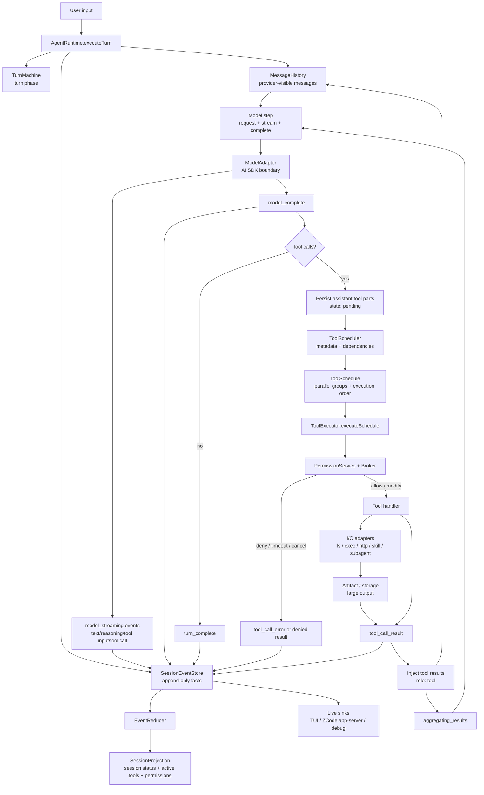
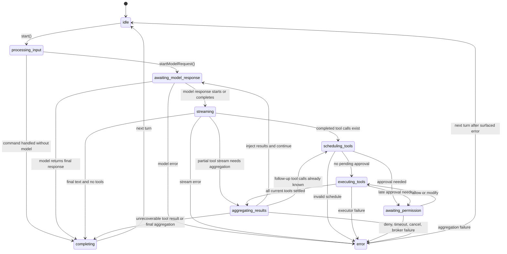
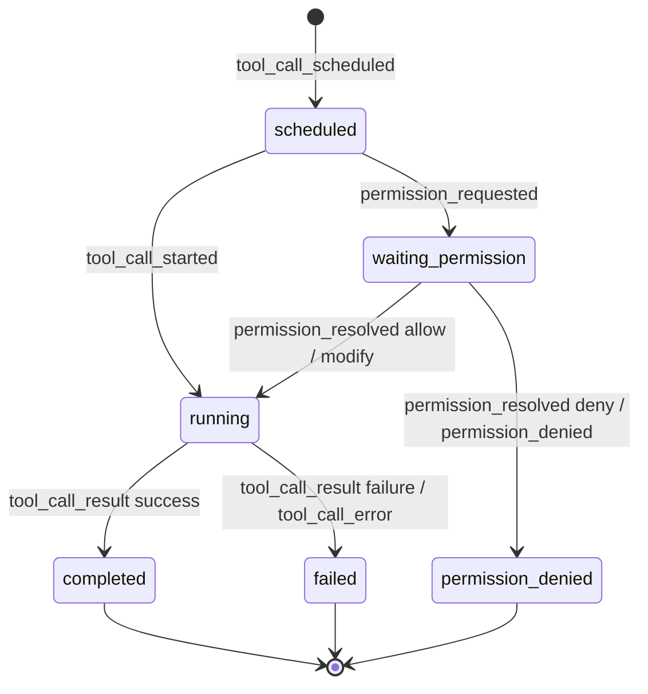

# Output State Rotation Architecture

## 文档定位

本文整理 ZCode 在一次输出过程中的状态轮转，重点回答两个问题：

1. 用户看到的输出为什么会在 thinking、streaming、tool running、permission、done 之间切换。
2. tool 调度到底有哪些状态，哪些是调度计划，哪些是执行状态，哪些只是 UI projection。

本文是 v2 loop spec 的补充文档。它不新增运行时代码，先把现有实现和下一步契约统一成一张架构图。

## 结论

输出过程不是一个单层状态机，而是五层状态并行推进：

| 层级 | 主要状态 | 事实来源 | 消费者 |
| --- | --- | --- | --- |
| Session projection | `idle`、`running`、`waiting`、`paused`、`completed`、`error` | `EventReducer` 从 `SessionEvent` 重建 | TUI、ZCode app-server、debug panel、session list |
| Turn phase | `processing_input`、`awaiting_model_response`、`streaming`、`scheduling_tools`、`executing_tools`、`awaiting_permission`、`aggregating_results`、`completing`、`error` | `TurnMachine` 内存状态 | runtime 控制流、错误归属 |
| Model stream part | `start`、`text_delta`、`reasoning_delta`、`tool_input_delta`、`tool_call`、`finish`、`error` | `model_streaming` 事件 | TUI live assistant text、debug timeline |
| Tool call | `scheduled`、`waiting_permission`、`running`、`completed`、`failed`、`permission_denied` | `ToolExecutor` 事件和 `TurnMachine` | tool progress、message history、artifact |
| Background task | `running`、`completed`、`failed`、`timed_out`、`cancelled`、`spawn_error`、`lost` | `background_task_*` 事件 | TUI long-running task view、debug |

设计上应避免把这些状态压扁成一个枚举。推荐做法是：`SessionEvent` 作为事实，`TurnMachine` 管转移合法性，UI 只做投影。

## 总架构图



## Turn Phase 状态机

`TurnPhase` 是 runtime 的控制流状态，不应直接等同于 UI 文案。



## Tool 调度不是 Tool 状态

`ToolScheduler` 产出的是执行计划，不是工具生命周期。计划由三部分组成：

| 字段 | 含义 |
| --- | --- |
| `items` | 每个 tool call 的调度条目，包含依赖、是否可并行、只读/破坏性/副作用信息 |
| `parallelGroups` | 按批次执行的 tool call id 列表，组内可并发，组间串行 |
| `executionOrder` | `parallelGroups.flat()` 后的模型可解释顺序 |

当前 runtime 传给 scheduler 的 `dependsOn` 还是空数组，依赖能力已经在 scheduler 里存在，但还没有暴露为模型可声明的依赖协议。实际分组主要由 tool 契约决定：

- `readOnly && sideEffectScope === "none"` 通常可并行。
- `concurrentSafe: true` 可并行。
- `concurrentSafe: false`、`destructive: true` 或 workspace/system/git/network 副作用通常串行。
- `maxConcurrency` 会把过大的并行组拆成多个批次。

```mermaid
flowchart LR
  Calls["Model tool calls"] --> Registry["ToolRegistry metadata\nreadOnly / destructive / concurrentSafe / sideEffectScope"]
  Registry --> Dependencies["ToolDependency[]\ndependsOn + safety metadata"]
  Dependencies --> Topo["Topological sort\ncycle detection"]
  Topo --> Grouping["Group by dependency level\nand parallel safety"]
  Grouping --> Limit["Apply maxConcurrency"]
  Limit --> Plan["ToolSchedule\nitems + parallelGroups + executionOrder"]

  Plan --> Batch0["batch 0\nparallel"]
  Plan --> Batch1["batch 1\nexclusive or parallel"]
  Plan --> BatchN["batch n"]

  Batch0 --> Complete0["tool_batch_complete"]
  Complete0 --> Batch1
  Batch1 --> Complete1["tool_batch_complete"]
  Complete1 --> BatchN
```



## Tool Call 生命周期

单个 tool call 的理想生命周期如下：



需要注意：代码里同一件事目前有多套名称。

| 语义 | TurnMachine | Session projection | persisted message part | SessionEvent |
| --- | --- | --- | --- | --- |
| 已排队 | `scheduled` | `pending` | `pending` | `tool_call_scheduled` |
| 等审批 | `waiting_permission` | `pendingPermissions[]` | 仍可显示为 `pending` | `permission_requested` |
| 执行中 | `running` | `running` | `running` | `tool_call_started` |
| 成功 | `completed` | `completed` 后通常被 batch 移除 | `completed` | `tool_call_result` |
| 执行失败 | `failed` | `failed` 后通常被 batch 移除 | `error` | `tool_call_error` 或失败 result |
| 权限拒绝 | `permission_denied` | `denied` | `error` 或拒绝结果 | `permission_denied` / `permission_resolved` |

这张表是 UI 和 debug 视图应该使用的翻译层。不要要求所有底层枚举立即同名，但新事件和新 UI 文案应尽量沿用“pending / waiting permission / running / completed / failed / denied”这组用户可见词。

## 输出过程事件序列

下面是一次“模型输出 tool call，tool 执行后继续模型输出最终答案”的典型序列：

| 顺序 | 事件 | Turn phase | 用户可见状态 |
| --- | --- | --- | --- |
| 1 | `turn_started` | `processing_input` | 收到输入，开始处理 |
| 2 | `model_request` | `awaiting_model_response` | Calling model |
| 3 | `model_streaming(start/text_delta/reasoning_delta)` | `streaming` | Assistant 正在输出 |
| 4 | `model_streaming(tool_input_delta/tool_call)` | `streaming` | 模型正在生成 tool call |
| 5 | `model_complete` | `streaming` | 本次模型 step 完成 |
| 6 | `tool_call_scheduled` | `scheduling_tools` | Tool pending |
| 7 | `permission_requested` 可选 | `awaiting_permission` | 等待用户批准 |
| 8 | `permission_resolved` 可选 | `executing_tools` | 用户已批准或修改 |
| 9 | `tool_call_started` | `executing_tools` | Tool running |
| 10 | `tool_call_result` / `tool_call_error` | `executing_tools` | Tool completed / failed |
| 11 | `tool_batch_complete` | `aggregating_results` | 当前批次结束 |
| 12 | tool result 注入 `MessageHistory` | `aggregating_results` | 准备下一次模型请求 |
| 13 | 回到 `model_request` | `awaiting_model_response` | Calling model |
| 14 | `model_streaming(text_delta)` | `streaming` | Assistant 继续输出最终答案 |
| 15 | `model_complete` | `streaming` | 模型完成 |
| 16 | `turn_complete` | `completing` | 本轮完成 |

## 状态边界建议

### Session status

`SessionStatus` 只表达粗粒度会话状态，不承载细节：

| 状态 | 建议语义 |
| --- | --- |
| `idle` | 没有正在执行的 turn 或后台交互 |
| `running` | 至少一个 turn 正在推进 |
| `waiting` | turn 正在等待用户或外部系统，不消耗模型/tool 执行 |
| `paused` | 用户主动暂停，可恢复 |
| `completed` | session 被显式结束或归档前的完成态 |
| `error` | 最近一次 turn 以错误结束 |

当前 reducer 已落地 `idle`、`running`、`error` 的主线语义。`tool_batch_complete` 只表示当前并行工具组结束，会从 projection 移除对应 `activeToolCalls`，但不会把 session 从 `running` 切回 `idle`；只有 `turn_complete` 才结束本轮并回到 `idle`。`waiting`、`paused`、`completed` 仍是保留状态，后续接入交互 permission、pause/resume、archive 时再激活。

### Turn phase

`TurnPhase` 应只由 runtime 控制流推进。UI 可以读取它做 debug 展示，但普通用户状态文案应来自事件投影，而不是直接显示枚举名。

### Tool status

Tool 状态应按 `toolCallId` 独立维护。批次完成不代表 turn 完成，只代表当前并行组已经 settle。一个 turn 内可能经历多轮：

```
model -> tools batch A -> tools batch B -> model -> tools batch C -> model -> final
```

### Model stream part

`ModelStreamingKind` 是输出片段类型，不是 turn 状态。`text_delta` 和 `reasoning_delta` 可以高频出现，TUI 需要帧率合并；`tool_call` 只在完整 tool call 已经可执行时进入 scheduler。

### Background task

背景任务从 tool result 中派生，可能在 turn 完成后继续变化。它必须归属同一个 `traceId`、`sessionId`、`turnId`、`toolCallId`，但不能阻塞当前 turn completion。

## 已知语义缺口

1. `TurnMachine` 有 `requestPermission()` 和 `resolvePermission()`，但当前主要权限流由 `ToolExecutor` 事件驱动。后续如果要让 turn phase 严格反映 `awaiting_permission`，runtime 需要在 executor permission callback 或事件回调里同步推进 machine。
2. Tool 状态名称在 `TurnMachine`、projection、persisted part 和事件之间不完全一致。新功能应先定义翻译表，避免 UI 根据某个内部枚举硬编码。
3. Scheduler 支持依赖和环检测，但 runtime 当前没有从模型或 tool contract 获取真实 `dependsOn`。复杂 tool 编排需要补“模型可声明依赖”或“runtime 派生依赖”的契约。
4. 当前 production streaming v1 是“模型 step 完成后再执行 tool”。边生成 tool input 边启动 tool 的 streaming execution 是后续优化，不能混入当前状态图。

## 测试覆盖建议

后续实现或修改状态轮转时，至少补以下测试：

- `TurnMachine`：覆盖 `awaiting_permission -> executing_tools` 和拒绝路径。
- `EventReducer`：已覆盖 `tool_batch_complete` 后 session 仍保持 `running`，直到 `turn_complete`。
- `AgentRuntime`：streaming tool call、permission ask、tool result injection、下一轮 model request 的事件顺序稳定。
- `ToolScheduler`：只读并行、写入串行、`maxConcurrency` 拆分、依赖排序、环检测。
- TUI projection：把底层状态翻译成 pending、waiting permission、running、completed、failed、denied，且不把批次完成误判为 turn 完成。

## 代码来源

- `packages/core/src/agent/turn-state.ts`
- `packages/core/src/agent/turn-machine.ts`
- `packages/core/src/runtime.ts`
- `packages/core/src/tool/scheduler.ts`
- `packages/core/src/tool/executor.ts`
- `packages/contracts/src/events/session.events.ts`
- `packages/contracts/src/events/event-reducer.ts`
- `packages/contracts/src/interfaces/session.port.ts`
