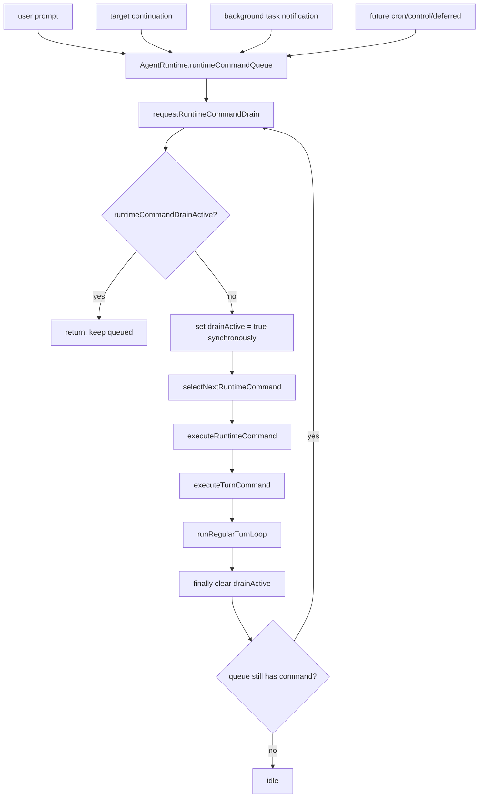

# Runtime Command Queue 前置实施计划

> **For agentic workers:** REQUIRED SUB-SKILL: Use `superpowers:executing-plans` to implement this plan task-by-task. Steps use checkbox (`- [ ]`) syntax for tracking.

**Goal:** 在 `executeTurn` / `runRegularTurnLoop` 前建立 `AgentRuntime` 实例级 command queue 和单一 drain gate，让所有会启动 model loop 的入口先入队再串行执行，为 background subagent、Bash/monitor notification、target continuation 和后续 command queue 能力打地基。

**Architecture:** `executeTurn(...)` 保持 public API，但改为提交 `prompt` command；现有 turn 主体下沉为 internal `executeTurnCommand(...)`。新增 `RuntimeCommandQueue` 和 `drainRuntimeCommandQueue(...)`，drain 入口在任何 await 前同步置 busy。第一阶段只实现 `prompt` 和 `task-notification`，但 command envelope、priority policy、executor switch 和 runtime busy helper 要为后续能力留口。

**Tech Stack:** TypeScript, Vitest, `@zcode/core`, existing `AgentRuntime`, existing `TurnMachine`, existing session event store.

---

## 全局约束

- 只以本计划和当前工作区实现为准；不参考其他分支。
- 本计划是 background subagent 的前置 runtime 地基，不属于 subagent tool 专项计划。
- queue 是 `AgentRuntime` 实例级状态，不能做全局单例。
- main runtime、child runtime、不同 child runtime 的 queue 和 drain gate 完全隔离。
- 第一阶段不把 `steerTurn(...)` 并入外层 queue；active turn 内部追加输入继续使用 `activeTurn.pendingInputs`。
- 第一阶段不实现 prompt merge、cancel/remove、orphaned permission、deferred tool resume、cron/control 或 background sweep，只保留清晰扩展点。
- 不新增外部产品名关键字；新增命名用 runtime/command/task-notification 语义，不用竞品名。
- 不自动提交。每个 phase 只产出 diff 和验证结果。
- 每个 phase 开始前必须重新 review 本 plan；如果现状与 plan 不一致，先更新 plan。
- 每个 phase 必须先补失败单测，再实现；focused tests 通过后才能进入下一 phase。

---

## 调度策略基线

每次开始 Phase 1、Phase 2、Phase 3 前先重新确认以下策略仍是目标行为；如果与现状不一致，先更新本 plan，不能按旧判断继续写代码。

已确认策略：

- command queue 支持 `now / next / later` priority。
- 普通 enqueue 默认 `next`，pending notification 默认 `later`，task completion 显式 `priority: "next"`。
- 主 drain 入口同步设置 busy flag，发生在任何 await 前。
- queue subscriber 只在 drain 不忙且队列有 command 时启动 drain。
- drain finally 清 busy 后再次检查 queue，仍有 pending command 时继续 drain。

---

## 当前实现事实

- `apps/zcode-cli/packages/core/src/runtime/methods/turn.ts`
  - `executeTurn(...)` 当前同时是 public submit API 和真实 turn executor。
  - 它在 async startup 前调用 `reserveTurnStart(...)`，之后再 `beginActiveTurn(...)`。
- `apps/zcode-cli/packages/core/src/runtime/methods/background-notifications.ts`
  - 当前 background notification 有独立 pending/wake 状态，并能直接调用 `executeTurn(...)`。
- `apps/zcode-cli/packages/core/src/runtime/methods/steering.ts`
  - `steerTurn(...)` 当前是 active turn 内部 pending queue。
- `apps/zcode-cli/packages/core/src/runtime/methods/target.ts`
  - `targetContinuationCandidate(...)` 当前只用 `activeTurn` 判断 idle。
- `apps/zcode-cli/packages/core/src/runtime/methods/subagent.ts`
  - child runtime 调自己的 `executeTurn(...)`；queue 落地后它应进入 child runtime 自己的 queue。
- `apps/zcode-cli/packages/core/src/tool/executor/background-tasks.ts`
  - Bash background completion 目前已有 notification producer，后续应接入同一个 runtime queue API。

---

## 目标结构



实例隔离：

```text
main AgentRuntime
  runtimeCommandQueue
  runtimeCommandDrainActive
  activeTurn

child AgentRuntime A
  runtimeCommandQueue
  runtimeCommandDrainActive
  activeTurn

child AgentRuntime B
  runtimeCommandQueue
  runtimeCommandDrainActive
  activeTurn
```

---

## 核心接口草案

新建 `apps/zcode-cli/packages/core/src/runtime/command-queue.ts`：

```ts
import type { TraceContext, TurnState } from "./deps.js";
import type { ExecuteTurnOptions, TurnResult } from "./types.js";

export type RuntimeCommandPriority = "now" | "next" | "later";
export type RuntimeCommandMode = "prompt" | "task-notification";
export type RuntimeCommandId = string & { readonly __runtimeCommandId: unique symbol };

export interface RuntimeCommandBase {
  readonly id: RuntimeCommandId;
  readonly mode: RuntimeCommandMode;
  readonly priority: RuntimeCommandPriority;
  readonly createdAt: Date;
  readonly traceContext: TraceContext;
}

export interface PromptRuntimeCommand extends RuntimeCommandBase {
  readonly mode: "prompt";
  readonly input: string;
  readonly attachments?: TurnState["attachments"];
  readonly options?: ExecuteTurnOptions;
  readonly resolve: (result: TurnResult) => void;
  readonly reject: (error: unknown) => void;
}

export interface TaskNotificationRuntimeCommand extends RuntimeCommandBase {
  readonly mode: "task-notification";
  readonly text: string;
  readonly source: "background_task";
  readonly taskId?: string;
  readonly toolUseId?: string;
}

export type RuntimeCommand =
  | PromptRuntimeCommand
  | TaskNotificationRuntimeCommand;
```

新建 `apps/zcode-cli/packages/core/src/runtime/methods/runtime-command-queue.ts`：

```ts
import type { RuntimeCommand, TaskNotificationRuntimeCommand } from "../command-queue.js";
import type { AgentRuntimeInternal } from "../internal.js";
import type { TurnResult } from "../types.js";

export function enqueueRuntimeCommand(this: AgentRuntimeInternal, command: RuntimeCommand): void;
export function requestRuntimeCommandDrain(this: AgentRuntimeInternal): void;
export function hasActiveOrQueuedTurnWork(this: AgentRuntimeInternal): boolean;
export async function drainRuntimeCommandQueue(this: AgentRuntimeInternal): Promise<void>;
export async function executeRuntimeCommand(
  this: AgentRuntimeInternal,
  command: RuntimeCommand,
): Promise<TurnResult | void>;
export async function executeTaskNotificationCommand(
  this: AgentRuntimeInternal,
  command: TaskNotificationRuntimeCommand,
): Promise<void>;
```

`executeTurn(...)` 保持 public signature；旧主体迁移到 internal `executeTurnCommand(...)`。

---

## Phase 通用执行规程

每个 phase 开始时：

- [ ] 读取本 plan 当前版本：`sed -n '1,260p' apps/zcode-cli/docs/design/v2/loop/runtime-command-queue-plan.md`
- [ ] 查看工作区：`git status --short`
- [ ] 只 review 与本 phase 相关的现有 diff。
- [ ] 如果文件路径或接口名已变化，先更新本 plan。
- [ ] 写失败单测。
- [ ] 运行 focused test，确认失败原因匹配目标行为。
- [ ] 实现最小代码。
- [ ] 再运行 focused tests。
- [ ] 运行 `git diff --check`。
- [ ] 不提交。

---

## Phase 0: Plan Placement And Guard

**目标:** 确认 runtime queue 前置计划独立于 subagent 专项 plan。

**文件:**

- Create: `apps/zcode-cli/docs/design/v2/loop/runtime-command-queue-plan.md`
- Do not modify for this phase: `apps/zcode-cli/docs/design/v2/tool/07-subagent-background-plan.md`

**Checklist:**

- [ ] 本 plan 位于 `design/v2/loop`。
- [ ] subagent plan 不承载 runtime queue phase。
- [ ] 本 plan 明确 queue 是 runtime instance scoped。
- [ ] 本 plan 明确 child runtime queue 与 main runtime queue 隔离。
- [ ] 本 plan 明确 `steerTurn(...)` 第一阶段不并入外层 queue。

**验证:**

```bash
test -f apps/zcode-cli/docs/design/v2/loop/runtime-command-queue-plan.md
git diff -- apps/zcode-cli/docs/design/v2/tool/07-subagent-background-plan.md
rg -n "[Cc][Ll][Aa][Uu][Dd][Ee]" apps/zcode-cli/docs/design/v2/loop/runtime-command-queue-plan.md || true
git diff --check -- apps/zcode-cli/docs/design/v2/loop/runtime-command-queue-plan.md apps/zcode-cli/docs/design/v2/tool/07-subagent-background-plan.md
```

**通过标准:**

- 新 plan 文件存在。
- subagent plan 没有 runtime queue plan diff。
- 关键字扫描无输出。
- `git diff --check` 无输出。

---

## Phase 1: RuntimeCommandQueue Pure Foundation

**目标:** 只新增纯 queue 类型和 priority dequeue policy，不改变 runtime 行为。

**文件:**

- Create: `apps/zcode-cli/packages/core/src/runtime/command-queue.ts`
- Create: `apps/zcode-cli/packages/core/tests/runtime-command-queue.test.ts`

**接口产出:**

- `RuntimeCommandPriority`
- `RuntimeCommandMode`
- `RuntimeCommand`
- `createRuntimeCommandQueue()`
- queue methods: `enqueue`, `dequeue`, `peek`, `hasPending`, `size`, `snapshot`

**Checklist:**

- [ ] 写 priority 测试：`now` 先于 `next`，`next` 先于 `later`。
- [ ] 写同 priority FIFO 测试。
- [ ] 写 snapshot 不可变测试。
- [ ] 实现 queue。
- [ ] 不加 prompt merge、cancel/remove、orphaned permission handler。

**Focused tests:**

```bash
pnpm --filter @zcode/core exec vitest run tests/runtime-command-queue.test.ts
```

**通过标准:**

- 纯 queue tests 通过。
- runtime 行为没有变化。
- `git diff --check` 通过。

---

## Phase 2: Prompt Command Drain Gate

**目标:** 让 public `executeTurn(...)` 提交 `prompt` command；单一 drain gate 是进入 turn 主体的唯一路径。

**文件:**

- Modify: `apps/zcode-cli/packages/core/src/runtime/agent-runtime.ts`
- Modify: `apps/zcode-cli/packages/core/src/runtime/internal.ts`
- Modify: `apps/zcode-cli/packages/core/src/runtime/internal-methods.ts`
- Modify: `apps/zcode-cli/packages/core/src/runtime/methods/index.ts`
- Create: `apps/zcode-cli/packages/core/src/runtime/methods/command-drain.ts`
- Modify: `apps/zcode-cli/packages/core/src/runtime/methods/turn.ts`
- Modify: `apps/zcode-cli/packages/core/src/runtime/methods/target.ts`
- Modify: `apps/zcode-cli/packages/core/tests/runtime-tool-loop.test.ts`

**接口产出:**

- `executeTurnCommand(...)`：旧 `executeTurn(...)` 主体。
- `enqueueRuntimeCommand(...)`
- `requestRuntimeCommandDrain(...)`
- `drainRuntimeCommandQueue(...)`
- `hasActiveOrQueuedTurnWork(...)`

**Checklist:**

- [ ] 把当前 `executeTurn(...)` 主体迁移到 `executeTurnCommand(...)`。
- [ ] 保持 public `executeTurn(...)` signature 不变。
- [ ] 在 `AgentRuntime` 初始化实例级 queue 和 drain state。
- [ ] drain 入口在任何 await 前同步设置 busy。
- [ ] `targetContinuationCandidate(...)` 改用 `hasActiveOrQueuedTurnWork()`。
- [ ] 确认没有外部路径直接调用 `executeTurnCommand(...)`。
- [ ] 保持 `steerTurn(...)` 测试不变。

**Required tests:**

- [ ] `executeTurn serializes concurrent prompt commands on the same runtime`
- [ ] `executeTurn queues are isolated per runtime instance`
- [ ] `steerTurn still queues active-turn input`
- [ ] `target continuation does not start while runtime command drain is active`

**Focused tests:**

```bash
pnpm --filter @zcode/core exec vitest run tests/runtime-command-queue.test.ts tests/runtime-tool-loop.test.ts
```

**通过标准:**

- 同一 runtime 的 concurrent prompt 串行。
- 不同 runtime 的 prompt 互不阻塞。
- steering 行为不变。
- target continuation 不绕过 drain busy。

---

## Phase 3: Task-Notification Command Mode

**目标:** 用 `task-notification` command 取代 background notification 的独立 wake 路径。

**文件:**

- Modify: `apps/zcode-cli/packages/core/src/runtime/methods/background-notifications.ts`
- Modify: `apps/zcode-cli/packages/core/src/runtime/methods/runtime-command-queue.ts`
- Modify: `apps/zcode-cli/packages/core/src/runtime/methods/turn.ts`
- Modify: `apps/zcode-cli/packages/core/src/runtime/methods/turn-loop.ts`
- Modify: `apps/zcode-cli/packages/core/src/runtime/internal.ts`
- Modify: `apps/zcode-cli/packages/core/src/runtime/internal-methods.ts`
- Modify: `apps/zcode-cli/packages/core/tests/subagent-background.test.ts`
- Modify: `apps/zcode-cli/packages/core/tests/runtime-hooks.test.ts`

**行为:**

- `enqueueBackgroundTaskNotification(...)` 只 enqueue `task-notification` command。
- idle runtime 会由 drain gate 启动 model-only turn。
- busy runtime 只入队，等当前 command 完成后继续 drain。
- `task-notification` command 跳过 `UserPromptSubmit` hook。
- provider-visible 内容是 user-role XML，不是 generic system wrapper。

**Checklist:**

- [ ] 删除或停止使用 `backgroundTaskNotificationWakeScheduled`。
- [ ] 删除或停止使用 private pending notification array。
- [ ] `task-notification` command 使用 `inputSource: "background_task"`。
- [ ] `task-notification` command 使用 `inputVisibility: "model-only"`。
- [ ] `task-notification` command 使用 `skipInputRecord: true`。
- [ ] `task-notification` command 使用 `skipUserPromptSubmitHooks: true`。

**Required tests:**

- [ ] `idle task-notification command wakes main agent`
- [ ] `task-notification waits behind active prompt command`
- [ ] `task-notification skips UserPromptSubmit hook`
- [ ] `task-notification command is provider-visible user XML`

**Focused tests:**

```bash
pnpm --filter @zcode/core exec vitest run tests/subagent-background.test.ts tests/runtime-hooks.test.ts
```

**通过标准:**

- 没有 private wake state。
- notification 通过 command queue 唤醒。
- focused tests 通过。

---

## Phase 4: Local-Agent Completion Producer 接入

**目标:** local_agent completion 只作为 `task-notification` producer 接入 runtime queue；修复 fake-notified。

**文件:**

- Modify: `apps/zcode-cli/packages/core/src/subagent/runner.ts`
- Create or Modify: `apps/zcode-cli/packages/core/src/subagent/completion-notification.ts`
- Modify: `apps/zcode-cli/packages/core/src/runtime-task/notification.ts`
- Modify: `apps/zcode-cli/packages/core/tests/subagent-background.test.ts`
- Modify: `apps/zcode-cli/packages/core/tests/subagent-explore.test.ts`
- Modify: `apps/zcode-cli/packages/core/tests/subagent-profile.test.ts`

**行为:**

- completion/failure/stopped 共用一个 local_agent notification helper。
- parent enqueue 成功后才把 task 标记为 notified。
- enqueue 抛错时不写 `notified: true`。
- duplicate finalize 不重复 enqueue。
- generic lifecycle 不依赖 Explore-specific 文案。

**Required tests:**

- [ ] `completed background local agent enqueues one task-notification`
- [ ] `failed background local agent enqueues failed task-notification`
- [ ] `stopped background local agent enqueues stopped task-notification`
- [ ] `enqueue failure does not mark task notified`
- [ ] `duplicate finalize does not enqueue duplicate task-notification`
- [ ] `general-purpose and custom background agents use the same lifecycle`

**Focused tests:**

```bash
pnpm --filter @zcode/core exec vitest run tests/subagent-background.test.ts tests/subagent-explore.test.ts tests/subagent-profile.test.ts
```

**通过标准:**

- fake-notified 在测试中不可达。
- local_agent completion 只通过 runtime queue API 投递。
- focused tests 通过。

---

## Phase 5: Foreground Local-Agent Auto-Background

**目标:** foreground local_agent 在配置 timeout 后转为 background，保持同一 task/child runtime 继续运行。

**文件:**

- Modify: `apps/zcode-cli/packages/core/src/subagent/runner.ts`
- Create or Modify: `apps/zcode-cli/packages/core/src/subagent/lifecycle.ts`
- Modify: `apps/zcode-cli/packages/core/src/runtime-task/registry.ts`
- Modify: `apps/zcode-cli/packages/bootstrap/src/app/runtime-config.ts`
- Modify: `apps/zcode-cli/packages/core/tests/subagent-background.test.ts`
- Modify: `apps/zcode-cli/packages/core/tests/subagent-explore.test.ts`

**行为:**

- explicit `run_in_background: true` 直接后台。
- foreground local_agent 默认仍 foreground。
- `autoBackgroundMs > 0` 时设置正常 ref'd timeout。
- timeout 后同一个 task 标记 background，tool result 返回 `async_launched`。
- child runtime 继续跑。
- child 先完成时清 timer，返回 foreground final result。

**Required tests:**

- [ ] `foreground local agent completes before timeout and returns final result`
- [ ] `foreground local agent becomes background after timeout`
- [ ] `auto-background reuses same task id and output file`
- [ ] `auto-background timer is cleared when child finishes first`
- [ ] `auto-background completion wakes parent through task-notification command`

**Focused tests:**

```bash
pnpm --filter @zcode/core exec vitest run tests/subagent-background.test.ts tests/subagent-explore.test.ts
```

**通过标准:**

- foreground-to-background 是同一 task。
- timer 不 unref。
- completion 复用 Phase 4 producer。

---

## Phase 6: Bash / Monitor Notification Producers

**目标:** Bash/monitor completion 最后接入同一 runtime queue notification producer，不改变 Bash 执行语义。

**文件:**

- Modify: `apps/zcode-cli/packages/core/src/tool/executor/types.ts`
- Modify: `apps/zcode-cli/packages/core/src/tool/executor/background-tasks.ts`
- Modify: `apps/zcode-cli/packages/core/tests/runtime-tool-loop.test.ts`
- Modify: `apps/zcode-cli/packages/core/tests/bash-run-conformance.test.ts`

**行为:**

- Bash/monitor completion enqueue `task-notification` command，priority `next`。
- notification 不创建 user-visible prompt。
- busy 时等待 queue drain。
- Agent async_launched 不被 Bash tracker 双通知。

**Required tests:**

- [ ] `background Bash completion enqueues task-notification command`
- [ ] `background monitor completion enqueues task-notification command`
- [ ] `Bash notification wakes idle runtime`
- [ ] `Bash notification waits behind active prompt command`
- [ ] `Agent async_launched is not double-notified by Bash tracker`

**Focused tests:**

```bash
pnpm --filter @zcode/core exec vitest run tests/runtime-tool-loop.test.ts tests/bash-run-conformance.test.ts tests/subagent-background.test.ts
```

**通过标准:**

- Bash/monitor/local_agent 共享同一 notification queue API。
- 没有双通知。

---

## Phase 7: Final Regression And Cleanup

**目标:** 清理 patch-on-patch 产物，确认 queue 地基可维护。

**Checklist:**

- [ ] 搜索并删除重复 busy flag。
- [ ] 搜索并删除 private notification wake/timer。
- [ ] 搜索并删除 catch-and-ignore enqueue failure。
- [ ] 确认 queue state 只存在于 `AgentRuntime` instance。
- [ ] 确认 future slots 只有类型/模块边界，没有空 handler。
- [ ] 确认 `steerTurn(...)` 行为没被误改。
- [ ] 确认 child runtime queue 与 parent queue 隔离。

**验证:**

```bash
git diff -- apps/zcode-cli | rg -n "^\+.*[Cc][Ll][Aa][Uu][Dd][Ee]" || true
git diff --check
pnpm --filter @zcode/core exec vitest run tests/runtime-command-queue.test.ts tests/subagent-background.test.ts tests/subagent-explore.test.ts tests/subagent-profile.test.ts tests/runtime-hooks.test.ts tests/runtime-tool-loop.test.ts tests/bash-run-conformance.test.ts
pnpm --filter @zcode/core typecheck
pnpm --filter @zcode/core lint
pnpm typecheck
pnpm lint
```

**通过标准:**

- queue/drain 统一入口完成。
- background subagent completion 可以唤醒 parent。
- Bash/monitor notification 走同一 producer。
- no fake running / no fake notified。
- typecheck/lint 通过。

---

## Future Expansion Slots

这些不是当前 scope，只定义未来能力应该放在哪里。

### Future A: Prompt Merge

入口：`RuntimeCommandQueue` dequeue policy。

未来实现连续 prompt merge 时，只改 policy 和 prompt command metadata，不改 `executeTurnCommand(...)`。

### Future B: Cancel / Remove / Queue Snapshot

入口：`RuntimeCommandQueue`。

未来有真实 caller 后再加 `removeById`、`removeByFilter`、cancel pending id；当前不加空 API。

### Future C: Orphaned Permission Command

入口：`RuntimeCommandMode` 和 `executeRuntimeCommand(...)` switch。

未来实现时加入优先级选择，不能混进 prompt merge。

### Future D: Deferred Tool Resume

入口：command producer + meta prompt command。

未来实现时仍由 drain gate 驱动，不新增并行 wake。

### Future E: Cron / Control Command

入口：command producer。

cron/control 只 enqueue command，busy 判断统一使用 `hasActiveOrQueuedTurnWork()`。

### Future F: Background Sweep / Waiting Policy

入口：drain loop post-command policy。

如果未来要等 background task 或做 sweep，只加 post-command policy，不把 polling 塞到 producer 里。

---

## Phase 总览

- [ ] Phase 0: Plan placement and guard.
- [ ] Phase 1: RuntimeCommandQueue pure foundation.
- [ ] Phase 2: Prompt command drain gate.
- [ ] Phase 3: Task-notification command mode.
- [ ] Phase 4: Local-agent completion producer 接入。
- [ ] Phase 5: Foreground local-agent auto-background.
- [ ] Phase 6: Bash / monitor notification producers.
- [ ] Phase 7: Final regression and cleanup.

每个 phase focused tests 通过后，才进入下一个 phase。
