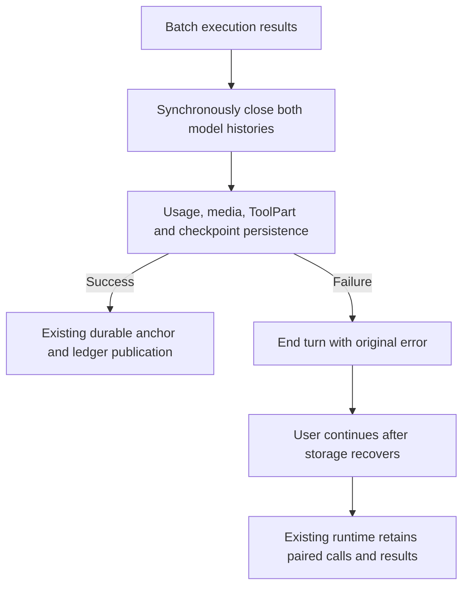

# Streaming Tool Execution And Recovery

## Goal

ZCode should support executing completed tool calls while the model stream is
still open, then use the same state boundaries to recover from retryable
mid-stream provider failures without double-running tools.

This spec covers two linked capabilities:

- Streaming tool execution: once a complete tool call input has streamed in,
  ZCode may schedule the tool before the model response finishes.
- Streaming failure recovery: when the provider stream fails after partial
  output, ZCode may discard uncommitted assistant output and start a new SSE
  request from the latest committed recovery anchor.

The core rule is:

> Retry from committed agent state, not from partial text.

## Non-Goals

- Do not implement provider transport-level SSE resume unless a provider exposes
  a stable resume token or event offset contract.
- Do not default to non-streaming fallback for mid-stream failures.
- Do not automatically roll back external side effects. Conversation cleanup and
  workspace/system rollback are separate capabilities.
- Do not infer recovery state from UI text. Recovery uses session events,
  message history, tool parts, and ledger records.
- Do not add a new `ZCODE_` environment variable for this feature without a
  separate config spec. Initial rollout should use an existing capability gate or
  typed config/session option.

## Current Baseline

Current ZCode starts eligible read-only client tools before the model stream
finishes. Other tools wait until the full step returns. The streaming callback
returns synchronously; pending persistence stays inside the existing early
execution error boundary. Cancellation aborts the active request and does not retry.

Tool declaration order can therefore differ from first-persistence order. Each
existing ToolPart write carries an optional `declarationIndex` within its assistant
message. Provider history hydration first selects the last persisted part for
each call ID within that assistant, then orders both calls and results by the
runtime-generated index when all selected indexes are present. Otherwise it
retains the selected parts' physical order.
This does not change scheduling, persistence timing, or UI ordering.

### Tool part identity across execution failure

End-of-stream fallback and synthetic recovery retain the existing behavior of
allocating a new part ID. The call ID and declaration index still identify the
same model declaration. Reusing the first part ID would preserve its original
SQLite position: a fallback Read that finishes later could then be overwritten
by an older Read snapshot during file-state hydration.

```text
early call -> first part (pending / running)
                    |
                    +-> fallback or synthetic recovery -> new part, same call/index
                                                          |
                         +--------------------------------+----------------+
                         v                                                 v
             model hydration: last part per call             file-state hydration:
             -> declaration order for calls/results          unchanged physical order
```

Pending persistence remains before execution. Model hydration selects the last
newly inserted part per call, regardless of success/error/pending/running state;
it does not use update timestamps or prefer a successful older attempt. If the
latest persisted attempt is unresolved, hydration produces one interrupted
result. Late updates to an earlier part cannot replace the selected newer part.
The executor still handles cancellation through its existing abort signal.

This selection also handles historical duplicate attempts without migrating or
deleting records, changing tool scheduling, retry policy, or public schemas.
Desktop continuous and mobile replayable delivery retain their existing
boundaries. Raw parts and UI/file-state consumers retain their existing order.
Runtime tests inject write failures and delayed scheduling, then inspect stored
parts, cold hydration, and the next model request. SQLite tests also cover full
Read snapshots and subsequent Edit after cold resume and rewind.

## Design Rationale

Tools may start once a streamed `tool_use` block is closed, and orphaned tool
calls are repaired with synthetic tool results on abort/error paths. The key
risk is that a mid-stream non-streaming fallback can double-run tools. ZCode
avoids this by making tool execution state durable and using committed tool
results as recovery anchors.

## Terminology

- `stream attempt`: one provider SSE request.
- `assistant prefix`: assistant content emitted by the current stream attempt.
- `tool call closed`: the model has emitted a complete tool call id, name, and
  parsed input.
- `tool result committed`: the tool result has been validated, persisted, emitted
  as a session event, and appended to model-visible message history.
- `recovery anchor`: the latest provider-valid state that may be used to build a
  new model request after stream failure.
- `ledger`: runtime state tracking streamed tool call lifecycle and recovery
  decisions.
- `partial tail`: assistant text/reasoning/tool input produced after the chosen
  recovery anchor and not committed into provider-visible history.

## Tool Result Settlement

Once execution has returned a batch of real results (including errors and
cancellations), runtime records all results in declaration order in canonical
history and turn request history through one synchronous commit, before any
asynchronous settlement work. This is an in-memory integrity boundary, not a
durable commit or permission to retry tools.



- Completed media persistence does not inherit the cancelled turn signal; Stop
  still cancels unfinished execution and never automatically continues the turn.
- Artifact/ToolPart failures propagate. Failed or unattempted result persistence
  does not publish a recovery anchor or `tool_result_committed`. Existing anchors
  for earlier successful results remain valid.
- Checkpoint cancellation retains its existing deferred-throw behavior so sibling
  persistence finishes before goal reminders and terminal processing.
- No database retry policy, alternate result cache or durable outbox is added.
  After process exit, pending/running stored parts still hydrate as interrupted
  results; unsaved original output is not guaranteed to survive.
- This boundary covers post-execution settlement. Admission and mid-stream
  recovery keep their existing contracts. Desktop continuous and mobile
  replayable still use their existing event delivery and recovery boundaries.

## Tool Ledger

Every streamed client-side tool call must have a ledger record. The ledger is the
source of truth for scheduling, cancellation, resume, and recovery.

Suggested states:

```text
tool_input_streaming
tool_call_closed
tool_queued
tool_started
tool_result_committed
tool_cancelled
tool_abandoned
recovery_blocked
```

`tool_result_committed` is the only normal tool state that creates a recovery
anchor. `tool_abandoned` records attempts discarded outside a retry transcript.
`recovery_blocked` is reserved for non-retryable failures where no provider-safe
transcript can be rebuilt.

Minimum record shape:

```ts
interface StreamingToolLedgerRecord {
  attemptId: string;
  assistantMessageId: string;
  toolCallId: string;
  toolName: string;
  input?: Record<string, unknown>;
  status: StreamingToolLedgerStatus;
  providerExecuted: boolean;
  sideEffectScope: ToolSideEffectScope;
  readOnly: boolean;
  destructive: boolean;
  concurrentSafe: boolean;
  startedAt?: number;
  committedAt?: number;
  resultMessageId?: string;
  resultPartId?: string;
  checkpointId?: string;
  recoveryAnchorId?: string;
}
```

Contracts should live in `packages/contracts` before implementation reaches
core, TUI, ZCode app-server, debug, compact, or resume.

## Recovery Anchors

A recovery anchor is a point where the next provider request can be built without
dangling tool calls or hidden external side effects.

Valid anchors:

- Initial user message before the current assistant stream.
- Complete assistant response with no client-side tool calls.
- Complete assistant tool call plus committed tool result.
- Tool error result, permission denial result, or cancellation result, if it is
  provider-visible and pairs with the corresponding tool call.

Invalid anchors:

- Half a text delta.
- Tool input deltas before `tool_call_closed`.
- A tool call that was emitted but has no matching tool result.
- A running side-effecting tool whose result is unknown.
- UI-only live lines that have not been persisted into session state.

Recovery should prefer the latest valid anchor. If no anchor after the current
user message exists, recover from the user message and discard the stream
attempt.

## Streaming Tool Execution Flow

### Streaming Function Call Input Assembly

Provider adapters must normalize streamed function-call arguments before core
scheduling sees them:

1. `tool_input_start` creates an adapter-local buffer keyed by provider
   `toolCallId` and records `toolName` plus `providerExecuted`.
2. `tool_input_delta` appends to that buffer and is forwarded as a model stream
   event, but it is still a retry-safe prelude until a complete `tool_call`
   exists.
3. After each delta, if the accumulated buffer is valid JSON, the adapter emits
   a synthetic `tool_input_end` when the provider has not ended the input yet,
   then emits exactly one normalized `tool_call`.
4. A later provider `tool_input_end` or provider `tool-call` with the same id is
   treated as a duplicate and must not create a second core tool call.
5. If the stream reaches `finish` with an unfinished input buffer and no final
   provider `tool-call`, the adapter closes the input and emits one best-effort
   `tool_call` using the existing string/tool-input normalization path, so tool
   schema validation can produce the user-visible error.
6. Core must still deduplicate `tool_call` by id as a defensive boundary because
   provider and adapter behavior can differ across transports.

This assembly lives in the model adapter, not in UI projection. ZCode Protocol
and app-server replay should not expose every raw `tool_input_delta` to desktop
or remote clients; high-frequency argument bytes stay in the agent event store
and debug path, while UI receives stable `tool.updated` lifecycle events once a
tool is scheduled/started/resulted.

Model stream handling:

1. `tool_input_start`: create ledger record with `tool_input_streaming`.
2. `tool_input_delta`: append buffered input and emit UI/debug progress only.
3. Adapter closes the input when `tool_input_end` arrives or the buffered JSON
   becomes complete enough to synthesize a provider-neutral `tool_call`.
4. If parse fails, commit a tool error result and create a recovery anchor.
5. If parse succeeds, transition to `tool_call_closed`.
6. Scheduler may transition to `tool_queued` and `tool_started` before stream
   finish.
7. Tool executor still owns permission, hooks, timeout, cancellation, result
   budget, artifacts, and adapter contracts.
8. Tool result commits only through the provider-safe transcript builder.
9. Ledger transitions to `tool_result_committed`.

Scheduling rules:

- Concurrency-safe and read-only tools may run in parallel with each other.
- Non-concurrent, destructive, or broad side-effect tools run exclusively.
- Permission prompts remain serialized by the permission broker even if multiple
  tool calls arrive quickly.
- Provider-native/server-side tools do not enter the client-side executor.
- Result emission must remain provider-valid even when execution finishes out of
  order.

## Provider-Safe Transcript Builder

The transcript builder owns model-visible history mutations during streaming
tool execution.

Responsibilities:

- Keep assistant tool calls paired with exactly one tool result.
- Preserve provider tool call ids exactly.
- Avoid interleaving regular user messages between unresolved tool calls and
  their results.
- Mark abandoned or interrupted tool calls with synthetic error results when
  they have already become provider-visible.
- Exclude UI-only partial assistant text from recovery prompts unless explicitly
  committed as a final assistant message.
- Provide a deterministic active chain for resume, compact, fork, debug replay,
  and recovery retry.

The model adapter must not directly mutate message history based only on stream
chunks. Runtime should commit through the builder after checking ledger state.

## Failure Policy

### User Cancellation

User cancellation is terminal for the current turn and must not trigger automatic
recovery.

Behavior:

- Abort the provider SSE request.
- Stop scheduling new tools.
- Propagate abort to running tools.
- Commit provider-visible interrupted tool results for already visible tool calls
  when required for resume safety.
- Mark the turn as `turn_cancelled`.
- Ignore late provider deltas and late UI updates.

Cancellation is not a provider failure and is not retryable.

### Provider Failure Before Tool Start

If the stream fails after a tool call was partially emitted but the tool has not
started:

- Discard uncommitted tool input and assistant tail.
- Mark ledger state as `tool_abandoned`.
- Retry from the previous recovery anchor if the failure is retryable.

### Provider Failure After Tool Start

If a tool is running when the stream fails:

Freeze the stream, stop scheduling new tools, and ask running tools to settle
through their abort signals. If a tool safely cancels before side effects, commit
a cancellation result or abandon it depending on provider visibility. If it
completes, commit the real result and use it as the latest anchor. If state is
unknown or side effects may have occurred without a result, commit a synthetic
failed tool result that warns side effects may be unknown, then retry from that
`tool_error` anchor.

This is the main safety boundary. Conversation rollback cannot undo filesystem,
process, network, MCP, or external service side effects.

The same boundary applies when an execution-scoped model falls back to the
session model. Before switching model identity, core must settle every complete
client-side tool call: preserve a completed result, commit an explicit cancellation result for safely cancelled execution, synthesize an interrupted
result for unknown execution, persist a terminal ToolPart, and commit
the paired assistant tool call/result to both live and cold provider-visible
history. A fallback must not leave pending/running parts or ask the session model
to blindly repeat the call. This settlement is independent from target resolution:
if no fallback model can be resolved, settle accepted tools first, then terminate
with the original provider error without issuing another model request. Do not emit
a later `tool_abandoned` transition after settlement. The discarded assistant
attempt remains marked as awaiting recovery until a later assistant completes the
turn. When settlement commits at least one tool result, reset the output-token
continuation budget because the tool result is a new execution anchor; a text-only
tail discard does not reset that budget.

### Provider Failure After Tool Result Commit

If one or more tool results were committed before the stream failed:

- Keep committed tool calls and results.
- Discard later partial assistant tail.
- Start a new SSE request from the latest committed tool result anchor.
- Never execute those committed tools again.

Example:

```text
assistant tool_call #1
tool_result #1 committed   <-- recovery anchor
assistant partial text
SSE failed
```

Recovery request context:

```text
user message
assistant tool_call #1
tool_result #1
```

The new request is a fresh SSE request from stable state, not a byte-level stream
resume.

### Provider Failure After Partial Assistant Output Without Tools

If the model emitted visible text or reasoning but no tool call after the previous
anchor:

- Discard the partial text and reasoning from provider-visible history.
- UI may show the partial output as interrupted/recovered, but the next model
  request should not assume it was said.
- Retry from the previous anchor only if the failure is retryable and retry
  budget remains.
- The retry request should keep streaming mode enabled. ZCode does not downgrade
  this path to non-streaming fallback because long agent responses should keep
  incremental UX.
- The new attempt must use a new assistant message id. Clients should treat the
  failed attempt as interrupted/discarded instead of appending the retry output
  onto the old partial assistant tail.

Reasoning remains real-time user-visible output. It crosses the adapter retry
boundary instead of being buffered until text starts, so a reasoning-only reset
or idle timeout is recovered by core from the previous provider-safe anchor.
This path is allowed only while no tool call has been accepted; user cancellation,
non-retryable failures, and exhausted recovery budget remain terminal.

Text overlap/dedupe is a later UX enhancement, not the first safe recovery
mechanism.

## Recovery Events

Add provider-neutral events before implementation:

```text
streaming_tool_ledger_updated
stream_recovery_anchor_created
stream_recovery_started, stream_recovery_anchor_selected
stream_recovery_tail_discarded, stream_recovery_retry_started
stream_recovery_blocked
```

Payloads should include attempt ids, assistant message id, selected anchor,
discarded text/tool ids, committed tool ids, blocked tool id/reason, retry
attempt/max retries, and `traceId` / `sessionId` / `turnId`.

TUI and ZCode app-server should consume events instead of inferring recovery from final error
text.

## Persistence And Resume

Persist enough information to resume safely after process exit:

- Ledger records or equivalent session events for streamed tool lifecycle.
- Assistant parts for text/reasoning/tool input with interrupted/error markers.
- Tool parts for pending/running/completed/error/cancelled states.
- Synthetic interrupted tool results for provider-visible but unresolved tool
  calls.
- Recovery anchor metadata.

On resume:

- Do not send dangling tool calls to the provider.
- Convert pending/running visible tool calls into interrupted tool results unless
  a committed result exists.
- Exclude abandoned stream attempts from active message history.
- Preserve audit trail through tombstone/discard metadata rather than deleting
  all evidence.

## Tool Side Effects

Streaming recovery depends on tool side-effect contracts.

Tool metadata must be sufficient to answer concurrency, read-only/destructive
status, side-effect scope, cancellation support, checkpoint/rollback support,
idempotency for the same `toolCallId` and input, and partial execution
detection.

First implementation should not require every tool to support rollback. Instead:

- Read-only/no-side-effect tools can be abandoned or retried more freely.
- Workspace mutation tools can use existing checkpoint artifacts when available.
- Unresolved side-effect tools default to synthetic failed tool results that
  warn side effects may be unknown; user cancellation still stays terminal.

## Rollout Plan

### Phase 0: Spec And Contracts

- Update this spec, `tool/00-tool-change-chain.md`, and model docs.
- Add contracts for ledger status, recovery anchor, and recovery events.
- Add tests for schema compatibility and event reducer behavior.

### Phase 1: Ledger Without Early Execution

- Record tool lifecycle for the current end-of-stream execution path.
- Persist anchor metadata after each committed tool result.
- Do not change scheduling latency yet.
- Validate resume can repair interrupted/dangling tool records.

### Phase 2: Streaming Tool Coordinator

- Introduce a coordinator that accepts closed tool calls incrementally.
- Gate with `AgentRuntimeConfig.streamingToolExecution`; only read-only,
  no-side-effect, concurrency-safe tools run early at first.
- Keep destructive and permission-heavy tools behind conservative scheduling.
- Commit results through the provider-safe transcript builder.
- Keep feature rollout gated by typed config or capability, not ad-hoc env.

### Phase 3: Full Streaming Tool Execution

- Allow non-concurrent side-effecting tools to start before stream finish when
  scheduler has exclusive access and permission is resolved.
- Add sibling/dependent cancellation policy for failures.
- Ensure TUI/ZCode app-server/debug show interleaved model and tool progress deterministically.

### Phase 4: Stream Failure Recovery

- On retryable provider failure, freeze stream and settle ledger.
- Select the latest committed recovery anchor.
- Discard uncommitted assistant tail.
- Start a new SSE request from rebuilt active history.
- Commit synthetic failed results for unresolved provider-visible tool calls.
- First implementation may handle partial-text-only failures before full
  streaming tool recovery coverage: if a retryable provider failure happens
  after visible text and before any accepted tool call, discard that text,
  emit recovery events, and retry once from the prior user-message anchor using
  another SSE request.

### Phase 5: Checkpoint-Aware Recovery

- Use workspace checkpoints to roll back selected file mutations when explicitly
  safe.
- Add idempotency keys for retry-safe tools.
- Add recovery summaries for users and debug views.

## Test Matrix

- Core: early scheduling after closed tool input, concurrency-safe parallelism,
  destructive tool exclusivity, permission denial as provider-visible tool
  result, user cancellation during model/permission/tool phases, and resume
  repair for dangling visible tool calls.
- Adapter: provider-neutral tool input stream events, retryable stream failure
  before/after committed anchors, streamed argument assembly into exactly one
  `tool_call`, duplicate provider-final `tool-call` suppression, cancellation
  as non-retryable, and late chunk suppression after abort.
- Persistence: ledger hydrate, abandoned attempts excluded from provider
  context, committed results kept exactly once, and interrupted tool calls
  hydrated as synthetic error results.
- TUI/ZCode app-server/Debug: interleaved model/tool progress, recovery events that clear or
  mark partial text, stable ZCode app-server statuses, and trace visibility for attempt,
  tool lifecycle, anchor selection, and retry.
- Regression: no duplicate tool execution, orphan tool result, missing tool
  result after cancellation, or provider-visible invalid message ordering.

## Open Questions

- Should the first early-execution phase include write/edit tools or only
  read-only tools?
- Should partial assistant text remain visible as interrupted UI artifact or be
  replaced by a recovery notice?
- What is the stable contract for tool idempotency keys and checkpoint rollback?
- How should provider-native/server-side tools expose recovery anchors?
