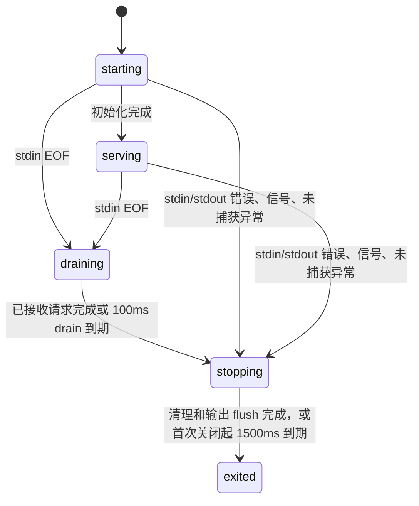

# ZCode Protocol Agent Server

## 背景

z-code 桌面端后续不再通过 ZCode app-server 兼容多 agent，而是只把 zcode-cli 作为私有 agent server 集成。桌面、SSH、Docker 场景里，GUI/host process 需要以薄客户端方式连接 zcode-cli，由 server 统一持有 session、模型、思考深度、模式、消息和运行态。

## 范围

- 新增 `zcode app-server --stdio` 入口，输出只承载 ZCode Protocol NDJSON frame。
- `agent-server --stdio` 作为同一能力的别名，方便后续命名切换。
- ZCode Protocol schema 仍由外层 z-code workspace 的 `packages/shared/src/zcode-protocol/index.ts` 单文件导出。
- v1 只实现 stdio transport；WebSocket 留给 cloud IDE/remote sandbox 后续复用同一 envelope。

## 状态归属

插件 `plugins/referenceCatalog` 与 `plugins/referenceCatalogWithCategory` 沿现有 listing join
按完整 plugin ID 投影可选 `description` / `descriptionI18n`。字段仅用于 Picker 按语言展示描述，
不进入 Session 冻结的能力身份或 model-only reminder；旧 Host 缺字段时 UI 留空。
语言回退与验收规则见[Plugin 对话引用](../../../../../docs/plugin-reference-mention.md#2-已确认的四项产品决策)。

- server 负责维护 session 核心状态：当前模型、可选模型、上次模型、思考深度、模式、权限、projection、eventSeq、stateRevision、消息和事件。
- TUI/GUI 只维护展示偏好，例如滚动位置、焦点、面板折叠状态和未提交草稿。
- `session/subscribe` 返回订阅确认、缺口事件和可选 snapshot；client 不把这层包装误当成 snapshot。

## 入口链路

```txt
zcode app-server --stdio
  -> runZCodeProtocolAgent
  -> ZCodeProtocolNdjsonConnection
  -> ZCodeProtocolAgentServer
  -> createZCodeApp / AgentRuntime / SessionStore
```

## stdio 输出边界

`app-server --stdio` 与 `agent-server --stdio` 的 stdout 是严格的 ZCode Protocol NDJSON
帧通道，不是通用日志流。宿主继续对每个非空 stdout 行执行严格的 schema
解析；不得为了兼容污染而忽略非 JSON 行。

CLI 在识别出 stdio protocol 命令后，必须在加载 `run.ts`、bootstrap 与三方 SDK
之前安装进程级 console 边界：`console.log/info/warn/debug/error` 统一写入 stderr，
只有协议 output 才允许写入 stdout（包括启动存储状态帧）。进程退出前保持该边界；
独立装配测试通过 disposer 恢复原 console。入口与 run 复用参数定义，只根据实际命令
启用生命周期，不能将 prompt/cwd 等选项的值误识别为 app-server。

```txt
ZCodeProtocolNdjsonConnection -> stdout -> Host JSON/schema parser
console.* / dependency logs    -> stderr -> Host log collector
```

该边界同时适用于桌面本地与 SSH/WSL/Docker 远程 agent；它不改变 protocol
message、desktop continuous 或 web remote replayable 的交付语义。

## 协议进程生命周期

CLI 入口在第一次异步初始化前接管 stdin/stdout 和信号，拥有唯一 shutdown deadline。
启动时用有背压的输入缓冲接住协议字节，不能为了观察 EOF 丢弃请求。bootstrap 通过
`RunZCodeProtocolAgentOptions.lifecycle` 接收取消信号、发起退出并读取同一个绝对 deadline；
它只释放运行时资源，不决定进程退出码。`--prepare-storage` Worker 和 plugin-host 保持各自生命周期。



- EOF 停止接单；有限的已接收请求可完成响应，挂起 handler 不能无限延长退出。
  首次关闭锁定原因、退出码和 deadline；后来的 SIGTERM、EOF、error 不重置预算。
- 仅 stderr 错误不关闭健康协议。入口对真实 stderr 安装写入边界：同步 throw、异步 error
  都只将出口置为不可用，之后不再写该流，不递归上报写入失败；所有 console/诊断共享该边界。
- 已被业务层处理的模型、工具、请求错误保留原协议行为。到达进程边界的未知
  uncaughtException/unhandledRejection 只诊断一次，随后取消运行、清理并以非零码退出。
- server 先拒绝新请求、取消反向请求和操作，再关闭所有已创建的 app，最后释放 gateway。
  迟到的 app 创建也必须关闭。此路径不调用产品 session/close，不发 session.removed，不删持久会话。
  bootstrap 在同一剩余预算内关闭 sampler、MCP/broker、共享存储、Registry 和遥测；单项失败不能阻止其他项被尝试。
- Host 立即使旧协议失效，但 stderr 保持收集至流关闭或有界 drain；exit 报告在 drain 后
  绑定原 runtime 身份与首次原因。正常 EOF 宽限 1800ms，进程树强杀仍受原总预算约束。
  CLI 的 E2E coverage 可额外预留 500ms 写盘，Host 沿用 coverage EOF 窗口。
- Host 按既有按需机制创建新 generation，不自动重发用户命令。手机 attachment 断开
  不触发共享 CLI 退出；desktop continuous / mobile replayable 的 owner 和恢复语义不变。

验收包括真实断管不自激、仅 stderr 断开仍能响应、启动中/空闲/在途 EOF、未知异常和
重复信号有界退出、短请求半关闭响应、挂起与迟到 handler 清理、最后一行诊断收集。

## v1 方法

- session: `create`、`resume`、`list`、`read`、`messages`、`events`、`subscribe`、`send`、`stop`、`setModel`、`setThoughtLevel`、`setMode`、`close`
- workspace: `readState`
- process: `childProcesses`——返回 MCP tracker 内存里仍有存活进程的 MCP 子进程 `{ pid, serverName, mcpSource, pluginName? }`。纯内存、无 I/O；`pluginName` 来自 `plugin:<name>:<key>` 命名空间，官方插件由 host CLI 注入的 MCP（如 `node_repl`）按 `OFFICIAL_PLUGIN_DEFINITIONS.hostMcpServerNames` 反查。桌面资源管理器用它把 Host 侧 `ps` 进程树上的 pid 归到内置 / 社区插件（见桌面仓库 `docs/electron/resource-manager.md`），CPU/内存采样不在 CLI 内完成。
- blocking request: 后续由 `interaction/requestPermission`、`interaction/requestUserInput` 通过 server-to-client request 扩展

## 验证

### 桌面字节码试验的启动约定

- `ZCODE_DESKTOP_AGENT_BYTECODE=1` 是 Dev desktop 启动器传给 Host 的实验开关，默认关闭；
  普通 Dev 启动显式关闭，`pnpm dev:desktop:bytecode` 显式开启。不开启时忽略残留字节码。
- 仅 Electron 的工作区 dist 解析路径选择同目录 `zcode.bytecode.cjs`；显式
  `ZCODE_AGENT_SERVER_COMMAND` 保持最高优先级，非 Electron/远端保持原入口。
- 开启后字节码入口缺失直接报错；禁止回退到 JS，避免 A/B 数据失真。
- `app-server --stdio`、`--surface`、cwd、stdin EOF、stdout 帧以及 stderr 诊断契约不变。
  `storagePreparationEntry` 仍指向普通 `zcode.cjs`，不改变 Host Worker 的准备协议。
- 字节码绑定生成时的 Electron/Node/V8、平台/架构和 V8 缓存标识，升级后必须重建。
  coverage 构建与字节码试验互斥；完整构建/测量边界见
  [桌面打包文档](../../../../../docs/electron/desktop-bundle.md#桌面-stdio-agent-字节码试验)。

- bootstrap 单元测试覆盖 create/read/subscribe 的返回形态，以及 server-owned model state mutation 的 `state.updated` 通知。
- CLI 单元测试覆盖 `app-server --stdio` 分发到 `runZCodeProtocolAgent`。
- CLI protocol 入口测试覆盖三方代码调用 `console.debug` 时 stdout 仍为空且日志进入 stderr，并验证命令结束后 console 恢复。
- 真实子进程回归使用不声明 `tools` capability 的 MCP server，约束 `mcp/list` 返回合法 JSON 且 transport 不出现 `protocol_parse_error`。
- app 联调烟测覆盖 `IZCodeAgentService.initialize()` 启动 stdio agent、`session/create` 返回 snapshot、`session/read` 读取同一 session。
