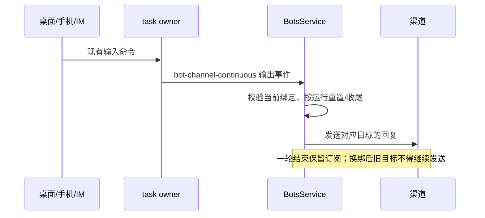

# 单聊绑定任务持续回传

## 行为与边界

飞书/Lark、Telegram、微信 iLink 的私聊绑定 task 后，IM、桌面和手机输入产生的 AI 输出均回传至当前绑定用户。沿用渠道 replyMode，不额外转发桌面输入正文。审批/问答维持原输入的来源授权，不因为订阅常驻扩大权限。

一轮完成、失败或停止只清理该轮状态，不释放绑定订阅。切换任务、工作区、用户、机器人身份或禁用/删除时使旧目标失效；已经发出的网络请求无法撤回。启用、启动和已连接工作区恢复时订阅后续事件，不重放历史、不为恢复主动连接远端。

后台每 10 秒检查既有远端连接并恢复可用订阅，不主动重连；已建立订阅仍使用连续实时事件。

同一 workspaceIdentity（本地回退 workspacePath）和 task 共享一个 Bot continuous 事件源；各接收目标独立串行处理，失败不能阻塞其他目标。自动任务以 Host 派发的 runId 匹配该轮，仍使用终态摘要，与同目标普通回传合并，不重复发送。输入 admission、执行状态仍归现有 task owner，不新增 accepted queue；桌面 continuous 和手机 replayable 边界不变。

## 微信及失败处理

入站授权通过后按机器人账号和用户保存最新 context_token 至 CredentialService；发送时读取最新值，支持重启后复用，不假定固定有效期。不得在日志或 getBotStates 中输出 token。凭证缺失或平台拒绝时，通过现有 deliveryError 展示失败与重新在微信发消息的指引，task 输出仍保留。更新 token 仅恢复后续发送，不自动补发旧回复。

当前进程为每个机器人保留最近一轮失败回复，用户可显式以文本重发完整正文；界面提示可能重复已收到的内容。换绑后失效，进程重启不保留待重试正文。结果未知不得自动重发，避免重复消息。发送限流和业务错误必须保留，不能把 HTTP 成功等同于平台投递成功。

## 验收

- 三渠道：IM 首轮完成后，桌面、手机连续两轮都有一次回复，无前轮正文或卡片污染。
- 多目标共享 task 时只建立一个底层订阅，各目标独立收到回复；一个目标失败不影响另一个。
- 同目标自动任务只发终态摘要，不重复；随后普通输入恢复配置的 replyMode。
- 换 task、工作区、解绑、禁用和删除阻止迟到输出；重新启用恢复订阅。相同路径不同 workspaceIdentity 不串线。
- 重启恢复有效绑定但不补发历史；远端断开不主动连接，重连后恢复。
- 微信最新 token 替换、重启读取、用户/机器人隔离、缺失或失效的可见失败；未经授权输入不能覆盖 token。
- 飞书两轮流式卡片各自独立；Telegram 拒绝、限流、格式回退失败不能报告成功。
- 桌面/手机触发的权限和问答不能因单聊订阅新增可操作的 IM 授权入口。

## 证据

2026-09-17：

- 服务/provider/UI：`botsService.privateSync.test.ts` 覆盖持续多轮、多目标、自动任务 runId 隔离、微信凭证更新与服务重启读取、换绑、失败显式重试及 mirror batch；其他 Bot 回归与 UI 重试交互一起执行：28 文件、432 条用例通过。
- Desktop runner：`BOT-E2E-PS-01` 三渠道 controlled-stream 用例通过（产物 `desktop-e2e-20260917035142993-p91509-fab905c1e30482ae`），证明服务 → HTTP 与合成 desktop/mobile 输入来源，不冒充真实手机/CLI 输入。同步复跑自动任务投递、飞书流式卡片用例，3 spec 全部通过。
- 根 typecheck、E2E typecheck、架构检查通过；lint 0 error、48 个原有 warning。
- 真实组件浏览器预览：390px/1280px、Zai 深浅主题、中英文；成功后按钮隐藏、失败后可再次操作，无横向溢出、无 console error。CLI agent-browser 未安装，使用内置浏览器完成。
- 真实 IM 账号、微信长期无入站消息、Windows/Linux、真实手机与远端重连尚未实测；新 E2E 保留 pending，不转正或加入 CI。
