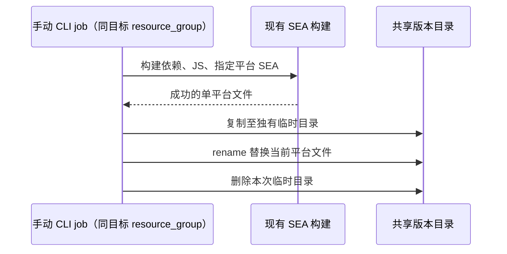

# CLI 独立平台 CI 打包

## 目标与边界

现有 GitLab 流水线提供六个独立手动 CLI SEA 打包 job：macOS、Linux、Windows 的 arm64/x64。
job 默认不运行，失败不阻塞桌面发布；不依赖桌面构建、Helper、远端资源或 MR approve job。
点击 CLI job 本身即为本次构建和上传的明确操作。现有 workflow 决定流水线是否创建，CLI 不扩展触发来源。
不修改桌面 job、桌面资源准备、安装包收集、签名、公证或发布 DAG，也不进入 Preview child pipeline。

## 构建契约

独立入口 `node scripts/ci-cli-sea.mjs --target <target> --shared-root <path>`。
target 使用既有 SEA 命名：darwin-arm64、darwin-x64、linux-arm64、linux-x64、win-arm64、win-x64。
先编译不提供 build script 的根 shared 包，再由根 pnpm workspace 按依赖图构建 CLI packages 及其完整依赖闭包，最后生成普通 zcode.cjs 并调用既有 build-sea 的单平台入口。
不能只使用 CLI 子 workspace 的 Turbo 图，否则会漏掉根 model-option-map 等 TUI runtime 依赖。
SEA 暂存资源内将 workspace package exports/main/module 的 src 路径映射到已编译的 dist 文件；不改源码 package.json，不把 TS 源文件塞进发布包。
SEA 依赖不能只按包名去重：同名不同来源版本按 Node 解析规则放到消费者的嵌套 node_modules，同一可见版本才复用。回归覆盖 contracts 的 Zod 3 与 shared 的 Zod 4 同时加载。
不能调用固定带 --all 的 build:sea。Node 版本由现有 ci:assert-node 校验，CLI 版本来自 apps/zcode-cli/package.json。
保持现有 SEA 签名和验证：macOS 主机 ad-hoc 签名、本机目标 --version 冒烟、跨架构目标明确跳过运行。
生成 JS 后先运行 build-sea.test.mjs，包括独立解包后的 TUI 加载；失败时不生成或上传 SEA。

## 上传与并发

复用桌面 CI 的 runner、registry、依赖安装函数及共享目录文件复制方式；不调用桌面安装包筛选脚本。
共享根使用 ZCODE_CI_SHARED_ROOT（macOS）、ZCODE_CI_LINUX_CONTAINER_OUT（Linux）、ZCODE_CI_WINDOWS_SHARED_ROOT（Windows）。
它们均表示共享的 zcode 目录，目标保持 `<shared-root>/deps/zcode-cli-<CLI版本>/<既有SEA文件名>`。
新增 job 内部变量 CLI_SEA_TARGET 仅选择构建目标，不传入产品运行时配置。
共享根必须已经存在，避免挂载丢失时悄悄创建本地替代目录。



同平台 job 跨流水线串行；后执行且成功上传的 job 覆盖该平台文件。不同平台可以并行，不写共同 manifest、不删除版本目录。
复制失败保留旧文件；rename 失败直接报错，不先删除旧文件兜底。源文件为空、目标非法、挂载不可用或构建失败时不发布。
job 日志记录 commit、pipeline、版本、目标和目标路径以追踪覆盖来源。原有全平台手动 SMB 上传命令保持不变，勿与 CI 同时覆盖同版本。

## CLI 独立版本维护

CLI 使用 `apps/zcode-cli/.release-it.json` 独立配置，仅共用仓库已安装的 release-it 工具，不加载根桌面 `.release-it.mjs`。
命令在 `apps/zcode-cli` 工作目录执行，以该目录 package.json 的 version 为唯一输入和修改目标；不改根版本、CLI 入口子包版本、桌面 changelog 或 runtime descriptor。

```bash
pnpm release:cli                 # 交互选择新版本
pnpm release:cli patch --ci      # 仅递增 CLI patch
pnpm release:cli minor --ci
pnpm release:cli 0.17.0 --ci     # 显式指定版本
pnpm release:cli:dry patch --ci  # 预览，不落盘
pnpm --dir apps/zcode-cli run release patch --ci
```

默认关闭 git 操作、npm publish、GitHub/GitLab release，不自动构建或上传；版本改动通过正常 commit/MR 合入后，由用户点选对应 CI job。
原因：当前桌面 workflow 对所有 tag 生效，CLI bump 不应意外启动桌面发布。CLI 不复用桌面 changelog 插件或 tag 命名。
CLI package.json 同时提供 `release` 与 `release:dry`，根 package.json 提供 `release:cli` 与 `release:cli:dry` 转发入口。
增量、显式版本与预发布的处理均使用 release-it 原生行为；不另写 SemVer 递增逻辑，也不新增环境变量。
预览入口使用 `--release-version` 只计算下一版本：当前 release-it 19.2.4 的 npm 插件将 `npm version` 标为非写入命令，原生 `--dry-run` 仍会修改 manifest，因此不要直接使用原生 `--dry-run`。

验证在独立临时 Git 项目执行真实 release-it：patch/minor/显式版本只改变 CLI package.json，CLI 直接入口支持 major，dry-run 不改文件，HEAD/tag/根版本/changelog 保持不变。

## 验收

- 六平台名称和文件名映射、仅单平台构建；任何前置构建失败时不继续或上传。
- 临时共享目录测试首次上传、同平台覆盖、其他平台保留、不同平台并行、非法输入和缺失/空产物失败。
- 校验 CI job 的 manual/allow_failure/needs/resource_group 和模板继承，原桌面 CI 文件字节不变。
- 运行脚本单测、CI 配置静态校验、architecture:check、typecheck、lint；实际 runner 验证各 OS 的挂载、SEA 和覆盖行为。
- 本次不涉及 APP 交互或 desktop continuous / web replayable 链路，不新增 UI E2E。

## 本地验证记录（2026-09-15）

- 根 typecheck、lint、architecture:check、CI 静态检查和本次文件格式检查通过；根 lint 有 43 条既有 warning。
- 单平台上传和 CI 配置测试、SEA 打包回归通过；解包后的 TUI 在独立临时目录成功加载。
- macOS arm64 完成真实 SEA blob 生成、注入、ad-hoc 签名和 --version（0.16.9）。由于 Node 下载缓慢，本地使用既有 --node-binary 参数指定当前同版本 Node 24.12.0；CI 仍使用原下载与校验流程。
- CLI 包全量测试 309 项中 307 项通过，两个 provider registry 测试失败；已用 HEAD 原始 CLI 源码在隔离临时目录复现相同失败。CLI workspace lint 另有既有 max-lines 错误，本次未扩大修改范围。
- 本机 glab 未登录仓库所在 GitLab，未执行服务端 CI lint、真实 runner 调度或向共享目录发布；Windows/Linux 实际执行、SMB rename 覆盖及跨架构二进制运行需在对应 runner 验收。

## CLI 打包成功通知

每个平台由 `ci-cli-sea.mjs` 在 SEA 构建及上传完成后发送一次飞书成功卡片，复用现有通知服务、`ci.build.completed` 场景和收件人配置。卡片标题明确标记 CLI，包含版本、平台、分支、提交人/信息、同一行水平排列的下载按钮及 Job 按钮。下载地址通过 `resolveIntranetDepsBaseUrl` 和实际发布目录/文件名生成。

顺序：`构建 → 单平台上传成功 → 飞书通知`。构建或上传失败不发送成功通知；缺少通知凭据或通知服务失败只记录警告，不改变构建成功状态。沿用 `ZCODE_FEISHU_NOTIFY_TOKEN`、`ZCODE_FEISHU_NOTIFY_BASE_URL`、`FEISHU_RECEIVE_ID`/`FEISHU_RECEIVE_ID_TYPE`；`SANDBOX_RELEASE=1` 或 tag 包含 test（不区分大小写） 时跳过通知。每次手动重跑成功都会再次通知，不增加去重状态。桌面通知入口及 DAG 不变。

验证：模拟通知服务检查六平台地址和卡片、缺少 token/发送失败/沙箱跳过；编排测试验证先上传后通知以及失败不发送。
