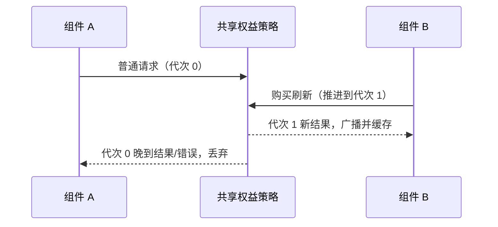

# Coding Plan Context 面板展示规范

## 背景

输入区 context 面板会聚合 Context window、Coding Plan 和 Start Plan 的轻量状态。这里是窄浮层，不承载完整 usage 明细。

## V4 输入区展示边界

- V4 composer 的 context 小圆圈与旧输入栏使用同一个 `ChatContextUsage` 展示组件，hover 面板需要同时聚合当前上下文容量、Coding Plan 剩余额度、Start Plan 今日余额和缓存命中率。
- 首轮模型请求完成前，面板可展示 `0 / 当前模型上下文容量`。该值只由 UI 根据当前有效模型 metadata 派生，用于帮助用户确认模型容量；不得写回 session usage 权威状态。
- 首轮模型请求完成后，面板使用 v4 session snapshot/delta 的 `usage.contextWindow` 作为上下文容量权威。`usedTokens` 与 `maxTokens` 来自 Agent runtime projection，缓存命中率和 breakdown 也随 `usage.contextWindow` 投影。
- 缓存命中率只展示主会话轮次的累计命中率；标题、压缩、prompt enhance、target completion 等 sidecar 请求即使带 usage 或 contextWindow，也不得覆盖输入栏 context meter。
- 冷启动恢复时，transcript 合成历史事件与 usage seed 共用按恢复模型身份精确查询的 Registry 容量。缺思考档位不阻断元数据查询；无对应模型/有效容量则投影 contextWindow=null，内部仍保留真实历史用量，不伪造 20 万分母。最终水位来自 runtime / 持久化消息（含 Compact 边界），不能覆盖恢复期间的新事件。

## V4 状态链路

```text
ModelComplete(main_turn)
  -> Agent runtime payload: usage + cacheHit + contextUsageBreakdown
  -> ProductProjection usage.contextWindow
  -> v4 snapshot / delta
  -> V4ComposerToolbar
  -> ChatContextUsage hover panel

Renderer modelProviders / settings / entitlements
  -> current Coding Plan or Start Plan source
  -> ChatContextUsage quota sections
```

- Desktop continuous 和 Web remote replayable 都只消费同一份 v4 session snapshot/delta；desktop main、external relay 不持有 context、quota、cache、breakdown 业务状态。
- 手机 `/remote` 通过 shared-host attachment 复用既有 host/session，恢复时只读取 replayable snapshot/delta，不为 context 面板另起独立 runtime 或独立额度查询权威。
- BigModel Team Plan 复用 BigModel Coding Plan provider id，但额度绑定团队项目来源。输入区如果当前连接方式是 Team Plan，必须按 sourceId 展示对应团队项目 quota，不得回退成个人 Coding Plan quota。

## Start Plan 今日余额

- Start Plan 的 `Today's balance` 与设置页 Plan Card 使用同一份 `UsageEntitlementSnapshot`。
- 剩余百分比和进度条使用 `quota.limits[].remaining / quota.limits[].number`，其中 `remaining` 来自后端 `remaining_units`。
- 余额进度条宽度过渡与 Coding Plan 额度条一致：`transition-[width] 500ms ease-out`，并保留 `motion-reduce:transition-none` 无障碍降级。
- 设置页 Plan Card 的 `Today's balance` 标题右侧显示套餐到期时间，来源是 `snapshot.subscription.details[0].expireTime`；该时间只表达套餐到期日，不参与额度计算。
- 设置页 Plan Card 的余额小卡按“模型名、剩余百分比 + renew 时间、进度条、剩余/总量”的顺序展示，底部剩余/总量使用千位逗号完整数值，不使用 K/M 缩写；输入区 context 面板保持只展示百分比、renew 时间和进度条，不显示套餐到期时间。
- `available_units` 只表示扣除进行中预占后的当前可用量，不用于 `Today's balance` 的剩余展示。

### Context hover 刷新与 loading（Start Plan 与 Coding Plan 对称）

- Start Plan 与 Coding Plan 的连接方式互斥；context hover 打开的静默 access 刷新入口必须两段都覆盖：`codingPlanUsageRemaining.onAccess ?? startPlanBalance.onAccess`，任一存在即触发 `refreshCodingPlanEntitlements({ silent: true, reason: "access" })`。Start Plan 不得只依赖设置页/侧栏刷新后被动同步。
- 静默刷新有缓存快照时不把 entitlement.loading 置 true；Start Plan 标题旁 spinner 的判定是 `loading || refreshing`，其中 `refreshing` 跟随本次 hover 触发的 promise（seq 防串），与 Coding Plan 段 header 刷新图标语义一致。
- `onAccess` 存在时即使还没有快照也保留 context 触发器，保证首次 hover 可以发起第一次余额请求（对齐 Coding Plan 段 `onAccess && entitlements.length > 0` 的兜底语义）。
- 60 秒 access 共享窗口与 in-flight 合并对 Start Plan 同样生效，反复 hover 不得放大 billing/balance 请求量。

## 5 小时额度 reset 时间

- Coding Plan 的 5 小时额度在 context 面板中只显示重置时间，不显示日期。
- 即使重置时间不是今天，也保持只显示 `HH:mm`。
- 日期维度留给 Usage 页面和更完整的用量面板展示，避免 context 面板在三列额度布局里变得拥挤。
- 周额度、月工具额度仍按日期展示。

## Start Plan 共享 balance 快照（2026-09-17）

账号可用性检查与用量查询共用 `zaiStartPlanBilling`，按 ApiClient、凭据和 URL 隔离。
请求发出后 1 秒内复用同一完整响应（失败也复用）；未完成请求继续合并。
购买/领取成功后的查询显式使对应记录失效，旧请求完成不能覆盖新记录。

```text
账号检查 ─┐
          ├─ balance 单一读取 owner ─ 请求/一秒快照 ─ plans + balances
用量查询 ─┘                              ├─ 账号可用性
                                        └─ 页面套餐与用量
```

桌面与手机共用 Host 服务；不改变 continuous/replayable 会话边界。
429 等传输失败必须保留错误并触发前端退避；同一身份已确认的订阅在刷新失败时保留，显示刷新失败。
无历史结果时 Start Plan 仍使用自身标题，并提供重试，不显示重复错误卡片或要求重新登录。
验收：先后/并发调用只发一次请求，一秒后可刷新；凭据隔离；失败复用；失效后重查；失败不覆盖已确认订阅。

## 购买入口刷新失败时复用快照

购买入口判断是否具备完整可用数据，不以最近一次刷新错误否定历史成功结果。
个人/Start 的已认证快照及成功确认的 `no_plan` 可继续使用；没有有效快照时才显示加载或重试。
团队结果按 family、登录身份和业务凭据隔离；Provider view 更新后重新核对凭据；同一来源刷新失败保留成功结果（包括空列表），成功返回空列表则覆盖旧套餐。
身份变化立即停止使用旧结果，过期异步请求不得写回。错误继续记录在日志和原权益状态中。

```text
个人/Start 权益 hook ─ 有效快照 ─┐
                              ├─ 购买入口：完整数据 ready，缺失数据 loading/error
团队查询 → 入口 hook 单一 owner ┘
           成功：替换；失败：同身份保留；身份变化：失效
```

验收覆盖首次失败、快照存在时刷新中/失败、no_plan、团队空结果、凭据变化和账号切换。
桌面与手机共用此 hook，不改变服务或会话恢复协议。

### 购买刷新与旧请求的顺序

共享权益策略按服务实例和 freshness identity 持有请求代次。购买/领取刷新先推进代次，再请求服务并使 balance 缓存失效。旧代次的成功和失败均不得更新组件、共享快照、持久缓存或退避状态；新代次普通请求不得复用旧代次 in-flight。不同身份互不影响。桌面与手机使用同一 hook 规则，不改变远控恢复边界。



验收：两个 hook 共用身份，购买结果先返回后，旧 no_plan 或旧失败均不能覆盖新结果；另一身份的待完成请求仍正常生效；购买后普通刷新不复用购买前的请求。
