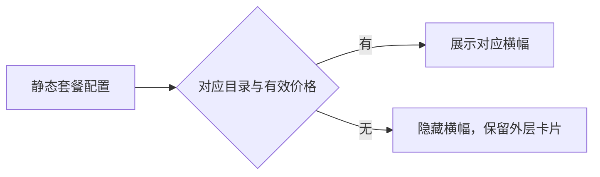

# 静态套餐配置与购买横幅显示

2026-09-14：第一阶段只移除兜底，不增加 Provider ID 兼容。

- 个人横幅由 codingPlanStaticProducts 当前 provider 的有效商品价格决定；加载中、缺字段、键不匹配、请求失败或无有效价格时不显示。保留明确售罄的已有展示语义。
- 删除个人 49 元与通用团队 598 元固定横幅。保留外层套餐卡片、登录入口及有效体验套餐。
- 团队购买横幅必须有 codingPlanStaticTeamProducts 对应静态目录；不能以实时 pricing 目录替代。已购团队状态查询仍使用实时 pricing。
- 由现有 hook 持有配置状态，Detail 仅派生显示；不引入缓存、定时器或新接口。
- 桌面与手机 Web、明暗主题、中英文使用同一显示条件，不改 continuous/replayable 链路。
- 本阶段精确匹配现有 providerId，不修改服务端配置，不增加 builtin/account 别名或迁移。

验证：单测覆盖空目录无固定价格、无配置不渲染个人/团队横幅、有效体验套餐保持；浏览器回归覆盖桌面/手机及明暗主题的缺配置状态。

浏览器用例：`packages/ui/test/browser/manual-review/pending/coding-plan-no-fallback.test.mjs`。前置为未登录 ZCode Dev 打开 BigModel 模型设置，公开配置缺少可用的 builtin/account 商品目录；执行 `node --test <用例路径>`，覆盖 390/1200 宽度和明暗主题，检查登录入口仍在、个人/团队横幅及固定价格均不存在。该用例为人工开发应用回归，不自动晋升 CI。

## 第二阶段：静态配置键兼容

兼容只存在于 Service 的 client/configs 解包边界，个人和团队目录均按 family 映射。优先读取自有键 builtin:{family}-coding-plan，仅当该键不存在时读取 account:{family}-individual-coding-plan；返回 UI 的键统一为后者（团队目录现有契约也是个人 provider 桶）。显式空数组优先，不合并两份目录，不以新目录复活被旧目录关闭的商品。不兼容其他命名空间，不改变运行时 Provider 身份。两种键都不存在时不创建该桶，延续第一阶段隐藏横幅规则。

验证矩阵：两种配置 × 两个 family × 旧键独有/新键独有/两键冲突/旧键空数组/两键缺失；通过真实 Service 接口验证，并检查无需 OAuth。

第二阶段线上验证：指定 app_version=3.12.1、platform=darwin-arm64，真实响应经 Service 解析后个人 BigModel/Z.ai 各 9 项、团队 BigModel 8 项/Z.ai 0 项。开发环境默认配置请求与该请求的返回不同，默认请求缺静态商品字段，不据此声称已完成有效商品横幅的 UI 验证。

## 未登录团队目录加载修复

原因：团队 hook 的 enabled 依赖 soldOutVisible（购买登录凭据），未登录根本不读取静态目录。删除固定团队横幅后没有真实目录替代。

设置页未登录团队横幅使用现有 hook 的 staticOnly 模式：getStaticTeamProducts → 当前 provider 桶 → 静态价格分组 → 横幅；不请求公开或鉴权 pricing。登录后 staticOnly=false，保持原静态目录+实时 pricing 链路。缺目录仍不显示，点击静态横幅仍先登录。其他调用方默认行为不变，不改桌面/手机数据传输或缓存。浏览器回归需验证未登录、个人和真实团队横幅均显示、静态目录中的价格一致。

用户确认：只显示一个「团队套餐」横幅。合并有效静态目录中的全部团队档位取最低有效价格，不显示独立标准版/高级版入口，点击传递 team audience，不预选某一档位。

套餐购买横幅不显示 150% 配额活动徽标；个人/团队/体验入口均只呈现名称、实际价格或额度、说明。外层状态卡的徽标不属于本次修改范围。
