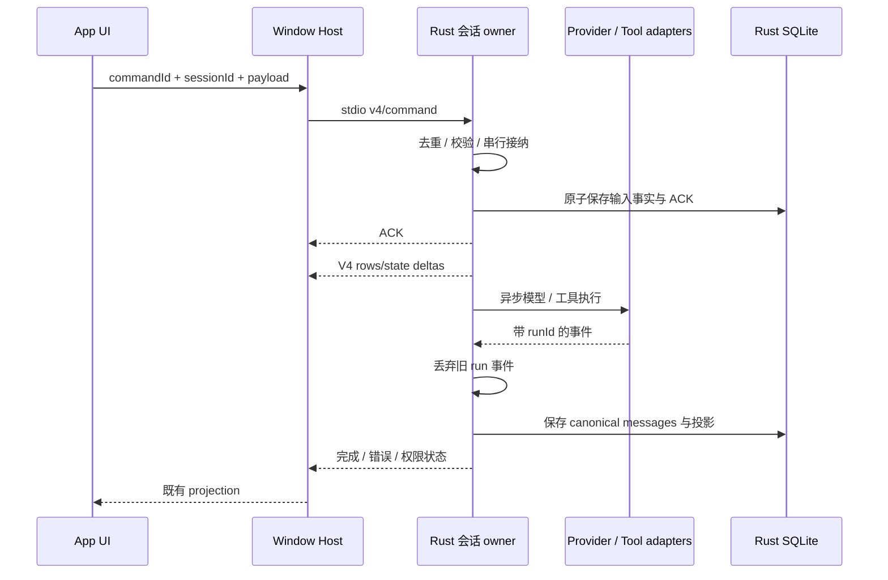

# Rust Agent 核心与 App stdio 接入

状态：核心切片已实现并完成本地集成验证。基线：2026-09-21，`main` / `872ad96`。本轮范围是可独立运行的核心，不是现有约 23 万行核心相关 TypeScript 的全量功能替换。

## 产品边界

- 新增 `apps/zcode-rust`，产物 `zcode-rust app-server --stdio`，不包含 TUI。
- 首版支持本地文本 Coding Agent：创建/恢复/重命名会话、流式正文、模型工具循环、读/列举/写入/精确替换文件、Shell、工具批准/拒绝、取消、FIFO 后续输入、进程重启后历史读取。
- 首版模型执行支持 OpenAI Chat Completions 兼容服务。明确拒绝未实现的模型协议、模型选择和附件，不能静默丢字段后声称成功。
- App Composer 必须提交 reasoningLevel。首版将模型和 reasoningLevel 一起固定在配置中，接受相同档位的选择并在投影中返回该档位；reasoningParameters 显式映射到模型 HTTP 参数。不同档位返回不支持，不能拒绝所有带 options 的正常 App 输入。
- 现有 TypeScript 仍为默认 runtime。Rust 通过显式启动选择接入；不自动替换生产包，不自动迁移旧会话。
- Rust 使用独立数据目录和数据库，不能打开或写入 TypeScript 的 session 数据库。旧库迁移、完整 Registry/账号模型兼容属于后续工作。
- MCP/插件、浏览器/CUA、动态工作流、subagent、goal、compact、fork/rewind、远端部署和安装包发布不属于这一核心切片。缺席能力返回结构化不支持错误。
- Node REPL/工作流是否保留 Node 子进程尚未确定，不影响本轮纯 Rust 核心。

## 基线接入点与改造要求

| 边界          | 当前源码                                                                                                                  | 迁移要求                                                            |
| ------------- | ------------------------------------------------------------------------------------------------------------------------- | ------------------------------------------------------------------- |
| 进程启动      | `packages/services/src/zcode-agent/zcodeAgentProcessManager.ts`                                                           | 保留 Host 的进程 owner/generation；明确 native 启动描述             |
| 桌面存储准备  | `packages/desktop/src/host/storagePreparationProcesses.ts`                                                                | 当前只支持 Node Worker；增加原生子进程适配，不能把二进制传给 Worker |
| RPC           | `packages/shared/src/zcode-protocol/index.ts`                                                                             | NDJSON，无 `jsonrpc` 字段；保留 string/number request id、错误形状  |
| 会话流        | `packages/shared/src/zcode-protocol-v4/`                                                                                  | wireVersion=3、snapshot protocolVersion=1；ACK 先于 initial frame   |
| stdio client  | `packages/services/src/zcode-agent/zcodeProtocolClient.ts`                                                                | 用现有客户端和运行时 schema 实测，不能只用 Rust 自测                |
| Node 专属能力 | `apps/zcode-cli/packages/bootstrap/src/app/built-in-node-repl.ts`、`apps/zcode-cli/packages/cli/src/dwf-child-command.ts` | 后续通过独立执行适配器迁移，不揉进核心                              |

## 单一所有者与依赖方向

`domain` 定义消息、会话和命令；`app` 拥有会话状态、command admission 和执行代际；`adapters` 实现 HTTP、SQLite、文件/进程与 NDJSON。binary 仅装配。

- Host 保留 attachment、owner/lease、remoteSessionId、进程生命周期；Rust 不创建第二个 Host。
- session state 只有 Rust actor 可写。异步执行返回事件，不直接修改会话。
- 同 session 接纳串行，不在等待模型/权限时阻塞 stdio reader；不同 session 可执行并行。
- 队列仅属于 Rust 进程，重启丢弃并可查询 discarded 结果；不能把已排队内容误恢复为已执行对话。
- 身份 key 为 `workspaceIdentity.trim() || workspacePath`；文件和 Shell 使用 cwd。拒绝跨 workspace 读取。
- ACK 仅表示接纳，不表示 turn 完成。去重以 `(workspace, sessionId, commandId)` 为边界，重试不能重复副作用。
- stop 必须校验可选 execution id；取消传播到 HTTP/工具/权限等待。迟到事件按 runId 丢弃。
- SIGTERM/SIGINT 即使发生在 output channel 背压时也能进入收口；退出时最多等待 stdout drain 两秒，Host 已停止读管道时报告失败退出，不无限 join writer。
- 权限等待显式进入 pendingInteractions；只有匹配 interactionId 的允许才执行有副作用工具。
- UI 只保留草稿/optimistic overlay；不补造能力、接受队列或真实执行状态。

## 核心接口与失败语义

- 入口兼容 `app-server --stdio --cwd <path> --surface desktop`；Rust 参数定义在本包 CLI contract。
- 开发接入复用 `ZCODE_AGENT_SERVER_COMMAND` / `ZCODE_AGENT_SERVER_ARGS_JSON`。新增显式选择 `ZCODE_AGENT_SERVER_RUNTIME=rust-core`：只在同时指定 command 时生效，声明 native 存储启动能力；未知值报错，不影响缺省 TS 路径。该变量不进入模型或工具环境中的业务逻辑。
- `runtime/capabilities.accountProviderConfig=false` 表示该核心不接收账号 Registry Overlay；Host 只在明确 false 时跳过该同步，旧 runtime 缺省保持原行为。核心模型选择必须匹配显式 config，并需在 App 中选择同名 provider/model；它不冒充账号模型可用。
- `--data-dir` 指定独立 Rust 存储；`--config` 指定只属于本轮开发核心的显式模型执行配置。配置不写回 App Registry；provider/model/reasoningLevel 必须与发送的 modelSelection 一致。
- 模型配置保存 endpoint/provider/model、固定 reasoningLevel/参数映射和密钥环境变量名；密钥从该变量读取，模型适配器不将其写入 stdout、数据库、测试 fixture 或错误。该配置是第一阶段边界，完整 Registry 迁移前不能宣称支持当前所有模型设置。
- stdout 只写协议帧；stderr 诊断。UTF-8 跨块、CRLF、坏 JSON、超大请求必须有界处理。BrokenPipe/EOF 导致统一取消和退出。
- 单 stdout writer 保证响应和随附 initial/recovery frame 原子排序；有界通道传播背压。
- `startup/storagePath -> startup/storagePathReady -> startup/storageState -> startup/storagePrepared` 用于桌面存储准备。普通启动发送 storageState checking/ready；失败报告分类错误后退出。
- SQLite 通过专属阻塞任务执行，不阻塞 async executor；会话输入事实与 ACK 在同一事务保存。
- 新进程生成新 logEpoch；冷恢复把 running/streaming 转为 interrupted，不自动重新运行 Shell/模型。
- 核心提供 conversation/sessions-index/workspace-config 订阅、resync、unsubscribe、分页及 command query。initial/recovery 使用 snapshot；在线使用连续 delta。第一阶段可以在断线后总是回 snapshot，不冒充 replay resume。
- Desktop continuous 与 Web replayable 使用各自 connection-owned subscription；暂停后必须 resync，不能把缺口标为连续。核心只发布两者共有的行形状。手机/远程实际链路另行验收。
- 未实现的有副作用方法必须失败，不能返回空成功；read-only 空目录只代表本 runtime 确实没有对应实体。

## 实施顺序与门槛

1. **Contract/core**：Cargo 包、CLI、严格 NDJSON、存储准备、独立 SQLite、V4 基本会话和 deterministic fake-provider 测试。
2. **Agent loop**：流式模型、增量 tool-call 汇编、工具执行、权限、取消和队列；真实子进程测试证明闭环。
3. **App 接入**：native storage preparation + 显式 runtime descriptor；使用当前 TS protocol client/schema 验证 Rust 帧和启动流程。
4. **兼容扩展**：读取旧库 fixture、完整 Provider Registry/账号鉴权、Anthropic/Responses、附件、多端恢复。
5. **全量替换**：插件/子代理/工作流/浏览器、三平台安装包和远端部署；通过矩阵后才切默认。

前三步为当前核心交付目标；第四、五步不得计入已完成。

## 验收场景

| ID   | Setup / action                                 | 必须断言                                                        | 证据                           |
| ---- | ---------------------------------------------- | --------------------------------------------------------------- | ------------------------------ |
| RC01 | 起真实 Rust 子进程，发送 subscribe/create/send | ACK 在 initial 之前；所有帧通过当前 TS schema；正文真正逐段到达 | Rust integration + TS protocol |
| RC02 | fake model 发工具 call，再读工具结果回答       | 工具循环完成，用户/assistant/tool 顺序正确；文件内容符合预期    | HTTP fixture + 临时 workspace  |
| RC03 | 模型提出写文件或 Shell；先拒绝再允许           | 拒绝不产生副作用；匹配批准才执行；错误可见                      | permission state + 文件        |
| RC04 | 慢模型、慢 Shell、权限等待时 stop              | 取消可到达，进程可继续处理下一请求；无迟到污染                  | 真实进程/模型请求              |
| RC05 | 重复 commandId、并发输入、旧 revision/epoch    | 不重复执行；FIFO；stale 拒绝；ACK 可查询                        | SQLite + protocol              |
| RC06 | 完成/执行中关闭再启动                          | 历史可读；未完成工作标 interrupted；不重放工具；旧 TS DB 未改   | 重启 + 文件                    |
| RC07 | 两个同路径不同 identity                        | 历史/订阅隔离                                                   | protocol + DB                  |
| RC08 | EOF、stdout/stderr 断管、非法/分段 UTF-8       | 无非协议输出、无忙循环、正常收口                                | 子进程管道                     |
| RC09 | native/JS 两种桌面存储入口                     | 原有 JS 路径保留；native 握手和取消正确                         | Host 集成                      |
| RC10 | continuous/replayable 各订阅/重订阅            | subscriptionId 隔离，seq 连续或明确 snapshot resync             | 双连接 fixture                 |

## 验证状态

补充核心一致性约束：同一 data-dir、workspace identity 同时只允许一个会话 runtime 持有 OS 文件锁；存储准备入口不抢占 runtime。第二个 runtime 必须在恢复历史前失败，进程退出后锁由 OS 释放。首次输入落库时同时保存 draft 的 create ACK；重启后重复 create 不得产生第二个会话。队列编辑和 setAutoDrain 按共享协议强制要求 baseRevision。工具投影按当前 turn 和 toolCallId 联合定位，供应商跨 turn 复用 ID 不得覆盖旧行。

- 已确认当前 checkout 无既有 CLI 单测/E2E 目录，不能引用其他分支历史覆盖。
- 实现前 `pnpm architecture:check --changed`：0 violations。
- Node/pnpm 已按 `mise.toml` 核验；`pnpm install --frozen-lockfile` 已完成。
- `pnpm check:rust-agent`：Rust 源码依赖方向检查、cargo fmt、Clippy（warnings as errors）全部通过。仓库 JS/TS 架构 checker 不解析 Rust，因此不把其 0 violations 当作 Rust 架构完整证明。
- `pnpm test:rust-agent`：测试代码类型检查、4 个 Rust 测试、12 个 Node 集成测试全部通过；真实 debug 二进制由脚本重新构建，未替换为 mock runtime。
- RC01–RC07、RC10：现有 App client/schema/assembler、实际 Composer 选择、Host service、HTTP fixture、SQLite、真实文件/Shell 覆盖。Host 创建与提交携带 reasoningLevel，检查实际 HTTP 参数；stop 后确认运行中的 Shell PID 已退出且下一轮可执行。
- RC08：已验证坏 JSON、跨 chunk UTF-8、超限请求、EOF、stdout EPIPE、饱和输出时 SIGTERM。有界关闭输出时可返回 transport failure；未独立注入 stderr EPIPE。
- RC09：桌面 `prepareSessionStorage` 原生握手、preparedPaths 去重、预先取消，以及保留的 JS Worker 分支通过；JS 分支使用协议 fixture，未构建完整旧 CLI bundle 做回归。
- `pnpm typecheck`：通过。`pnpm lint`：0 errors、70 warnings；未修改这些 warning 对应的既有代码。`pnpm architecture:check --changed`：baseline 0 / new 0。
- 改动文件格式检查和 `git diff --check`：通过。开发启动脚本已验证参数入口；完整 Electron Renderer、Windows/Linux 实机、真实供应商和 release 打包尚未验证。
- 执行入口：`pnpm build:rust-agent`、`pnpm check:rust-agent`、`pnpm test:rust-agent`；接入方法见 `apps/zcode-rust/README.md`。
- 变更范围：新增 zcode-rust 模块约 2,700 行 Rust；services/desktop/shared 只增加显式 native 接入与能力协商。本轮净增约 6,100 行（含 Cargo.lock、测试、文档和脚本），未删除原 TypeScript runtime。

## 后续规划风险

- JS SDK 的重试、reasoning、tool-call 分片、代理/证书和 usage 行为需要逐一移植；语言替换不自动保证模型兼容。
- SQLite 格式兼容不等于业务恢复兼容；旧 transcript/事件/command facts 与 tasks index 必须分别验证。
- Rust 性能收益必须测量冷启动、idle RSS、首帧、流式开销和多 session；不能按语言提前承诺。
- feature graph 已补充当前源码验证过的 native core、存储准备与 workspace/projection 边界；默认 TS 会话 owner 条目继续保留。

## 第二轮：请求、工具循环与性能契约

目标：补足本地文本 Coding Agent 的生产核心语义；以同一 release 二进制基准测量收益。完整 Registry、其他模型协议和旧 TS 数据迁移仍是切换默认 runtime 的门槛。

- HTTP client 由 provider adapter 持有并复用连接。请求体每次模型调用只编码一次，重试复用；只有连接失败、408/429/5xx、尚未公开正文/推理的断流和空响应可重试。非空正文或推理交付后禁止透明重放；已完成工具不会因请求重试再执行。重试次数、退避、Retry-After 和流闲置超时有界，stop 能立即打断等待。reasoning_content 保存到 canonical assistant 消息并随下一轮回传。
- SSE 按字节增量解码，单行/单事件有界；多事件 TCP chunk 不因整体大而被误拒绝。工具参数按 index 用 String 累积，验证 ID 唯一和完整性。首段立即投影，其余文本最多合并 16 ms 或 8 KiB，不用每 token 触发全历史复制和 fsync。
- Session actor 继续唯一持有 rows/messages/seq。SQLite 分开保存 metadata、row 和 canonical message，只写脏行和新增消息；输入+ACK、模型完成、工具起止、权限、停止/结束是耐久边界。流式部分最多每 250 ms checkpoint，崩溃最多损失未 checkpoint 的展示文本，不损失已 ACK 输入事实，不自动重放副作用。升级只迁移独立 Rust v1 数据库，事务失败保持旧数据可读。
- Agent loop 在工具执行前等待模型消息的 durable ACK，在进入下一轮模型请求前等待工具结果的 durable ACK。只读工具允许最多四个并发，同组结果按模型声明顺序进入 canonical transcript；写入和 Shell 是顺序屏障。每个工具都产生独立开始/结果事件，取消不留下无人管理的进程。
- Read/Write/Edit 使用现有 CLI 的 file_path、old_string、new_string、replace_all；保留第一版 Rust path/oldText/newText 作为输入兼容别名，不再对模型发布。Read 支持 offset/limit，拒绝特殊文件和二进制；Write 可创建 workspace 内父目录，Edit 精确匹配并支持 replace_all。读取过的文件若在外部改变，编辑拒绝并要求重新读取，防止覆盖未观察到的内容。
- 增加 Glob/Grep，复用已有 CLI 的参数名字、默认值和输出模式，遵守 workspace、忽略规则、取消和输出预算。Bash 接受 description、timeout（上限 600000 ms），非零退出标为工具失败并保留 stdout/stderr；未实现的后台执行必须明确失败，不静默转前台。
- 上述变更不改变 Host ownership、workspaceIdentity、V4 seq 或手机恢复语义。schema 仍由现有 TS 客户端逐帧验证。

新增验收：限流后恢复且请求一致；可见文本后断流不重放；退避/闲置时 stop；碎片工具参数与推理回传；工具部分失败后继续模型；读取并发与写屏障；规范参数、分页/搜索/替换与外部变更；旧 Rust 数据迁移和重启恢复。性能记录冷启动、首文本、总时长、RPC p95、协议帧数和 SQLite 字节数，比较相同机器/负载的 release 产物，不能用 debug 对 release 得出收益。

2026-09-21 收口状态：增量存储、原生 v1 迁移、250 ms 流式 checkpoint 节流、字符串原地追加、模型/工具结果 commit receipt、独立 agent_loop 模块已实现。5 个 Rust 测试及 12 个 App/native 集成测试通过；typecheck、Rust fmt/Clippy、架构检查通过，lint 为 0 errors / 70 个既有 warnings。请求重试/连接池、工具规范扩展等仍是计划内容，不能视为第二轮全部完成。后续以 `rust-agent-parity-plan.md` 的功能矩阵与分阶段验收推进。

## 2026-09-22 第一交付包执行契约

- 一个 HttpModel 复用一个 reqwest Client；每个 complete 编码一次请求体，每次尝试重新读取 env 鉴权并复用编码 bytes。取消覆盖连接/响应体/退避/事件通道等待。错误不包含原始 body、URL 或密钥。
- ModelPort 返回结构化 ModelFailure（code、reason、retryable、HTTP status、Retry-After、outputCommitted）；错误分类覆盖当前 TS 通用 HTTP/网络/TLS、已知供应商业务码、额度与上下文错误。业务码优先于通用 HTTP 状态。未知业务码按当前 TS 的状态与可恢复网络/超时规则处理。
- 默认 10 retries/11 attempts，2 s 指数退避、因子 2、60 s 上限、50%–100% jitter；沿用 ZCODE*MODEL_RETRY*\* 环境配置。可选 config.retry 字段优先于 env；不增加无界重试档位。Retry-After-ms 优先于 Retry-After（秒/HTTP date），x-should-retry=false 阻止使用该等待提示；合理范围按现有 TS runner-retry 保留。空响应（无正文、无工具、无 usage）最多额外重试一次且占用总预算。
- requestTimeoutSeconds 改为可选：显式值保持每次 HTTP 尝试总时长上限；省略时不设置总上限。streamIdleTimeoutMs 默认 600000，重试每次增加 30000 ms；零表示显式禁用 idle timeout。等待 response headers 同样有 idle 边界。有效 SSE 事件刷新 idle 计时，注释/半行不延长等待；网络闲置与 stdout 背压分开处理。
- 输出第一次交付给 owner 后标记不可重试。工具参数前奏在本次尝试内缓存，失败时可整体丢弃，不产生工具副作用。正文/推理已交付后失败保留中断行，不自动重发请求；reasoning_content 成功后与正文一起持久化并回传下一轮。
- SSE 不按 TCP chunk 大小限流，仅按单行/单事件和累计模型输出计数；解析须线性且保留 UTF-8。首段立即发送；后续以 16 ms/8 KiB 合并，切换正文/推理、工具边界和结束/错误前刷新。每个 tool call 使用独立 String，完整结束才进入 loop。
- 内部 Retry 状态事件由 owner 投影既有 control.apiRetry；开始下一次尝试、成功、失败、stop 和冷恢复清空。它属于瞬态运行状态，不进入 canonical transcript。保留 runId 防迟到污染。
- 只读 Read/List 明确声明 concurrent_safe；最多四并发且 canonical 顺序稳定。读取只允许普通文件，取消不会把只读 futures 或 Shell 后代留在无人管理状态。文件类语义扩展留在第二交付包。
- 输入/权限/模型完成/工具完成为耐久屏障。专门测试存储阻塞或失败时不得提前执行工具/下一次模型请求，也不得在收口时将失败事务中的内存状态重新写入数据库。
- 验收覆盖 HTTP 故障/错误 SSE/空响应、重试前后文本、推理、等待取消、连接复用、稳定请求 bytes、真实 App schema、持久化屏障、只读并发与写屏障。性能用同一脚本比较旧/新 release，各场景至少五轮，记录 RSS/时间/协议/存储；包含固定流、长历史和多 session。

实现补充：HTTP client 在首次请求时通过 OnceCell 初始化，系统证书的阻塞读取交给阻塞线程池，后续请求复用同一 client。2 MiB 请求预算在唯一一次 HTTP body 编码后检查，预算包含 messages、tools 和 reasoning 参数；超限返回 model_context_exceeded，自动压缩仍留在后续交付包。权限批准和 ACK 只提交一次，成功后才唤醒工具。TLS 分类展开多层 io::Error.get_ref，不能将证书错误误判为可重试网络错误。

2026-09-22 验证：8 个 Rust 单测、3 个受控 runtime/storage 测试、23 个真实 App/native 集成测试通过；包括本地自签名 HTTPS、真实 socket reset、SSE 错误、空闲期间定时 flush、权限提交失败和异步工具结果顺序。类型检查、Rust fmt/Clippy、源码边界及仓库架构检查通过；lint 0 errors / 70 个既有 warnings。完整 Electron Renderer、真实供应商和 Windows/Linux 实机仍未在本包验证。性能和产物证据见 `../reports/rust-agent-requests-2026-09-22.md`。

## 第二交付包覆盖规则（2026-09-22）

当前执行模式、工具与后台任务按 `rust-coding-tools.md`；本文件前文的 build/逐次审批是第一交付包历史规则。新会话只支持 yolo，旧 native build 会话须显式切换。普通 Coding 工具自动执行；Session owner 的模式、输入/模型/结果提交屏障和后台登记提交屏障保持不变。权限 fixture 仍验证通用端口的历史提交边界，不代表 native 对外提供 build 模式。

第三包覆盖说明：2026-09-22 起 compact 已实现，取代本文早期切片的“后续交付”限制。实现边界及尚未对齐项以 [rust-context-management.md](./rust-context-management.md) 为准；仍未启用 App Registry、额外模型协议或默认 Rust runtime。

## 2026-09-22 模型协议包覆盖

显式 apiType 现支持 OpenAI Chat Completions / Responses / Anthropic Messages，覆盖前文首版单协议限制；不改变单个配置模型、TS 默认 runtime、yolo 和账号未接入边界。供应商推理元数据、工具终态及请求转换规则见 [模型协议 spec](./rust-model-protocols.md)。

输出上限续写补充：三协议的明确截断终态在提交 partial 后最多恢复三次，临时 Continue 不进入 canonical；空截断也消耗次数。具体覆盖前文“长度续写未支持”限制，见 [续写 spec](./rust-output-continuation.md)。
