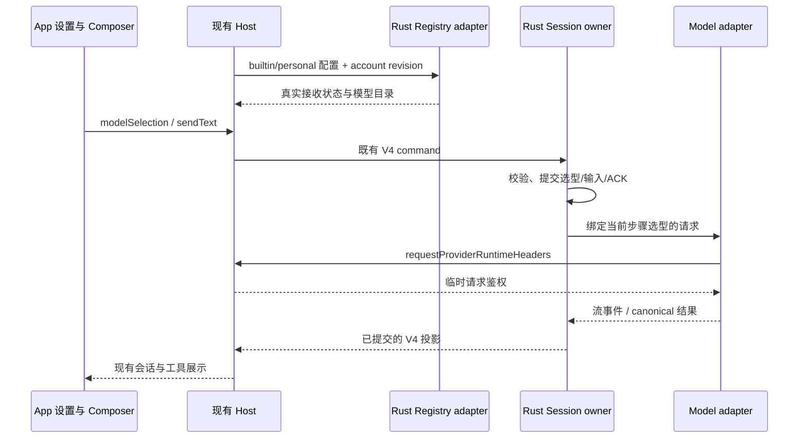
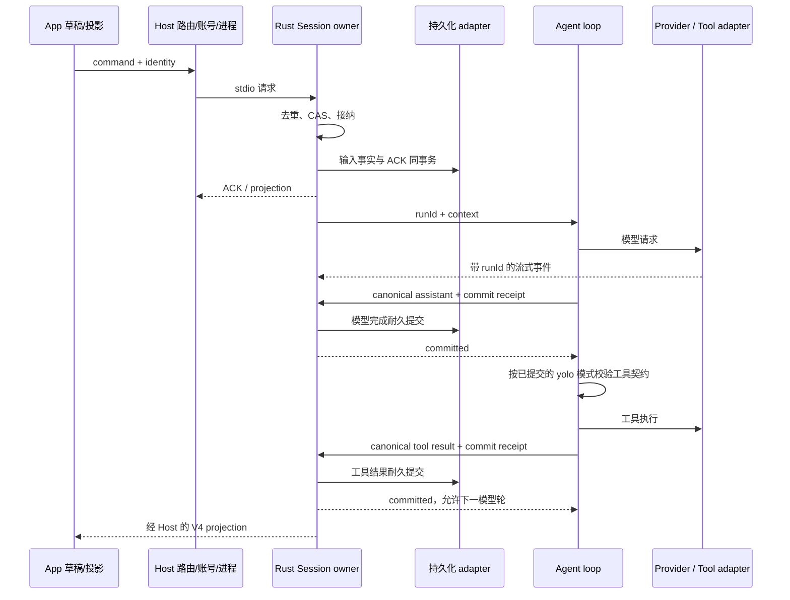

# Rust Agent 功能对齐与替换计划

日期：2026-09-21。源码基线：`main` / `872ad96`，包含工作区尚未提交的 Rust 核心。

## 目标与完成定义

最终交付是能够替换 App 当前 Agent 进程的 Rust headless runtime，入口为 `app-server --stdio`，不实现 TUI。App 保留现有输入、模型设置、权限交互、历史、工具显示及远程连接方式。

“对齐”以当前可达的产品行为为准，包括成功、失败、取消、恢复、权限和输出顺序。每项功能都要追踪到注册/启动入口、契约、状态所有者和验收用例；只有类型声明或遗留文件，不计入必须迁移的功能。

设两个明确验收点：

- **A：常用 Coding 功能可替换（yolo）**。App 既有配置与账号直接可用；多协议模型、文本/附件、文件与终端工具、上下文压缩、yolo 执行、队列、常用会话操作和恢复通过。尚未迁移的扩展功能必须显式协商，不得报告空成功。达成 A 后可以针对限定功能集试用，仍不切全量默认。
- **B：全部在用 headless 功能可替换**。补齐当前启用的 MCP/技能、子代理、后台任务、工作流、自动任务、浏览器等功能，再通过旧数据兼容、远端部署和三平台发布验收。达成 B 后才将 Rust 设为默认。

纯 Rust 的要求适用于进程入口、会话 owner、Agent loop、协议、存储和请求执行。现有 `js`/浏览器等工具可先通过受管理的子进程端口保留，Node 不再承载主运行时；是否消除全部 Node 工具依赖另立任务，不阻塞 Rust 核心替换。

## P0 接入包状态（2026-09-22）

本次实现规则以 [rust-app-p0.md](rust-app-p0.md) 为准，验证与限制以 [验收报告](../reports/rust-app-p0.md) 为准。

- 接入：保留原 Host/client/schema，补齐双向 RPC 回复、账号配置同步、临时鉴权、workspace 文本生成/取消、连通性测试和已导入附件的读取。
- 配置：读取 App 内置/个人 Registry，解析模板、参数规则与手动覆盖；revision 配对刷新，运行中模型切换在下个步骤生效，队列和恢复保留选型。
- 数据：当前 TS 库只读备份、按 workspace 幂等导入，保留消息/工具关联、压缩边界、输入处置和附件快照；未知副作用不重跑，非 yolo 和计划状态不静默提升。

P1/P2 继续保留：附件剩余差分/context refs、完整上下文、Todo 旧历史与扩展连续性、分支/编辑/重试/回退、扩展工具和工作流等。主会话 Todo 与 App 工作计划已完成，见 [Todo 报告](../reports/rust-todos-2026-09-22.md)；guide 和 AskUserQuestion 已在后续包完成，见 [运行中输入报告](../reports/rust-busy-input-2026-09-22.md) 与 [问答报告](../reports/rust-user-questions-2026-09-22.md)。完整 Renderer/供应商矩阵、TS 同条件性能对照、大库按需加载及跨平台发布仍是切换门槛。本包不等于 A/B 验收通过，TS 仍为默认。

后续进度以 [剩余对齐清单](rust-parity-remaining.md) 为当前状态入口，逐项保留未完成要求与验证证据，避免用各交付包的历史快照误判全量完成。真实基础 App 验收已经补做，见 [E2E 记录](../reports/rust-app-e2e-2026-09-22.md)；附件正在按 [Composer 附件 spec](rust-prompt-attachments.md) 推进。

## 历史基线（2026-09-22，第五包后，P0 实现前）

| 面        | 已有                                                                                                    | 主要缺口                                                                 |
| --------- | ------------------------------------------------------------------------------------------------------- | ------------------------------------------------------------------------ |
| App stdio | 原生启动、存储握手、当前客户端/schema、双连接订阅集成                                                   | 当前 App 调用面完整覆盖、真实 Renderer 交互、远端安装                    |
| 会话      | 创建、文本流、取消、FIFO/CAS/去重、held queue、sendQueuedNow、冷恢复                                    | guide、模型切换、分支/编辑/重试/删除与文件恢复                           |
| 模型      | 单个静态配置，Chat Completions/Responses/Anthropic；连接复用、重试/取消、推理回传、最多三次输出上限续写 | App Registry、账号与请求期鉴权、动态选型/参数映射、供应商兼容细节        |
| 上下文    | 手动/自动/反应式压缩、microcompact、增量预算、根 AGENTS 刷新                                            | 附件/引用、多媒体、目录规则、完整 prompt/记忆、超长摘要分块              |
| 工具      | Read/Write/Edit/Glob/Grep/Bash/TaskOutput/TaskStop、yolo、四只读并发与写屏障                            | 宽松 Edit 匹配、多媒体读取、后台完成自动续跑、扩展工具及完整 TS 差分矩阵 |
| 数据      | 独立 Rust SQLite、原生 v1 拆分迁移、canonical/工具结果提交屏障                                          | TS 历史兼容、索引/附件/工具产物、版本回退、会话按需加载                  |
| 性能      | 增量存储/checkpoint、HTTP 池、SSE 合并；固定流式/长历史/四会话重复测量                                  | 同条件 TS 对照、更大规模历史与会话、物理写入/事务统计、三平台            |

已有测试只能证明上述已覆盖路径，不能将“能聊天、能执行工具”计作 A 或 B 完成。

## 以替换 App stdio runtime 为目标的优先级（2026-09-22）

用户明确目标是接替既有 zcode-cli 的 stdio 进程。以 App 真实调用链是否可用、既有数据是否保留来决定关键性。App 继续使用现有服务、协议与状态归属；允许必要的启动器/能力协商适配，不维护另一套 Rust 专用业务流程。正常用户不需要另写 Rust 模型 JSON、复制账号密钥或清空旧历史。

此排序覆盖下文原始实施阶段的推进顺序；原阶段编号保留为功能分类。已完成的请求/loop/压缩不重复重写，只在兼容差分发现缺口时修改。权限仍只支持 yolo，不实现 TUI。

| 顺序 | 关键性              | 工作包                                                                                          | 阻断原因与验收要求                                                                                                                                                                      |
| ---- | ------------------- | ----------------------------------------------------------------------------------------------- | --------------------------------------------------------------------------------------------------------------------------------------------------------------------------------------- |
| 1    | P0 接入契约         | 当前 App 使用的启动参数/环境、存储握手、RPC/command/交互回执、capabilities、错误与事件投影      | 已有基础链路继续复用；逐项核对实际调用，补齐必要接口。空进程列表、空配置/功能结果不能代替真实实现；未支持能力明确协商，UI 入口与事实一致。stdout、EOF/EPIPE、stop、身份与订阅隔离回归。 |
| 2    | P0 配置与模型       | Provider Registry/参数规则、账号 overlay、每请求动态鉴权、switchModelConfig、思考档位与默认选型 | 直接使用 App 现有配置和账号发请求；热更新和模型切换确实影响目标请求，恢复会话保留自身选型。凭据不进入会话/队列/ACK 持久化。只有完成链路后才声明 accountProviderConfig=true。            |
| 3    | P0 数据连续性       | TS 历史/索引/附件/产物兼容、幂等迁移、备份与回退                                                | 从现在建立旧数据 fixtures 和兼容边界，实施可与后续并行；不得留到最终发行才设计。既有任务能显示、继续，保留 ID/工作区身份和工具关系；未知副作用不重跑。非 yolo 旧会话不能静默提升权限。  |
| 4    | P1 完整输入与上下文 | Composer 附件/context refs、目录规则、完整 system prompt/记忆、模型能力对应的媒体投影           | App 已接受的输入不能被忽略；同一输入在 TS/Rust 产生语义一致的模型上下文。压缩保留这些信息，模型不支持的媒体显式拒绝。                                                                   |
| 5    | P1 会话与交互       | guide、AskUserQuestion、Todo/独立任务计划、fork/retry/edit/文件回退/delete                      | App 当前可见的常用操作真正生效，ACK/时序/持久化和冷恢复一致。任务计划与 Plan 权限模式分开；后者仍不迁移。                                                                               |
| 6    | P1 Coding 行为补齐  | 已有八个工具的剩余差分、宽松 Edit、输出与进程状态、后台完成通知与续跑                           | 同一真实修改/测试任务可以完成；后台通知经 Session owner admission，停止/分支切换后的迟到通知不能唤醒错误任务。                                                                          |
| 7    | P2 扩展执行         | MCP、Skill、Web 工具、子代理/协作、JS/浏览器、goal、工作流与自动任务                            | 排在常用 Coding 替换后；当前 App 启用的扩展仍属于最终替换验收，不因较晚实施而永久删减。工具可见性遵循实际 profile/装配开关。                                                            |
| 全程 | 切换门槛            | 差分、真实 App E2E、性能、旧库、远端及目标平台发行                                              | 不因功能表打勾就切默认。性能检查贯穿各包，大旧库验证按需加载/内存上界；最终执行 TS/Rust 同条件 release 对照、真实供应商及桌面/手机恢复矩阵。                                            |

### P0 实现前确认的交付计划：打通既有 App 配置链路

先完成顺序 1 的必要接口清单与顺序 2；顺序 3 同期建立脱敏旧数据 fixtures，不在本包承诺已完成迁移。

所有者不变：Host 的账号源提供账号事实和请求期凭据；Registry adapter 解析既有配置规则并提供模型解析结果；Session owner 管理会话选型、输入、队列和历史。默认选型沿用既有配置仓储契约，与会话当前选型区分；不能把账号密钥写进会话来换取恢复。Desktop continuous 和 mobile replayable 的差异继续由原订阅/恢复边界承担。

直接依据：`packages/services/src/zcode-agent/zcodeAgentService.ts` 的 `syncAccountProviderConfigToClient` 和 `interactionRequestProviderRuntimeHeaders` 分派、`independentPlanSupport.ts` 的连接级 capability 缓存、`packages/shared/src/zcode-protocol-v4/command.ts` 的 `switchModelConfig` 等命令，以及 Rust `queries.rs` / `input_validation.rs` 当前的能力和固定选型限制。现有 feature graph 的 Rust/存储/身份/投影边界仍适用；本轮仅改优先级，不把计划能力标成已经实现。

| 场景           | Setup / action                                                    | 必须断言                                                                             | 验证状态                                        |
| -------------- | ----------------------------------------------------------------- | ------------------------------------------------------------------------------------ | ----------------------------------------------- |
| 原有配置启动   | 使用 App 既有个人/账号模型，启动 Rust 后创建任务并发消息          | 不要求专用模型 JSON；真实请求地址、参数和鉴权正确；正文/工具正常显示                 | accepted；真实 App E2E 待新增                   |
| 选型与刷新     | 两个模型/思考档位，切换并刷新配置，再重启任务                     | ACK/生效时机与当前 TS 一致；在途请求不被配置刷新改写；新任务默认与旧任务选型分别保留 | accepted；协议/请求/DB 差分待新增               |
| 鉴权失败与取消 | 请求期凭据过期、刷新失败、等待刷新时 stop                         | 使用受控错误；及时取消；凭据不进入历史/队列/ACK/日志                                 | accepted；Host 双向交互 fixture 待新增          |
| 旧任务恢复     | TS 脱敏历史含工具调用、附件及未结束执行，导入后重启               | 同身份可见/可续聊、迁移幂等、未知副作用不自动重跑，保留回退源数据                    | accepted；本包准备 fixture，迁移后验收          |
| 两种客户端     | 同会话 desktop-continuous 与 web-remote-replayable，断连/进程换代 | 连续流与新 snapshot 恢复语义各自正确，无重复 owner 或跨 workspace 数据               | accepted；既有基础测试保留，配置/鉴权组合待扩充 |

剪枝：TUI 和非 yolo 权限模式按用户范围排除；未启用的可选工具 profile 不要求暴露，但不能据此跳过 App 实际启用的工具。上述新增验收是计划，不把既有 23 个 Rust / 57 个 App 测试计作新能力已通过。

## 权限范围调整（2026-09-22）

用户确认先只支持 `yolo`。下一交付包只开放该执行模式；普通 Coding 文件修改与 Shell 按 TS yolo 契约自动执行，不再等待逐次审批。暂缓 build/edit/plan/auto 权限模式、模式切换和通用审批规则系统。A 按 yolo 功能集验收；B 的权限范围也以此为限，增加其它模式需另行确定范围，不能以 yolo 覆盖声称其它模式已兼容。

- Session owner 是模式事实的唯一所有者；新会话缺省 yolo，显式请求其它模式返回不支持，不能静默将 build/plan 提升为 yolo。Host/Composer 的选项、提交和投影须一致，E2E 验证实际配置与文件副作用，不以菜单显示代替事实。
- 旧 Rust 实验会话的 mode 缺省、恢复和在途审批在实现前明确迁移规则；不能仅跳过 `requires_permission`，却继续向 App 投影 build。
- 工具参数校验、工具自身硬约束、取消、写操作顺序、模型/工具耐久提交和未知副作用恢复继续生效。扩展工具另有强制交互契约时，在注册该工具前核对；不因 yolo 无条件发布所有工具。
- AskUserQuestion 用于补充需求和方案选择；Todo/计划内容属于任务状态，与工具执行审批分开，仍保留在后续功能范围。Plan 权限模式不纳入本期。
- yolo 已在第二交付包实现；旧 native 会话默认保留 build，只读恢复，经 switchCollaborationMode(yolo) 显式切换后续聊。

## 对齐基准与架构

| 对齐对象      | 当前权威源码                                                                                                                              | 需要保持的契约                                                                     |
| ------------- | ----------------------------------------------------------------------------------------------------------------------------------------- | ---------------------------------------------------------------------------------- |
| App 请求/事件 | `packages/shared/src/zcode-protocol/index.ts`、`packages/shared/src/zcode-protocol-v4/command.ts`、`transport.ts`                         | 严格 schema、ACK、错误码、ID、epoch/revision、连续序号、分页和大帧                 |
| Agent 状态机  | `apps/zcode-cli/packages/core/src/runtime/methods/turn-loop.ts`、`turn-model-step.ts`、`turn-tools.ts`、`runtime-command-queue.ts`        | admission、工具/模型顺序、stop、follow-up、迟到事件隔离                            |
| 模型请求      | `apps/zcode-cli/packages/adapters/src/model/runner-stream.ts`、`runner-retry.ts`、`stream-retry-boundary.ts`、`runner-runtime-headers.ts` | 消息规范化、重试边界、推理历史、鉴权刷新、取消                                     |
| 工具          | `apps/zcode-cli/packages/contracts/src/tools/`、`packages/core/src/tool/handlers/index.ts`                                                | 实际注册面、schema、返回值、权限、超时、取消、可并发性、结果预算                   |
| 存储          | `apps/zcode-cli/packages/adapters/src/storage/session-store/`                                                                             | transcript/输入事实/索引/权限/usage 分别验证；不直接拿 SQLite 格式等价代替恢复语义 |
| Host          | `packages/services/src/zcode-agent/`、`packages/desktop/src/host/storagePreparationProcesses.ts`                                          | 启动与退出、身份、owner/lease、账号配置同步、窗口/远端隔离                         |

Session owner 唯一管理已接受输入、消息、权限、队列、run generation；Host 保留账号、attachment 和进程路由。Desktop continuous 与 Web/mobile replayable 共享 owner，各自维护订阅与恢复。使用 workspaceIdentity 隔离，workspacePath 执行文件与命令。

## 实施阶段

| 阶段                  | 实现内容                                                                                                                                                                                                                            | 通过条件                                                                                                            |
| --------------------- | ----------------------------------------------------------------------------------------------------------------------------------------------------------------------------------------------------------------------------------- | ------------------------------------------------------------------------------------------------------------------- |
| 0. 契约清单与基准     | 枚举实际 RPC、commands、模型协议和已注册工具；按配置开关列 profile；建立脱敏 fixture、预期事件、release 性能基准                                                                                                                    | 每项标明已实现/部分/缺失/不迁移，且有源码证据；不从已删除旧协议推导功能                                             |
| 1. 请求与 loop        | HTTP 连接复用、取消、idle/总超时、typed error、重试与 Retry-After、空响应、SSE/工具分片、reasoning 与 usage；完善 durable barrier、工具调度、停机、背压                                                                             | 断流不重复可见输出，重试不重新执行工具；部分工具失败能继续；权限/取消/重启下消息成对且结果顺序正确                  |
| 2. Coding 工具与权限  | 规范 Read/Write/Edit/Bash 参数和结果；Glob/Grep；文件读取分页、变更检查、原子写与输出产物；后台 Shell、TaskOutput/TaskStop；仅 yolo 的模式接纳、投影与执行                                                                          | 同一组规范调用与 TS yolo 等价；普通 Coding 工具无需审批；其它模式显式拒绝；超时/取消收回完整进程树；大文件/输出有界 |
| 3. 上下文与长任务     | AGENTS/目录规则、system prompt、工具描述、动态上下文刷新；token/context budget、manual compact、auto compact、microcompact、输出截断续写；附件与图像/文档投影                                                                       | 压缩保留用户目标、约束、重要文件和未完成工具关系；失败不丢上下文；长任务不靠固定工具轮数截断                        |
| 4. App 原生配置与交互 | Provider Registry、模型/思考档位切换、账号 overlay 与每请求动态鉴权；Responses/Anthropic；held queue/guide/sendQueuedNow；AskUserQuestion、plan/todo；fork、retryTurn、editUserQuery、applyFileRewind、deleteSession 等当前可达操作 | 普通用户使用 App 原有设置即可运行，无需另写 Rust 模型配置；现有 Composer/yolo/历史/工具 UI 真实端到端通过；达到 A   |
| 5. 扩展执行能力       | MCP stdio/HTTP、生命周期与鉴权；Skill、WebFetch/WebSearch；Agent/Task、协作消息、goal、后台任务；动态/保存工作流、Cron/OffPeak；js/浏览器/CUA 端口                                                                                  | 保持当前启用 profile 的工具可见性、权限与状态归属；子任务异常不污染主会话；无重复 Host/runtime owner                |
| 6. 数据与发行替换     | TS 会话/附件/产物/索引导入、幂等迁移与备份；native 版本迁移；Windows/macOS/Linux、远端二进制分发与启动；包版本协商与回退                                                                                                            | 历史可读且可续聊、不重放副作用；真实三平台和远端运行；能力/性能/生命周期矩阵全通过；达到 B，再切默认                |

阶段按依赖推进，每阶段拆成可单独审查的改动。阶段 4 的配置/鉴权契约在阶段 0 就定好，阶段 1 的 ModelPort 必须预留对应输入；阶段 6 的旧数据 fixtures 在阶段 0 建立，避免最后才发现 canonical 结构不兼容。性能检查贯穿各阶段。

当前工具注册有两个容易误迁移的事实：ApplyPatch 在 `builtInTools` 中被注释，暂不作为兼容必选项；Glob/Grep 在 embedded search 分支会隐藏，Rust 必须保持分支语义。工作流、Agent、js 等也受装配选项控制，不能将 contracts 目录中所有文件无条件发布给模型。

## 性能目标与测量

优先消除已确认的复杂度问题：每 token 克隆/序列化整段历史、整会话 SQLite 重写、每模型步骤新建 HTTP client、工具参数 String 反复复制。优先缓存不变内容，使用有界队列、线性解析、增量存储、有限并发；任何优化必须保留取消、耐久和事件顺序。

以下为初始验收预算，待 TS release 与 Rust release 同机基线齐备后校准，不是已达到的承诺：

| 指标                          | 初始预算 / 验收方法                                                                                              |
| ----------------------------- | ---------------------------------------------------------------------------------------------------------------- |
| 空 workspace 冷启动至首个 RPC | p95 ≤ 100 ms，独立记录磁盘冷/热缓存                                                                              |
| 正在流式输出时的控制 RPC      | p95 ≤ 20 ms；同时测多 session，不能只测空闲查询                                                                  |
| Stop ACK / 所属子进程收口     | ACK p95 ≤ 100 ms；可终止工具进程树在 1 s 内收口，平台差异单列                                                    |
| 流式交付                      | 首段立即投影；后续合并延迟 ≤ 16 ms；有界输出、无遗漏与重复                                                       |
| 历史增长                      | 8/32/100 轮分别测；展示和持久化成本不再按“chunk 数 × 全历史大小”增长；模型请求本身随上下文增大的编码成本独立报告 |
| 内存                          | 新启动空闲 RSS 初始预算 ≤ 50 MiB/进程；1/10/100 会话与大产物单独测峰值，不能将缓存无界加载到内存                 |
| 耐久写                        | semantic boundary 即时提交，展示 checkpoint ≤ 250 ms 一次；记录事务次数/写入字节，不拿缓存延迟冒充性能收益       |

现有脚本：`node scripts/bench-rust-agent.mjs <release-binary> 8`。本机 darwin/arm64 初版 Rust 单次诊断基线：启动 9.84 ms，8 轮总时长 76.04 s，单轮由 1.02 s 增至 18.74 s，控制 RPC p95 7.49 ms。每轮固定 2,048 个 SSE 文本片段。它证明历史增长退化，尚不代表 TS/Rust 性能比较；脚本尚未采集 RSS，统计也未达到重复测量的性能发布门槛。

本轮增量存储/checkpoint 收口后，同机同负载 release 单次结果为总时长 3.33 s，首轮 441 ms、第 8 轮 415 ms，控制 RPC p95 0.66 ms；启动 19.02 ms。当前产物消除了这个负载中的历史增长退化，但尚未完成 HTTP 池和流式合并，不能将此单次诊断推广为完整性能承诺。原始记录保存在工作区 `.zcode-runtime/rust-bench/baseline.json` 和 `incremental.json`，该目录不参与发布。

## 验收组织

每个 case 包含 setup、action、预期事实、实际帧/请求/文件/DB 证据；不把 mock 能通过等同于用户入口可用。

1. **差分契约测试**：同一 fake provider/工具输入驱动 TS 与 Rust，比较归一化后的请求、tool schema/result、ACK、语义事件与最终事实；时间戳、随机 ID 和文本分片边界可归一化，事件因果与错误类别不能抹平。
2. **真实 native 集成**：现有 App ProtocolClient、schema、frame assembler + Rust 子进程，验证 EOF/EPIPE/超大帧/暂停恢复/跨 workspace/迟到 stop。
3. **故障注入**：连接失败/429/5xx、首 token 后断流、部分 tool call、写盘失败、模型与工具边界强杀、权限重复回执；不丢已接受输入，不自动重放未知副作用。
4. **App E2E**：现有 UI 创建、模型切换、输入/附件、yolo 自动执行、终端、压缩、队列与历史恢复；同时验桌面 continuous 和手机 replayable。跨窗口、远端和多 session 单列。
5. **发布验证**：release 三平台产物、远端安装、升级与回退；真实供应商小矩阵与代理/证书环境。性能至少多次重复，报告中位数/p95、机器/产物/样本量。

当前可执行命令是 `pnpm test:rust-agent`、`pnpm check:rust-agent`、`pnpm typecheck`、`pnpm lint`、`pnpm architecture:check --changed`。完整 TS 差分驱动、Renderer E2E、更大规模多会话基准和三平台 CI 属于待新增项；RSS 和四会话重复基准已完成，见第一交付包报告。

## 最近三个交付包

1. **请求与耐久 loop（已完成）**：增量存储/commit receipt、HTTP 池、SSE 合并、reasoning 回传、重试取消；已交付故障测试和前后 release 数据。
2. **规范 Coding 工具**：完成 yolo 模式、Read/Write/Edit/Bash 契约、Glob/Grep、后台 Shell、TaskOutput/TaskStop 和输出产物；复用已有只读并发与写屏障，交付 TS/Rust 同输入对照。
3. **长任务与 App 配置**：接 Registry/账号运行时鉴权，补多模型协议、模型选择和上下文压缩，使 App 能以既有设置持续完成真实开发任务。

后续以本清单更新完成状态和证据。只有通过验收的功能才扩大 runtime capabilities 和默认工具注册面。

## 第一交付包进度（2026-09-22）

请求与耐久 loop 已实现：连接池、一次请求编码、线性 SSE/参数汇编、定时/字节合并、reasoning 回传、结构化错误、CLI 默认重试/Retry-After/空响应预算、闲置与显式总超时、apiRetry 投影、取消、提交屏障与存储失败收口。Read/List 启用四并发，写/Shell 保持屏障；未提前发布尚未实现的新工具。11 个 Rust 测试和 23 个 App/native 集成测试通过。重复 release 性能结果与限制记录在 `../reports/rust-agent-requests-2026-09-22.md`。常用 Coding 与全量 headless 两个替换里程碑尚未达到，下一包是规范 Coding 工具。

## 第二交付包进度（2026-09-22）

yolo、标准工具输入 schema、分页文本读取与新鲜度检查、原子文件写入、精确 Edit/replace_all、原生 Glob/Grep、后台 Bash/TaskOutput/TaskStop、输出产物及 App 文件 diff/任务投影已实现。新增真实 App Coding 链路、TS handlers 同输入对照、后台登记失败/EOF/跨会话隔离与旧模式恢复验证。范围和限制以 `rust-coding-tools.md` 及第二包报告为准；完整多媒体、宽松编辑策略、后台完成自动续跑、跨平台实测不计入已完成。下一步是上下文与 App 原生模型配置。

## 2026-09-22 第三包进度

已实现手动/自动/反应式压缩、请求投影 microcompact、增量 token 估算、当前 TS preflight 阈值、摘要持久化屏障和根 AGENTS 动态刷新。App 补齐 compact FIFO、held queue 保留/清空发送、sendQueuedNow 预留及旧 run 收口屏障。具体规则与验收见 [上下文 spec](./rust-context-management.md)。

仍未完成：目录级 rules/完整 prompt、多媒体和长度续写；App Provider Registry 规则解析（含 restricted CEL option map）、账号 Overlay 与请求期鉴权、模型切换、多协议；AskUserQuestion/Todo/plan；fork/retry/edit/rewind/delete；扩展能力、TS 数据迁移与跨平台发布。不能据此宣称全量替换完成。

## 2026-09-22 第四包进度

原生请求新增 Responses 与 Anthropic Messages。复用 SSE/合并/重试/取消/提交屏障，支持函数工具、结果、推理及加密/签名元数据的冷恢复与回传。11 项协议 App 子进程用例及既有回归通过；21 个 Rust 测试、46 个 App/Host 测试。规则见 [多协议 spec](./rust-model-protocols.md)。仍为单个显式模型配置，Registry/账号鉴权、动态选择、完整多媒体及输出上限续写尚未实现；不得据此扩大账号 capability 或切换默认 runtime。

## 2026-09-22 第五包进度

三协议输出上限续写已实现，最多三次，partial/usage 先提交；临时 Continue 留在 RunContext 请求投影，压缩与冷恢复不污染 canonical offset。没有内容的截断仍消耗次数；截断工具不执行，截断摘要不提交。完整行为见 [续写 spec](./rust-output-continuation.md)，覆盖第四包未实现输出上限续写的限制。账号 Registry/动态模型选择、其余上下文和扩展能力、历史迁移及三平台发行仍未完成。

最新累计验收：23 个 Rust 测试、57 个 App/Host 集成测试；fmt/Clippy/typecheck/lint/架构通过，70 个既有 lint warnings 单列。第四包 90 次、第五包最终 30 次同机 release 样本及限制分别见 [多协议报告](../reports/rust-model-protocols-2026-09-22.md) 和 [续写报告](../reports/rust-output-continuation-2026-09-22.md)。这些阶段结果不等于常用 Coding 全量替换或全量 headless 替换里程碑。
