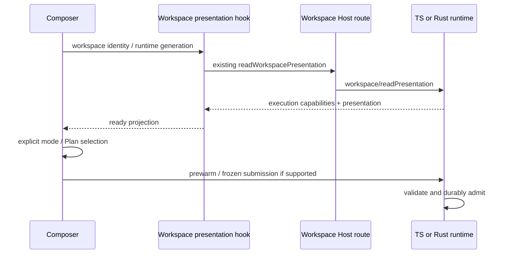

# App 根据工作区执行能力选择权限

## 产品规则

Rust 只声明 yolo，独立 Plan 不支持；TS/旧 runtime 未声明新增能力时沿用既有权限与 Plan 行为。Host transport hello 仍描述 Host 能力，不把它混成每个工作区的执行能力。默认 runtime 不变。

新草稿与历史草稿保留用户已有 mode / planEnabled，包括默认 build、历史 Plan 和 Recent。不得把不受支持的权限静默改成 yolo。Composer 显示明确说明，用户通过现有权限菜单选择 Full access 后才能预热和发送；若 Plan 仍开启，需显式关闭。菜单中不支持的项禁用，快捷键只循环受支持项。已开启但不支持的 Plan 仍允许关闭。

能力未知或请求失败时禁止预热/发送，不假设完全访问。正常正文编辑、模型选择和取消运行不受影响。已有会话也遵循此门禁；Rust 仍在接纳层拒绝非法 mode / Plan，UI 不是安全边界。

## 唯一事实与接口

Runtime 是执行能力的唯一所有者，新增可选 `executionCapabilities: { permissionModes, independentPlanState }`，出现在 `workspace/readPresentation` 以及 V4 workspace-config 状态。共享 schema 严格校验内容，版本不变。旧 App 的 presentation 响应 schema 为 strict：Rust 通过 runtime/capabilities 的 workspaceExecutionCapabilities 声明支持，Host 仅在该能力为 true 时附带 includeExecutionCapabilities；Rust 仅在请求为 true 时返回新增字段。未协商请求保持旧形状。V4 workspace-config 内层原有 schema 允许剥离新增字段。Rust 两条投影来自同一函数，Host 转发。

Renderer 复用现有 workspace presentation RPC。通过统一 hook / SWR 合并同 service / workspace identity / runtime generation 的并发读取，移除旧 Composer 中独立水合请求。响应只用于展示投影：configOptions 与 slash 仍写既有 Zustand store；执行能力由同一查询返回，不存 localStorage，不成为会话权限事实。工作区、服务或进程换代都重新获取；旧响应不得回写新一代。传输连续/重放差异不改变此 workspace 级只读能力。

## 验收

- 当前 App schema 接受 Rust yolo-only；两种订阅 delivery 均保留能力字段，TS 缺字段兼容。
- build/Plan 不自动变成 yolo，不发模型请求、不预热失败重试；用户选择后才可发送。
- 菜单禁用其他权限与 Plan 开启，快捷键不进入不支持模式；Plan-off 不受限制。
- 同路径不同 workspace identity 分离；服务或进程换代等待新能力，迟到响应不能覆盖。
- 真实 App 新任务、历史续聊、窄屏权限入口与键盘路径；Rust/App 回归和全部门禁。
