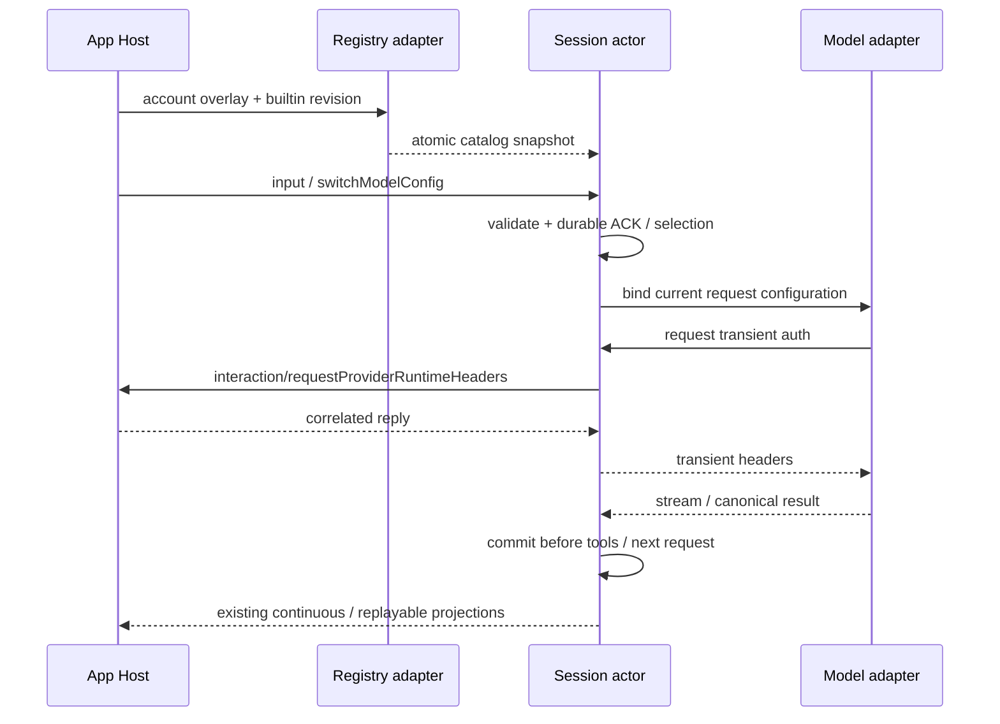

# Rust App stdio P0

本包覆盖 App 接入契约、现有 Provider 配置与账号请求鉴权、TS 数据连续性。权限仅 yolo；TS 继续作为默认 runtime。P1/P2 未实现能力须明确拒绝，不能用空成功结果宣称支持。

## 所有者与顺序

- Session actor 是选型、队列、消息、ACK 和恢复状态的唯一写入者。输入/选型先提交，再启动请求；工具结果先提交，再请求下一步。
- Registry adapter 读取既有 `ZCODE_BUILTIN_PROVIDER_CONFIG_FILE` / `ZCODE_PERSONAL_PROVIDER_CONFIG_FILE`，按 TS 的模板、内置、账号、个人覆盖和模型规则解析。配置快照原子替换；账号基线 revision 不匹配时保留上一份完整快照。既有显式 `--config` 继续用于测试和独立部署。
- 模型每次调用绑定已提交选型及完整配置快照；刷新不改变在途请求。模型切换允许在运行期间提交，下一模型步骤生效。排队输入保留 admission 时的选型。
- 默认选型与会话选型分开：App 配置仓储拥有 `defaultModelSelection`；Rust 读取该字段创建新任务，恢复任务保留自己的选型，不直接覆盖配置文件。
- Account overlay 不含凭据。每次网络请求经既有 `interaction/requestProviderRuntimeHeaders` 向 Host 获取临时鉴权，响应按请求 ID 匹配；取消发既有取消通知并清理等待者。迟到或重复回复不得恢复已取消请求。鉴权不进入 canonical、ACK、队列、日志或数据库。
- stdio 同时支持请求、通知、回复；stdout 只写协议。Host 仍拥有进程、workspace identity、lease 和连接路由。
- `workspace/generateText`、`workspace/cancelGenerateText`、`provider/testModelConnectivity` 复用模型解析/鉴权/取消端口；actor 只持有临时 operation 关联，不创建持久会话，不执行返回的工具调用。请求自己的 maxOutputTokens 使用既有 option map；等待鉴权时仍可取消。

## 数据连续性

TS 原库只读，Rust 使用独立 SQLite。导入使用一致性快照，保留源数据与附件/产物，不原地升级 TS 表。按源身份和会话 ID 幂等导入；已存在的 Rust 会话不被旧源覆盖。保留会话 ID、workspace identity、时间、标题、模型选择、消息/工具关联及附件引用。无法识别的持久化语义必须报出，不静默截断历史。未结束工具转为 unknown outcome，绝不重新执行。非 yolo 会话保留模式，显式切换后才可执行。计划开启的旧任务保留 planEnabled，必须通过显式关闭计划后才允许 yolo 执行；本包不启动计划执行。列表成员沿用 TS taskType，interactive/fork/workflow_parent 可见；归档与辅助子任务不混入列表，仍可按 ID 查询。未知 part/未支持的上下文语义阻止导入，并通过 startup/storageState failed 明确反馈，不以缺失上下文继续执行。迁移读取既有 storage 路径优先级及 artifact 引用；本地/data/artifact 附件字节保存独立快照，通过现有 attachment read/stat/previewSource 读取，须按会话、行和附件序号重新授权；显式不存在的导入源视为错误。回退 TS 使用保留原库；Rust 后续新增历史不冒充已回写 TS。

## 验收

真实 Renderer 补充：Host task-index 仍通过 `session/read` 回源。Rust 必须从同一个 Session owner 只读投影 legacy snapshot 的会话元数据、当前选型/能力、运行状态和可见消息/工具；不能返回空消息代替索引正文，也不能触发 resume、模型请求或改写订阅 deliveryKind。`messageLimit` 按消息尾部裁剪，超出物理帧预算明确拒绝。session kind 与归档时间从导入事实保存。回归须经过现有 Host `readSession(existing-only)` 和真实 Renderer，确认新任务进入侧栏、停止后可续聊、重启后恢复。

1. 不提供 Rust 模型 JSON，使用既有内置+个人文件及 account overlay 创建任务、流式回复与工具调用。
2. 同 modelId 不同 provider 不串选；所有 reasoning 档位按既有 option map 产生请求；空值/删除/规则覆盖语义与 TS 差分一致。
3. 修改配置、账号 revision 到达次序、运行中切模型、排队输入及重启；正确模型用于正确步骤。
4. 鉴权成功/失败/错误帧/等待时取消/迟到回复、双订阅和凭据不落盘。
5. TS 真实 schema 生成的历史含工具、附件、压缩和中断执行；导入、重启、重复导入、隔离与回退源不变；数据库失败不继续执行。
6. Rust test/fmt/Clippy、真实子进程 App client/schema 测试、typecheck/lint/架构检查。区分 fixture、真实 Renderer 和真实供应商验收，不互相冒充。
