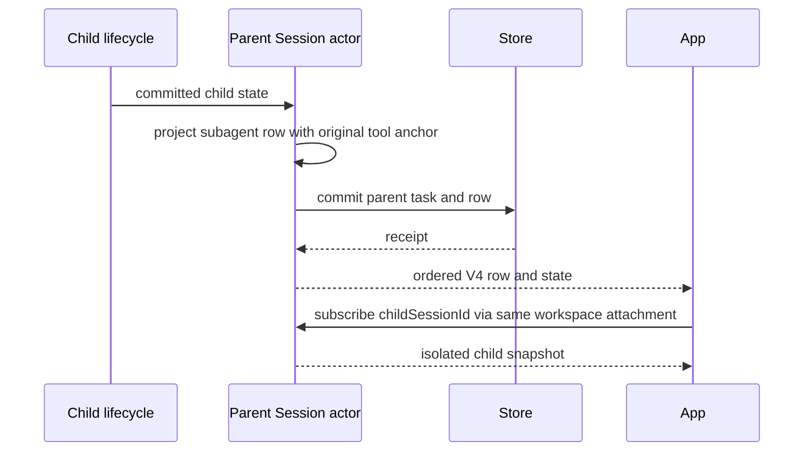

# Rust App 会话身份与子代理详情

2026-09-23。真实 Rust stdio 记录确认本地 desktop-continuous 会话被 snapshot 的多余 workspaceIdentity 投影成远端任务；父会话只有 Agent toolCall 和 subagents 状态，缺少可关联详情入口的 subagent 行。

## 规则与所有者

- Rust Session actor 独占 canonical 与子代理任务事实；App 接收既有协议投影，不改变 runtime/远控路由，不新增协议版本。
- session/read 的 workspaceKey 保持身份 key。本地 key 等于 workspacePath 时省略 workspaceIdentity；真实远端身份继续保留。session/list、冷 session/read 与活跃读取一致。
- tasks-index repo 读取旧行时，若 workspace_key、workspace_path、workspace_identity 三者相等，投影为本地身份；相同路径的真实远端 key 必须保留。任务列表和 grouped structure 共用该规则，不改主键、归档、pin、标题、顺序或正文，不直接编辑用户数据库。
- 每个有已提交 Agent/Task toolCall 锚点的 child 对应一条 subagent 行，携带 parentToolCallId、childSessionId、subagentType、summaryText、status 和时间。生命周期以 child task 为事实源，SendMessage 继续更新原行，不改原始工具关联，不嵌入 child transcript。
- launch、完成、取消、消息恢复和冷恢复都更新同一投影；父事实提交成功后才能启动 child 或交付结果。旧 Rust 历史只有 children 事实时，在单会话恢复中从真实 toolCall 锚点补齐行；没有可证明锚点则不猜测关联。冷恢复一次扫描建立锚点索引，不按每个历史 child 重扫整段 rows。只增加展示事实，canonical 和模型意图不变。

## 验收

- 真实 Rust 子进程：本地/远端身份、live/cold session/read 与列表；旧 tasks-index 路径身份读取后恢复本地图标语义，真实 remote 同路径隔离不变，壳状态不丢。
- 并发 child 精确关联 Agent 调用；running/terminal/resume/cancel、cold 旧行补齐且幂等；App schema 校验、子会话可订阅并显示正文。
- 隔离 Electron App：点击 Agent 摘要打开子代理侧栏并看到其独立历史；本地任务归档显示本地图标。
- Rust tests/fmt/Clippy、App 集成、typecheck/lint/fmt 与架构检查。用户 App 和用户数据库保持未改写。
