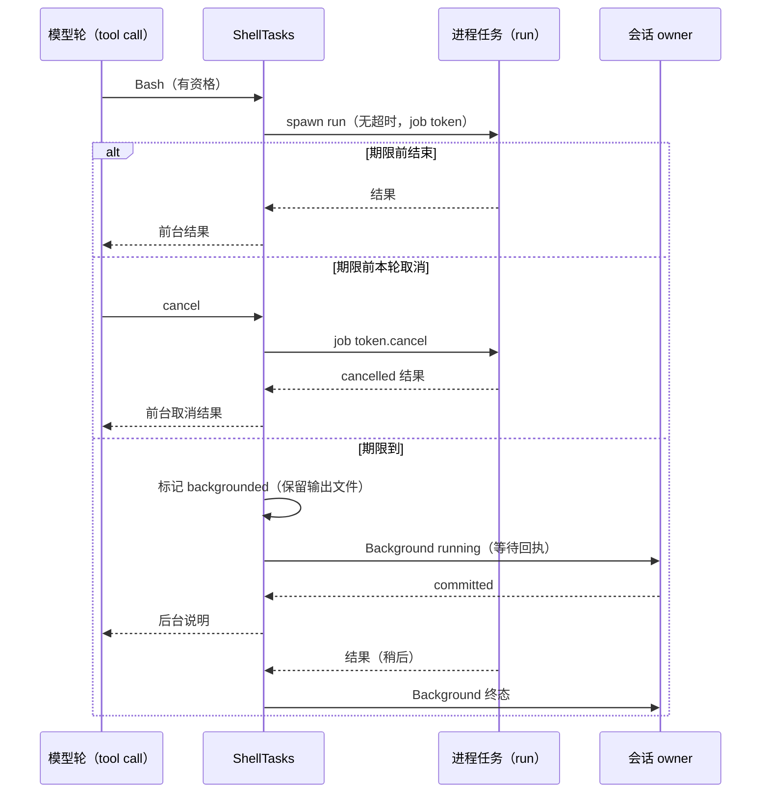

# Rust Bash 超时自动转后台

## 背景

TS 前台 Bash 超时后不终止进程，而是把它转成后台任务（`runBashWithBackgroundLifecycle` 的
`auto_on_timeout`）。模型收到与显式后台相同的说明：「Command running in background with ID: …」。
进程完成后，经任务通知另起一轮。Rust 仍按超时终止，模型看到的是超时中断结果。这是
rust-bash-model-content.md 第 12 条遗留项。

## 规则（对齐 TS）

1. 资格（TS `isBashAutoBackgroundEligible`）：
   - 非 `run_in_background`；
   - 命令去首尾空白后非空，且第一个词不是 `sleep`；
   - 有会话 owner（与显式后台相同，后台任务需要 owner 登记与通知）。
   - 不满足资格时保持原前台超时终止语义。
2. 有资格的前台命令，进程本身不设超时；前台等待期限为解析后的 timeout（默认 120s，上限 600s）。
3. 期限前进程结束：按普通前台结果返回。输出文件仅在截断时保留，与 rust-bash-model-content.md 一致。
4. 期限到时：
   - 把进程登记为后台任务。登记方式与显式后台相同：Background running 事件，并等待 owner 提交回执；
   - 立即返回后台说明（`status: backgrounded`、`backgroundTaskId`、输出文件路径）；
   - 从此进程与本轮的取消脱钩，只受 TaskStop、会话关闭与 runtime 关闭控制；
   - 进程结束后发 Background 终态事件，与显式后台相同。
5. 期限前本轮被取消：终止进程，按前台取消结果返回。
6. 工具 future 被丢弃（未转后台时）：终止进程，不留孤儿进程（drop guard）。
7. 登记失败（后台任务达到 16 个上限、owner 未提交，或登记期间本轮取消）：
   - 终止进程，返回工具失败：`Command timed out after <时长> and could not move to the background: <原因>`；
   - TS 在该处不会失败，这是 Rust 的有意兜底，只影响上限等极端情况。
8. 不移植：TS 闲时 turn（`offPeakTurn`）禁用后台。Rust 没有闲时 turn 概念。

## 所有者与事件顺序

- 进程生命周期由 `ShellTasks` 持有的 job token 控制。
- 前台等待方（工具调用）只在转后台之前把本轮取消转发到该 token。

## 验收

- Node 对 Rust 差分：
  - `echo started; sleep 3` 配合 `timeout: 1000`：两侧模型可见的工具结果一致（id 与路径按占位比较）；
  - 后台任务完成后，两侧都另起一轮任务通知。
- 期限前本轮取消：进程被回收，没有遗留后台任务。
- 期限前完成：返回普通前台结果，不登记后台任务。
- 回归：显式后台、TaskOutput、TaskStop 与 shell-lifecycle 用例保持通过。
