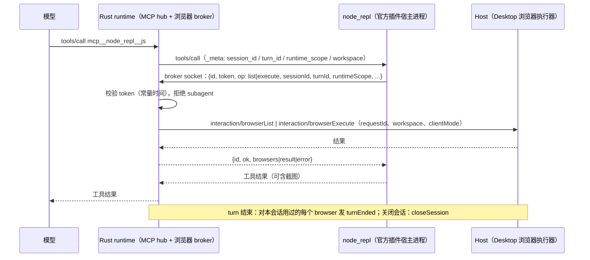

# Rust Browser Use / Computer Use（node_repl 宿主）

2026-09-26。用户决定：在 Rust runtime 中实现，不声明 unsupported。差分发现：此前 Rust 完全没有 `node_repl`
内置 MCP，Browser Use 与 Computer Use 在 Rust 下整体不可用；发布门槛表中的「浏览器截图压缩」低估了缺口。

TS oracle：

- `bootstrap/src/app/{built-in-node-repl,official-plugin-runtime,plugin-runtime-features,node-repl-browser-broker}.ts`；
- `bootstrap/src/zcode-protocol/browser-control-broker.ts`（`BrowserControlPort` → Host 反向请求）；
- `bootstrap/src/mcp-config.ts`（CUA broker 凭据注入）；
- `adapters/src/mcp/index.ts` 的 `mcpRequestMeta`；
- `core/src/runtime/methods/browser-turn-screenshot.ts`、`helpers/conversation.ts` 的 `formatBrowserAmbientUserInput`，
  以及 turn 收尾的 `turnEnded`。

## 所有者与事件顺序

- broker 由 Rust 进程持有：Unix socket（`<tmp>/znr-<uuid>.sock`），Windows 为命名管道
  `\\.\pipe\zcode-node-repl-<uuid>`。
- token 为 32 字节随机数，仅经 env 注入 node_repl。每个请求一行 JSON，上限 1 MiB。
- 对端断开即取消在途 Host 请求：先发 `cancelRequest`（同一 browser/generation），再中断等待。
- Host 请求走既有的 Host 通道（`HOST_CHANNEL`），不依附会话。
  但 `sessionId` 必须是本 runtime 的会话（TS `requireSession`），否则报错。

## 分期

1. node_repl 注册与启动，以及 MCP 请求上下文：
   - 注册条件：`browser-use@…` 或 `computer-use@…` 启用，且 `node-repl-host@…` 存在。
     满足时注册 stdio server `node_repl`：
     - 命令：`ZCODE_PLUGIN_HOST_EXEC_PATH`；
     - 参数：`[ZCODE_PLUGIN_HOST_ENTRYPOINT, "__zcode-plugin-host", <host>/dist/mcp/server.js]`；
     - env：`ELECTRON_RUN_AS_NODE=1`，以及按启用情况注入 `ZCODE_PLUGIN_ROOT` / `ZCODE_CUA_PLUGIN_ROOT`；
     - `isolation: workspace`，`protocolVersion: 2026-07-28`，超时 600s；
   - 缺少宿主或启动器时不注册；
   - 所有 MCP `tools/call` 带 `_meta` 请求上下文（TS `mcpRequestMeta`：扁平键与 `com.zcode/request-context` 两份）。
2. 浏览器 broker：
   - socket/pipe 监听与 token 校验；
   - `list`/`execute` 映射到 Host 的 `interaction/browserList`、`interaction/browserExecute`，含取消；
   - 记录会话用过的 browser，turn 结束时发 `turnEnded`，关闭会话时发 `closeSession`；
   - broker env 注入 node_repl。
3. 会话侧呈现：
   - 输入的 `browserAmbientContext` 按 TS 模板包装进模型可见的用户正文；
   - turn 结束时对 active tab 截图，生成 `browser_turn_end` 工具行（超预算按统一图片处理压缩）；
   - node_repl 图片结果的展示与压缩。
4. Computer Use：
   - node_repl env 注入 CUA broker socket、plugin authority、refresh marker、`ZCODE_CUA_NODE_REPL_HOST=1` 与插件 id；
   - 这些凭据不泄漏给其他子进程（TS runtimeEnv sanitize 清单）。
   - 细则见下文「第 4 期细则」。

## 验收（每期）

- Node 与 Rust 在同一 fixture 上差分：
  - 测试用 `ZCODE_PLUGIN_HOST_EXEC_PATH=node`、`ENTRYPOINT=zcode.cjs` 启动同一个真实 node_repl 宿主；
  - harness 应答 Host 的浏览器请求。
- 第 1 期比较：MCP 状态、node_repl 工具定义、一次 `js` 调用的结果，以及 node_repl 收到的请求上下文。
- 第 2 期比较：Host 浏览器请求的参数序列、token 错误与 subagent 拒绝、turnEnded。
- 第 3 期比较：模型请求中的用户正文、轮尾截图行。
- 第 4 期比较：node_repl env 中的 CUA 键集合（不比较值）。

## 进度

- 第 1 期（已完成）：
  - `mcp_node_repl.rs` 注册内置 node_repl；设置页 `mcp/list` 不列出它，也不为此启动宿主（与 Node 一致）。
    宿主插件按已启用列表查找：`node-repl-host` 默认启用且对用户隐藏；
  - 所有 MCP `tools/call` 下发 `_meta` 请求上下文：
    - `TurnFacts.mcp_meta` 在 run 开始时构建，每次调用生成新的 `span_id`；
    - 订阅记录 `clientMode`；
    - rmcp 自带的 `progressToken` 保留，Node 不发该键；
  - 差分：
    - `zcode-cli-rust-mcp-request-context.test.ts`：键集合与取值关系一致；
    - `zcode-cli-rust-node-repl.test.ts`：设置页状态、会话工具定义与一次 `js` 调用结果（`42`）一致。
- 第 2 期（已完成）：
  - 实现在 `browser_broker.rs` 与 `browser_broker_listen.rs`（Unix socket / Windows 命名管道）；
  - 首次出现 node_repl 配置时启动 broker，socket 与 token 只注入 node_repl 的 env；
  - 会话上下文来自该会话 MCP 调用的 `_meta`，未知会话在到达 Host 前拒绝；
  - 对端断开时发 `cancelRequest`；关闭会话时对用过的 browser 发 `closeSession`；
  - 差分 `zcode-cli-rust-node-repl.test.ts` 用真实 browser-use bootstrap 与 `agent.browsers`：
    Host 的 `interaction/browserList`、`interaction/browserExecute` 请求序列与参数逐项一致；
  - 单测覆盖 token 错误、subagent 拒绝与未知会话。
  - 差分实测：Node 的 app-server 路径**不发 `turnEnded`**。TS 代码虽在 turn 收尾调用 `browserControlPort.turnEnded`，
    但等待 10s 仍未观察到。Rust 按实测行为不发，只在关闭会话时发 `closeSession`。
- 第 3 期（已完成）：
  - MCP 工具卡：
    - ToolStart 时行级 `display` 为 `mcp_tool`（serverName / 原始 toolName / description，按 TS 上限截断）；
    - 结果 `output.display` 与之相同；node_repl 图片走行级 `node_repl_images`；
    - 行级 display 按 TS 白名单投影（`domain/tool_display.rs`、`session_recovery::finish_tool_row`）。
  - 轮尾截图：
    - node_repl 结果 `_meta["zcode/browserTurnScreenshot"]` 记为本轮候选；
    - 成功收尾时 list → 对 active tab screenshot；超过 200 KiB 按统一图片处理压缩
      （`image_budget::prepare_within`，最长边 2048，无 token 上限）；
    - 追加 `browser_turn_end` 工具行（`tool_<uuid>`，空输出，不进入模型历史）。
  - 生命周期：TS 的 node_repl broker 与会话 runtime 各持一个 BrowserControlPort，`turnEnded` 与 `closeSession`
    只覆盖 runtime 自己操作过的 browser（轮尾截图）。一旦截图过，此后每个 turn 收尾都发 `turnEnded`（任何结局）。
    第 2 期「Node 不发 turnEnded」的结论只适用于未截图的会话，已按此修正。
  - `browserAmbientContext`：
    - 输入校验从「不支持」改为按协议 schema 校验；
    - 模型可见正文按 TS 模板包装，展示行保持原文。
  - 差分：
    - 截图轮的命令序列（newTab、navigate、list、screenshot、turnEnded × 2）一致；
    - 两条工具行的 display 与 output 逐字段一致；
    - 下一轮的模型历史一致；
    - 环境状态包装后的用户正文一致。
  - 顺带发现并对齐的两处模型请求差异：
    - 只有工具调用的 assistant 消息，chat 协议下 content 为 `null`（Rust 之前发空串）；
    - 有插件技能时，技能提醒位于上下文提醒之前（Rust 之前相反）。
- 第 4 期（已完成）：
  - 实现：
    - 子进程环境按上文细则清洗；
    - CUA 凭据只注入 node_repl；
    - 内置 node_repl 最后合并；
    - 退役 CUA server 被过滤；
    - 插件 stdio env 默认值与插件 id 由宿主写入。
  - 差分（`zcode-cli-rust-child-env.test.ts`）：Bash 与 MCP stdio 子进程看到的相关键逐项一致，唯一例外是上文的
    遗留 token 有意差异；node_repl 内核看到的 CUA 键一致，同名用户 node_repl 与退役 server 同时存在也不影响。
  - TS 以入口文件目录发现官方插件，没有 `ZCODE_OFFICIAL_PLUGINS_BASE_DIR`。差分中让 Node 从同一 base 下的
    bundle 副本启动，使两侧看到同一组插件。
  - node-repl-host 不把 socket/authority 透传给 JS 内核，只透传宿主标记与插件 id。Rust 与 Node 一致。
  - 另外发现：Rust 的 Bash 模型可见内容是结果对象 JSON，TS 为格式化文本。见 rust-bash-model-content.md。
- 差分中另外发现：Rust 不按 inputSchema 校验工具入参。Node 缺少必填参数时返回 `InputValidationError`，
  Rust 直接调用工具。见 rust-tool-input-validation.md，单独对齐。

## 第 4 期细则（Computer Use 与子进程环境）

所有者：进程环境只在启动时读取一次（`std::env`），Rust 不改写自身进程环境（多线程下 `set_var` 不安全），
每次派生子进程时由 `host::child_env` 计算差量（删除/设置），纯规则在 `domain::runtime_env`。

1. 子进程环境清洗（对齐 TS `sanitizeZCodeRuntimeEnv` + `applyNetworkEgressEnv`）：
   - 清洗键：TS `SANITIZED_RUNTIME_ENV_KEYS`（NODE_ENV、代理与证书、REMOTE 网络授权、CUA broker、OTEL/遥测）
     与包管理器代理/证书模式；按大写比较，Windows 下同名不同大小写一并删除。
   - 所有子进程（Bash、自定义命令 shell、MCP stdio、git 上下文、PDF 渲染）都删清洗键。
   - 工具子进程（Bash、自定义命令、MCP stdio）再按 TS 顺序恢复出网配置：
     1. 删 `ZCODE_TOOL_ENV_PASSTHROUGH_JSON`；
     2. 恢复透传：JSON 中的合法键，加上启动环境里可捕获的清洗键（`shouldCaptureZCodeToolEnvPassthroughKey`，
        后者覆盖前者；遥测键、NODE_ENV 类、CUA 凭据与 REMOTE 键不可捕获）；
     3. `ZCODE_HTTP_PROXY`（补 `http://`）写入 6 个代理键；
     4. `ZCODE_NO_PROXY` 写入 `NO_PROXY`/`no_proxy`；
     5. `ZCODE_AGENT_CA_CERT` 写入 5 个证书键。
   - 有意差异：TS 会经透传恢复遗留的 `ZCODE_CUA_PERMISSION_BROKER_TOKEN`（与其注释「一并剔除」相矛盾），
     Rust 不恢复，按剔除处理。
   - MCP 配置里的 `env` 在清洗后覆盖（TS spread 顺序），node_repl 的定向凭据因此能送达。
2. CUA 凭据（TS `captureZCodeCuaBrokerCredentials`）：启动环境中 socket 与 authority 同时非空才成组，
   refresh marker 可选；半组视为无凭据（fail-closed）。
3. node_repl 注入（TS `injectZCodeCuaBrokerMcpServers`）：computer-use 插件启用且 node_repl 注册、凭据成组时，
   node_repl env 加 socket、authority、marker（有时）、`ZCODE_CUA_NODE_REPL_HOST=1`、
   `ZCODE_PLUGIN_ID=computer-use@zcode-plugins-official`。浏览器 broker env 仍照旧注入。
4. 配置合并：内置 node_repl 最后合并，用户、`.agents`、插件或会话 overrides 的同名配置不能替换它
   （TS `builtInMcpServers` 最后 spread）。
5. 退役 CUA MCP（TS `isRetiredCuaMcpServer`）：除 node*repl 外，名为 `computer-use`、
   env `ZCODE_PLUGIN_ID` 为官方 CUA 插件 id、command 或任一 arg 匹配 `zcode-cua` 包规格
   （`zcode-cua`、`[`/`@`/`==`/`.` 续接，`*`视同`-`，并比对路径叶子）的 stdio server，
   不连接、不进入状态列表、不暴露工具。
6. 插件 stdio MCP 的 env 默认值（TS plugins/mcp.ts）：
   - 默认值：`CLAUDE_PROJECT_DIR`、`ZCODE_PROJECT_DIR`（工作区）、`ZCODE_PLUGIN_DATA`、`CLAUDE_PLUGIN_DATA`
     （`<storage>/data/<sanitized id>`）、`ZCODE_PLUGIN_ROOT`、`CLAUDE_PLUGIN_ROOT`；
   - manifest env 在其后覆盖；
   - `ZCODE_PLUGIN_ID` 最后由宿主写入插件 id，manifest 不可伪造。

验收：

- 单测覆盖清洗、透传、代理/证书映射、半组凭据、包规格匹配。
- 差分（Node vs Rust，同一启动环境含 CUA 凭据、OTEL、NODE_ENV、`ZCODE_HTTP_PROXY`、透传 JSON）：
  - Bash 子进程可见的相关键逐项一致；
  - MCP stdio 子进程可见的相关键逐项一致；
  - node_repl 可见的 CUA 键一致；
  - 同名用户 node_repl 配置不生效；
  - 退役 CUA server 不出现在 `mcp/list` 与工具列表中。
