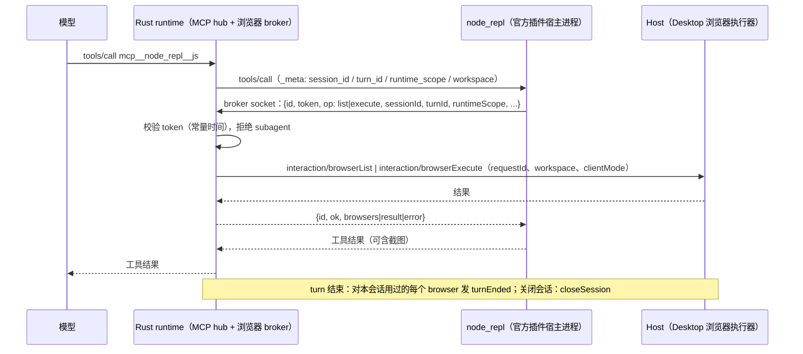

# Rust Browser Use / Computer Use（node_repl 宿主）

2026-09-26。用户决定：在 Rust runtime 中实现，不声明 unsupported。差分发现：此前 Rust 完全没有 `node_repl`
内置 MCP，Browser Use 与 Computer Use 在 Rust 下整体不可用；发布门槛表中的「浏览器截图压缩」低估了缺口。

TS oracle：

- `bootstrap/src/app/{built-in-node-repl,official-plugin-runtime,plugin-runtime-features,node-repl-browser-broker}.ts`；
- `bootstrap/src/zcode-protocol/browser-control-broker.ts`（`BrowserControlPort` → Host 反向请求）；
- `bootstrap/src/mcp-config.ts`（CUA broker 凭据注入）；
- `adapters/src/mcp/index.ts` 的 `mcpRequestMeta`；
- `core/src/runtime/methods/browser-turn-screenshot.ts`、`helpers/conversation.ts` 的 `formatBrowserAmbientUserInput`，
  以及 turn 收尾的 `turnEnded`。

## 所有者与事件顺序

- broker 由 Rust 进程持有：Unix socket（`<tmp>/znr-<uuid>.sock`），Windows 为命名管道
  `\\.\pipe\zcode-node-repl-<uuid>`。
- token 为 32 字节随机数，仅经 env 注入 node_repl。每个请求一行 JSON，上限 1 MiB。
- 对端断开即取消在途 Host 请求：先发 `cancelRequest`（同一 browser/generation），再中断等待。
- Host 请求走既有的 Host 通道（`HOST_CHANNEL`），不依附会话。
  但 `sessionId` 必须是本 runtime 的会话（TS `requireSession`），否则报错。

## 分期

1. node_repl 注册与启动，以及 MCP 请求上下文：
   - 注册条件：`browser-use@…` 或 `computer-use@…` 启用，且 `node-repl-host@…` 存在。
     满足时注册 stdio server `node_repl`：
     - 命令：`ZCODE_PLUGIN_HOST_EXEC_PATH`；
     - 参数：`[ZCODE_PLUGIN_HOST_ENTRYPOINT, "__zcode-plugin-host", <host>/dist/mcp/server.js]`；
     - env：`ELECTRON_RUN_AS_NODE=1`，以及按启用情况注入 `ZCODE_PLUGIN_ROOT` / `ZCODE_CUA_PLUGIN_ROOT`；
     - `isolation: workspace`，`protocolVersion: 2026-07-28`，超时 600s；
   - 缺少宿主或启动器时不注册；
   - 所有 MCP `tools/call` 带 `_meta` 请求上下文（TS `mcpRequestMeta`：扁平键与 `com.zcode/request-context` 两份）。
2. 浏览器 broker：
   - socket/pipe 监听与 token 校验；
   - `list`/`execute` 映射到 Host 的 `interaction/browserList`、`interaction/browserExecute`，含取消；
   - 记录会话用过的 browser，turn 结束时发 `turnEnded`，关闭会话时发 `closeSession`；
   - broker env 注入 node_repl。
3. 会话侧呈现：
   - 输入的 `browserAmbientContext` 按 TS 模板包装进模型可见的用户正文；
   - turn 结束时对 active tab 截图，生成 `browser_turn_end` 工具行（超预算按统一图片处理压缩）；
   - node_repl 图片结果的展示与压缩。
4. Computer Use：
   - node_repl env 注入 CUA broker socket、plugin authority、refresh marker、`ZCODE_CUA_NODE_REPL_HOST=1` 与插件 id；
   - 这些凭据不泄漏给其他子进程（TS runtimeEnv sanitize 清单）。

## 验收（每期）

- Node 与 Rust 在同一 fixture 上差分：
  - 测试用 `ZCODE_PLUGIN_HOST_EXEC_PATH=node`、`ENTRYPOINT=zcode.cjs` 启动同一个真实 node_repl 宿主；
  - harness 应答 Host 的浏览器请求。
- 第 1 期比较：MCP 状态、node_repl 工具定义、一次 `js` 调用的结果，以及 node_repl 收到的请求上下文。
- 第 2 期比较：Host 浏览器请求的参数序列、token 错误与 subagent 拒绝、turnEnded。
- 第 3 期比较：模型请求中的用户正文、轮尾截图行。
- 第 4 期比较：node_repl env 中的 CUA 键集合（不比较值）。

## 进度

- 第 1 期（已完成）：
  - `mcp_node_repl.rs` 注册内置 node_repl；设置页 `mcp/list` 不列出它，也不为此启动宿主（与 Node 一致）。
    宿主插件按已启用列表查找：`node-repl-host` 默认启用且对用户隐藏；
  - 所有 MCP `tools/call` 下发 `_meta` 请求上下文：
    - `TurnFacts.mcp_meta` 在 run 开始时构建，每次调用生成新的 `span_id`；
    - 订阅记录 `clientMode`；
    - rmcp 自带的 `progressToken` 保留，Node 不发该键；
  - 差分：
    - `zcode-cli-rust-mcp-request-context.test.ts`：键集合与取值关系一致；
    - `zcode-cli-rust-node-repl.test.ts`：设置页状态、会话工具定义与一次 `js` 调用结果（`42`）一致。
- 第 2 期（已完成）：
  - 实现在 `browser_broker.rs` 与 `browser_broker_listen.rs`（Unix socket / Windows 命名管道）；
  - 首次出现 node_repl 配置时启动 broker，socket 与 token 只注入 node_repl 的 env；
  - 会话上下文来自该会话 MCP 调用的 `_meta`，未知会话在到达 Host 前拒绝；
  - 对端断开时发 `cancelRequest`；关闭会话时对用过的 browser 发 `closeSession`；
  - 差分 `zcode-cli-rust-node-repl.test.ts` 用真实 browser-use bootstrap 与 `agent.browsers`：
    Host 的 `interaction/browserList`、`interaction/browserExecute` 请求序列与参数逐项一致；
  - 单测覆盖 token 错误、subagent 拒绝与未知会话。
  - 差分实测：Node 的 app-server 路径**不发 `turnEnded`**。TS 代码虽在 turn 收尾调用 `browserControlPort.turnEnded`，
    但等待 10s 仍未观察到。Rust 按实测行为不发，只在关闭会话时发 `closeSession`。
- 差分中另外发现：Rust 不按 inputSchema 校验工具入参。Node 缺少必填参数时返回 `InputValidationError`，
  Rust 直接调用工具。见 rust-tool-input-validation.md，单独对齐。
