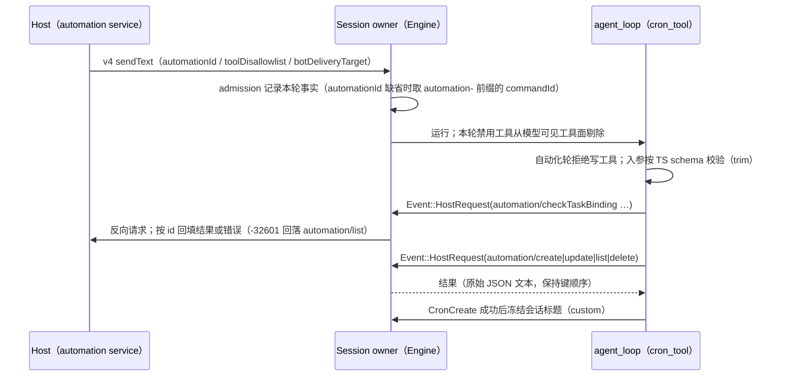

# Rust Cron 工具（CronCreate / CronList / CronUpdate / CronDelete）

2026-09-25。用户决定实现（rust-release-rollback.md「功能缺口范围」）。App 的定时任务由 Host 持有（调度、持久化、派发），
runtime 只做入参校验、守卫与协议转发；逐条对齐 TS `core/src/tool/handlers/cron.ts` 与
`bootstrap/src/zcode-protocol/automation-port.ts`、`zcode-protocol-v4/commands/prompt-turn.ts`。

## 所有者与流程

- 本轮事实：`automationId`（显式或 commandId 以 `automation-` 开头时取 `:` 之前部分）、`toolDisallowlist`
  （自动化轮额外加入 CronCreate/CronUpdate/CronDelete）、`botDeliveryTarget`；admission 时写入该输入的 payload，
  运行开始时读出。自动化轮（有 automationId 或禁用列表包含全部三个写工具）调用写工具时拒绝。
- 反向请求：Engine 通用 `HostRequest`，以请求 id 路由应答；错误保留 `code` 与 `message`。
- CronCreate：本轮已由 automation 派发时拒绝；先查当前会话是否已绑定定时任务（查询失败即拒绝，`-32601` 回落列表判定）；
  参数映射与 TS 相同（相对延迟、间隔 carrier、有限次数、会话模型与模式 `auto→build`、`targetTaskId`、bot 回推地址）；
  Host 返回创建上限错误（`AUTOMATION_CREATE_LIMIT_REACHED`）时给模型固定文案并结束本轮后续工具。
- 输出与模型可见内容：`JSON.stringify(output)`，automation 字段按 TS `toModelAutomation` 顺序，嵌套 `scheduleRule` 保持 Host 原始键顺序。
- 已知差异：Node 以 strict 协议 schema 校验 Host 应答（多余字段即报错），Rust 不校验应答形态；同版本 Host 不会产出非法应答。
- OffPeak 字段（`offPeakTaskId` / `offPeakRunType`）仍不支持（不在用户选定范围）。

## 验收

- `scripts/generate-zcode-cli-rust-cron-corpus.mjs`：真实 handler + 真实协议端口 + 脚本化 Host 的 21 个流程与 39 个校验用例，
  Rust 逐条比对请求序列与参数、输出、模型可见文案、错误、创建上限与标题冻结。
- App 差分：同一段对话在 Node 与 Rust 上创建/列出/更新/删除定时任务，Host 收到的请求与模型看到的结果一致；
  自动化轮中写工具不可见且被拒绝。
