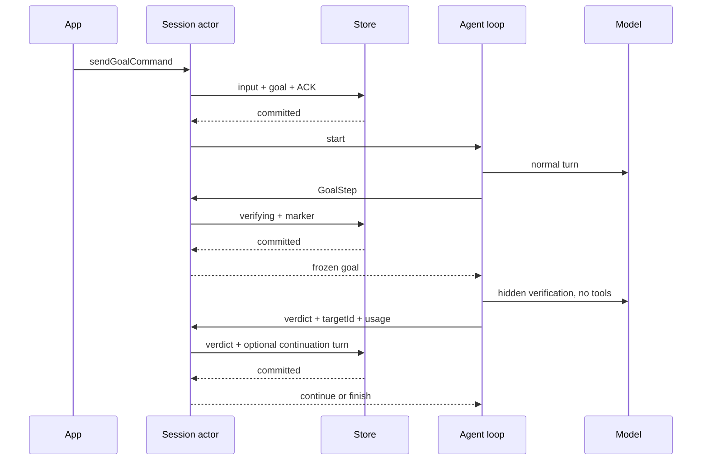

# Rust Goal owner 与执行契约

沿用当前 `goal-compact.ts`、`target-continuation-loop.ts` 及 V4 goal schema；权限仅 yolo。`sendGoalCommand` 校验非空、最多 4000 Unicode 字符，busy 时保留命令类型排队，不进入 guide；真正 admission 才替换目标。`pauseGoal` 不改变队列策略；`stop` 暂停目标并保持既有 queue hold；`resumeGoal` 在空闲时继续已有目标，无目标 noop。

Session actor 独占持久化 Goal：目标身份、状态、迭代、验证记录、token/time usage。工作副本通过有提交回执的事件请求验证和续跑。目标/验证开始提交后才调用模型，结果/续轮提交后才执行下一请求。取消、目标更换及迟到结果按 runId + targetId 隔离。重启将执行中的 Goal 暂停，不自动发起请求。

验证使用当前冻结模型、同一历史/摘要/指令，隐藏正文并保留 auth/retry 控制事件。明确通过才投影 verified；未通过且有 nextAction 则继续；无下一步或验证失败则停止自动推进但保留目标可恢复。与当前 TS 的显式差异：先采用已提出的保守方案，无效 JSON/基础设施错误不判通过，等待用户后续选择时可调整。工具调用或输出截断也不能判通过。

队列优先于自动续轮；有运行中的后台任务时不运行验证，后台工作全部完成且队列空闲后才恢复目标推进。暂停/停止不能被后台事件唤醒。每个完成请求累计 usage，活跃时间在提交边界结算；支持已有目标数据的可选 token budget，达到后暂停，不扩展当前 App command schema。

验收：两次验证后成功、无效 JSON 保留、工具使用后验证、目标替换/排队、pause/stop/resume、验证期间取消、冷恢复、后台任务等待、预算、提交故障阻止验证/下一请求；所有可见投影通过现有 App schema，隐藏 verifier 文本不得出现在普通 assistant 行中。
