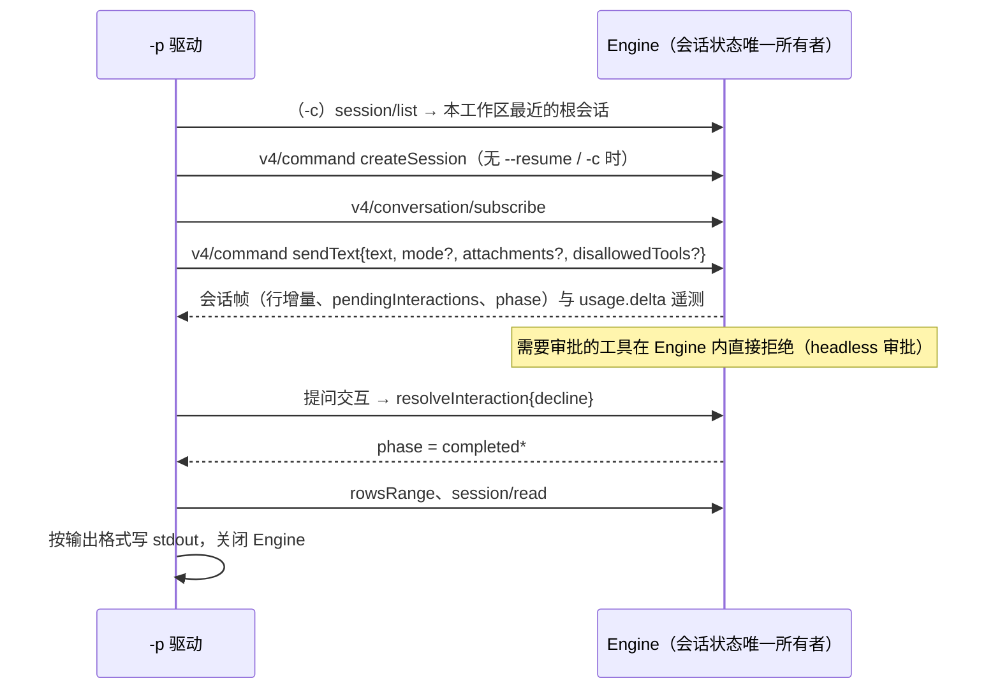

# Rust `-p` 无头模式

2026-10-08。对照 MBearo/ZCode-rs 的 M4 发现：Rust runtime 只有 `app-server --stdio`，没有 Node `zcode -p` 的一次性无头入口
（脚本、CI、自动化调用依赖它）。本期在 Rust 二进制上提供与 Node 相同的 `-p` 入口与输出。基线：
`apps/zcode-cli/packages/cli/src/{arguments.ts,run.ts,prompt-command.ts,shutdown.ts,resume.ts}`，以及 Node `-p` 实测输出。

## 入口与参数

- 第一个参数是 `app-server` 时走现有协议入口（行为不变）；其余情况按 Node 全局参数解析（`util.parseArgs` strict）。
- `-h/--help` 写帮助到 stdout，退出 0；`-v/--version` 写版本，退出 0；二者先于 `-p` 检查。
- 没有 `-p`：Rust 不提供 TUI，stderr 提示改用 `-p`，退出 2。

| 选项                                               | 规则（与 Node 相同，除注明外）                                                                              |
| -------------------------------------------------- | ----------------------------------------------------------------------------------------------------------- |
| `-p, --prompt <text>`                              | 去空白后为空：`--prompt requires non-empty text.`，退出 1                                                   |
| `--output-format <text\|json\|stream-json>`        | 其他值：`--output-format must be one of text, json, stream-json (received: X).`；显式值优先于 `--json`     |
| `--json`                                           | 旧别名，等同 `--output-format json`                                                                         |
| `--mode <build\|edit\|plan\|yolo>`                 | 不区分大小写；其他值：`Unsupported --mode value: X. Supported modes: build, edit, plan, yolo.`；缺省 `yolo`（Node `DEFAULT_HEADLESS_PROMPT_MODE`），且总是覆盖会话已存的模式（续接时同样） |
| `--cwd <path>`                                     | 工作区；缺省进程 cwd                                                                                        |
| `--attach <path>`（可重复）                        | 按扩展名推断类型（图片 / 视频 / PDF / 其他文件），相对路径按工作区解析                                    |
| `--resume <id>` / `-c, --continue`                 | 二者同时给：`--resume and --continue cannot be used together.`；`-c` 续接本工作区最近更新的根会话           |
| `--disallowed-tools, --disallowedTools <tools...>` | 贪婪读取后续非选项参数，逗号或空白分隔（括号内不拆），`web_search` 归一为 `WebSearch`；只作用于本轮         |
| `--surface <terminal\|desktop>`                    | 系统提示的展示面，缺省 `terminal`                                                                           |
| `--locale <en-US\|zh-CN>`                          | 只校验（Rust 提示词不区分语言）                                                                             |
| `--verbose`                                        | 出错时追加 `Cause:` 行                                                                                      |
| `--data-dir`、`--config`                           | Rust 独有：数据目录与单模型配置（同 app-server）                                                           |

- 未知选项：与 Node 同文 `Unknown option '--x'. …`，退出 1。
- Node 有、Rust 本期不支持的选项（`--target`、`--target-replace`、`--browser-use`、`--browser-executable`、`--memory-bench`、
  `--enable-workflow`、`--force-mcs`）：明确报错 `--x is not supported by the Rust runtime.`，退出 1，不静默忽略。
- `--output-format stream-json`：Node 逐行输出旧协议会话事件（`mapSessionEvent`），Rust 没有该事件流，V4 行增量是另一套
  schema；同一个参数在两个 runtime 输出不同结构会误导调用方，本期明确报错 `--output-format stream-json is not supported by
  the Rust runtime yet.`，退出 1。

## 执行

`-p` 在进程内驱动与 app-server 相同的 Engine（同一套 V4 命令、持久化与工具语义），不另写执行路径：

- 反向请求（无 Host）：`session/requestRuntimePreferences` 回空偏好（shell 自动探测）；其余（账号运行时请求头、插件 /
  工作流宿主等）回错误。需要 Host 每请求鉴权的账号 Provider 因此在 `-p` 下失败（见已知差异）。
- 审批：Engine 的 headless 审批（`Engine::with_headless_permissions`）与 Node `createHeadlessPermissionBroker` 一致——需要审批的工具
  调用不建交互、直接拒绝，模型看到的结果为 `No permission client configured for {tool}`；`CreateWorkflow` / `AmendWorkflow` 放行。
  提问交互（AskUserQuestion）由驱动回 decline。
- 标题：不生成会话标题（Node `-p` 的 `titleGenerationEnabled: false`，`Engine::without_title_generation`），标题停在首条输入。
- 模型：`--config`，或 Registry 环境变量（`ZCODE_BUILTIN_PROVIDER_CONFIG_FILE` + `ZCODE_PERSONAL_PROVIDER_CONFIG_FILE`）；
  都没有时报错 `No model configured: pass --config <model.json> or set ZCODE_BUILTIN_PROVIDER_CONFIG_FILE and
  ZCODE_PERSONAL_PROVIDER_CONFIG_FILE.`，退出 1。

## 输出

- `response`：本轮最后一个模型步骤的正文（Node `result.response`；带工具的轮次只取工具之后的最终回答）。
- text：`{response}\n`。
- json：2 空格缩进 + 换行（Node `formatJson`），键序：
  `sessionId, traceId, turnId, response, usage?, eventCount, projection{status, turnCount, totalTokenCount, contextUsed, contextWindow}`。
  - `usage`：本轮用量（本轮 `usage.delta` 遥测累加）：`source: "provider", modelRequestCount, inputTokens, outputTokens,
    totalTokens, cacheReadTokens, cacheWriteTokens, reasoningTokens, webFetchRequests, webSearchRequests`。
  - `projection.status`：`idle`；`turnCount`：本进程内完成的轮数（Node 投影同样只数本次运行）；`totalTokenCount`：本轮总
    token；`contextUsed` / `contextWindow`：会话的上下文用量。
- 错误：stderr `Error: {message}`，有 trace 时追加 ` (traceId: {id})`；`--verbose` 追加 `Cause:` 行；退出 1。轮次失败
  （`phase = completedError`）按错误处理，message 取会话 `lastError`。
- 信号：SIGINT / SIGTERM 取消当前轮、关闭 Engine 后分别以 130 / 143 退出（Node `shutdown.ts`）。

## 已知差异

- `eventCount`：Node 是本轮的会话事件数，Rust 没有 Node 的会话事件，取本轮收到的 V4 行与状态增量数（数值不同）。
- `turnId`：Rust 的轮次 id 是裸 UUID，Node 带 `turn_` 前缀（均为本轮真实 id，不改写）。
- `traceId`：`-c` / `--resume` 时 Node 每次运行生成新的 trace，Rust 沿用会话已存的 trace。
- `projection.contextUsed`：Node 取最后一次请求上报的 token，Rust 取会话上下文估算值（`session/read` 投影）。
- `usage`：按本轮 `usage.delta` 遥测累加（请求数与各类 token 与 Node 一致）；`webFetchRequests` / `webSearchRequests` 取本轮
  WebFetch / WebSearch 工具调用数（Node 计网络请求数）。
- `stream-json`、`--target` 等选项本期不支持（见上）。
- 斜杠命令：Node 在 `-p` 下特殊处理 `/help`、`/skill`、`/login`、`/logout`、`/goal`、`/expert`；Rust 按普通输入提交
  （自定义命令与 `/compact` 由 Engine 展开）。
- 模型来源：Node 独立模式会自动定位 Provider 配置（含 Z.ai 登录账号与内置配置的 CDN 刷新），Rust 需要 `--config` 或
  Registry 环境变量，且不支持需要 Host 鉴权的账号 Provider。

## 验收

- 单测：参数解析（合法组合、各错误文本、`--disallowed-tools` 贪婪与归一、`--json` / `--output-format` 优先级）。
- App 差分：`zcode-cli-rust-headless.test.ts`，同一模型夹具与 Registry 下分别运行 Node `zcode.cjs -p` 与 Rust `-p`：
  text 与 json 输出（去掉 id、`eventCount`、`contextUsed`，保留键序）、带工具的轮次、缺省 yolo 与显式 build 下的拒绝文案、
  `-c` 续接、各参数错误的退出码与 stderr 首行一致。
