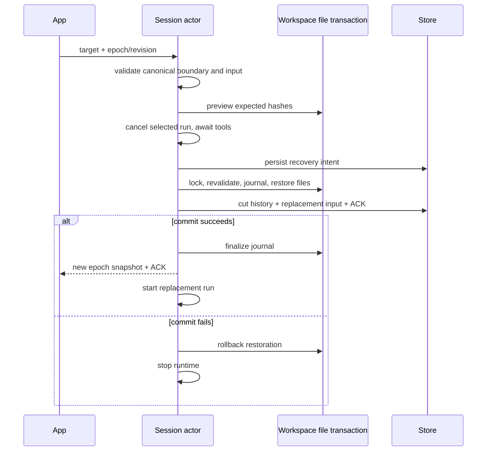

# Rust 历史操作与文件回退

依据当前 `fork-edit-retry.ts`、`file-rewind.ts`、V4 rows/actions 和 preview schema。所有行为使用现有方法/命令；Session actor 持有唯一历史、输入意图、稳定消息边界与 checkpoint 索引。数据库失败停止运行，文件恢复失败不能把会话切成成功的新分支。

## 对话边界

- admission 保存 canonical 输入意图、附件引用、选型、kind、对应 user entity/turn、进入前的消息位置与 context 边界。model 提交时保存可分支的稳定 assistant 边界；不能凭相同正文或最新轮猜目标。
- 每个 action 校验 session、epoch/revision、rowId+entityId 和动作资格。无效/陈旧目标先拒绝，不停止当前执行。
- `retryTurn` 只接受最新一轮 assistant；原输入在截断前捕获，按原 canonical kind 重新执行。
- `editUserQuery` 只接受最新 realUser 输入。附件缺省继承，`[]` 清空；正文与附件都空、附件无效等在取消前拒绝。Goal 输入保留 Goal 意图。
- `forkAssistant` 只复制被选轮最后稳定 assistant 边界，可在父会话继续运行时执行。新 session 有独立 owner/epoch，不复制队列、运行中工具、后台任务或交互；不改变父会话或工作区。
- 截断采用一个 Store 事务：删除未来 rows/messages、保存元数据/重发输入与 ACK。row ID 单调且不复用，改变 epoch 后推送完整 snapshot。已执行 command 的幂等凭据必须独立于被截断的 row 保留。
- 旧历史只有在能从已有 canonical 身份证明边界时才回填；无法证明的目标明确拒绝，不按文本猜测。

## 工作区恢复

Write/Edit 在实际修改前保存有内容 hash 的原始字节 checkpoint，准备事实先提交，才允许写文件；记录创建、修改、BOM/CRLF、权限、目标路径和预期写后 hash。恢复使用 checkpoint 原字节，不反向猜 diff；备份按 hash 去重。只追踪可证明的工具修改，本包不追踪 Shell 或外部 MCP 的任意文件修改，因此不声称可完整撤销整个工作区；preview 只判断已有 Write/Edit checkpoint。

`v4/conversation/fileRewindPreview` 只读地返回 safe/unsafe/ignored。当前文件与预期写后 hash 不一致、备份缺失、非普通文件或外部修改均拒绝覆盖。`applyFileRewind` 恢复文件但保留会话历史，成功后提交 checkpointRestored 时间线事实；二次执行幂等。

App 的文件入口依赖 `turnHeader.fileChanges` 和 `actions.canRewindFiles`，终态必须持久化这些投影，不能只在 user/assistant 行声明能力。`v4/conversation/fileChanges` 按目标所属轮聚合每个路径的 first-before → final-after，并返回 diff、写入次数和工具名称；已恢复轮显示 reverted。冷加载只修复缺失摘要，不在启动时读取所有会话或备份。详细 diff 按需读取，超过 RPC 预算时保留准确统计、省略 patches。

`editUserQuery.workspaceMode=rewind` 先预检且要求没有 unsafe/ignored 并至少有一个 safe 文件。取消执行并收齐子工具终态后，在统一文件写入门内再次校验并恢复；会话截断提交失败则回滚本次恢复。使用持久化恢复 journal，处理进程在文件与数据库两个提交之间退出的情况；恢复时发现新外部修改也不能覆盖。

验收覆盖同会话 retry/edit、附件继承和清空、Goal 意图、重复 ACK、跨 epoch 迟到目标、运行中无效目标不取消、稳定 fork 不停止父轮、cold restore 不复活已截断消息、压缩边界、原始字节恢复、外部修改冲突、取消与文件/存储故障、恢复 journal，以及通过现有 App client/schema 的真实子进程场景。

冷加载校验历史边界的 row/entity/turn、canonical message offset、上下文 offset 与模型选择字段；损坏的边界拒绝激活，不等到用户点击重跑后 panic。对话切断后的旧 command receipt 保留；fork 的新 session 与命令 ACK 事务失败时不得残留子会话。
