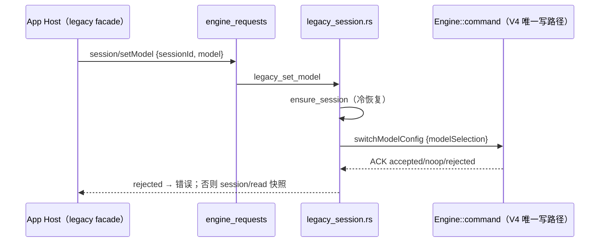

# Rust legacy session 方法对齐

2026-10-03。默认 runtime 切到 Rust 后，App 仍有若干路径走 legacy `session/*` 请求，Rust 回 `Unsupported method`
或拒绝普通建会话，相关功能在 Rust 上直接失败。本文定义这些方法在 Rust 上的语义与验收。

## 现状与触达路径（探针实测）

同一组请求分别打到 Node 与 Rust（`escode-cli-rust-legacy-session.test.ts`），Node 全部受理，Rust 结果如下：

| 方法                      | Rust 原行为                         | App 触达路径                                                                                                |
| ------------------------- | ----------------------------------- | ----------------------------------------------------------------------------------------------------------- |
| `session/create`（普通）  | `Null shared import field` / 缺字段 | 定时任务首跑（`host/index.ts` cron createTask）、闲时任务首跑、task facade 默认建会话                       |
| `session/send`            | `Unsupported method`                | task facade 带附件输入：Bots 收到图片/文件、手机 replayable 附件首发                                        |
| `session/setModel`        | `Unsupported method`                | Bots `/model`、facade `setConfigOption(model)`、desktop `escodeSessionService.setModel`、replayable 草稿复用 |
| `session/setThoughtLevel` | `Unsupported method`                | 打开历史任务时重放 task 思考档位（`escodeSessionService.resumeSession`）、replayable 草稿复用                |
| `session/setMode`         | `Unsupported method`                | facade 切到 `auto`（Rust 不声明 auto，见下）、`escodeSessionService.setMode`                                 |
| `session/close`           | `Unsupported method`                | 关闭框选副屏 runtime（`useAppPanels`）、草稿 Skill 失效、条件关闭 deferred 草稿、facade `closeTask`         |

`session/compact` 与 `session/goal` 只在 task facade 中声明，App 内没有调用点，本期不实现（与
rust-parity-remaining.md 中「无活跃 UI 调用点」同口径）。`importedHistory.source = "claudeCode"`（Claude Code
历史导入/修复）是独立缺口，另立工作包。

## 设计：翻译到 V4 命令，单一写路径

legacy 请求不新建写路径：在 Engine 内构造 V4 `Command`（`clientId = "legacy-session"`，`commandId` 取 legacy
`inputId` 或新 id），调用与 `v4/command` 相同的 `Engine::command`，再按 Node 的 legacy 结果形状返回（快照即
`session/read` 同形）。状态所有者仍是 Engine actor；ACK 账本、持久化、订阅推送与 V4 命令一致。

### 各方法映射

| legacy                                   | V4 / Engine                                                                                                                                                                         | 结果                                         |
| ---------------------------------------- | ----------------------------------------------------------------------------------------------------------------------------------------------------------------------------------- | -------------------------------------------- |
| `session/create`（无 `importedHistory`） | `createSession {workspaceId, config{provider,model,thought,mode}, mcpServers, offPeakToolEnabled, dynamicWorkflowEnabled}`；`mode=plan` 再发 `switchCollaborationMode{planEnabled}` | 新会话快照                                   |
| `session/setModel`                       | `switchModelConfig {modelSelection}`                                                                                                                                                | 快照                                         |
| `session/setThoughtLevel`                | `switchModelConfig {provider,model 取当前, thought}`                                                                                                                                | 快照                                         |
| `session/setMode`                        | `yolo/build/edit` → `switchCollaborationMode{mode, planEnabled:false}`；`plan` → `{planEnabled:true}`                                                                               | 快照                                         |
| `session/close`                          | `deleteSession`（关闭 runtime、保留历史，见 rust-session-close.md）                                                                                                                 | `{closed:true}`；持久性不符 `{closed:false}` |
| `session/send`                           | `sendText {text, modelSelection, modelExecution, automationId, offPeak*, botDeliveryTarget, browserAmbientContext, toolDisallowlist, attachments, requestedDelivery:startNow}`      | `{sessionId, accepted:true, stateRevision}`  |

规则：

- **建会话**：带 `sessionId` 而无 `importedHistory` 报 `sessionId is only supported for imported history creates`（Node 同文）；
  有 `importedHistory` 仍走共享上下文导入。`persistence` 只校验取值：差分实测 Node 的空会话无论
  `immediate` 还是 `deferred` 都要到首条输入才进会话库（重启后 resume 报 `Session not found`），Rust 草稿同语义。
  `titleGenerationEnabled=false` 只在 automation 建会话时出现，
  Rust 已按首条输入的 automation 身份关闭标题生成，故只校验类型。`toolAllowlist/toolDenylist/parentSessionId`
  非空时明确拒绝（Rust 无会话级工具白名单；CUA 会话不经此路径）。`mode=auto` 拒绝（Rust 不声明 auto）。
- **发送**：会话运行中报 `A prompt is already running for this session`（Node 同文，legacy 不排队）；
  `toolDenylist` 映射为 `toolDisallowlist`；`expectedRevision` 不符报 stale。附件逐个转换为 V4 attachmentRef：
  `localPath` 直接作 ref（Engine 快照原文件），`dataBase64`/`textContent` 写入附件存储并登记到会话；
  `fileName` 取 `filename`，`mime` 取 `mimeType`。
- **关闭**：`expectedPersistence` 与当前持久性不符时返回 `{closed:false}` 且不动会话；当前持久性：会话无行、
  无消息、无共享上下文（即仍是草稿）为 `deferred`，否则 `immediate`。会话未加载时返回 `{closed:true}`（已无 runtime）。
- **激活**：legacy 方法统一 `ensure_session` 冷激活（Node 要求已活跃；App 调用前均已 resume，宽松不改变结果）。
- **ACK 拒绝**：V4 返回 `rejected` / `stale` 时以 reasonCode 报错，不返回成功快照。

## 验收

`packages/services/tests/escode-cli-rust-legacy-session.test.ts`（Node / Rust 同场景、逐字比较，2026-10-03 通过）：

1. 普通 `session/create`（model + thoughtLevel + mode=build）两侧快照的模型/档位/模式一致；带 `sessionId` 无导入时两侧都报错。
2. `setModel` / `setThoughtLevel` / `setMode(edit → plan → build)` 后快照的模型/档位/模式一致。
3. `session/send` 带 `dataBase64` 与 `localPath` 两个文本附件：两侧都 ACK，模型请求同时带上两份内容，回合完成。
4. `session/close` 带 `expectedPersistence: "deferred"`：草稿两侧 `closed:true`；已发送会话两侧 `closed:false`；无条件关闭 `closed:true`。
5. 运行中再次 `session/send` 两侧都报 `already running`。
6. 未发送的空会话重启后两侧都不可 resume，已发送的会话两侧都可 resume。

## 已知差异

- **建会话的 mode**：Node legacy `session/create` 的快照不体现 `mode` 参数（`yolo`/`edit` 都读回 `build`），尽管
  `bootstrap/app/runtime-config.ts` 的意图是 `runtimeConfig.mode` 优先。Rust 按参数生效（与 V4 输入 mode、
  共享上下文导入一致）。闲时任务首跑只在建会话时下发权限模式，Node 侧这一行为疑似缺陷，需单独确认。
- **只在 `model.options` 带档位**：Node 建会话快照的档位为空，Rust 取该档位；App 实际调用总会同时传 `thoughtLevel`，两侧一致。
- **未激活会话**：Node 要求会话已活跃，Rust 统一冷激活；App 调用前均已 resume，结果不变。
