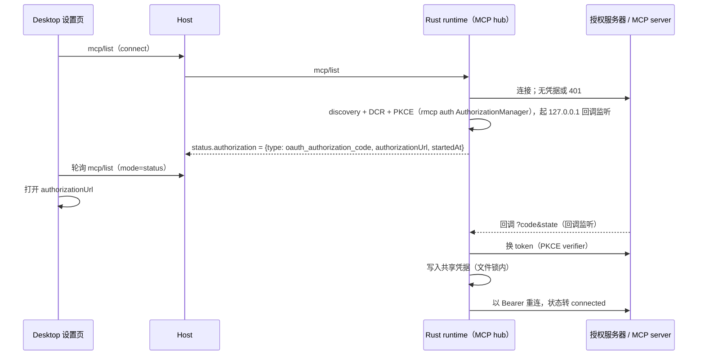

# Rust MCP OAuth（授权码 + PKCE）

2026-09-26。承接 rust-mcp-parity.md 第 3 期。用户确认按本文实施（与 Node 共用加密凭据存储）。

进度：

- 第 1 层（已完成）：共享凭据存储。`crates/host/src/{credential_cipher,file_lock,credential_store}.rs`
  对齐 TS cipher、`atomicFileLock` 协议与 `shared-credentials.ts`；`zcode-cli-rust-credentials.test.ts` 验证默认 secret 推导、
  双向解密、同一路径与跨进程锁（Node/Rust 交错独立写入各 25 次无丢失；去掉 Rust 锁时该用例稳定失败）。
- 第 2 层（进行中）：OAuth 流程（discovery、DCR、PKCE、回调、刷新、租约）与 `mcp/list` 授权状态。

TS 基线：

| 模块           | TS 文件                                                       |
| -------------- | ------------------------------------------------------------- |
| OAuth 流程     | `adapters/src/mcp/oauth-*.ts`                                 |
| 本地回调       | `adapters/src/auth/localhost-callback.ts`                     |
| 凭据存储与加密 | `adapters/src/auth/{shared-credentials,credential-cipher}.ts` |
| 文件锁         | `@zcode/shared/node` `withFileLock` / `atomicFileLock`        |
| 协议           | `mcpServerConfig.oauth`、`mcp/list` 的 `authorization` 状态   |

## 目标

- 需要 OAuth 的远程 MCP server 在 Rust runtime 下可用。
- 凭据与 Node 共用同一份加密存储：
  - 任一 runtime 授权后，另一方直接复用；
  - 回退到 Node 不需要重新授权；
  - 两个 runtime 并发刷新时不互相作废 token。

## 所有者与流程

- 运行期 token：每次请求前读取共享凭据，临期时在跨进程锁内刷新，与 TS `refreshMcpOAuthTokensUnderLock` 相同。
- 401 处理：
  - 有 refresh token 时刷新一次后重试；
  - 否则把状态置为需要交互授权，与 TS `createInteractiveAuthorizationRequiredError` 相同。

## 兼容点（与 Node 共享的事实）

1. 凭据文件：路径同 TS `resolveSharedZCodeCredentialsPath`（`ZCODE_DATA_BASE_DIR` 或默认位置）。
   - 条目值以 `enc:v1:<iv>.<tag>.<cipher>` 形式保存，均为 base64url；
   - 算法为 AES-256-GCM，密钥为 `sha256(ZCODE_CREDENTIAL_SECRET 或 "zcode-credential-fallback:<platform>:<home>:<user>")`；
   - `<platform>` 取 Node `os.platform()` 的取值（`win32`/`darwin`/`linux`）。
2. 键：
   - 前缀为 `mcp:oauth:<sha256(serverName\nserverUrl\nclientId\nscope\nredirectPath) 前 24 位>`；
   - canonical 记录的键为 `<前缀>:authorization_credentials`；
   - 记录为 version 2 JSON：`client_information`、`tokens`、`published_by`、`generation`、`obtained_at`、`expires_at`、`issuer`；
   - legacy 键 `client_information`、`tokens` 只读兼容。
3. 文件锁：对 `<file>.lock` 做 mkdir，内含 `owner-<token>.json`（pid、createdAt、token）；陈旧锁与宽限期规则逐条对齐 `atomicFileLock.ts`。
4. 写入：原子写（临时文件 + rename），文件权限 0600。
5. 回调：
   - 监听 127.0.0.1 随机端口，路径为 `redirectPath`，缺省时按 server 名生成；
   - 成功/失败页文案、`state` 校验、授权服务器 `error` 回传的分类，均与 `localhost-callback.ts` 相同。
6. 授权事务有效期 5 分钟（`MCP_OAUTH_AUTHORIZATION_TRANSACTION_TTL_MS`）。
7. 多个进程同时授权时：租约内先到者主导，其余跟随并等待 canonical 换代（`oauth-lease.ts`）。

## 实现选择

- OAuth 协议部分使用 rmcp `auth` feature（AuthorizationManager：metadata discovery、DCR、PKCE、换 token、刷新），`CredentialStore`/`StateStore` 自实现为上述共享存储。
- 加密使用已随 rustls 引入的 `ring`（AES-256-GCM），不新增依赖；锁、原子写与存储在 host crate（domain 不做 IO）。
- 锁实例观察（TS `lockInstanceObserver`）在时间戳不可用时以首次观察时刻近似。

## 验收

- 语料（TS oracle）：
  - 凭据加解密与 Node 互读（同一 secret 下两侧加密的值互相解密）；
  - 键前缀 hash；
  - canonical 记录读写。
- 并发：Node 与 Rust 同时持锁刷新时只有一方换代，另一方读到新 generation。
- App 差分：本地授权服务器 fixture（discovery、DCR、authorize 重定向、token、refresh）上，Node 与 Rust 需要满足：
  - `mcp/list` 状态序列一致；
  - 回调后连接成功；
  - 两侧可用对方写入的凭据直接连接。
- 已知限制：
  - `official-auth.ts`（官方账号授权）需要 Host 账号能力，单独评估；
  - enterprise-managed 授权不在本期范围。

## 第 2 层设计（2026-09-26）

以 TS `adapters/src/mcp/{oauth-*.ts,index.ts}` 与 `@modelcontextprotocol/client@2.0.0` 的 `auth()` 为 oracle。

### 适用范围（对齐 `resolveAuthorizationCodeOAuthConfig`）

- 仅 http/sse。stdio、ZCode 官方鉴权（`auth.type=zcode_official` 且带 provenance）不走 OAuth。
- `oauth.type=authorization_code` 使用配置；`oauth.type=client_credentials` 暂不支持（保持 `not_authenticated`，另行评估）。
- 配置了 `Authorization` 头时不走 OAuth。
- 其余 http/sse（包括只配置 URL 的 server）隐式视为 authorization_code：只有服务器回 401/403 才会进入授权。

### 运行期（Phase 1）

- 每个 HTTP 请求前读取共享凭据的 pair（`deriveCredentialPair`）：无 token 不带 Authorization；临期（无 `expires_at` 或
  距过期 < 30s）且有 refresh token 时，在 `<凭据目录>/<sanitized prefix>.refresh` 锁（45s）内刷新（proactive，失败回退现值）。
- 401：没有 refresh token → 需要交互授权；否则在锁内 reactive 刷新后重试一次。锁内先比对 generation，他人已换代就直接复用。
- 刷新失败：`invalid_grant` 按 CAS 清 tokens 保留 client；`invalid_client`/`unauthorized_client` 在非静态 client 时整对清除；
  静态 clientId 报配置错误；其余失败 proactive 回退现值、reactive 报临时错误（不触发交互授权）。

### 交互授权（Phase 2）

- `<sanitized prefix>.authz` lease（250ms 等待）：抢到的是 leader，否则为 follower，按 500ms 轮询 canonical 换代与
  `pending_authorization` 键，投影同一授权 URL。
- leader：127.0.0.1 随机端口回调（路径 `redirectPath`，缺省 `/oauth/callback/mcp/<encodeURIComponent(name)>`，
  state 不匹配回 400 继续等待、`error` 参数立即失败、文案同 TS）；discovery（RFC 9728 → RFC 8414/OIDC，URL 顺序与回落同 SDK，
  `MCP-Protocol-Version: 2025-11-25`）；每次 fresh DCR（静态 clientId 除外），client metadata 与 SDK 相同
  （`application_type` 按 redirect 推导）；PKCE S256（43 字符 verifier）；authorize URL 参数顺序同 SDK，含 `offline_access` 时追加
  `prompt=consent`；授权 URL 发布到 `pending_authorization` 并通过状态暴露（不自动打开浏览器）；事务 TTL 5 分钟；
  code exchange 后发布 canonical pair（tokens 与 client_information 带 `issuer`，与 SDK 保存形态一致）。
- 403 `insufficient_scope`：scope = config ∪ 当前 token scope ∪ challenge scope，强制重新授权。

### 状态与编排（`mcp/list`）

- 需要授权时：状态 `connecting`，`authorization = {type:"oauth_authorization_code", authorizationUrl, startedAt}`；
  授权事务在后台进行，调用方最多等待本次请求的超时（与 TS caller 预算语义一致），不阻塞 hub。
- 授权完成：后台重连一次并更新状态为 `connected`，下一次工具定义读取直接复用连接；失败/超时：`failed`，
  `failureKind = oauth_authorization_failed`。

### 验收（第 2 层）

- 纯规则语料（TS oracle）：key prefix、配置解析、WWW-Authenticate、discovery URL、resource 选择、scope 并集与 determineScope、
  client 认证方式、deriveCredentialPair。
- App 差分：本地授权服务器 + 需要 Bearer 的 MCP server fixture 上，Node 与 Rust 的 DCR/authorize/token 请求、状态序列、
  写入的 canonical 记录一致；任一方授权后另一方直接连接成功；refresh 与 invalid_grant 路径一致。
