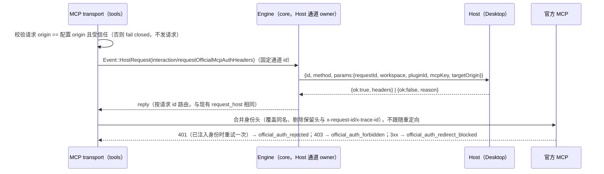

# Rust 官方 MCP 鉴权（zcode_official）

2026-09-26。承接 rust-mcp-oauth.md 的已知限制「官方账号授权」。以下述 TS 实现为 oracle：

- `adapters/src/plugins/mcp.ts` 与 `mcp-official-auth.ts`：解析 `auth` 与 provenance；
- `adapters/src/mcp/official-auth.ts`：逐请求注入身份头并对失败分类；
- `bootstrap/src/zcode-protocol/official-mcp-auth-port.ts`：通过 Host 反向请求取身份头；
- `packages/shared/src/official-mcp-auth.ts`：共享常量与信任判定。

## 范围

- 只来自插件配置：`.mcp.json` 中写 `auth: {type: "zcode_official", provider: "jwt_token"}`。
  `mcp/list` 协议没有 `auth` 字段，Host 传入的 server 不会走这条路径。
- provenance `{pluginId, mcpKey}` 由 runtime 按已加载插件生成，配置里写的 `official` 字段一律忽略。
- http：每次请求注入身份头，并对 401/403/3xx 分类。
- stdio：身份头放在出站消息 `params._meta["com.zcode/official-mcp-auth"]` 中下发，属于第二期。
- sse：声明 zcode_official 即禁用该 MCP（`config_invalid`）。

## 所有者与事件顺序

- Host 通道：Engine 启动时把一个固定 id 的事件发送端交给 tools（`ToolPort::attach_host`）。
  该 id 上的 `HostRequest` 不需要活跃会话，直接走 `request_host`。
  这样 `mcp/list`（没有会话）和会话内的工具调用都能取身份头。
- 身份头不缓存：每个请求重新向 Host 请求，与 TS 相同。
- 取不到身份头时（`ok:false` 或通道不可用），请求不带身份头照常发出（匿名降级），由服务端判定；
  日志只记录 reason。
- 信任判定逐请求进行，只看 origin：
  - 目标 origin 必须是 https、不含 userinfo，且等于 ZCode API origin；
  - ZCode API origin 来自 `ZCODE_BASE_URL`，其次 `ZCODE_ENDPOINT_ORIGIN`，缺省为生产 origin；
  - `ZCODE_OFFICIAL_MCP_DEV_TRUSTED_ORIGINS` 只放开其中列出的 http loopback origin；
  - 不受信任时 fail closed：不发请求、不向 Host 取头，failureKind 为 `official_origin_untrusted`。
- 配置期校验：
  - 静态 headers 含保留头时禁用该 MCP，大小写不敏感。保留头为：
    - 身份头：`authorization`、`x-bigmodel-authorization`、`bigmodel-target-type`、
      `bigmodel-organization`、`bigmodel-project`；
    - 其他：`x-coding-plan-api-key`、`mcp-session-id`、`mcp-protocol-version`；
  - 与 `oauth` 同时声明时禁用。
- 日志：
  - 不记录任何 header 值，只记录 header 名与 target type 摘要；
  - 读取服务端响应的 `x-request-id`，用于对账。

## 分期

1. 纯规则（domain）：
   - 解析 auth 配置；
   - 保留头检查；
   - origin 信任判定（含 dev loopback）；
   - 合并身份头；
   - 按响应分类（401/403/3xx，以及非 tools/call 的 429、5xx、JSON code 3001/1000/1006/3101）。
   - 验收：TS oracle 语料（shared 的 `isOfficialMcpOriginTrusted`、`findOfficialMcpReservedHeaders`）。
2. 插件解析与 http 注入：
   - 插件 `.mcp.json` 的 `auth` 与 provenance；
   - Host 通道；
   - http transport 的身份头注入与失败分类。
   - 验收：用本地官方 MCP fixture 与 dev trusted origin 做 App 差分，比较 Node 与 Rust 的：
     - Host 反向请求参数；
     - 注入的请求头；
     - 401 重试次数；
     - 状态与 failureKind。
3. stdio `_meta` 下发：
   - 出站请求与通知携带身份载荷；
   - 取不到身份时下发 reason；
   - 用 stdio fixture 做差分。

## 验收总则

- 身份头只发往受信任 origin；
- 不受信任时网络请求数为 0；
- 状态、stderr 与日志中不出现身份头的值；
- Node 与 Rust 在同一 fixture 上的请求与状态序列一致。
