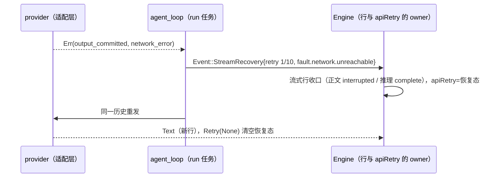

# Rust 模型重试状态与断流恢复

2026-10-08。对照 MBearo/ESCode-rs 的 M7 发现的两处缺口，均以当前 Node 源码为基准。

## 1. 重试原因码（V4 `control.apiRetry.reasonCode`）

- 规则：TS `product-projection.ts` 的 `modelRetryReasonCode`：
  `rate_limited` / `offpeak_queued` → `fault.provider.rateLimited`；`provider_overloaded` / `server_error` →
  `fault.provider.serverError`；`timeout` → `fault.network.timeout`；`stream_idle_timeout` → `fault.network.sseStalled`；
  `stale_connection` → `fault.network.sseDisconnected`；`network_error` → `fault.network.unreachable`；其余
  （`auth_refresh`、`reasoning_signature_repair` 等）→ `fault.provider.requestFailed`。
- 缺陷：Rust 原先把适配层原始 reason（如 `rate_limited`）直接作为 reasonCode，UI 按 `fault.*` 取的重试文案无法命中。
- 修复：`domain::model::retry_reason_code`；`RetryState` 同时保留原始 `reason`（不序列化）。
- 旧 `session/read` 的 `runtime.apiRetry.error` 不变：TS `normalizeESCodeApiRetryStatus` 在事件没有 error/message 时回落
  原始 reason，Rust 继续给原始 reason。
- 验收：domain 单测逐项对照；`escode-cli-rust-network.test.ts`、`escode-cli-rust-provider.test.ts` 的 reasonCode 断言改为 `fault.*`。

## 2. 断流恢复（已有可见输出后失败）

- Node 基准：`core/src/runtime/methods/streaming-recovery.ts` 的 `recoverPartialAssistantOutputFailure`。模型已流出正文或
  推理后失败（适配层因此不再重试），若失败可重试或属于瞬时原因（`stream_idle_timeout`、`rate_limited`、
  `server_error`、`network_error`、`timeout`），作废本次 assistant 尾部，从失败前的历史重新请求；每个 run 至多 10 次。
- UI（V4 投影）：
  - 仍在流式的行收口为 `interrupted`（Node 在正文开始时已把同一响应的推理行收口为 `complete`）；恢复请求开新行。
  - `apiRetry = {attempt: n, maxAttempts: 11, nextRetryAt: now, reasonCode}`，reasonCode 按失败类型：超时 →
    `fault.network.timeout`，网络错误 → `fault.network.unreachable`，其余 → `fault.network.sseDisconnected`；
    首个新输出到达后清空。
- Rust 实现：
  - 所有者：Engine。run 任务在 `agent_loop` 里判定（`app::stream_recovery`），发 `Event::StreamRecovery`；Engine 用
    `Session::discard_stream_tail` 收口行并设置 `apiRetry`；随后 run 用未变的历史重发。失败尾部从未进入历史，
    所以重发请求体与失败请求逐字相同。
  - 正文续写按 `assistantResponseId` 找行时跳过 `interrupted` 行（重发可能沿用同一 response id）。
  - Rust 在模型完成后才执行工具，不存在 Node 的「部分工具已提交」恢复路径（`latest_committed_tool_result`）。

### 已知差异

- 冷恢复：Node 重启后把被作废的尝试整段隐藏（hydration 跳过 discarded assistant 消息），与它自己重启前的实时视图
  不一致；Rust 的行直接落库，冷恢复与实时视图相同。照搬需要在冷加载时删行，而历史边界按行下标引用，不做。
- 恢复态帧数：Node 发两次（StreamRecoveryStarted / RetryStarted），Rust 发一次；值相同。
- 无结束标记的正常 EOF（HTTP 正常结束但缺 `finish_reason` / `[DONE]`）：
  - 已有正文时，Node 适配层把它当作成功完成，被截断的部分正文成为最终回答；Rust 判为失败并走断流恢复。
    Node 静默接受截断输出属于缺陷，Rust 不照搬。
  - 只有推理时，Node 走适配层的空回复重试，推理行收口为 `complete`；Rust 走断流恢复，推理行为 `interrupted`。
    两侧都重发且最终回答一致，只有被作废推理行的状态不同。
  - 对应 Rust 用例：`escode-cli-rust-provider.test.ts`「…recovers truncated text or reasoning by discarding the tail」。

## 验收

- 单测：`stream_recovery` 的可恢复判定与原因码。
- App 差分：`escode-cli-rust-stream-recovery.test.ts`（推理 + 部分正文后断开：请求次数、请求体、行状态、恢复态与清空两侧
  一致；冷恢复按上述已知差异分别断言）。
