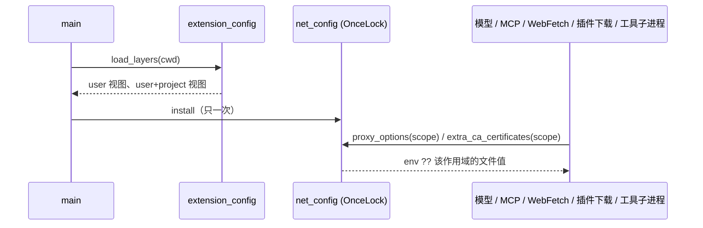

# Rust 网络代理解析与 TS 对齐（WP4）

2026-09-24。TS 的模型与工具请求都经 `adapters/src/network/http-config.ts` 显式解析代理；Rust 之前直接用 reqwest 客户端，
只认 `HTTP(S)_PROXY`，因此同一台机器上两个 runtime 的出口可能不同。本规格把解析逻辑做成 domain 内的纯函数，
并按同一份判定接入模型客户端。

## 规则（与 TS 逐条一致）

| 顺序 | 来源                                                                                     | 结果                                                 |
| ---- | ---------------------------------------------------------------------------------------- | ---------------------------------------------------- |
| 1    | 非 http/https 目标                                                                       | 不使用代理（`noProxyMatched=false`）                 |
| 2    | 显式 `noProxy` 或 `ZCODE_NO_PROXY` 命中                                                  | 绕过代理（`noProxyMatched=true`）                    |
| 3    | 显式 `httpProxy`                                                                         | 代理来源 `network.httpProxy`                         |
| 4    | `ZCODE_HTTP_PROXY`                                                                       | 代理来源 `env:ZCODE_HTTP_PROXY`                      |
| 5    | 工具运行请求（web-fetch 变体）：捕获环境里的 `no_proxy`/`NO_PROXY` 命中                  | 绕过代理                                             |
| 6    | 捕获环境的 `https_proxy`→`HTTPS_PROXY`→`http_proxy`→`HTTP_PROXY`→`all_proxy`→`ALL_PROXY` | 代理来源 `env:ZCODE_TOOL_ENV_PASSTHROUGH_JSON.<key>` |
| 7    | 其余                                                                                     | 不使用代理                                           |

- 代理值缺 scheme 时按 `http://` 补齐；解析失败视为无值。`noProxy` 支持 `*`、`example.com`、`.example.com`、`*.example.com`、
  `host:port`（端口不符则不匹配）、`[ipv6]`（忽略端口）、带 scheme 的完整 URL；匹配为后缀式（`host` 及其子域）。
- 捕获环境来自 `ZCODE_TOOL_ENV_PASSTHROUGH_JSON`（JSON 对象，仅字符串值，键名须匹配 `^[A-Za-z_][A-Za-z0-9_]*$`）。

## 已知差异

- Host 侧的环境捕获过滤（`shouldCaptureZCodeToolEnvPassthroughKey` 的排除名单）未移植：Rust 只消费已捕获的键值，
  不产出该变量，因此不会把不该捕获的键写进去。
- ~~配置文件的 `network` 段尚未接入~~：已接入（2026-10-08），见下节「配置文件 `network` 段」。
- CA 文件已接入（2026-09-30）：`host::tls_ca` 读 `ZCODE_AGENT_CA_CERT`（显式来源，读不到即失败，
  与 TS `readFileSync` 同路），缺席时回落 `NODE_EXTRA_CA_CERTS`（Node 原生行为：文件不存在只忽略）；
  模型客户端与 WebFetch 客户端把 PEM（可含多张）/DER 证书加进根证书。设置页注入时两个变量都在
  （`services/src/runtime-tools/agentProxyEnv.ts`），独立 CLI 只设后者——两条都要认。
- MCP 客户端（`mcp_hub.rs`）仍用 reqwest 默认行为，待与 TS MCP 传输路径一并核对（同下一条）。
- MCP 网络已接入（2026-09-30）：`tools/src/mcp_http.rs` 按目标 URL 解析代理（显式/`ZCODE_HTTP_PROXY`/
  `ZCODE_NO_PROXY`/捕获环境）并信任自定义 CA；MCP streamable HTTP / SSE 传输按 URL 缓存客户端，
  OAuth 发现与令牌端点（`mcp_oauth_http.rs`，整请求 60s）走同一条构造。TS 侧是 `createMcpTransportFetch`
  的 per-request fetch，两侧判定同源。

## 配置文件 `network` 段（2026-10-08）

TS `createConfig` 按 system < user（`~/.zcode/cli/config.json`）< project（工作区向上到 git 根的 `zcode.json` /
`.zcode/config.json`）< env（`ZCODE_HTTP_PROXY` / `ZCODE_NO_PROXY` / `ZCODE_AGENT_CA_CERT`）< cli 合并出
`network.httpProxy` / `noProxy` / `caCertFile`。设置页走环境变量（`agentProxyEnv.ts`），Rust 已支持；手写在
配置文件里的 `network` 段此前被 Rust 一律忽略，同一份配置下两个 runtime 的出口不同。

Node app-server 里不同出口读的是**不同的合并视图**。下表全部由 App 差分实测确认（Node 侧为 2026-10-08 用当前源码重建的 bundle）：

| 出口                  | Node 读到的视图                                                                  | Rust 作用域 |
| --------------------- | -------------------------------------------------------------------------------- | ----------- |
| 模型请求、MCP 传输    | user + env（provider registry / MCP 连接池在进程启动时 `createConfig({ env })`） | `Process`   |
| WebFetch              | user + project + env（会话 app 的 httpClientPort 带 workingDirectory）           | `Workspace` |
| 插件市场下载 / git    | 只认 env（`applyNetworkEgressEnv` 不传 network）                                 | `EnvOnly`   |
| Bash 等工具子进程环境 | user + project + env（会话 app 的 executionPort）                                | `Workspace` |

- 所有者：`zcode_cli_host::net_config`，进程级 `OnceLock` 只写一次（`main` 在建任何 HTTP 客户端前按 `--cwd`
  读 user 视图与 user + project 合并视图，复用 `extension_config` 的发现与合并）。Rust 不改写自身进程环境
  （多线程下 `set_var` 不安全）。
- 有效值 = 同名环境变量（非空）?? 该作用域的文件值，与 TS env 层覆盖文件层一致：
  - 代理判定：`ProxyOptions.http_proxy` / `no_proxy` 取有效值，来源标签因此与 TS 同为 `network.httpProxy`；
  - CA：显式来源 = `ZCODE_AGENT_CA_CERT` ?? 该作用域的 `network.caCertFile`（读不到即失败），再回落
    `NODE_EXTRA_CA_CERTS`；
  - 工具子进程：`child_env` 计算差量时，环境里缺席的文件值以等价的 `ZCODE_*` 键参与（`with_file_fallback`），
    据此写标准代理 / NO_PROXY / CA 键（TS `applyProxyEnv` / `applyNoProxyEnv` / `applyCaEnv`）。
- 配置文件读失败（JSON 坏、超限）只在 stderr 告警，按「无文件值」继续（TS 文件配置有诊断时同样忽略该文件）。
- 不在本节：`network.timeout`（TS WebFetch 超时）——Rust WebFetch 用固定超时，单独核对。

### 已知差异（2026-10-08 实测记录，未处理）

- Windows 上工具子进程的代理键名大小写：TS `setEnvKey` 依次写 `HTTP_PROXY`、`http_proxy` 等，Windows 环境键大小写
  不敏感，后写的小写键覆盖前者，Git Bash 里只剩 `http_proxy` / `https_proxy` / `all_proxy` / `no_proxy`
  （`$HTTPS_PROXY` 为空）；Rust 保留大写键。值一致，只有键名大小写不同。这是既有差异（经 `ZCODE_HTTP_PROXY` 注入时
  同样存在），TS 的结果让大写变量消失，更像 TS 侧缺陷，未照搬。
- WebFetch 经代理失败时的错误文案：Node `Proxy connection ended before receiving CONNECT response (proxy_error)`，
  Rust 为 reqwest 原文。属既有的传输错误文案差异。

## 验收

1. 差分：`scripts/generate-zcode-cli-rust-proxy-corpus.mjs` 以 TS 两个入口为 oracle，导出
   2,464 条（url × 17 种显式配置 × 14 种环境变量），Rust 逐条比对 `noProxyMatched`/`proxySource`/`proxyUrl`。
2. 实机：设置 `ZCODE_HTTP_PROXY` 后请求走代理、`ZCODE_NO_PROXY` 命中时直连；未设变量且无捕获环境时不影响本地地址。
3. 差分（2026-09-30）：`packages/services/tests/zcode-cli-rust-network.test.ts` 的
   「settings-page CA is trusted by Node and Rust」——同一份 CA→叶子证书链的本地 TLS 模型服务，
   Node 带 `NODE_EXTRA_CA_CERTS`+`ZCODE_AGENT_CA_CERT`、Rust 只带 `ZCODE_AGENT_CA_CERT`，两者都必须
   成功收到模型回复（叶子不能是 `CA:TRUE`：rustls 明确拒绝把 CA 当服务端实体，Node/OpenSSL 宽容——
   单张自签证书会造出假差异）。
4. 差分（2026-09-30）：`packages/services/tests/zcode-cli-rust-mcp.test.ts` 的
   「MCP HTTP transport goes through the configured proxy in both runtimes」——本地 forward 代理统计
   MCP 路径请求，Node 与 Rust 的 MCP 握手都必须经代理过去（模型 fixture 由 `ZCODE_NO_PROXY` 绕过）。
5. 差分（2026-10-08）：同文件 `zcode-cli-rust-mcp.test.ts`，均不设任何代理环境变量、只写配置文件：
   - 「user config network section routes MCP through the proxy in both runtimes」：用户层 → 两侧 MCP 经代理；
   - 「project config network section does not reach the process-level MCP pool in either runtime」：项目层 → 两侧直连；
   - 「project config network section routes WebFetch through the proxy in both runtimes」：项目层 → 两侧 WebFetch 经代理；
   - 「project config network section reaches Bash subprocess env in both runtimes」：项目层 → 两侧 Bash 的代理 / NO_PROXY 值一致（键名按小写比较）。
     单测：`host::net_config` 覆盖「只取非空字符串」「环境变量优先于文件、空值视为缺席」「子进程差量补齐文件值」「EnvOnly 不读文件」。
