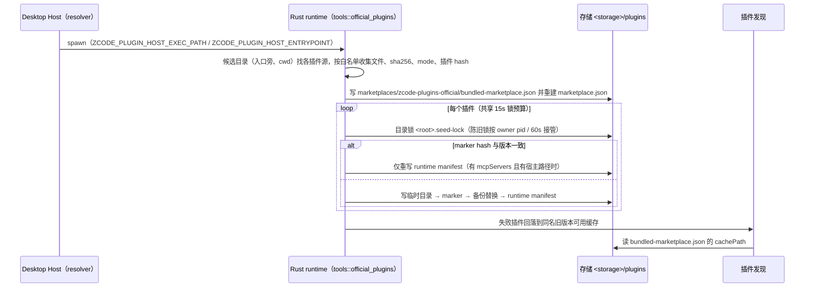

# Rust 官方插件 seed（对齐 TS `bootstrap/src/app/bundled-plugins.ts` 等）

2026-09-25。Node runtime 每次启动把随包官方插件写入存储缓存，并据此发现插件技能、agents、commands 与 MCP；
Rust 只读缓存，仅运行 Rust 的新环境因此没有任何官方插件与技能（差分用例中 Node 列出 browser-use 技能，Rust 为空）。
用户决定（2026-09-25）：Rust 自行 seed，Host 传入 Node 插件宿主路径，官方插件的 JS MCP 服务继续跑在 Electron-as-Node 上。

## 所有者与流程

- 所有者：seed 在进程内每个 storage root 执行一次（插件发现首次调用时），与 TS 在 runtime 构建时调用
  `resolveOfficialPluginRoots` 的时机一致；Node 与 Rust 可并发 seed 同一缓存，靠同一目录锁与 marker 协作。
- 与 Node 字节一致：插件 hash（`JSON.stringify([[path, sha256, mode]...])`，文件按 TS `localeCompare` 排序）、
  marker、marketplace 分片与合并目录、runtime manifest 均按 TS 的键顺序与 `JSON.stringify(v, null, 2)` 格式输出；
  内容不变时不重写文件（避免两个 runtime 互相覆盖、放大 Windows 文件占用）。
- runtime manifest：插件 `plugin.json` 有 `mcpServers` 时，把每个 server 改写为
  `command=<宿主 exec>`、`args=[<入口>, "__zcode-plugin-host", <root>/dist/mcp/server.js]`、
  `env += {ELECTRON_RUN_AS_NODE: "1", ZCODE_PLUGIN_ID: "<name>@zcode-plugins-official"}`；
  未收到宿主路径时不改写（等价 TS 无 `process.argv[1]`）。
- 插件源候选目录：Rust 可执行文件所在目录（打包态与 `zcode.cjs` 同在 `resources/glm`）、进程 cwd；
  `ZCODE_OFFICIAL_PLUGINS_BASE_DIR` 为开发/测试用的额外候选（Rust 独有，TS 以 monorepo 下 dist 路径覆盖同一需求）。
- 不移植：SEA 资产源（Rust 不以 SEA 形态运行）。

## 验收

- 生成器导出插件定义、文件白名单与 ASCII `localeCompare` 排序表；语料覆盖仓库内真实插件目录的文件清单排序与插件 hash。
- 差分：同一存储先由 Node seed、再由 Rust 启动 —— 不重写任何文件（mtime/内容不变）；反之亦然。
- App 差分：新会话请求中的技能提醒与 Session-specific guidance 两侧一致。
