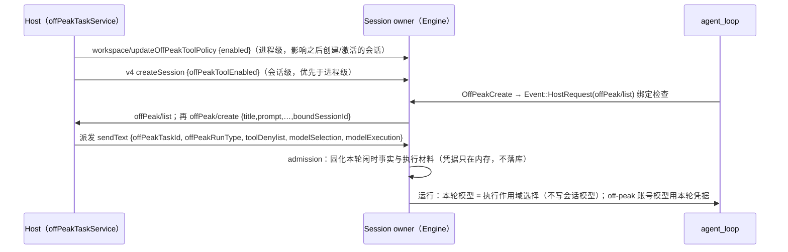

# Rust 闲时任务（OffPeak）

2026-09-27。用户决定在 Rust 原生实现（此前 Rust 拒绝 `offPeakTaskId` / `offPeakRunType` / `modelExecution`）。
闲时任务由 Host 持有（取号、排队、派发、持久化）；runtime 只负责工具面、守卫、协议转发，以及派发轮的执行约束。
逐条对齐 TS：

- 工具：`core/src/tool/handlers/off-peak.ts`、`contracts/src/tools/off-peak.ts`；
- 协议端口：`bootstrap/src/escode-protocol/offpeak-port.ts`、`off-peak-tool-policy.ts`；
- 派发轮：`server-operations.ts`（`resolvePromptTurnOffPeakTaskId`、turn denylist）、
  `core/src/runtime/methods/turn-loop-state.ts`（`isOffPeakCreateRestrictedTurn`）、`bash.ts`、`send-message.ts`；
- 执行模型：`bootstrap/src/escode-protocol/model-execution.ts`、`core/src/runtime/methods/turn-model.ts`、
  `adapters/src/model/runner.ts`（off-peak 账号鉴权）。

## 所有者与流程

## 第一期：工具与工具面

- 工具面开关：`createSession.offPeakToolEnabled === true`，或进程级 `workspace/updateOffPeakToolPolicy` 结论为 true；
  两者都不是时不注册。子代理（subagent_child）不注册。会话激活（冷恢复）读进程级结论。
- `workspace/updateOffPeakToolPolicy`：参数 `{workspace, enabled}`（strict），结果原样回显 `{workspace, enabled}`。
- 定义：`OffPeakCreate` / `OffPeakList` 的 schema、描述（含 modelInstructions 拼成的 Usage 列表）与 provider 顺序
  由 `scripts/generate-escode-cli-rust-tool-schemas.mjs` 从 TS 生成。
- OffPeakCreate：
  1. 闲时派发轮拒绝：`OffPeakCreate is not allowed while running an idle-time task.`；
  2. 入参按 TS schema（trim、strict）；
  3. 本会话正处于闲时派发轮（activeOffPeakTaskId）时拒绝：`Cannot create an idle-time task while running an idle-time task.`；
  4. 绑定检查：`offPeak/list`，本会话已有未终态任务时拒绝（固定文案）；查询失败即拒绝（固定文案，fail-closed）；
  5. `offPeak/create`，参数只带出现的字段，`boundSessionId` 为当前会话；
  6. 失败分类按 `errorCategory` / `errorCode` 翻译为固定文案（额度、资格、校验、网络、其它），不按 message 猜；
  7. 成功：`{task, message}`，message 带队列位置（有时）。
- OffPeakList：`offPeak/list` → `{tasks}`，任务只保留快照字段。
- 模型可见内容：成功为 `JSON.stringify(output)`；失败为错误文案。
- 权限：能力表来自 TS（OffPeakCreate needsApproval、medium、workspace；OffPeakList 只读）。

## 第二期：派发轮

- 入参校验（协议 superRefine）：`automationId` 与 `offPeakTaskId` 互斥；`offPeakRunType`（init/resume）需要 `offPeakTaskId`。
- 本轮闲时身份：显式 `offPeakTaskId`；缺省时 inputId 以 `offpeak-` 开头取 `:` 之前部分。
- 本轮禁用工具：Host 下发的 `toolDenylist` 加上 OffPeakCreate、SendMessage、Workflow（有闲时身份时）。
- 受限轮判定（`isOffPeakCreateRestrictedTurn`）：有闲时身份，或 queryId 以 `offpeak-` 开头，或禁用列表含 OffPeakCreate。
- 受限轮内：
  - OffPeakCreate 拒绝（见第一期 1）；
  - SendMessage 拒绝，文案附提示 `Spawn a new foreground Agent with the full context instead of resuming a completed one.`；
  - Bash 显式后台拒绝：`Idle-time tasks do not support background commands. Run this command in the foreground without run_in_background.`；
    同时关闭超时自动转后台。

- TS 缺陷（2026-09-28 差分发现并修复）：`tool/executor/batch-runner.ts` 的 `executeSchedule` 向 `executeBatch` 转发了
  `automationTurn`，漏了 `offPeakTurn`。handler 收到的 `offPeakTurn` 恒为 undefined，上面三条 handler 层守卫在 Node 上从未生效：
  OffPeakCreate 只剩端口层的递归拒绝，SendMessage 照常续跑子代理，Bash 可以后台运行（通知轮落到用户套餐）。
  已补上转发；Rust 按修复后的语义实现。

## 第三期：执行作用域模型（modelExecution）

- 形态（strict）：`selectionScope: "execution"`，可选 `memoryExtraction: "skip"`、`requestAuth {apiKey?, headers?}`、
  `subagents {foregroundModel: "submission", background: "deny"}`；需要同时有 `modelSelection`。
- 本轮模型按 `modelSelection` 构造，但不写入会话模型选择、不发 model selected 事件、不持久化。
- 凭据：只在内存，随本轮结束丢弃，不写数据库、日志与事件。
  账号访问模式为 `off-peak` 的模型只用本轮凭据（缺失即 `ModelRequestAuthMissing` 失败，不向 Host 请求 header）；
  其它账号模型仍向 Host 请求 header；API key 模型不受影响。
- `memoryExtraction: "skip"`：本轮结束不触发记忆提取。
- `subagents`：前台子代理沿用本轮提交的模型（含凭据）；后台子代理拒绝。

- 实现要点（2026-09-28）：
  - admission 把凭据按 turn 暂存在 Engine 内存，payload（会持久化）只留无秘密标记 `_modelExecution {skipMemory, subagents}`；
    运行开始按 (会话, run) 取出；进程重启后凭据不在，off-peak 模型该轮鉴权失败（与 TS 缺失凭据同义）。
  - 辅助作业（标题、记忆等）没有执行材料：off-peak 模型直接鉴权失败，不向 Host 请求 header（差分：两侧都不请求）。
  - 执行作用域的本轮模型不被同轮 guide 改写。
  - 会话忙时收到 modelExecution 输入：TS core admission 拒绝（不排队、不 steer）；V4 层收口为
    **failed + `activePrompt`**，文案 `Core prompt admission rejected: turn_not_steerable`（活跃轮；
    只排队而没活跃轮时 core reason 是 `no_active_turn`）。Rust 已按此对齐（2026-09-30 App 差分确认：
    `packages/services/tests/escode-cli-rust-model-execution-admission.test.ts`）。

## 验收

- TS oracle 语料：真实 handler + 协议端口 + 脚本化 Host（与 cron 语料同法），覆盖成功、各失败分类、绑定、递归、fail-closed。
- App 差分：工具面开关（进程级与会话级）、OffPeakCreate/OffPeakList 往返、派发轮禁用工具与各拒绝文案、
  modelExecution 下本轮模型与凭据（请求头）、会话模型不变、无记忆提取。
- 凭据不出现在 stdout 事件、数据库与日志中。
