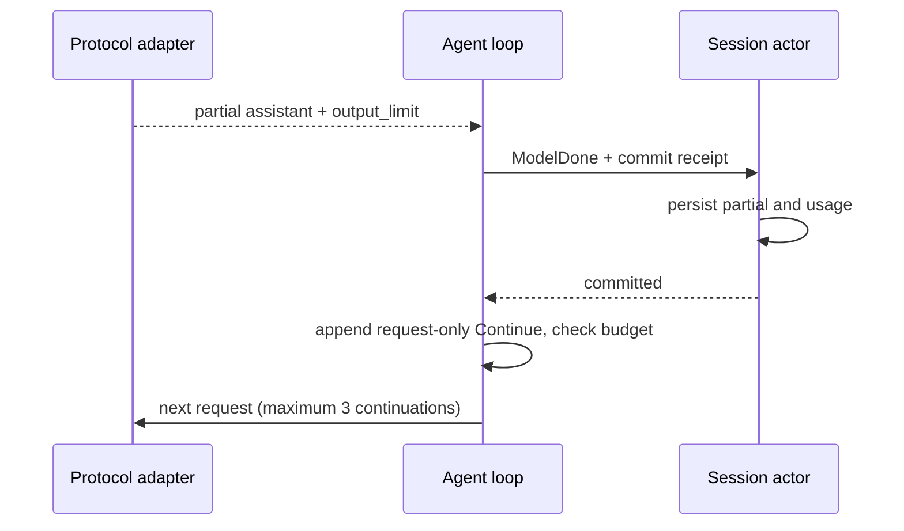

# Rust 输出上限续写

状态：通过本地原生/App 验收，见 [交付记录](../reports/rust-output-continuation-2026-09-22.md)。沿用 TS turn-output-token-continuation.ts 的三次限制，权限仅 yolo。

- 三协议明确完成的输出上限状态映射为 ModelOutput.output_limit：Chat length/max_tokens，Responses incomplete_details.reason=max_output_tokens，Anthropic max_tokens/model_context_window_exceeded。EOF、网络错误、缺失终态不属于续写。
- 仅没有工具调用时续写；含未完成或截断调用时明确失败，不执行工具。保留已有可见内容。
- Session actor 是唯一持久化所有者。部分 assistant（含推理元数据）先提交，收到 receipt 后再请求；没有任何 assistant 内容时仅提交 usage，不创建空 canonical 消息。存储失败立即终止。
- 与 TS 使用相同的 Continue 提示，最多三次；第四次仍截断则投影 model_output_limit_exceeded。空内容也消耗次数；模型的 HTTP 重试和摘要请求不消耗或重置续写次数。正常工具步骤结束恢复计数。
- Continue 提示为当前 RunContext 的请求投影，不持久化、不作为用户输入或队列项；冷恢复不自动续写。已有 canonical assistant 内容保留。预算包含提示；压缩只提交 canonical 边界，不能将临时提示计入 offset。
- Anthropic 与当前 TS reasoning-history-normalization 一致：仅含 thinking/redacted_thinking、没有正文或工具的 assistant 不进入请求投影，相邻 user 合并；canonical 推理事实仍保留，避免将仅推理截断消息作为非法 assistant content 回放。
- 续写重新经过已有 micro/auto/reactive compact 检查；取消使用当前 run token。摘要本身若被截断不得提交为完整摘要。

验收：三协议截断后成功、持续空截断耗尽、工具截断无副作用、提交失败无后续请求、Continue 不进入 App 用户历史/冷恢复；压缩不改变 canonical offset，摘要截断回滚。保留当前 App schema 与 capability。
