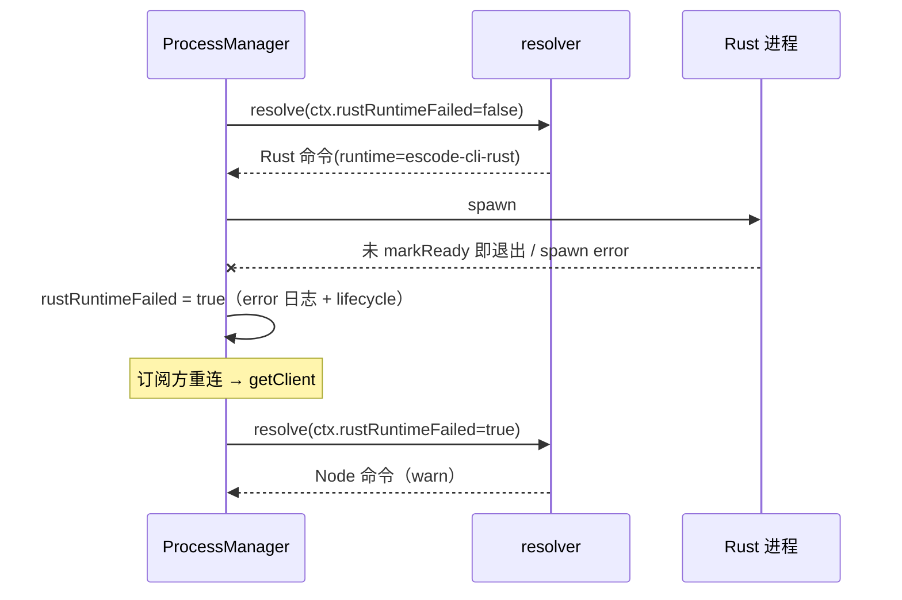

# Rust runtime 打包与选择（WP8）

2026-09-24。此前 Rust runtime 只能通过 `ESCODE_AGENT_SERVER_COMMAND` 指向本地二进制启用；桌面安装包不含 Rust 二进制，`ESCODE_AGENT_SERVER_RUNTIME=escode-cli-rust` 单独设置时被忽略（仍启动 Node）。（2026-10-03 起**默认 runtime 为 Rust**：安装态未设置 `ESCODE_AGENT_SERVER_RUNTIME` 且无自定义命令时用随包二进制，见下文「默认切换」。）

## 规则

- 描述符（`packages/shared/src/escode-agent-runtime.ts`，唯一事实源）：新增 `rustBinaryName = "escode-cli-rust"` 与 `resolveRustBinarySegments(platform)`（Windows 追加 `.exe`），与 Node bundle 同放 `glm/` 资源目录。
- 查找（`providerRuntimeResolver.findESCodeAgentRustBinary`）：候选链与 Node bundle 完全平行（packaged resources → `~/.escode/server/agents/glm` → `bundled-agents/<platform>/glm` → legacy）。
- 选择（`resolveDefaultESCodeAgentCommand`，唯一 owner）：
  1. `ESCODE_AGENT_SERVER_COMMAND` 显式命令（现状不变）；
  2. 未设命令但 `ESCODE_AGENT_SERVER_RUNTIME=escode-cli-rust`：使用随包 Rust 二进制，参数 `app-server --stdio --cwd <workspacePath>`，`storagePreparationMode: "process"`、`supportsStorageStartup: true`（与显式命令路径相同）；
  3. 找不到随包 Rust 二进制：**回退 Node**，并以 `warn` 记录 `escode_agent.runtime.rust_binary_missing`——不静默；
  4. 其余情况维持现有顺序（dev 源码 → Electron Node bundle → 已部署二进制）。
     `ESCODE_AGENT_SERVER_RUNTIME` 接受 `node`（显式回退，与未设置等价）与 `escode-cli-rust`；其他值抛错（此前只在设置了命令时校验）。
- 构建（`packages/desktop/scripts/prepare-rust-agent.mjs`，由 `prepare-runtime-assets` 在 `ESCODE_BUNDLE_RUST_AGENT=1` 时调用）：按目标平台映射 Rust target triple（`win32-x64 → x86_64-pc-windows-msvc`、`win32-arm64 → aarch64-pc-windows-msvc`、`darwin-* → *-apple-darwin`、`linux-* → *-unknown-linux-gnu`；`ESCODE_RUST_TARGET` 可覆盖，例如本机无 MSVC 时用 GNU），`cargo build --release --locked --target <triple> -p escode-cli-rust`，复制到 `bundled-agents/<platform>/glm/`。
- 官方插件宿主（2026-09-25，rust-official-plugin-seed.md）：Rust 命令额外带 `ESCODE_PLUGIN_HOST_EXEC_PATH` 与
  `ESCODE_PLUGIN_HOST_ENTRYPOINT`（与 Node 链同一 Electron-as-Node 与 `escode.cjs`），Rust seed 官方插件时据此改写
  插件 MCP 的启动命令；开发态 tsx 源码入口不传。
- macOS 签名（2026-09-25 修订，见 rust-ci.md）：`glm/` 在 electron-builder 中被 `signIgnore`。Rust 二进制跟随应用的签名开关：`ESCODE_ENABLE_MAC_SIGN=1` 时用同一身份（`ESCODE_RUST_CODESIGN_IDENTITY` / `APPLE_SIGNING_IDENTITY` / `CSC_NAME`，缺失即失败）以 hardened runtime 签名；未开启时整个应用都不签名，二进制保持未签名。

## 回退

- 用户/运维回退：设置 `ESCODE_AGENT_SERVER_RUNTIME=node` 后重启 App 即回到 Node（见 rust-release-rollback.md）。
- 随包二进制缺失：自动回退 Node 并记录原因。
- 启动失败自动回退（2026-09-25）：
  - 所有者：`ESCodeAgentProcessManager`（每个 manager 实例，即每个窗口的 Local Host 泳道）持有 `rustRuntimeFailed`；只增不减，进程生命周期内不再尝试 Rust。
  - 判定：以 Rust 命令（resolver 标记 `runtime: "escode-cli-rust"`）启动的进程在 `markReady`（首次通过 provider/model 门禁，即握手成功）之前发生 spawn error 或非预期退出。
  - 生效：manager 把该事实经 `ESCodeAgentCommandResolverContext.rustRuntimeFailed` 交给 resolver；默认 resolver 此时忽略 Rust 选择（含指向 Rust 的显式命令），走 Node 链并 `warn`。自定义 resolver 同样拿到该事实。
  - 时序：不在同一次启动内重试——失败进程照旧走既有 exit/lifecycle 上报，订阅方重连触发的下一次 `getClient` 解析到 Node。这样不改变启动代际、存储握手与 restart 语义。
  - 已就绪后的崩溃不触发回退（那是运行期故障，按现有重启处理）。

## 验收

- 单测：Rust 选择、缺失回退、显式命令优先、非法 runtime 抛错；平台 → triple 映射。
- 本机已验证（2026-09-25）：`ESCODE_RUST_TARGET=x86_64-pc-windows-gnu` 下 `prepare:rust-agent` 产出 release 二进制 `bundled-agents/win32-x64/glm/escode-cli-rust.exe`（24 MB）；Host 真实解析链（未注入）按规则 2 选中它，并在 App harness 下完成一轮（`escode-cli-rust-runtime-selection.test.ts`，未随包时该用例跳过）。
- 未验证：MSVC 目标构建、macOS 签名与公证、Linux 包（本机环境限制，如实标注）。

## 默认切换（2026-10-03，用户决定）

- 选择顺序：`ESCODE_AGENT_SERVER_RUNTIME=node` → Node；`=escode-cli-rust` → Rust；**未设置**时，若无自定义命令且不在 monorepo
  开发态（开发入口在场即保持 Node，改源码立刻生效），用随包 Rust 二进制。找不到二进制、或 Rust 就绪前失败，回退包内 Node。
- 打包：`ESCODE_BUNDLE_RUST_AGENT` 默认开启（`=0` 关闭，此时安装包只含 Node，桌面端自动用 Node）。
- 用例：`escode-cli-rust-runtime-selection.test.ts` 覆盖默认选 Rust、二进制缺失 / 开发态 / Rust 失败 / 显式 node 四种回退。
