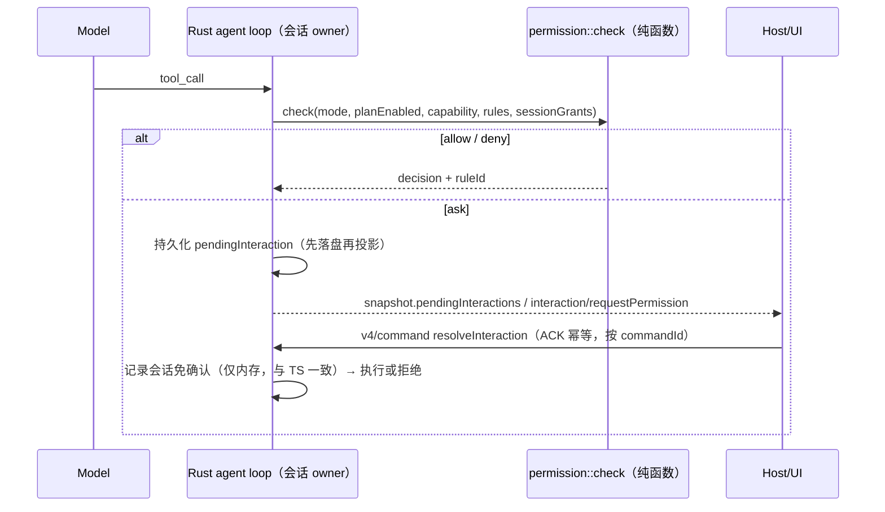
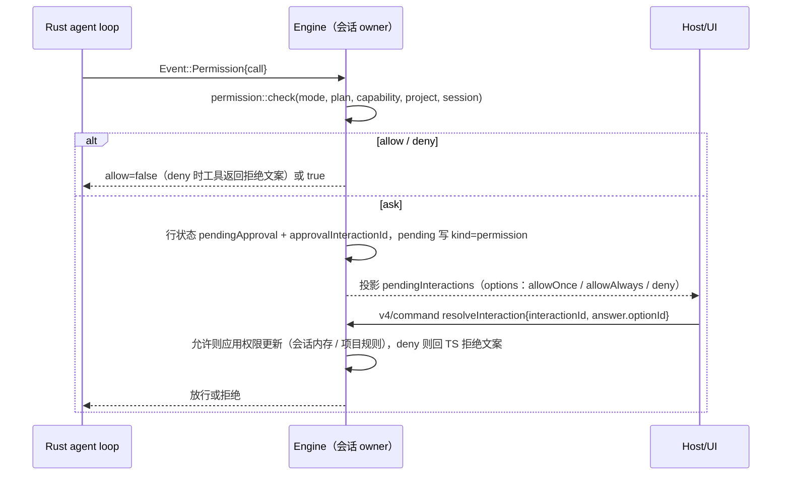

# Rust 权限模式与 Plan 对齐（WP3）

2026-09-24。当前 Rust 只宣告 `permissionModes=[yolo]`、`independentPlanState=false`，`requires_permission` 恒为 false，UI 据此禁用其他模式。App 默认模式不是 yolo，因此这是 Rust 成为默认 runtime 的 P0 前置。基准实现为 TS `apps/zcode-cli/packages/core/src/permission/service.ts::checkPermission`。

## 判定顺序（必须逐位一致）

1. plan 模式切换工具（EnterPlanMode/ExitPlanMode，`plan-mode-policy.ts`）→ allow/deny
2. `requiresUserInteraction`：disallowed → deny，否则 ask
3. `alwaysAsk` → `checkAlwaysAsk`（auto deny → disallowed deny → 项目 deny → 会话免确认 allow → ask）
4. `yolo` 且未开 plan → allow
5. `auto` → deny（`mode.auto.unimplemented`，与 TS 保持同样的保留语义）
6. disallowedTools → deny；项目 deny → deny；项目 ask → ask
7. plan 开启 → `checkPlanMode`（只读非破坏、非破坏 MCP、会话作用域的 allowedInPlanMode 放行，其余拒绝）
8. 项目 allow → allow；WebFetch 预批 URL → allow；workflow 草稿写入 → allow（Rust 无工作流时不可达，保留位次）
9. allowedTools → allow
10. `edit`：workspace 文件编辑 allow，其余同 build
11. `build`：只读非破坏且无需审批 allow；critical → ask；high 且未 autoApproveHighRisk → ask；其余按 TS

每个分支的 `ruleId`（如 `mode.build.highRisk`）原样输出，用于 App 展示和差分比对。

## 所有者与时序

- 唯一状态所有者：会话 actor 持有 mode、planEnabled、会话免确认；权限判定是无状态纯函数。
- ask 期间 stop/cancel：pending 转终态并投影，迟到的 resolveInteraction 返回 `stale`，不执行工具。
- 冷恢复：pending ask 与 TS 一致按中断处理（会话免确认不持久化）。

## 工具能力表

- 每个内置工具的 `readOnly/destructive/riskLevel/sideEffectScope/permissionName/allowedInPlanMode/alwaysAsk/requiresUserInteraction` 从 TS 工具定义导出为 JSON 资产（同 `generate-zcode-cli-rust-tool-schemas.mjs`，`--check` 防漂移）。
- Bash 只读分类（`core/src/tool/handlers/bash-readonly-policy-*.ts` + fig registry）必须移植，不能把 Bash 一律视为写入，否则 build 模式确认频率与 TS 不同。先导出 TS 对命令语料的分类结果作为差分 oracle。

## 能力宣告

实现一档宣告一档：`permissionModes` 按实际支持追加 `build`/`edit`/`plan`，`independentPlanState=true` 仅在 plan 状态独立持久化后打开。未宣告的模式 UI 继续禁用，不在 Rust 内做静默降级。

## 默认模式与 yolo 时代的遗留门禁（2026-09-24 差分发现）

差分用例（build 模式下 Write，不传 `mode`）发现：Node 弹出确认，Rust 直接写入。原因是 Rust 仍保留只支持 yolo 时的默认值与门禁：

| 位置                                     | Rust 原值                          | TS 基准                                                                       | 处理                            |
| ---------------------------------------- | ---------------------------------- | ----------------------------------------------------------------------------- | ------------------------------- |
| 新会话 `mode`（`domain/src/session.rs`） | `yolo`                             | `build`（`contracts/src/config`、`projection-state.ts`、`runtime/methods/*`） | 改为 `build`                    |
| `workspace/readPresentation.mode`        | `yolo`                             | `build`（`workspace-model-runtime.ts`）                                       | 改为 `build`                    |
| compact / sendQueuedNow                  | 非 yolo 即 `capabilityUnsupported` | 与模式无关                                                                    | 只拒绝 plan（Rust 未实现 plan） |
| goal 执行                                | 要求 yolo                          | 只与 plan 互斥（`guard.planGoalMutuallyExclusive`）                           | 只拒绝 plan                     |

规则：未显式指定模式的会话一律按 `build` 处理——漏传模式时必须偏向「需要确认」，不能偏向「全部放行」。
已持久化为 `yolo` 的旧 Rust 会话保持原值（那是当时用户可见的真实模式），不做迁移改写。

验收：`zcode-cli-rust-differential.test.ts` 的「build 模式写文件」用例，两侧确认选项、载荷键、summary、完全访问选项与拒绝结果一致。

## 完全访问（fullAccess）

TS 语义（`interaction-registry.resolveFullAccess` → `commitPermissionFullAccess`）：只对主会话的确认提供；选中后在一个事务里把会话执行模式与已接纳的排队输入改为 `yolo`，再按 allowOnce 放行本次调用。

Rust：`permission_flow.rs` 仅在 `parent_id` 为空时投放 `fullAccessOption`（形状与 TS 相同）；`questions.rs` 选中时把 `session.mode` 与队列项 `mode` 改为 `yolo`，随 `commit_interaction` 与 ACK 同一次持久化后才释放 waiter。子代理会话选择 `fullAccess` 按未知选项拒绝。

## 被拒调用的行投影

与 TS `settlePermission` 一致：拒绝在应答时立即把行收口为 `cancelled`；随后的 `ToolDone { denied: true }` 保持 `cancelled`，不写 `output`/`error`/`endedAt`。模型侧仍收到逐字一致的拒绝文案。

## 验收

1. 差分：TS 导出 `(mode, planEnabled, tool, input, rules) → {decision, ruleId}` 矩阵（覆盖全部分支），Rust 单测逐条比对。
2. Bash 语料差分：≥2000 条命令（fig registry 覆盖的主命令 + git 子命令 + 管道/重定向），分类一致率 100%。
3. App 集成：build 模式 Write 弹确认 → 允许/拒绝/会话免确认；plan 模式写入被拒；stop 期间 pending 转终态；冷恢复。
4. `desktop-continuous` 与 `web-remote-replayable` 两种订阅都能看到并解决 pendingInteraction。

## 实现状态（2026-09-24）

| 部分                                                                                   | 状态                                                                                                                                        | 差分证据                                         |
| -------------------------------------------------------------------------------------- | ------------------------------------------------------------------------------------------------------------------------------------------- | ------------------------------------------------ |
| 模式与工具能力分支（判定顺序 1–11）                                                    | 已实现 `crates/domain/src/permission.rs`                                                                                                    | 34,700 条与 TS 一致                              |
| 项目 deny/ask/allow、会话免确认（alwaysAsk 门）、Write 命中 Edit 规则、官方 CUA 作用域 | 已实现 `permission_rules.rs`                                                                                                                | 1,344 条规则用例与 TS 一致                       |
| WebFetch 预批                                                                          | 已实现；清单由生成器从 TS 源码抽取为 `webfetch_preapproved.json`（`--check` 防漂移）                                                        | 含编码路径、多重编码、前缀边界用例               |
| disallowedTools / allowedTools / autoApproveHighRisk 配置                              | 未接入（TS 默认均为空/false，当前行为一致）                                                                                                 | —                                                |
| Bash 只读分类                                                                          | 已实现 `bash_parse` + `bash_policy*` + `bash_callbacks*`；策略表由生成器导出 JSON；Bash 能力按命令动态降级（只读 → low/none/免确认，同 TS） | 5,098 条语料与 429 条解析 oracle 全部一致        |
| Bash rulePolicy（复合命令拆分与「总是允许」建议）                                      | 已实现 `bash_rule_policy` + `bash_rule_prefix`；fig registry 导出为 JSON 资产                                                               | 2,123 命令 × 8 规则集 × 2 行为 + 建议项全部一致  |
| 带工作目录的 git 运行时检查（hooks/config 信任）                                       | 已实现 `crates/tools/src/bash_git_safety.rs`（IO 在 adapter，domain 只做纯决策）                                                            | 15 例目录树语料；差分测试待可构建环境运行        |
| 工具能力表                                                                             | 由 TS 工具元数据导出 `tool_capabilities.json`（`--check` 防漂移）                                                                           | 40 个内置工具                                    |
| ask 交互（pendingInteraction、resolveInteraction、stop/冷恢复）                        | 已实现 `core/src/app/permission_flow.rs`；allowAlways 写入项目规则表                                                                        | App 集成 4 条用例（允许/拒绝/yolo/项目规则复用） |
| 能力宣告 `permissionModes` / `independentPlanState`                                    | `["yolo","build","edit"]` / false（plan 需计划审批交互，auto 在 TS 同样保留）                                                               | 编译验证；声明本身未跑构建                       |

## Bash 只读分类移植方案

- Oracle：`scripts/generate-zcode-cli-rust-bash-readonly-corpus.mjs` 以 TS `isRuntimeReadOnlyBashCommand` 为准，从 TS 策略表派生 5,098 条语料（3,311 条只读），产物 `crates/domain/tests/fixtures/bash_readonly_corpus.json`，runner 中 `--check` 防漂移。xargs 走 TS 平台分支，排除出语料。
- 解析：TS 依赖 `unbash`（4.4k 行），但分类只消费简单命令、管道、`&&`/`||`/`;`、重定向与动态词判定；其余节点一律视为不支持→非只读。Rust 实现该子集的保守解析器，超出子集的输入按不支持处理，由语料差分确认不存在「Rust 判只读而 TS 不判」的放宽。
- 策略表：`READONLY_COMMAND_POLICIES`、git/多词子命令、safeFlags 等数据经生成器导出为 JSON 资产；回调（sed/find/date/docker/gh 等）逐个移植。
- 验收：语料一致率 100%；任何差异先判定方向，放宽方向视为阻断缺陷。

## ask 交互（权限确认）

对应 TS `tool/executor/permission-flow.ts` 与 v4 投影的 `permissionRequestPayloadSchema`。

### 所有者与时序

- 判定在 Engine 内完成，工具行与 pending 与行状态同一提交（与 AskUserQuestion 同规）。
- `resolveInteraction` 迟到或未知 interaction → `noop` + `proto.alreadyResolved`，不执行工具。
- stop/cancel：pending 转终态，工具返回取消；冷恢复不保留 pending（与 TS 一致）。
- deny 文案：`PERMISSION_DENIED_BY_USER_CONTENT`（含 freeText 追加），与 TS 逐字一致，作为工具结果回给模型。

### 选项与授权范围

| 选项                        | 生效范围       | 说明                                                                          |
| --------------------------- | -------------- | ----------------------------------------------------------------------------- |
| allowOnce                   | 本次调用       | 只放行这一次                                                                  |
| allowAlways（allowSession） | 会话内存       | 工具声明按会话授权时使用；随会话结束消失                                      |
| allowProject                | 项目持久化规则 | 默认选项；规则来自 `suggestedPermissionUpdates`（Bash 为稳定前缀 `prefix:*`） |
| deny                        | —              | 可带 freeText 反馈，附加到拒绝文案                                            |

### 本增量范围

- 实现：判定接入工具循环、pending 投影与 resolve、会话授权、deny 文案、stop/冷恢复语义。
- 项目规则：`permission::check` 已支持读取与匹配；持久化需在 store 增加项目规则表（后续步骤），
  在此之前不投放 allowProject 选项，避免给出无法兑现的授权按钮。
- 能力宣告：`permissionModes` 在 build/edit/plan 的端到端场景验收后逐个打开。

## 待产品确认

- **requiresUserInteraction 工具是否先弹权限确认**：TS `checkPermission` 对声明该能力的工具（AskUserQuestion）返回 `ask`，
  而该工具自身的提问界面就是这次「用户交互」。Rust 现有问句流程与既有集成用例都按「不额外弹权限确认」实现，
  当前在 runtime 侧把 `tool.userInteraction` 这一 ask 视为已满足（`permission::check` 仍与 TS 逐位一致）。
  若产品确认应弹确认，则改为走确认交互并同步更新问句用例。
- **旧会话缺 mode 的恢复语义**：`legacy_mode()` 缺省给出 build；build 现在受支持，冷恢复后的输入不再被拒，
  而是按 build 规则走确认。`zcode-cli-rust-coding.test.ts` 的对应用例需按新契约改写。

## 验证现状（2026-09-24）

- 可运行：`cargo clippy --all-targets -D warnings`（覆盖全部改动）；WSL Linux 下 `cargo test -p zcode-cli-domain`
  （权限矩阵 34,700 条、Bash 语料 5,098 条、规则语料、解析 oracle 全部通过）。
- 已运行（GNU 目标，Windows）：`cargo test --workspace -- --test-threads=1` 全部通过；
  App 集成套件 196 用例 183 通过、13 跳过、0 失败——包含 build/edit 模式、权限确认允许/拒绝/会话免确认、
  项目规则跨会话复用、git 安全语料与 AskUserQuestion 全量用例。

## 子代理的执行模式

与 TS `resolveSubagentPermissionMode` 一致：子会话继承父会话的 `mode` 与 plan 状态；内置 Explore（`name == "Explore"` 且 `source == "built-in"`，同名用户 profile 不算）以 `yolo` 运行。原先 Rust 子会话取 `Session::new` 的默认值，默认值改为 build 后会让 yolo 父会话的子代理意外停在确认弹窗。

已知差异：TS profile 的 `permissionMode: auto|plan`（仅非 project 来源）会覆盖继承值；Rust 尚不支持这两种模式，按继承处理。

## 集成测试约定

`packages/services/tests/zcode-cli-rust-fixture.ts` 提供 `fixture({ mode })`：输入命令未写 `mode` 时由 harness 补上。验证运行时一致性（Shell 生命周期、MCP、回退、队列等）而非权限的用例显式声明 `mode: "yolo"`；验证默认回落的用例（本文档「默认模式」、coding 的旧会话冷恢复）不设置，以保证测到的是 runtime 的真实默认。
