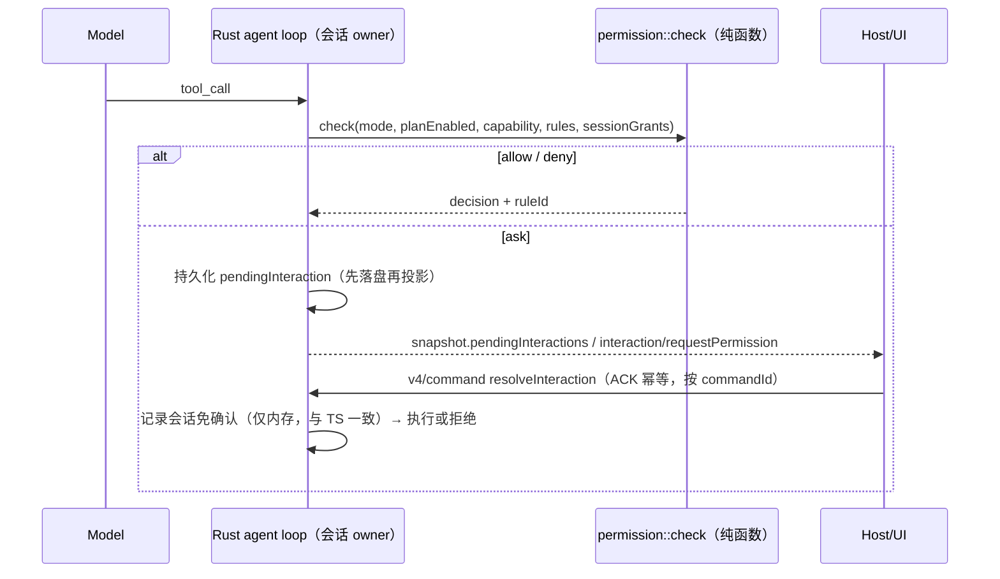

# Rust 权限模式与 Plan 对齐（WP3）

2026-09-24。当前 Rust 只宣告 `permissionModes=[yolo]`、`independentPlanState=false`，`requires_permission` 恒为 false，UI 据此禁用其他模式。App 默认模式不是 yolo，因此这是 Rust 成为默认 runtime 的 P0 前置。基准实现为 TS `apps/zcode-cli/packages/core/src/permission/service.ts::checkPermission`。

## 判定顺序（必须逐位一致）

1. plan 模式切换工具（EnterPlanMode/ExitPlanMode，`plan-mode-policy.ts`）→ allow/deny
2. `requiresUserInteraction`：disallowed → deny，否则 ask
3. `alwaysAsk` → `checkAlwaysAsk`（auto deny → disallowed deny → 项目 deny → 会话免确认 allow → ask）
4. `yolo` 且未开 plan → allow
5. `auto` → deny（`mode.auto.unimplemented`，与 TS 保持同样的保留语义）
6. disallowedTools → deny；项目 deny → deny；项目 ask → ask
7. plan 开启 → `checkPlanMode`（只读非破坏、非破坏 MCP、会话作用域的 allowedInPlanMode 放行，其余拒绝）
8. 项目 allow → allow；WebFetch 预批 URL → allow；workflow 草稿写入 → allow（Rust 无工作流时不可达，保留位次）
9. allowedTools → allow
10. `edit`：workspace 文件编辑 allow，其余同 build
11. `build`：只读非破坏且无需审批 allow；critical → ask；high 且未 autoApproveHighRisk → ask；其余按 TS

每个分支的 `ruleId`（如 `mode.build.highRisk`）原样输出，用于 App 展示和差分比对。

## 所有者与时序

- 唯一状态所有者：会话 actor 持有 mode、planEnabled、会话免确认；权限判定是无状态纯函数。
- ask 期间 stop/cancel：pending 转终态并投影，迟到的 resolveInteraction 返回 `stale`，不执行工具。
- 冷恢复：pending ask 与 TS 一致按中断处理（会话免确认不持久化）。

## 工具能力表

- 每个内置工具的 `readOnly/destructive/riskLevel/sideEffectScope/permissionName/allowedInPlanMode/alwaysAsk/requiresUserInteraction` 从 TS 工具定义导出为 JSON 资产（同 `generate-zcode-cli-rust-tool-schemas.mjs`，`--check` 防漂移）。
- Bash 只读分类（`core/src/tool/handlers/bash-readonly-policy-*.ts` + fig registry）必须移植，不能把 Bash 一律视为写入，否则 build 模式确认频率与 TS 不同。先导出 TS 对命令语料的分类结果作为差分 oracle。

## 能力宣告

实现一档宣告一档：`permissionModes` 按实际支持追加 `build`/`edit`/`plan`，`independentPlanState=true` 仅在 plan 状态独立持久化后打开。未宣告的模式 UI 继续禁用，不在 Rust 内做静默降级。

## 验收

1. 差分：TS 导出 `(mode, planEnabled, tool, input, rules) → {decision, ruleId}` 矩阵（覆盖全部分支），Rust 单测逐条比对。
2. Bash 语料差分：≥2000 条命令（fig registry 覆盖的主命令 + git 子命令 + 管道/重定向），分类一致率 100%。
3. App 集成：build 模式 Write 弹确认 → 允许/拒绝/会话免确认；plan 模式写入被拒；stop 期间 pending 转终态；冷恢复。
4. `desktop-continuous` 与 `web-remote-replayable` 两种订阅都能看到并解决 pendingInteraction。

## 实现状态（2026-09-24）

| 部分                                                                                   | 状态                                                                                 | 差分证据                                  |
| -------------------------------------------------------------------------------------- | ------------------------------------------------------------------------------------ | ----------------------------------------- |
| 模式与工具能力分支（判定顺序 1–11）                                                    | 已实现 `crates/domain/src/permission.rs`                                             | 34,700 条与 TS 一致                       |
| 项目 deny/ask/allow、会话免确认（alwaysAsk 门）、Write 命中 Edit 规则、官方 CUA 作用域 | 已实现 `permission_rules.rs`                                                         | 1,344 条规则用例与 TS 一致                |
| WebFetch 预批                                                                          | 已实现；清单由生成器从 TS 源码抽取为 `webfetch_preapproved.json`（`--check` 防漂移） | 含编码路径、多重编码、前缀边界用例        |
| disallowedTools / allowedTools / autoApproveHighRisk 配置                              | 未接入（TS 默认均为空/false，当前行为一致）                                          | —                                         |
| Bash 只读分类                                                                          | 已实现 `bash_parse` + `bash_policy*` + `bash_callbacks*`；策略表由生成器导出 JSON    | 5,098 条语料与 429 条解析 oracle 全部一致 |
| Bash rulePolicy（复合命令拆分）与带工作目录的 git 运行时检查                           | 未实现                                                                               | —                                         |
| ask 交互（pendingInteraction、resolveInteraction、stop/冷恢复）                        | 未实现                                                                               | —                                         |
| 能力宣告 `permissionModes` / `independentPlanState`                                    | 仍为 `[yolo]` / false；以上完成前不打开                                              | —                                         |

## Bash 只读分类移植方案

- Oracle：`scripts/generate-zcode-cli-rust-bash-readonly-corpus.mjs` 以 TS `isRuntimeReadOnlyBashCommand` 为准，从 TS 策略表派生 5,098 条语料（3,311 条只读），产物 `crates/domain/tests/fixtures/bash_readonly_corpus.json`，runner 中 `--check` 防漂移。xargs 走 TS 平台分支，排除出语料。
- 解析：TS 依赖 `unbash`（4.4k 行），但分类只消费简单命令、管道、`&&`/`||`/`;`、重定向与动态词判定；其余节点一律视为不支持→非只读。Rust 实现该子集的保守解析器，超出子集的输入按不支持处理，由语料差分确认不存在「Rust 判只读而 TS 不判」的放宽。
- 策略表：`READONLY_COMMAND_POLICIES`、git/多词子命令、safeFlags 等数据经生成器导出为 JSON 资产；回调（sed/find/date/docker/gh 等）逐个移植。
- 验收：语料一致率 100%；任何差异先判定方向，放宽方向视为阻断缺陷。
