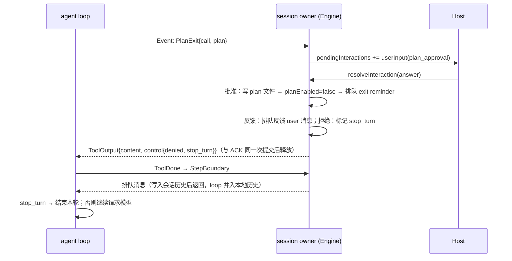

# Rust plan 模式（WP3）

2026-09-24。Rust 此前拒绝 `planEnabled`、声明 `independentPlanState=false`，Host 因此不给 Rust 会话走 plan 流程。本文按 Node 实测（`packages/services/tests/zcode-cli-rust-plan-differential.test.ts`）定义对齐规则。

## 基准行为（Node 实测）

| 场景              | 工具结果（模型可见）                                                               | 行状态      | 之后的消息                                           | planEnabled | plan 文件 |
| ----------------- | ---------------------------------------------------------------------------------- | ----------- | ---------------------------------------------------- | ----------- | --------- |
| ExitPlanMode 批准 | `User has approved your plan. …\n\n## Approved Plan:\n<plan>`（plan 为空时另一句） | `success`   | 工具结果后追加「Exited Plan Mode」reminder，继续本轮 | false       | 写入      |
| 反馈（freeText）  | `The plan was not approved by the user.`                                           | `cancelled` | 反馈作为真实 user 消息追加，继续本轮                 | true        | 不写      |
| 拒绝（其余应答）  | 拒绝文案                                                                           | `cancelled` | 本轮在工具结果后结束，不再请求模型                   | true        | 不写      |

- 审批交互：`kind: "userInput"`，`payload.schema = {interaction:"plan_approval", toolName:"ExitPlanMode"}`，`prompt` 与问题文本为 `Tool ExitPlanMode requires user interaction`，单选项 `approve / Approve / Exit plan mode and start implementation.`，`freeText: true`。
- 应答归一（TS `v4AnswerToPlanApprovalResponse`）：`optionId` 为 `allowOnce|allowAlways` → 批准；`freeText` 去空白非空 → 反馈；`action` 形态按 accept/content 同样归一；其余 → 拒绝。
- 不在 plan 模式时调用 ExitPlanMode：工具失败，文案 `You are not in plan mode. …`。
- EnterPlanMode：无需确认，`planEnabled=true`，结果文案固定（`formatEnterPlanModeModelContent`）。
- plan 文件：`<workspace>/.zcode/plans/plan-<sanitized sessionId>.md`，sessionId 中 `[^A-Za-z0-9._-]+` 替换为 `-` 并去首尾 `-`。
- 模式 reminder（TS `buildRuntimeModeReminderBody`）：planEnabled 时，在用户正文之前插入；距上次模式 reminder 不足 5 个真实用户轮次则不插；第 1、6、11… 次为完整版，其余为精简版。reminder 作为历史保存，后续请求中保留原位置。
- 能力：`independentPlanState: true`。

## 所有者与时序

- 唯一所有者：会话 owner（`core/src/app/plan_mode.rs`）持有 planEnabled、审批交互与待追加消息；loop 只路由工具并执行 stop_turn。
- 纯规则（文案、节奏、文件名、应答归一）位于 `domain/src/plan_mode.rs`，文案由 `scripts/generate-zcode-cli-rust-plan-mode.mjs` 从 TS 导出并 `--check`。
- IO（plan 文件）经 `ToolPort::write_plan_file`，tools crate 原子写入。

## 暂不覆盖

- profile `permissionMode: plan` 的子代理；
- plan 文件的跨会话引用 reminder（`plan_file_reference`，resume 场景）。
