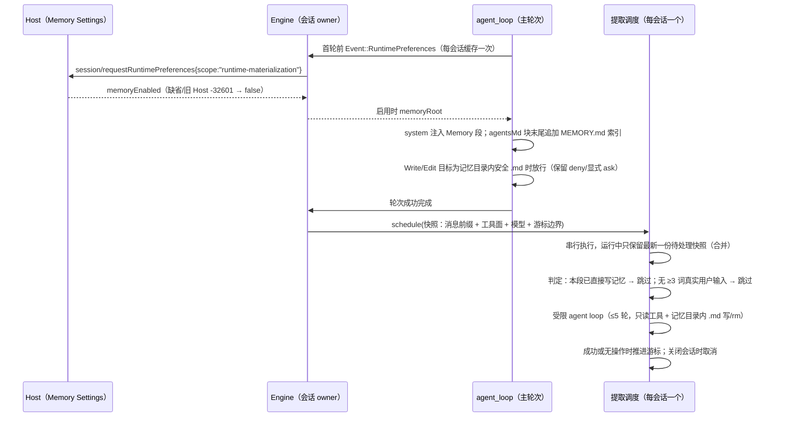

# Rust 项目记忆（Memory 段、MEMORY.md 索引、自动提取）

2026-09-25。用户选定的功能缺口（rust-release-rollback.md「功能缺口范围」）。逐条对齐 TS：

- `core/src/memory/*`：根目录、索引格式、manifest、提取调度与 agent loop。
- `core/src/context/sections/{memory,request-user-context}.ts`：Memory 段与索引注入。
- `core/src/runtime/helpers/project-memory*.ts`：启用判定、快照与提取执行。
- `core/src/tool/executor/memory-file-permission.ts`：记忆文件写入放行。
- `bootstrap/src/zcode-protocol/server-operations.ts`：`memoryEnabled` 启动偏好。

## 所有者与时序

- 启用条件：
  - Host 偏好 `memoryEnabled` 为 true；
  - CLI 配置 `features.memory`（缺省 true）与 `memory.use`（缺省 true）都未关闭；
  - 仅主会话启用，子代理不启用；
  - 远程 workspace 不做提取。
- 记忆根：
  - 路径为 `<cliStorageRoot>/memories/projects/<slug>-<hash16>/memory`；
  - hash 为 sha256，取 `workspaceIdentity`，或 workspace 绝对路径（Windows 下转小写）；
  - slug 为目录名清洗结果，有 identity 时固定为 `project`；
  - cliStorageRoot 与插件存储同源（`ZCODE_STORAGE_DIR` / `storage.dir` / `~/.zcode`，再取 `cli`），保证 Node 与 Rust 共享同一份记忆。
- 首轮前创建记忆根目录（失败不阻断）。读取 `MEMORY.md` 后按 TS `formatProjectMemoryIndexContent` 处理：
  - 去掉 frontmatter 与顶层 HTML 注释；
  - 超过 200 行或 25000 字符时截断，并附警告。

## 写入与读取状态

- 主会话启用记忆后，工具侧记录该会话的（记忆根, 来源会话）。
- Write/Edit 写入记忆根内的 `.md` 时，按 TS `stampMemoryOriginSessionId` 补写 `metadata.node_type: memory` 与 `originSessionId`：
  - 仅在已有 mapping 形态的 `metadata` 且缺少非空 `originSessionId` 时补写；
  - 没有 metadata 或 metadata 不是 mapping 时原样写入。
- 首次解析到非空索引时，把 MEMORY.md 记入该会话的读取状态。格式化结果与原文不同即为部分视图（TS `isPartialView`）：此时 Write 前仍需 Read，Edit 可以直接改。
- 已知差异：TS 用 `yaml` 整体重新序列化 frontmatter，Rust 按行插入并保留其余行原样。两者在常见形态上逐字一致，包括：
  - plain/引号标量；
  - 两空格块映射；
  - 单行 flow 映射。

  `yaml` 会折行的超长标量等少见形态可能格式不同，语义相同。

## 提取

- 触发：主轮次成功完成后调度。输入带 `modelExecution.memoryExtraction:"skip"` 时不调度，但 Rust 目前不接受 modelExecution 输入，因此不会出现这种情况。
- 快照：
  - 当时的 provider 消息（系统前缀 + 投影后的历史）；
  - 工具定义；
  - 本轮模型；
  - 边界：消息数与 userInput 行数。
- 判定：
  - 游标之后的 assistant 工具调用中，若有 Write/Edit 的 `file_path` 落在记忆根内，则跳过（direct-memory-write）；
  - 游标之后没有 origin=realUser、至少 3 个词的 userInput 行，则跳过（no-user-prose）；
  - 跳过也推进游标。
- 提示词：TS `buildMemoryExtractionPrompt`，附带 manifest。manifest 取 mtime 最新的 200 个 `.md` 文件，排除 MEMORY.md；每个文件读前 30 行 frontmatter 中的 description 与 type。
- 工具策略：TS `evaluateMemoryAgentToolPolicy`，拒绝文案逐字一致。
  - 未注册的工具返回 No such tool。
  - 拒绝：Agent、`mcp__*`、网络工具。
  - Write/Edit：仅允许记忆根内的安全 `.md`，路径不得含敏感段。
  - Bash：只读分类，或参数全部为记忆根内绝对 `.md` 路径的 `rm`。
  - 允许：Read、Grep、Glob。
- 执行：
  - yolo 模式，没有交互式权限；
  - 模型请求使用辅助选项（最低推理等级，输出上限 min(5000, max)）；
  - 请求与主轮次相同的工具目录；
  - 不写入会话，也不发布任何行。
- 运行载体：借用 auxiliary 作业通道，由会话 owner 答复 Host 鉴权。
  - 文件 checkpoint 直接确认，记忆写入不进入会话回退。
  - shell 偏好转给来源会话。
  - 作业开始时继承主会话的读取状态，结束后关闭作业的工具侧状态。
- 游标：
  - 按会话消息计数（工具结果属于 assistant 消息，不单独计数）；
  - 真实用户输入在 admission 时以 `_zcode_input` 标注是否满足 ≥3 词；
  - 旧会话缺少标注的消息不计为用户散文；
  - 会话回退使游标失效时按「未找到」处理，与 TS 相同。

## 验收

- `scripts/generate-zcode-cli-rust-memory-corpus.mjs` 覆盖以下纯规则，Rust 须逐条一致：
  - 记忆根 hash/slug；
  - 索引格式化（frontmatter、HTML 注释、截断）；
  - manifest 格式；
  - 提取提示词；
  - 工具策略判定；
  - 提取判定。
- App 差分：Host 开启 Memory 时，Node 与 Rust 需要满足以下各项一致：
  - 首个模型请求的 system Memory 段与 agentsMd 索引注入；
  - 记忆 `.md` 写入在 build 模式下无需确认；
  - 轮次后的提取请求：消息尾部提示词、工具集合；
  - 提取写入的文件内容；
  - Host 关闭 Memory 时以上都不出现。
