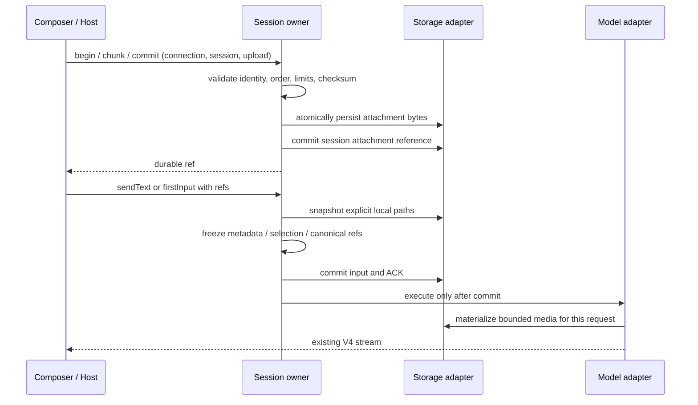

# Rust Composer 附件输入

## 当前协议和所有者

依据 `packages/ui/src/v4/composer/attachmentUpload.ts`、共享 `attachmentRefSchema`、TS `attachment-upload-registry.ts` 与 `commands/attachment-refs.ts`：本地文件直接作为 ref；粘贴图片、Web 内容经 `v4/attachment/begin/chunk/commit/abort` 得到 ref。命令和 topic 仅携带引用与元信息，不内联正文。

Session actor 仍是输入、上传关联、队列、附件授权与历史的唯一所有者。存储端口负责异步文件 IO、原子快照及持久化；模型 adapter 在每次模型调用编码前按需读取快照，重试复用已编码请求。模型能力来自同一次绑定的配置，禁止把图片/PDF/视频悄悄当作普通文本发送。

## 行为

- 上传按 connectionId/sessionId/uploadId 隔离。重复 begin 元信息一致时返回当前进度，重复 chunk 内容一致时幂等；乱序、冲突、总量越界、校验和不一致不得完成。commit 可重试；abort、连接关闭和 TTL 清理未完成上传，不删除已经提交的附件。
- 与共享限制一致：每附件 20 MiB，每片 512 KiB，最多 64 片、16 个并发上传、64 MiB staging，TTL 5 分钟。staging 使用有界块缓冲，不按 chunk 拼接全量字符串。只有 commit 校验后写持久快照，命令 ACK 不早于元数据提交。
- 新文件输入支持仅附件、首条输入、普通输入、busy FIFO 和 sendQueuedNow。排队时保存完整附件元信息及不可变快照；提升队列不重新读取可能已变更的源文件。引用不跨会话复用，过期 staging 不能冒充已提交 ref。
- 本地附件在 admission 时读取；新上传 ref 只允许引用当前 Session 拥有的 artifact。规范化显示 ref 指向不可变快照，原文件后续更改或删除不影响已接受输入与预览。文本以用户上下文进入消息；图片、PDF 和视频保留媒体语义。PDF 验证 `%PDF-`，媒体按模型能力明确校验；不支持的格式报错。
- 数据库不保存媒体 base64，canonical 只保存内部附件描述，adapter 编码请求时转换；内部文件路径/字段不得泄漏给供应商。文本预览和请求编码有界；超限不得以完整内容伪装截断结果。大于 20 MiB 的本地文件、大图缩放和完整文本 Read 预览差分仍须后续补齐后才能宣布完整 TS 附件对齐。
- 预览沿用当前 session/row/entity/index 授权；未发送附件不能通过普通历史读取入口读取。历史、重启、压缩继续保留快照引用。附件读取失败不允许执行模型或工具。

## 验收

现有 App client/schema + 真实 Rust 子进程验证 begin/chunk/commit 幂等和故障、双连接隔离、关闭清理、仅附件/首发/排队/重启/跨会话拒绝、源文件变更后内容稳定、图片/PDF/视频三协议投影与不支持模型拒绝、提交失败无请求。使用真实 Composer 选择本地文本并提交，证明用户入口可用。TS/Rust 分片状态机同输入差分；性能检查包括多片载荷和媒体 base64 不进入会话元数据。
