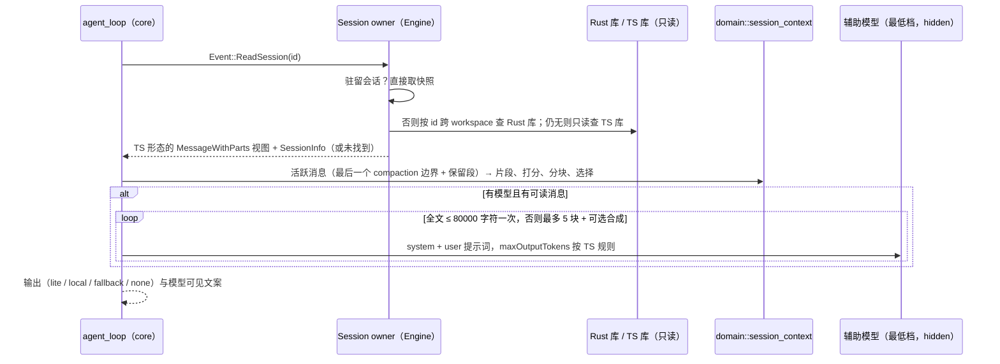

# Rust ReadSessionContext（对齐 TS `read-session-context.ts` 与 `session-context/*`）

2026-09-25。用户决定完整对齐（rust-release-rollback.md「功能缺口范围」）。Node 默认向模型暴露该工具，
并在用户输入含 `#sess_*` 时注入引用提醒。

## 所有者与流程

- 所有者：会话读取由 Engine（持有 store 与驻留会话）完成；工具只经事件请求，不直接访问存储。
- 视图：统一为 TS `MessageWithParts` 的 JSON 形态。TS 库会话原样读取；Rust 会话由 `rust_message`（顺序、工具调用与结果）
  与 `rust_row`（时间、id）转换：用户消息 → text part；assistant 消息 → tool parts（在前）+ text part + step-finish
  （有工具调用为 `tool-calls`，否则 `stop`）；以 `<system-reminder>` 开头或带 `_zcode_source` 的用户消息视为 model-only。
- 工具 input 保留原始键顺序：TS 为 `JSON.stringify` 的插入顺序；Rust 以原始 JSON 文本（压缩空白）携带，
  不经 serde_json 重排。
- 字符串长度、截断与切片按 UTF-16 码元，与 TS 一致；`created` 按 `toISOString()` 格式（毫秒 + Z）。
- 辅助模型：`ModelPort::auxiliary()` 最低推理档；hidden 调用，只转发重试与鉴权事件。
- 会话 id：新建会话使用 `sess_<uuid>`（TS `createSessionId`）；此前 Rust 为裸 UUID，无法被 `#sess_*` 引用与本工具读取。
  已有会话 id 不变。
- `#sess_*` 引用提醒：用户输入含引用时按 TS `buildReferencedSessionContextReminderBody` 注入 system-reminder。

## 已知差异

- Rust 会话转换的消息 id 为行实体 id，时间取对应行 `createdAt`；与 Node 会话的 id / 时间本就不同，差分用例归一化比较。
- 汉字二元切分按 Unicode 字符（TS 按 UTF-16 码元；仅扩展区汉字不同）。

## 验收

- `scripts/generate-zcode-cli-rust-session-context-corpus.mjs`：以 TS handler + 假 store / 假模型为 oracle 的 14 个场景
  （local、单次 lite、NO_RELEVANT/空/异常回落、多块抽取与合成、handoff、各类 part、compaction 保留段、空会话、未找到），
  Rust 逐条比对辅助调用、输出与模型可见文案。
- App 差分：同一段对话在 Node 与 Rust 各跑一次，另一会话读取它；归一化 id 与时间后辅助调用与工具结果一致。
