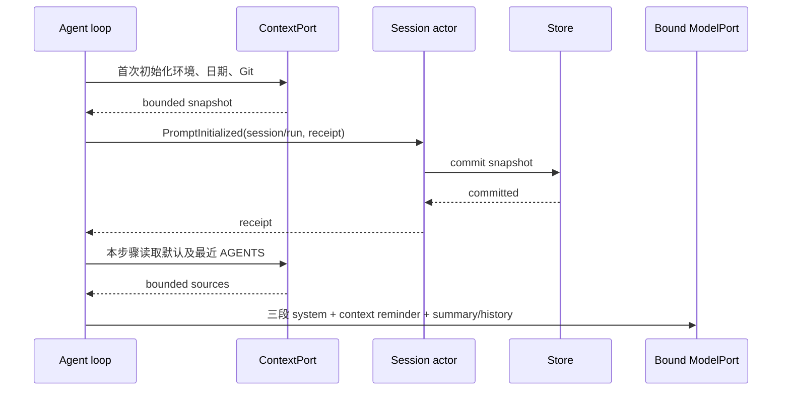

# Rust 主会话请求上下文对齐

2026-09-22。以当前 TS `context/builder.ts`、`adapters/context/index.ts` 和 `git-snapshot.ts` 为准。当前 Rust 短 system 与根 AGENTS 字符串不能替代 TS 主会话的请求前缀。

## 产品规则

- 默认主会话按 TS 的 CLI prefix、稳定身份/桌面说明、动态行为/环境/上下文管理/Git 顺序组装三段 system。静态文案由当前 TS 构造器生成，检查模式发现漂移立即失败；运行时不依赖 Node。
- `--surface desktop` 启用真实桌面说明；terminal 不注入桌面内容。surface 来自当前进程，不能从持久化历史沿用，跨入口冷恢复需要重新选择该文案。环境显示实际文件 cwd、原生平台、工具实际使用的 shell、OS，以及本步骤已绑定的 provider/model，不能用 workspace identity 或历史模型替代。
- AGENTS 与日期在独立 user `<system-reminder>` 请求前缀中，不拼入 system、不计为用户输入。转义嵌套 reminder 标签，保持 TS 格式和三协议正文语义；Anthropic 保留三段 system 和 ephemeral cache hints。
- 用户默认 `~/.zcode/AGENTS.md` 在前。从 cwd 向上选择最近的 AGENTS，遇最近 Git 根停止；无 Git 根可查到文件系统根。用户和工作区路径重复时去重。只选实际文件，单文件最多读取 100 KiB，超过时提供 TS 截断标记，缺失/不可读视作缺少该 source。不能误实现为自动加载所有后代目录或父子文件全拼接。
- 保留已交付 Rust 的每模型步骤 AGENTS 动态刷新；日期和 Git 是会话首次普通请求的快照，持久化后跨后续轮、压缩及冷恢复复用。模型名称每步骤刷新，不落入该静态快照。旧 native 会话缺少快照时在下一轮初始化。
- Git 检测通过有界、可取消的直接进程调用执行；branch、main branch、user、status、最近五条提交遵循 TS 命令和输出限制。失败不注入 stderr/不可信输出。Git status 按 2,000 UTF-16 字符截断，避免每一步遍历仓库。

## 所有者与时序

Session actor 是 durable prompt snapshot 的唯一所有者；ContextPort 只执行环境、Git、文件 IO，不维护第二份会话状态。RunContext 持有本轮工作副本，请求前缀是投影，canonical 消息和 context offset 保持不变。读取与子进程等待都响应该 run 的取消。

快照提交失败不得请求模型；取消或旧 run 的初始化事件不得覆盖会话事实。Desktop continuous 与 mobile replayable 继续共用 Session，内部上下文事件不增加 App 协议版本或可见聊天行。

## 验收

1. TS ContextBuilder 与真实 Rust 子进程的三段 system、日期/AGENTS reminder 差分；desktop 与 terminal、Git 与非 Git、当前模型切换、Chat/Responses/Anthropic。
2. 用户默认 + 最近文件、Git 边界、去重、超限及跨 UTF-8 字节截断、嵌套 reminder 转义、文件删除/更改下一步骤刷新。
3. Git/日期首次快照持久化，后续请求及关闭/进程重启不重新探测；压缩仍保留前缀但不污染 canonical 用户历史。
4. 慢 Git 初始化可取消且控制 RPC 可响应；快照事务故障阻止模型请求；所有既有上下文、模型及 App 测试回归。

差分测试直接编译并执行 TS source adapter；合并指令 source 的非空不变量需在其实现中明确校验，避免更严格索引类型检查把有效比较入口阻塞。

## 本包边界与后续

本包完成当前已注册 Coding 工具的默认主会话上下文。工具描述仍通过 tools 字段提供，不重复注入 system。记忆的启用/路径/读写权限、output style、自定义 system、skills、工作流身份随对应能力实现；不能注入尚不存在的工具或记忆承诺。TS 本身没有自动逐文件加载所有嵌套 AGENTS 的路径，后续不得凭名称假设该行为。默认 runtime、yolo 限定保持不变。
