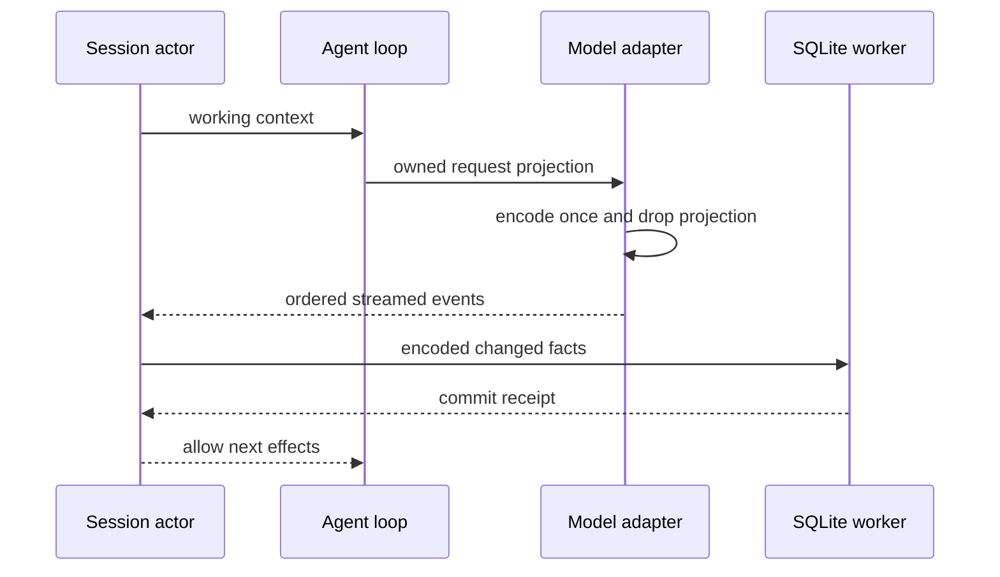

# Rust runtime 延迟与内存优化

2026-09-22。基线为关键功能包交付后的 release 二进制。先记录各阶段成本，优化不得改变 App 协议、请求内容、错误分类、取消、历史边界或提交回执。

## 所有权与约束

- Session actor 仍独占 canonical history 与状态；请求投影是可释放的工作数据，不得把临时 provider 内容写入 canonical history。
- ModelPort 接收一次请求拥有的投影，adapter 编码后释放中间树；重试只持有编码后的 bytes。连接/TLS 设置必须保留当前系统证书与取消规则。
- Store 事务只传递需要提交的编码数据，避免同时保留第二份完整 Value 树；相同 row 内容不重复更新。输入、工具/模型、Goal、权限、历史切断与 ACK 的事务边界不变，SQLite 故障仍停止执行。
- 空闲 Session 缓存同时受 8 个会话和 16 MiB 估计内存预算约束，按 LRU 淘汰，超大单会话也不能绕过字节限制。估算在事实提交后失效，只对空闲会话计算并缓存；计入 canonical/rows 的字符串和数组 capacity，元数据与历史边界用无分配的计数序列化近似。运行、队列、交互、附件上传与任意有效订阅继续 pin；不能通过强制丢弃活跃状态节省内存。估计值只用于缓存调度，不是 RSS 硬限制。

- rowsRange 从请求游标向前取有界尾页，逐行计数字节，不反复编码缩小的整页；保持 200 行、900 KiB、顺序与 hasMore 语义。
- 非 Git 工作区通过祖先 `.git` 文件/目录快速否定探测；显式 `GIT_DIR` / `GIT_WORK_TREE`、权限不确定性继续交给 Git。每次重新检查，避免缓存不存在状态导致新仓库漏检。

- App 的显式 Rust 启动入口 `pnpm dev:desktop:zcode-cli-rust` 默认构建并运行 release，避免实际接入仍使用未优化的 debug 二进制；`--debug` 显式选择调试构建。入口固定 `CARGO_INCREMENTAL=0`，TS 默认选择不变。

## 验收

- 固定 SSE、100 轮历史、4 会话负载，修改前后 release 交错至少 5 次，记录初始化/首段/总耗时/RPC p95/RSS/SQLite 文件开销。
- 增加能区分驻留内存与过程峰值的长历史、多会话负载；重复打开和释放历史后验证 pin、LRU 与内存预算。
- 测试请求编码/三协议/附件/reasoning/取消、事务失败屏障、编辑/fork/冷恢复及双连接仍保持现有语义。
- 性能 profile 只输出阶段计时与计数，不输出用户数据或配置；不接入默认生产日志。
- Rust 测试/fmt/Clippy、App 集成/typecheck/lint/架构检查。所有 Cargo 构建关闭 incremental，不删除用户数据库或运行所需二进制。
