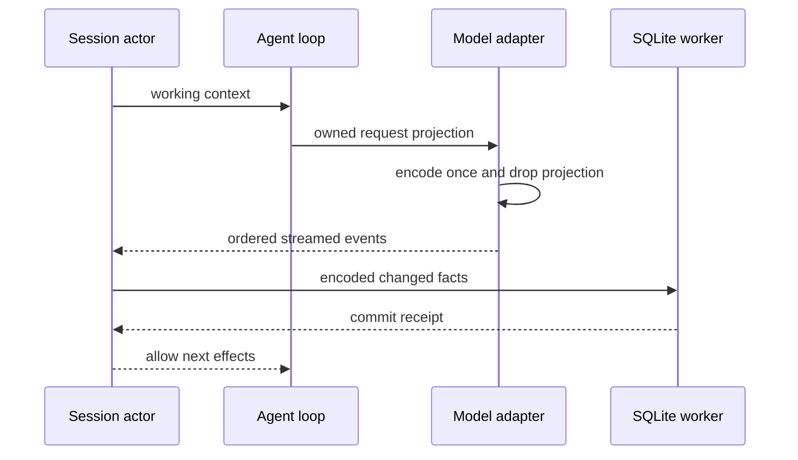

# Rust runtime 延迟与内存优化

2026-09-22。基线为关键功能包交付后的 release 二进制。先记录各阶段成本，优化不得改变 App 协议、请求内容、错误分类、取消、历史边界或提交回执。

## 所有权与约束

- Session actor 仍独占 canonical history 与状态；请求投影是可释放的工作数据，不得把临时 provider 内容写入 canonical history。
- ModelPort 接收一次请求拥有的投影，adapter 编码后释放中间树；重试只持有编码后的 bytes。连接/TLS 设置必须保留当前系统证书与取消规则。
- Store 事务只传递需要提交的编码数据，避免同时保留第二份完整 Value 树；相同 row 内容不重复更新。输入、工具/模型、Goal、权限、历史切断与 ACK 的事务边界不变，SQLite 故障仍停止执行。
- 空闲 Session 缓存同时受 8 个会话和 16 MiB 估计内存预算约束，按 LRU 淘汰，超大单会话也不能绕过字节限制。估算在事实提交后失效，只对空闲会话计算并缓存；计入 canonical/rows 的字符串和数组 capacity，元数据与历史边界用无分配的计数序列化近似。运行、队列、交互、附件上传与任意有效订阅继续 pin；不能通过强制丢弃活跃状态节省内存。估计值只用于缓存调度，不是 RSS 硬限制。

- rowsRange 从请求游标向前取有界尾页，逐行计数字节，不反复编码缩小的整页；保持 200 行、900 KiB、顺序与 hasMore 语义。
- 非 Git 工作区通过祖先 `.git` 文件/目录快速否定探测；显式 `GIT_DIR` / `GIT_WORK_TREE`、权限不确定性继续交给 Git。每次重新检查，避免缓存不存在状态导致新仓库漏检。

- App 的显式 Rust 启动入口 `pnpm dev:desktop:zcode-cli-rust` 默认构建并运行 release，避免实际接入仍使用未优化的 debug 二进制；`--debug` 显式选择调试构建。入口固定 `CARGO_INCREMENTAL=0`，TS 默认选择不变。

## 验收

- 固定 SSE、100 轮历史、4 会话负载，修改前后 release 交错至少 5 次，记录初始化/首段/总耗时/RPC p95/RSS/SQLite 文件开销。
- 增加能区分驻留内存与过程峰值的长历史、多会话负载；重复打开和释放历史后验证 pin、LRU 与内存预算。
- 测试请求编码/三协议/附件/reasoning/取消、事务失败屏障、编辑/fork/冷恢复及双连接仍保持现有语义。
- 性能 profile 只输出阶段计时与计数，不输出用户数据或配置；不接入默认生产日志。
- Rust 测试/fmt/Clippy、App 集成/typecheck/lint/架构检查。所有 Cargo 构建关闭 incremental，不删除用户数据库或运行所需二进制。

## 已修复：输出背压下的 EOF/退出（2026-09-24 发现，2026-09-25 修复）

场景：Host 停止读取 stdout 并写入大量请求（如 12k 条）后关闭 stdin。

- 运行时先因 stdout 管道满而阻塞在写响应上；stdin 读取线程随后因输入队列（容量 64）已满而阻塞在入队上，
  **因此连 EOF 都观测不到**，`stdio::finish` 只能等 2s 后超时报错；实测进程直到测试看门狗 SIGKILL（5s）才结束。
- 相关用例 `zcode-cli-rust-transport.test.ts` 的 Windows 变体（用 EOF 代替 SIGTERM）因此保持跳过，
  跳过理由已写明指向本条。
- 曾尝试的修法（输入关闭时取消一个 shutdown token，让被背压挡住的写入放弃）已回退：仅在「输入已关闭」时放弃输出
  会丢掉仍在读取的 Host 的在途响应（EOF/EPIPE 用例立刻失败）；根因是 EOF 检测本身被满队列挡住，需要在 stdio
  读取层与输出缓冲策略上重新设计（例如独立的 EOF 探测或受限的缓冲增长），不在本次改动范围内。
- TS 侧对照：Node 的 stdout 写入在内存中排队，Host 不读取时不会阻塞事件循环，因此能读到 EOF 后退出；
  Rust 当前的有界输出通道是更严格的背压策略，代价是上述场景下无法退出。

修复（`crates/app-server/src/stdio_input.rs`）：

- 读取线程不再直接向容量 64 的输入队列阻塞入队，而是写入按字节限额（64 MiB）的中间队列，由转发线程承担阻塞；EOF 因此总能被及时观测并取消 `input_closed`。
- 区分「仍在读取的 Host」与「已离开的 Host」看写出进展，而不是看输入是否关闭：EOF 之后写出照常排空；只有单次写出卡住超过 1s 才取消运行时，走与 POSIX SIGTERM 相同的收尾路径。在途响应因此不会丢（EOF/EPIPE 用例保持通过），之前失败的修法正是缺了这一区分。
- 验收：新增 `Rust observes EOF under output backpressure and exits without the watchdog`（全平台）：旧代码在 Windows 上被看门狗杀死（16.6s），新代码约 3s 自行退出。SIGTERM 变体仍只在 POSIX 运行（Windows 没有 SIGTERM），Windows 由 EOF 变体覆盖。

## 2026-09-24：Node/Rust 同口径实测

用仓库自带 `bench-zcode-cli-node-rust.mjs` 在 WSL2（Linux x64）跑 5 次配对：Rust 启动 15.7ms vs Node 3305ms、
空闲 RSS 11.3MiB vs 339MiB、峰值 19.5MiB vs 394MiB、同一 workload 墙钟 0.18s vs 15.9s。
完整数据、读法与仍缺的口径（三平台原生、真实供应商、大历史、p95/p99）见
[性能报告](../reports/rust-perf-2026-09-24.md)。

## 2026-09-26：三平台原生 release 基准

`bench-zcode-cli-node-rust.mjs` 改为三平台可运行：

- Windows 用 `Get-Process` 取工作集与累计 CPU，其余平台仍用 `ps`；
- 两侧都设置 `NO_PROXY`：runner 或开发机的代理会把本地 fixture 请求转走，Rust 会一直重试；
- 会话标题 sidecar 请求不计入主循环请求数（按请求的 `stream` 应答）。

CI 新增 `bench (ubuntu/windows/macos)` job：release 二进制与 Node bundle 在同一 workload 下交错 5 次，
取中位数写入 job summary，并作为 artifact 上传。该 job 不作为失败门槛。

本机 Windows x64（Xeon Gold 5218R，3 次配对，中位数）：

| 指标                              | Node    | Rust     |
| --------------------------------- | ------- | -------- |
| 启动（到 `runtime/capabilities`） | 1892 ms | 32 ms    |
| 空闲工作集                        | 275 MiB | 9.3 MiB  |
| 峰值工作集                        | 302 MiB | 19.8 MiB |
| 8 轮 workload 墙钟                | 3.33 s  | 0.18 s   |
| CPU                               | 2.73 s  | 0.13 s   |
