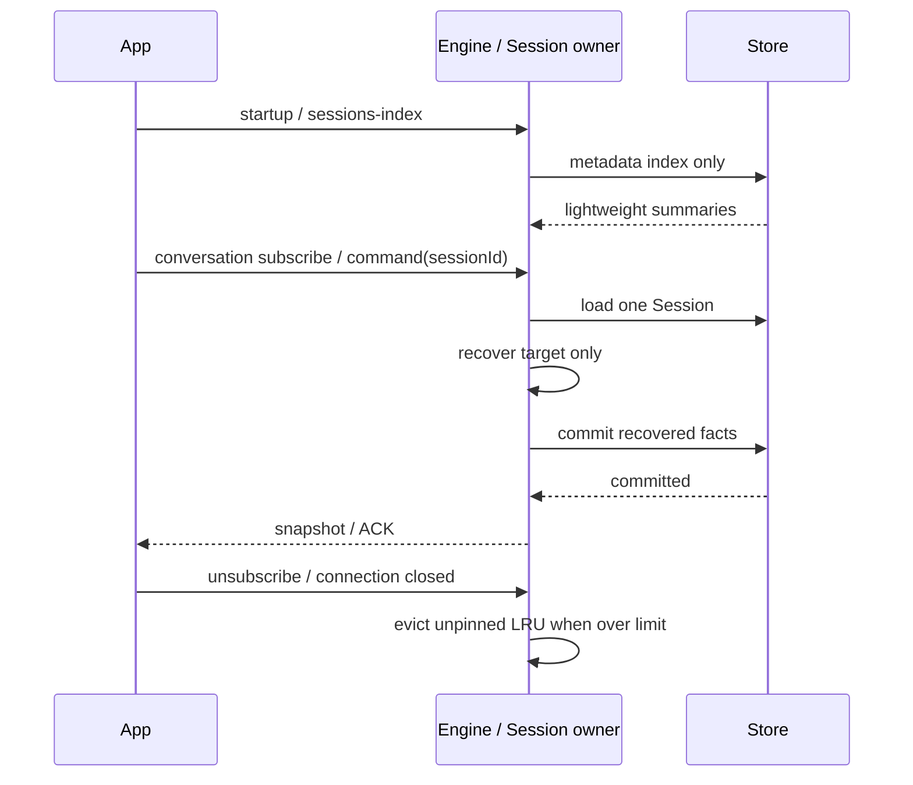

# Rust session 按需加载

2026-09-22。启动时全量加载 rows/messages 并逐个恢复写回的路径移除。Engine 仅加载轻量 sessions-index 投影，不加载所有 Session，也不把全量 command ACK 装入内存。

## 所有权与读取

- SQLite 为冷历史与 durable ACK 的来源；Session actor 持有已激活会话的唯一可变状态。index 仅为 metadata 派生投影，不得承载队列/执行状态的第二份写入路径。
- Store 提供 metadata index、按 ID 读取 Session、按 key 读取 ACK 的明确 ports。启动/列表不读 rust_row/rust_message，不执行全库恢复，不写会话历史。
- metadata index 将上次进程遗留 running/prewarming 投影为 interrupted，pending/background 不伪装仍在运行。真正恢复工具/消息只发生在对应会话激活，提交成功后发布。
- conversation subscribe/query/新 command 只加载目标会话，恢复后提交。legacy session/read 对未激活持久会话作临时只读投影，不启动模型、不注册 live runtime、不改变订阅归属；本进程显式 close 后仍保持 existing-only 拒绝，V4 显式重开可恢复。
- ACK 按 command key 查找；冷队列 ACK 若没有已开始输入对应 row，则原子记为 discardedOnRestart。查询 ACK 不加载会话 transcript。当前进程已接受的队列 ACK 保留在 actor 内存，避免误判为冷队列。

## 驻留与释放

- 运行、后台任务、队列、交互、上传和 conversation 订阅均持有驻留需求。任一需求存在不能逐出。草稿保留直到既有 close 流程。
- 无驻留需求的 durable 会话采用最多 8 个且估计驻留内存最多 16 MiB 的 LRU 缓存；按提交失效的缓存估算计入 canonical/rows capacity 和历史边界，超限时释放工具观察缓存和 Session，已提交的数据库历史与 sidebar index 保留。命令缓存超出 1024 后清理可从 Store 重建的项，草稿与排队输入 ACK 不丢。
- 新 epoch 标识重新激活，旧 run 事件不得复活已释放对象。desktop-continuous 与 mobile-replayable 的有效订阅都保护该会话。
- 历史按单个会话读取；单个超大会话的消息分页/模型上下文窗口分段装载进一步优化单列，不能据此声称内存对任意单会话恒定。

## 验收

- 用禁止会话写入的 trigger、损坏的未打开 transcript/ACK，证明启动和 index 不访问它们；坏历史只影响读取该会话。
- 多会话冷读取不调用模型，不改数据；只激活目标且仍使用持久 ACK 去重。旧 queued ACK 查询可判定处置且不加载其 transcript。
- 超过 8 个会话的打开/释放、双连接、活跃任务/队列/后台 pin、显式 close、重新激活 epoch 和迟到事件隔离。
- 冷恢复现有工具结果/问答/Todo/shared context 提交屏障全部保持，真实 App 任务列表与历史续聊回归。
- Rust 测试、App client/schema、typecheck/lint/fmt/Clippy/架构检查；构建关闭 incremental。性能记录区分 metadata 数量与 transcript 大小，不将 fixture 当真实供应商吞吐量。
