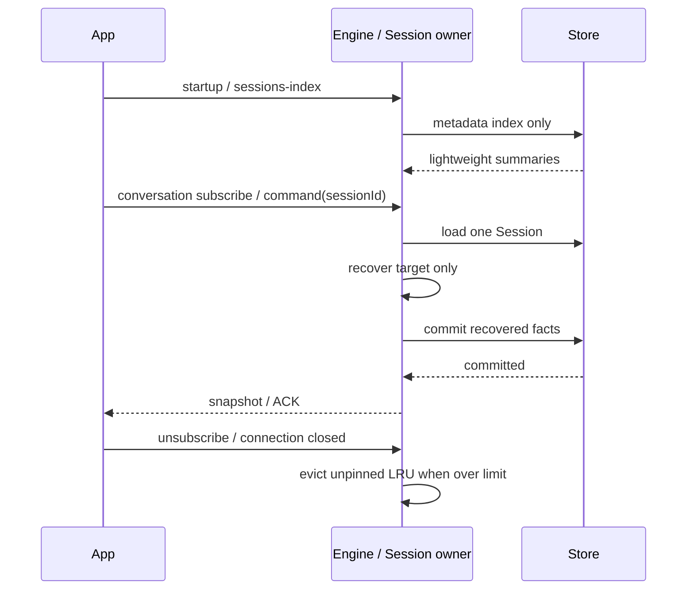

# Rust session 按需加载

2026-09-22。启动时全量加载 rows/messages 并逐个恢复写回的路径移除。Engine 仅加载轻量 sessions-index 投影，不加载所有 Session，也不把全量 command ACK 装入内存。

## 所有权与读取

- SQLite 为冷历史与 durable ACK 的来源；Session actor 持有已激活会话的唯一可变状态。index 仅为 metadata 派生投影，不得承载队列/执行状态的第二份写入路径。
- Store 提供 metadata index、按 ID 读取 Session、按 key 读取 ACK 的明确 ports。启动/列表不读 rust_row/rust_message，不执行全库恢复，不写会话历史。
- metadata index 将上次进程遗留 running/prewarming 投影为 interrupted，pending/background 不伪装仍在运行。真正恢复工具/消息只发生在对应会话激活，提交成功后发布。
- conversation subscribe/query/新 command 只加载目标会话，恢复后提交。legacy session/read 对未激活持久会话作临时只读投影，不启动模型、不注册 live runtime、不改变订阅归属；本进程显式 close 后仍保持 existing-only 拒绝，V4 显式重开可恢复。
- ACK 按 command key 查找；冷队列 ACK 若没有已开始输入对应 row，则原子记为 discardedOnRestart。查询 ACK 不加载会话 transcript。当前进程已接受的队列 ACK 保留在 actor 内存，避免误判为冷队列。

## 驻留与释放

- 运行、后台任务、队列、交互、上传和 conversation 订阅均持有驻留需求。任一需求存在不能逐出。草稿保留直到既有 close 流程。
- 无驻留需求的 durable 会话采用最多 8 个且估计驻留内存最多 16 MiB 的 LRU 缓存；按提交失效的缓存估算计入 canonical/rows capacity 和历史边界，超限时释放工具观察缓存和 Session，已提交的数据库历史与 sidebar index 保留。命令缓存超出 1024 后清理可从 Store 重建的项，草稿与排队输入 ACK 不丢。
- 新 epoch 标识重新激活，旧 run 事件不得复活已释放对象。desktop-continuous 与 mobile-replayable 的有效订阅都保护该会话。
- 历史按单个会话读取；单个超大会话的消息分页/模型上下文窗口分段装载进一步优化单列，不能据此声称内存对任意单会话恒定。

```mermaid
sequenceDiagram
    participant App
    participant Owner as Engine / Session owner
    participant Store
    App->>Owner: startup / sessions-index
    Owner->>Store: metadata index only
    Store-->>Owner: lightweight summaries
    App->>Owner: conversation subscribe / command(sessionId)
    Owner->>Store: load one Session
    Owner->>Owner: recover target only
    Owner->>Store: commit recovered facts
    Store-->>Owner: committed
    Owner-->>App: snapshot / ACK
    App->>Owner: unsubscribe / connection closed
    Owner->>Owner: evict unpinned LRU when over limit
```

## `session/resume`（2026-09-30）

App 的任务列表/会话恢复走 `session/resume`（TS `server-operations.ts::resumeSession` +
`activateSessionForResume`）；Rust 此前没有该方法，App 直接拿到 -32601“Unsupported method”。

Rust 实现（`core/src/app/session_resume.rs`）：

1. 校验 workspace → `ensure_session`：已在内存则 touch，否则从 Store 物化（校验边界、recover、
   水合文件改动并提交）、发布 index——与 TS materialize 的等价物。
2. **仅冷恢复时**应用请求参数（TS 命中 existing 会直接返回，不重放参数）：`offPeakToolEnabled` /
   `dynamicWorkflowEnabled` 按 create 的同一套 `fix_*` 固化；`mcpServers` 交 `configure_mcp`；
   `thoughtLevel` 只作为旧会话的迁移 hint——仅在会话没有持久化推理档位时写入，已有档位以持久化为准
   （TS `model: undefined`、由单向迁移/entry 恢复的同一条规则）。
3. 返回 `read_session` 的 snapshot（与 `session/read` 同一 schema 与投影）。

已知差异（不影响 App 的恢复链路）：

- `toolAllowlist` / `toolDenylist` 被忽略：Rust 不支持会话级工具白名单（既有差异，见
  rust-tool-surface.md），恢复时沿用会话原本的持久化约束。
- 冷恢复 snapshot 的 `projection.mode`：Node 会回落成 `build`（`derivePersistedSessionMode` 从
  persisted assistant 消息取 hint，取不到就用默认），而 `settings.mode.current` 是会话真实模式；
  Rust 两处都按持久化模式，因此与 Node 的 `projection.mode` 可能不同。App 的权威模式来源是
  `settings.mode.current`，该字段本身两侧一致。
- TS 的 legacy remote workspace 修复（WSL/远端 identity 回填）未移植；Rust 的远端会话由导入侧处理。

验收：`packages/services/tests/zcode-cli-rust-session-resume.test.ts`——同一会话在 Node/Rust 上
热恢复（同进程）与冷恢复（新进程）的 snapshot 投影逐字段一致（除上面记录的 `projection.mode`，
以及 Node 独有的 `step-start/step-finish` part），恢复后可直接续聊（消息数与用户轮数一致），
且冷恢复参数 `dynamicWorkflowEnabled: true` 让两侧都看到工作流只读工具。

## `session/messages`（2026-09-30）

App 的 `readSessionMessages` 走 `session/messages`（TS `readMessages`），Rust 之前回 -32601。
实现（`session_read.rs::read_messages`）：只读**活跃**会话（未激活时与 Node 同文案
`Session is not active: <id>`）；`afterMessageId` 命中后取其后的全部（找不到退回全部）；
`limit` 取**最后** N 条（TS `slice(-limit)`）；`limit` 非正数报 `Invalid message limit`。
响应直接满足 App 的 `zcodeSessionMessagesResultSchema`。

已知差异（该方法的 App 调用方 `readSessionMessages` 当前没有活跃 UI 消费者）：

- 消息形状：Node 返回 legacy AI SDK 形状（`info.id/sessionID`、part 带 `id/sessionID/messageID`），
  **过不了 App 自己的 `zcodeSessionMessagesResultSchema`**（要求 `messageId/partId/sessionId`）；
  Rust 按该 schema 的形状返回。因此锚点字段也不同（Node 比 `info.id`，Rust 比 `messageId`），
  两侧无法逐条 deepEqual。
- Node 的历史里含一条「活」的占位 assistant（只有 step-start），出现时机晚于 turn 完成，
  同一场景连续两次读取的条数可能不同；Rust 只反映已提交的历史。

验收：`packages/services/tests/zcode-cli-rust-session-messages.test.ts`——Rust 侧校验 schema 通过、
四类分页（命中锚点 / 锚点缺失 / limit 取尾部 / limit 超限）逐条对齐 TS 算法、未激活会话报同文案。

## 验收

- 用禁止会话写入的 trigger、损坏的未打开 transcript/ACK，证明启动和 index 不访问它们；坏历史只影响读取该会话。
- 多会话冷读取不调用模型，不改数据；只激活目标且仍使用持久 ACK 去重。旧 queued ACK 查询可判定处置且不加载其 transcript。
- 超过 8 个会话的打开/释放、双连接、活跃任务/队列/后台 pin、显式 close、重新激活 epoch 和迟到事件隔离。
- 冷恢复现有工具结果/问答/Todo/shared context 提交屏障全部保持，真实 App 任务列表与历史续聊回归。
- Rust 测试、App client/schema、typecheck/lint/fmt/Clippy/架构检查；构建关闭 incremental。性能记录区分 metadata 数量与 transcript 大小，不将 fixture 当真实供应商吞吐量。
