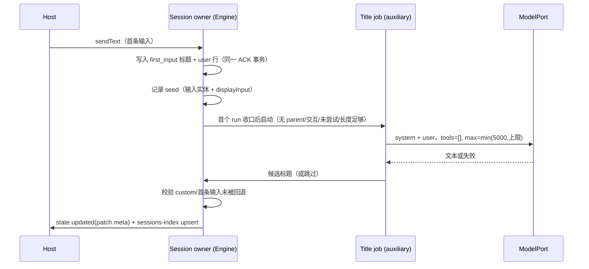

# Rust 会话标题（first_input 与模型生成）

2026-09-26。对齐 TS `runtime/methods/session-title.ts`、`title-generation-sidecar.ts`、
`helpers/project.ts#titleFromInput` 与 bootstrap 的 `titleGeneration` 注入。App 侧边栏与会话 meta 都读标题，
此前 Rust 只取首条输入前 80 个字符且不调用辅助模型，与 Node 可见文本不同。

## 产品规则

### first_input（首条输入落库）

- 会话第一次接受输入时写入标题：`titleFromInput(displayInput)`——
  `trim` → 空白折叠为单个空格 → 长度 ≤ 60 时原样，否则前 57 + `...`；归一后为空时用 `Untitled session`。
  长度按 UTF-16 code unit 计（TS `String#length`），与 `truncate_utf16` 同口径。
- `titleSource = first_input`（持久化身份；V4 meta 投影为 `generated`，`default` 与 `custom` 原样）。
- 只写一次：已有标题（含导入的历史会话、`custom`、`default`）不被首条输入覆盖。
- 标题变化经既有 `state.updated` patch 与 sessions-index upsert 下发，不新增协议字段。

### generated（辅助模型生成）

- 触发：首条输入落库并完成其首个 run 之后，且满足全部条件：
  会话无 parent、`taskType` 为 `interactive`、标题生成未被显式关闭、尚未尝试过、
  `normalizeTitleInput(displayInput)` 非空、按 code point 计 ≥ 10 字符
  （`/goal` 这类外部输入入口不受 10 字符门槛限制）。
  TS 对需要请求期刷新 runtime headers 的 provider 会推迟到主轮次之后，Rust 的账号链路同样要求
  主请求先发出，因此统一在首个 run 收口后触发，不并发占用鉴权窗口。
- 请求：`messages = [{role:"system",content:<固定 system prompt>}, {role:"user",content:<normalizeTitleInput(displayInput)>}]`，
  无工具；模型为会话当前选型绑定最低推理档位（`auxiliary()`）并限制 `maxOutputTokens = min(5000, 模型上限)`；
  单次调用，60 秒超时且随会话关闭取消。
- 结果：返回工具调用、空标题或清洗后为空的候选都视为跳过，不改标题、不重试。
- 清洗（`cleanGeneratedTitle`）：去掉 ` thinking…</think>` → 依次尝试整段 JSON、```json 围栏内 JSON 的
  `title` 字段、首个非空行；再去掉开头 `#`、首尾引号/空白、结尾标点，空白折叠为单个空格；
  不含 `[A-Za-z0-9]` 或 CJK（`㐀-鿿`）时视为无效；超过 100 个 UTF-16 unit 时前 97 去尾空白 + `...`。
- 写回：仅当会话仍存在、无 parent、`titleSource ∈ {default, first_input, generated}`（`custom` 优先）且
  首条输入未被编辑/回退（`history.inputs` 仍含该输入实体）时写入；成功后 `titleSource = generated`。
  并发写只由会话 owner 执行，迟到候选不会覆盖 `custom`。

### 边界

- 目标（Goal）摘要标题（`summaryTitle`）不在本包范围：Rust 仍投影 `null`，见「剩余边界」。
- TS 另行持久化 `titleMessageID`（用于用量归因与编辑判定）；Rust 不新增该字段，编辑/回退判定直接查
  `history.inputs` 的输入实体，两者对 App 可见行为一致。
- 会话创建即持久化的 draft、导入历史与子代理会话不触发生成；自动化执行会话与 TS 相同地不生成标题
  （TS 在 session/create 传 `titleGenerationEnabled=false`，Rust 以「首条输入带 automation 身份」表达），
  标题停在 `first_input`。

## 所有者与顺序



- 标题与 `titleSource` 只由会话 owner 写；job 只返回候选，不直接改会话。
- 取消：会话关闭时取消未完成的 job；job 结束不写被关闭/回退的会话。
- 幂等：每个会话最多尝试一次生成（`title_attempted`），重启后不补跑历史会话。

## 验收

- 纯规则语料：`scripts/generate-zcode-cli-rust-title-corpus.mjs` 从 TS oracle 生成
  `crates/domain/tests/fixtures/title_corpus.json`（system prompt、first_input、normalize、清洗/解析各分支），
  Rust 逐条一致；`--check` 参与 `pnpm test:zcode-cli-rust` 的漂移检查。
- App 差分：`packages/services/tests/zcode-cli-rust-title-differential.test.ts` 在 Node 与 Rust 上比对
  - 首条输入后的 meta 标题与 `titleSource`；
  - 生成的标题请求（system 首段、user 内容、无工具、思考档位与输出上限）；
  - 清洗后的标题与 meta（含 JSON/围栏/首行三种返回形态）；
  - 不触发的情形：短输入（<10 字符）、第二轮输入、`renameSession` 之后的 `custom` 标题不被覆盖、
    工具调用返回、空标题、会话被回退。
