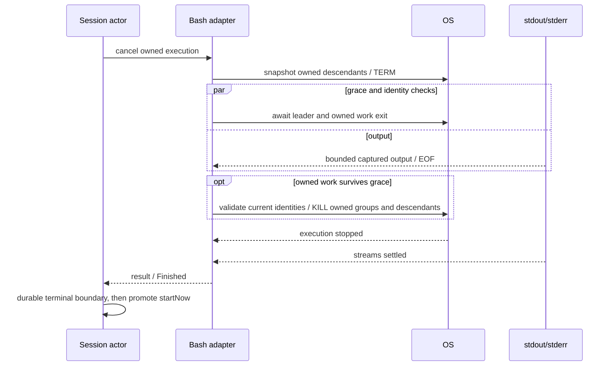

# Rust Bash 终止与进程树回收

2026-09-22。承接运行中输入验收发现的后台 shutdown 30 秒延迟，范围为 Bash / TaskStop / stop / startNow / EOF 的现有进程所有权，不新增 Host watchdog 或任务重试。

## 已复现原因与 TS 基线

旧 Rust `tool_process::run` 在取消时只对原 PGID 发一次 SIGKILL，随后等待 leader 和 stdout/stderr EOF。后台注册测试在 `echo $$ > pid; sleep 30` 的启动窗口取消时，观察到 leader 已退出、sleep 的 PPID=1、PGID 仍为原 leader。一次组信号与 fork 存在竞态，存活后代保持管道打开，导致取消迟迟不收口。当前测试只断言父 PID，不能证明进程树回收。

TS 基线为 adapters/exec/process-tree.ts 和 node-execution-adapter-process.ts：Bash 取消先 TERM，1500ms 后强制清理；除 PGID 外，枚举 PPID 后代以覆盖 job control / pipeline / PTY 的跨 PGID 工作进程。Rust 沿用这个取消意图并保留已捕获输出。宽限期是正常清理机会，不能把超时当作退出成功。

## 所有者与实现边界

- Session actor 继续拥有 run/task 终态与持久化；ToolPort adapter 唯一拥有 OS child、终止计划和捕获任务。App/Host 不能绕过这个所有者杀工具进程。
- POSIX Bash 使用独立进程组。取消、超时或输出限制触发统一终止流程；正常 leader 完成也收回其原组内仍持有输出的后代。
- 终止开始时异步读取有界进程关系快照，记录后代及其进程组。仅操作本次 Bash root 或确认为其后代的 PID；跨组信号仅针对后代拥有的组。SIGTERM 允许清理，仍存活的工作在最多 1500ms 后 SIGKILL。
- TERM 后仍保留原 PGID 的清理责任，不因 leader 先退出就结束。跨阶段 PID 使用开始身份校验，避免把旧 PID 当成新进程；新阶段读取当前关系，补充同一拥有组内的新后代。
- 等 child exit、后代清理与输出捕获全部完成后，才返回 ToolOutput / 后台终态。leader 已退出但管道未关闭时仍响应取消与超时，不能把响应期限仅绑在 child.wait。
- 强制清理阶段最多 1 秒；每次进程表读取限 500ms / 2MiB。取消后捕获再等待最多 1 秒；无法确认回收时返回内部 `ProcessCleanupFailure`，通过 run-scoped `ToolCleanupFailed` 停止 actor admission，不作为普通工具失败继续请求模型。迟到旧 run 的失败不能终止新的执行。
- 进程表身份使用 PID 与启动时间；这是已有进程所有权的清理，不是 OS 沙箱。终止快照前已经主动脱离原进程组且完成 reparent 的 daemon 不在完整覆盖声明内。PID 复用保护受平台进程表时间精度限制。
- actor EOF 等待真实前台/后台清理完成，不以早于 TERM 宽限期的 1200ms 截止时间丢弃运行任务；数据库失败后的内存事实仍不可再提交。
- Windows 保留 taskkill /T /F 现有边界；跨平台完整回收验证仍须在对应平台执行，不能由 macOS 测试代替。
- 仅终止路径读取进程表，普通模型循环与正常无后代命令不增加常驻扫描。使用异步 IO，有界输出；不缓存全局 PID 真相。

## 验收

1. 启动即取消的旧 30 秒用例在有限时间内完成；实际检查父、子 PID 与原进程组，不只检查父进程。
2. TERM trap 能写入清理标记；忽略 TERM 的跨 PGID child 被升级终止，取消期间生成的后代不能继续产生副作用。
3. 正常 leader 先退出、仍有子进程持有 pipe 时，取消/超时继续有效；输出保留，有界内存和磁盘规则不变。
4. 真实 Rust/App schema 测试覆盖前台 stop/startNow、TaskStop、EOF、EPIPE；新请求不能早于旧工具清理完成。
5. 使用真实 App 重复停止/抢占，保存 PID、终态、耗时及冷恢复证据。Rust tests/fmt/Clippy、App integration、typecheck/lint、fmt 和架构检查通过；继续禁用增量缓存。
