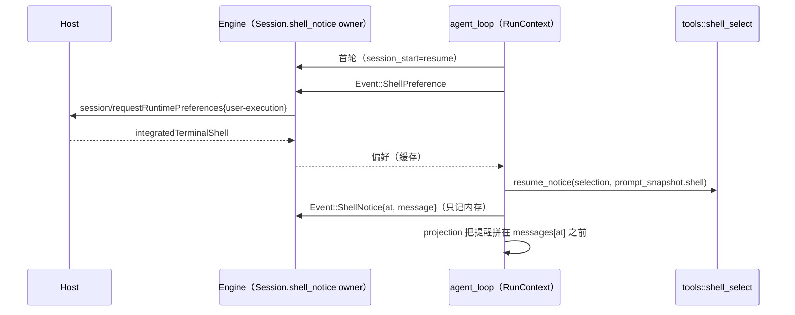

# Rust 恢复会话的 shell 提醒

2026-10-08。Node 在恢复会话（跨进程冷恢复、fork child、副屏 child）后，按 TS
`announceSessionShellEnvironmentNoticeAfterResume`（`core/src/runtime/methods/session-shell-environment.ts`）
给模型补一条 `The Bash tool shell is …` 提醒；Rust 原先没有，恢复后的首个模型请求比 Node 少一条消息
（`rust-v4-command-gaps.md` 副屏 / fork 两节的已知差异）。

## Node 基准（App 差分实测）

- App stdio 链路上 Node 不写 shell 快照 entry（见 `rust-shell-selection.md`），恢复时快照状态恒为 `missing`，
  于是只剩两条触发规则（TS `getShellEnvironmentResumeNoticeKind`）：
  1. 当前选择是 **自动探测到的 Git Bash**（Windows 默认）→ `The Bash tool shell is Git Bash.`；
  2. 否则，会话起始时写进系统提示词的 `- Shell:` 名与当前 shell 显示名都非空且不同 →
     `The Bash tool shell is {当前显示名}.`。
- 形态：`<system-reminder>\n{正文}\n</system-reminder>` 的 user 消息，provider 可见、UI 不渲染。
- 位置：恢复时追加在历史末尾，即恢复后第一条输入（及其前置提醒）之前；之后在本进程内一直留在那个位置。
- **不落库**：再次冷恢复时旧提醒消失，新提醒出现在新一轮输入之前（同一份历史里永远至多一条）。
- 实测三组（同一会话，phase 1 → 重启 → phase 2 → 重启 → phase 3）：
  Git Bash（用户选）→ CMD：提醒 `CMD`；自动 → 自动（Windows 探测到 Git Bash）：提醒 `Git Bash`；
  CMD → CMD：无提醒。

## Rust 规则

- 判定时机：会话在本进程内的首轮且之前已有输入（`TurnFacts.session_start == "resume"`，与 SessionStart hook 的
  `resume` 同一判定），在项目记忆与提示词初始化之后、hooks 之前。Rust 没有独立的 runtime 物化步骤，首轮就是
  它的物化点（`runtime-materialization` 偏好也在这里请求），因此这里就是「激活时解析」：shell 选择经
  `session/requestRuntimePreferences{scope:"user-execution"}` 解析一次并缓存，后续 Bash 复用。
- 规则：`tools::shell_select::resume_notice(selection, persisted)`，`persisted` 取会话的 `prompt_snapshot.shell`
  （会话起始时写进提示词的 Shell 名，对应 TS 的 persisted envInfo）。
- 位置：插在本轮输入起点（`turn_hooks::input_start`）之前，并越过紧邻其前的 child 分支提醒（`fork_notice` /
  `selection_side_chat`）——实测 Node 的 fork / 副屏 child 首个请求里 shell 提醒位于分支提醒之前。同轮 hook 上下文
  插在输入起点，位于提醒之后，与 Node「先恢复、后 hooks」的顺序一致。

## 所有者与时序

- 所有者：会话 owner（Engine）在 `Session.shell_notice`（`serde(skip)`）记 `(messages 下标, 消息)`，只在内存；
  运行时副本 `RunContext.shell_notice` 记相对本次消息窗口的下标，在 `projection` 拼进请求，与临时 Continue
  同样不进入 canonical 消息与上下文偏移。
- 失效：压缩边界越过锚点、历史截断（retry / edit / rewind）截到锚点之前、UserPromptSubmit 阻止撤回本轮时丢弃；
  锚点之前插入消息时锚点后移。fork child 不继承父会话的提醒，child 首轮按恢复会话自行判定。

## 已知差异

- 压缩摘要的输入不含该提醒（Node 的压缩输入含 runtime attachment）。只影响摘要模型看到的一条短提醒。
- TS 在快照可恢复（`restored`）时不提醒；App 链路上 Node 没有快照，Rust 也不实现快照，两侧一致。

## 验收

- 单测：`shell_select_tests.rs::resume_notice_follows_ts_rules`（自动 Git Bash 必提醒、显示名变化提醒、相同或缺失不提醒）。
- App 差分：`packages/services/tests/zcode-cli-rust-shell-resume-notice.test.ts`（Windows；三组设置，两次冷恢复后的
  模型请求会话部分两侧逐字一致，含提醒位置与不落库）。
- fork child 与副屏 child 的首个模型请求不再过滤该提醒（`zcode-cli-rust-fork-child.test.ts`、
  `zcode-cli-rust-selection-side-session.test.ts`）。
