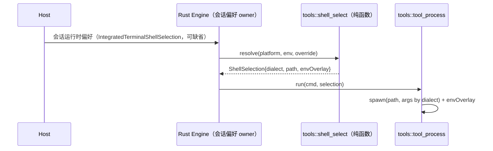

# Rust Shell 选择与 TS 对齐

2026-09-24，WP2（跨平台正确性）的第一项。Rust Bash 工具的 shell 解析必须与 TS `apps/zcode-cli/packages/adapters/src/exec/bash-shell-provider.ts` 一致，否则同一条模型命令在两个 runtime 上会得到不同语义。

## 现状差异（已确认）

| 平台             | TS（基准）                                                                                                                                                                 | Rust（`crates/tools/src/tool_process.rs::run`） |
| ---------------- | -------------------------------------------------------------------------------------------------------------------------------------------------------------------------- | ----------------------------------------------- |
| Windows 默认     | 自动探测 Git Bash：固定路径 `C:\Program Files{, (x86)}\Git\bin\bash.exe` → PATH 中 `git.exe` 反推 `..\bin\bash.exe` / `..\..\bin\bash.exe`；都没有时走 legacy system shell | 固定 `cmd.exe /D /S /C`                         |
| Windows 用户选择 | Host 下发 `IntegratedTerminalShellSelection`（`mode!=auto`）：`git-bash`（路径需可执行）或 `cmd`（`cmd.exe` 裸名可免校验）                                                 | 不支持                                          |
| POSIX 默认       | `$SHELL` 为 bash/zsh 时优先；否则按 `$SHELL` 类型决定 bash/zsh 顺序（默认 zsh 优先），先 PATH、后 `/bin` `/usr/bin` `/usr/local/bin` `/opt/homebrew/bin`                   | 固定 `/bin/bash -c`                             |
| 环境覆盖         | git-bash/posix 注入 `GIT_EDITOR=true`、`SHELL=<选中路径>`                                                                                                                  | 无                                              |

证据：Windows 上 `tests/coding_tools.rs` 的后台 Shell 用例依赖 `$$`/`sleep`，在 `cmd.exe` 下无法表达，clippy `-D warnings` 也因 `pid` 仅在 unix 分支使用而失败。

## 规则

- 唯一所有者：`crates/tools` 内新增 `shell_select.rs`，纯函数 `resolve(platform, env, override, exists) -> ShellSelection`，与 TS `resolveEffectiveBashShellSelection` 一一对应；`tool_process::run` 只消费结果，不再内联平台分支。
- 用户选择来源与 TS 相同：会话运行时偏好（Host → runtime），`mode=auto` 视为无覆盖。首版 Rust 若尚未接入该偏好，仅实现自动探测，并在 `runtime/capabilities` 中不宣告 shell 覆盖能力，不静默忽略用户设置。
- legacy 回退：TS 的 `legacy-shell` 在 Windows 即系统 `ComSpec`（缺省 `cmd.exe`），POSIX 为 `/bin/sh`；Rust 保持一致。
- Git Bash 下 cwd、临时文件等路径需按 TS `windowsPathToGitBashPath` 规则转换（`C:\a` → `/c/a`）。

## 验收

1. 差分单测：同一组 `(platform, env, override, exists)` 输入，Rust `resolve` 与 TS `resolveEffectiveBashShellSelection` 输出相同的 dialect/path/source（fixture 由 Node 脚本导出 JSON，`--check` 防漂移）。
2. Windows 实测：装有 Git Bash 时 `echo $$` 返回 bash pid；后台任务可被进程树清理；无 Git Bash 时回退 `cmd`。
3. `tests/coding_tools.rs` 后台用例在 Windows 走 Git Bash 分支运行，不再依赖 `cfg(unix)` 才有意义；clippy 在 Windows 通过。
4. macOS/Linux：交叉编译通过；`$SHELL=zsh` 时选择 zsh 的单测。

## 实现状态（2026-09-24）

- 已实现：`crates/tools/src/shell_select.rs`（解析与 spawn 参数）、`crates/core/src/app/shell_preferences.rs`（Engine 按会话请求一次 `session/requestRuntimePreferences{scope:"user-execution"}` 并缓存，并发首批 Bash 共用一个请求）、Bash 工具在启动 shell 前经 `Event::ShellPreference` 取偏好（15s 超时，同 `ZCODE_SESSION_RUNTIME_PREFERENCES_REQUEST_TIMEOUT_MS`）。
- 已知差异，待对齐：
  - TS 对 -32601/-32020 以外的错误和超时会让会话 runtime 创建失败；Rust 传输层把错误回包归一为 `Null`，统一回退自动探测。
  - TS 子代理继承父会话的 shell 选择；Rust 子会话以自己的 sessionId 请求 Host，Host 不认识时回退自动探测。
  - TS 会把选择结果作为快照持久化（`source != user-config` 的恢复路径）；Rust 仅进程内缓存，冷恢复后重新请求。
