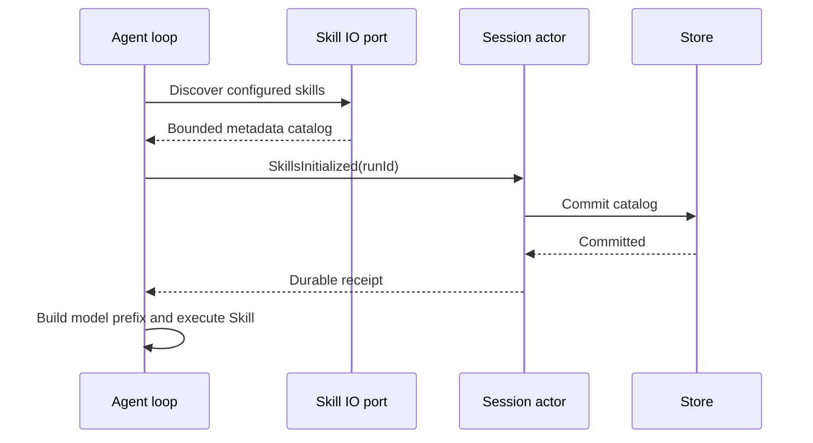

# Rust Skill runtime parity

## Product rules

`skills/referenceCatalog` returns the existing strict workspace/session authority schema. Workspace discovery reads the current configuration. A session freezes its skill catalog at first catalog access or initial model context, persists that catalog before a model request, and retains it through cold restore, retry and fork. Unknown sessions fail closed. The Skill tool loads only a member of that catalog by its bare or plugin-qualified name; paths in arguments cannot expand the catalog.

Discovery merges extra roots, user `.zcode/skills` and `.agents/skills`, then workspace roots through the nearest Git root, and enabled plugin roots. Deduplication is by installation path, preserving same-name installations and TS root precedence. Honor feature/skill switches and per-path overrides, including canonical paths. Plugin roots and SKILL.md files cannot escape through symlinks. Read metadata and content with explicit size bounds and cancellation. Load at most 100,000 bytes, strip frontmatter, expand the two skill-directory variables, and return the established skill_content wrapper. Invalid frontmatter is excluded, while plain Markdown uses its directory name.

## Ownership and interfaces

Session owns serializable catalog metadata; RunContext uses an immutable copy. ToolPort owns discovery/content IO, never session mutation. A run-scoped SkillsInitialized event requires the actor's durable receipt before model use. Workspace catalog reads do not create or load session history. Catalog metadata enters the request prefix under the existing system-reminder convention; skill instructions enter canonical history only as a completed tool result. The App wire version remains unchanged.

## Acceptance

Use a real Rust subprocess and the App catalog schema: discovery/precedence, duplicate names, plugin aliases and disable switches; metadata injection and Skill result; frozen session vs fresh workspace catalog; cold restoration; malformed and oversized files; cancellation and symlink escape. Store failure prevents the first model request. Plugin installation, downloads and hooks are separate capabilities and are not inferred from successful skill loading.
