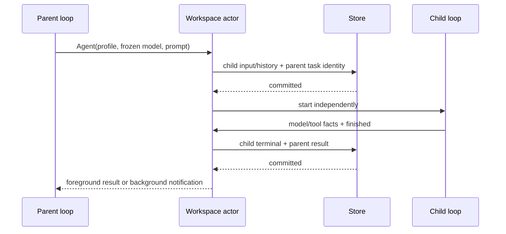

# Rust 子代理与 App stdio 契约

依据当前 Agent/SendMessage/TaskOutput/TaskStop contracts 和 subagent runner。实现内置 general-purpose、Explore 及用户/项目 profile；不启动嵌套 Node CLI。父子会话属于同一 workspace actor，子会话独立历史、Todo、模型调用及工具读状态，继承启动时模型选择和权限 yolo。使用现有 App `session/subagents`、snapshot.subagents、backgroundWorks 和子 session 订阅，不新增协议。

`Agent` 前台等待真实子运行的提交终态；显式 background 立即返回稳定 agentId/taskId/childSessionId/outputFile，完成通知先提交父会话，再进入 continuation inbox。`SendMessage` 只能访问当前协调者所属 child；运行中在模型/工具边界接收，终态后恢复同一 child 历史。`TaskOutput` 支持非阻塞和有期限等待；`TaskStop` 和 App cancelBackgroundWork 取消并等待子工具清理。Task 是 Agent 的非公开兼容别名。

子工具可见集与调用时检查一致，不能只从 provider schema 隐藏。Explore 对齐 TS 的只读工具集合和提示词（Bash 仍按 TS 以只读提示约束）；profile 的 tools/disallowedTools/maxTurns/模型覆盖必须影响实际执行。MCP 子代理复用父 session 已借用的连接，不复制凭据到历史；Skill 元数据复用冻结目录，正文按需加载。

父 stop/close/EOF 取消整个持有的运行树并等待子工具终态；不能发出清理完成后仍有子 Shell 写文件。冷恢复将未完成 child 标记 lost，不透明重放；已完成的 child 支持消息继续。运行中父子及未投递结果不可被 LRU 回收；终态可按需加载。任务身份、workspace、run generation 均校验，其他会话不能读取/停止/消息注入本会话子代理。

父 Session 同时将 child 生命周期投影为与原始 Agent/Task toolCall 配对的 `subagent` 行，供 App 摘要打开子会话详情。消息恢复更新原行，父回复结束不提前结束后台 child；旧历史冷加载从真实工具锚点补齐缺失行，不能猜测或重放。详见 [App 会话投影](rust-app-session-projection.md)。

并发上限为每父会话 4 个运行 child、整个 workspace 32 个，嵌套深度最多 4；到限返回明确工具失败，不排不可观察的内存队列。所有 IO 通过 ports；前台等子结果、TaskOutput 等待和发现配置不阻塞 actor。验收覆盖前后台、并发、权限工具面、消息恢复、结果通知、取消 Shell 树、冷恢复、身份隔离、提交屏障及现有 App schema。
