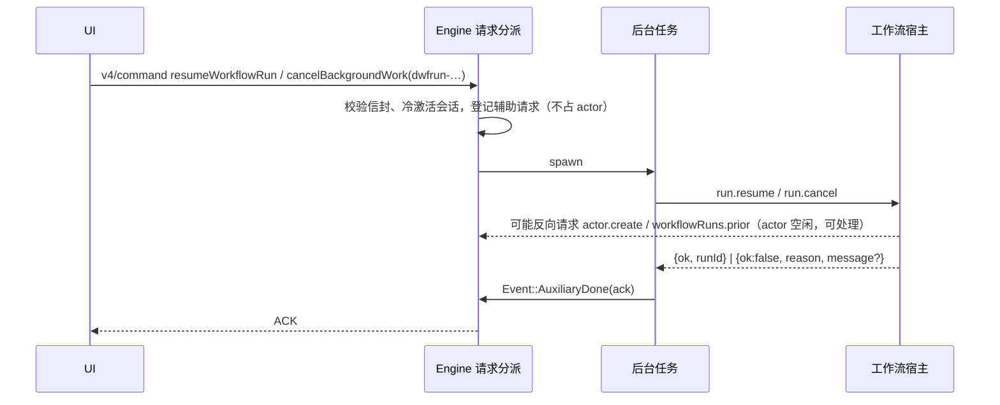
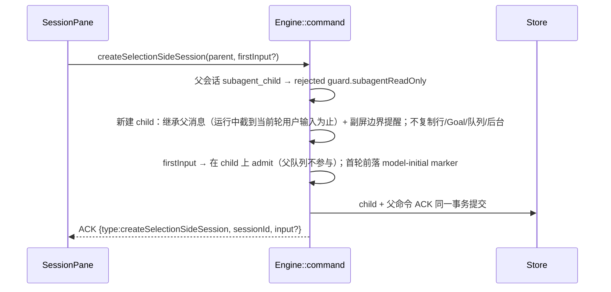
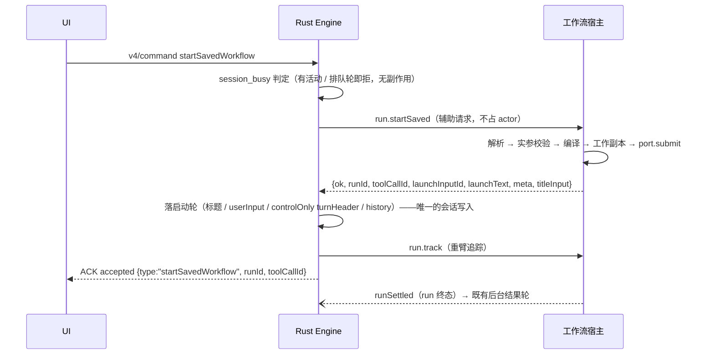

# Rust V4 命令缺口（2026-10-03 复查）

把共享协议 `commandPayloadSchemas`（`packages/shared/src/zcode-protocol-v4/command.ts`）的全部命令类型与 Rust
`crates/core` 的处理逐条比对，App 在用、Rust 完全没有处理的命令共 5 个——Rust 对未知命令一律
`rejected / guard.capabilityUnsupported`，UI 动作直接失败。

| 命令                         | App 入口                                                 | 状态                                 |
| ---------------------------- | -------------------------------------------------------- | ------------------------------------ |
| `setAssistantFeedback`       | 助手回复点赞 / 点踩（`v4/SessionPane.tsx`）              | **已实现**，差分一致                 |
| `createSelectionSideSession` | 框选「问一问」副屏（`v4/SessionPane.tsx`）               | **已实现**，差分一致（已知差异见下） |
| `startSavedWorkflow`         | 设置页「已保存工作流」启动（`useSavedWorkflowLauncher`） | **已实现**，差分一致                 |
| `resumeWorkflowRun`          | 工作流运行侧栏「恢复」（`WorkflowRunSidePane`）          | **已实现**，差分一致                 |
| `amendWorkflowRunSettings`   | 工作流运行设置弹层（`useWorkflowRunPaneSettings`）       | 待实现                               |

Workspace hook 的四个命令（`requestWorkspaceHookReview` 等）经 `kind.contains("WorkspaceHook")` 整体转发给工具层，已覆盖。

另有一个「命令存在、语义缺失」的缺口：`cancelBackgroundWork {workId: dwfrun-…}`（run 卡 / 详情页的「取消」，三个入口
同一实现）——Rust 只认子代理与后台 Bash，对工作流 run 回 `noop`，取消按钮无效。**已修**，见下节。

## 工作流 run 的取消与恢复

TS：`runtime.cancelBackgroundTask`（initiator = user，非 strict）与 `app.resumeWorkflowRun`（`port.resume` + 追踪重臂）。
Rust 的 run 由工作流宿主（`__zcode-workflow-host`）执行，新增宿主方法 `run.cancel` / `run.resume`
（`apps/zcode-cli/packages/cli/src/workflow-host-runs.ts`），Engine 侧 `workflow_run_commands.rs`。

- 宿主处理中会反向请求会话 owner，Engine 不能在 actor 里同步等应答，故走 `mcp/list` 同款辅助请求。
- 恢复拒绝：`failed / fault.command.workflowRunResumeRejected.<reason>`，`message` 为宿主诊断或
  `workflow run resume rejected: <reason>`；取消拒绝（未找到 / 已终态）：`failed /
  fault.command.backgroundWorkCancelRejected.<not_found|not_running>`，`message` 为
  `background work <id> was not cancelled: <reason>`——均与 Node 原文一致。
- 验收：`zcode-cli-rust-workflow-run-commands.test.ts`（actor 挂住时 UI 取消 → 停止通知 → UI 恢复 → actor 重跑结算 →
  完成通知；未知 run 的恢复 / 取消、已完结 run 的取消，两侧 ACK 与通知逐字一致）。

## setAssistantFeedback

TS 以 transcript metadata 为持久权威、事件推进投影。Rust 的会话行本身随会话落库，反馈直接写在 assistantText 行的
`feedback` 字段（`null` 删除字段），推送 `row.upserted`，与命令 ACK 同一次提交，冷恢复随行还原。

- CAS 命令：缺 `baseRevision` 报错；stale 在命令入口判定。
- 目标行不存在 → `stale / proto.staleTarget`；不是 assistantText → `rejected / guard.actionUnavailable`；同值反馈仍 `accepted`。
- 验收：`zcode-cli-rust-assistant-feedback.test.ts`（like / 重复 like / dislike / 清除 / userInput 行 / 不存在行 / 重启恢复，两侧逐字一致）。

## createSelectionSideSession

TS：handler + core `createSelectionSideConversation`。Rust `selection_side_session.rs`：

- child：`sess_` 前缀 id、`taskType = selection_side_chat`、标题 `Selection side chat`（generated，不生成标题）、
  `listed = false`（不进任务列表）、继承父模式 / plan / followup、附件、Skill 目录与提示快照；模型取 firstInput
  的 `modelSelection`，缺省继承父会话。
- 副屏内 `sendGoalCommand / pauseGoal / resumeGoal / editUserQuery / retryTurn / forkAssistant / discardSharedContext`
  → `failed / guard.selectionSideChatRestrictedCommand`。
- 验收：`zcode-cli-rust-selection-side-session.test.ts`（ACK、子会话行、模型请求会话部分、sessionKind/标题、列表不可见、
  受限命令、无首条输入的副屏，两侧逐字一致）。

### 已知差异

- marker 的 `toThought`：Node 副屏 child 投影的 `config.thought` 为空串，Rust 填实际档位。
- shell 环境变更提醒：Node 恢复 runtime（副屏、fork、跨进程冷恢复）且 shell 快照未还原时注入
  `The Bash tool shell is …`（Windows 自动检测 Git Bash 时必注入），Rust 尚未实现该提醒，属跨路径缺口，单独处理。

## forkAssistant 的 child 身份与边界（2026-10-03）

- **已改**：child 原先沿用父会话身份（`task_type = interactive`、id 无 `sess_` 前缀、标题与父会话相同），
  也没有 fork 边界产物。现按 TS `buildForkedSessionInput` + `buildAtomicForkNotice` 对齐：
  `sess_<uuid>` / `taskType = fork` / `Fork of {parent.title}` / `titleSource = generated`，
  并追加 hidden model-only 提醒（`_zcode_source = "fork_notice"`）与被选轮末尾可见的
  `timelineMarker`（`lane = turnTailBoundary`、`marker = {type:"forkNotice",…}`）。
  逐字比较见 `zcode-cli-rust-fork-child.test.ts`。
- **验收已确认**：fork ACK、`session/list` 可见性与 `parentSessionId`、child 行、child 首次模型请求的
  会话部分（含 fork 提醒）与 Node 一致；`turnId` / `createdAtSeq` 两侧取值不同（Node 用新 turnId 且按父
  会话 seq 续号，Rust 复用被选行 turnId、child 自身从 1 起），差分测试对这两项归一。

### 已知差异

- fork child 的 `session/read.session.mode`：Node 取父会话**创建时**持久化的 permission（`buildForkedSessionInput`
  用 store 行的 `parentSession.permission`），因此父会话后来切到 yolo，child 仍是 `build`；Rust 只有一个实时
  `mode` 字段，child 继承父会话当前模式。补齐需要给会话增加「创建时模式」持久化字段，属数据模型变更，待确认。
- shell 环境变更提醒：同「副屏」一节的已知差异，fork child 的首次模型请求同样少一条
  `The Bash tool shell is …`。Rust 的 shell 选择是首个 Bash 前懒解析（`crates/core/src/app/shell_preferences.rs`），
  要在恢复期注入得把解析提前到会话激活，属设计变更，需先确认。

## session/read 的 session 投影（2026-10-03）

对齐 `session-mapper.ts` 的 `mapSessionInfo`，改了四处：

- 补 `traceId`：进程内会话与 `session/list` 一样投影 `s.trace_id`（TS `session.traceID ?? app.traceId`）。
- 补 `target`：无 Goal 时显式 `null`（TS `mapSessionGoal` 对无目标返回 null，不是缺字段）。
- `session.model` 只发 `{providerId, modelId}`：TS 从 `optionalModelSelectionFromString(getModel())` 解析，
  该解析只按 `/` 切分，不含 options；档位仍由 `settings.thoughtLevel.current` 与 `settings.model.current` 表达。
- 未命名的会话不发 `titleSource`：TS 直发会话记录里的该字段，新建会话时它还没设置（整个键消失）；
  Rust 的内部初值 `default`（`session_new.rs`）表示同一状态，读口用 `Session::titled` 还原成「不发送」。
  已有来源时两侧都发原值（首条输入后是 `first_input`，与 TS 的 stored 身份一致）。

验收：`zcode-cli-rust-session-read-session.test.ts`（新会话与跑完一轮后的进程内 `session/read`，两侧
`session` / `settings` 投影逐字段一致；用例同时自检 Node 侧确实带 `traceId`、显式 `target: null`、
`model` 只有两个键、新会话无 `titleSource`）。

仍存缺口：**有 Goal 的会话不投影 `session.target`**。Rust 的 `Goal` 记录没有 TS 的 `createdAt` / `updatedAt`，
`status` 词表也是内部的 `verifying` / `notSatisfied`，直接发会被 `zcodeSessionGoalSchema`（strict）拒绝；
需要先给 `Goal` 补时间字段并把状态归一到 `active|paused|budget_limited|complete`。

## startSavedWorkflow（2026-10-03）

设置页「已保存工作流」的「运行」原先在 Rust 上直接失败（未知命令 → `rejected / guard.capabilityUnsupported`），
现在按 Node `app.startSavedWorkflow` 的语义实现。解析 / 实参校验 / 编译 / 落工作副本 / 提交 run 仍由工作流宿主
用 TS 的同一段共享实现（`launchSavedWorkflowRun`）完成；Rust 只做会话侧事实。

| 事实                                                                    | 所有者           |
| ----------------------------------------------------------------------- | ---------------- |
| 已保存工作流的解析 / 实参校验 / 编译 / 工作副本 / `port.submit`          | 工作流宿主（TS） |
| run 的后台追踪（注册表、终态 waiter、结算通知）                          | 工作流宿主（TS） |
| 启动轮的标题 / 行（userInput、turnHeader）/ runtime history / ACK / 持久化 | Rust Engine      |

宿主新增两个方法（`apps/zcode-cli/packages/cli/src/workflow-host-runs.ts`）：

- `run.startSaved {session, cwd, name, scope?, args?}` → `{ok:true, runId, toolCallId, launchInputId,
  launchText, meta, titleInput}` 或 `{ok:false, reason, message?}`。**零会话副作用**：解析 / 校验 / 编译
  失败时没有 run、没有消息、没有行；成功即已 `port.submit`，并把合成 CreateWorkflow 描述子按 toolCallId 暂存。
- `run.track {session, toolCallId}` → `{ok:true}`：为 `run.startSaved` 提交的 run 重臂后台追踪（与
  `run.resume` 的重臂同一条 `BackgroundTaskTracker` 路径）。

追踪必须在**启动轮落定之后**才重臂（Node 是先 `await emitControlOnlyUserTurn` 再 `trackBackgroundTask`）：
否则一个很快结算的 run 的完成通知会先落成后台结果轮，启动轮就跑到它后面去。Rust 因此把「落启动轮」
拆成 actor 内的一个事件（`Event::WorkflowLaunchTurn`），辅助任务等它回 ACK 后才发 `run.track`。

- 启动轮：标题取工作流名（`titleFromInput` + `title_source = "first_input"`，会话为空标题时）；
  userInput 行 `origin:"workflowLaunch"`、文本为启动句、`sourceCommandId` / `rootSourceCommandId` 都是
  `launchInputId`；turnHeader `origin:"workflowLaunch"`、`executionKind:"controlOnly"`、
  `state:"completedSuccess"`、`sourceCommandId = launchInputId`；两行带同一份 `workflowLaunch` 元数据；
  文本进 runtime history（role=user），模型下一回合以真实 user prompt 读它。
- 拒绝（宿主 reason）：`failed / fault.command.savedWorkflowStartRejected.<invalid_name|not_found|invalid_args|
  compile_failed|session_busy|start_failed>`，`message` 用宿主诊断，缺席时 `saved workflow start rejected: <reason>`。
  `session_busy` 由 Rust 在调宿主前判定（TS `hasActiveOrQueuedTurnWork()`），不产生任何副作用。
- 提交之后的失败（落行 / 重臂）只记 warn 不回滚：run 已在飞，可在侧板取消；ACK 仍按成功回。
- 验收：`zcode-cli-rust-start-saved-workflow.test.ts`（成功启动的 ACK、启动轮两行、`session/read` 标题与状态、
  下一次模型请求里的启动句、`invalid_name` / `not_found` / `invalid_args` / `session_busy` 四条拒绝的
  ACK 与零行副作用，两侧逐字一致）。
