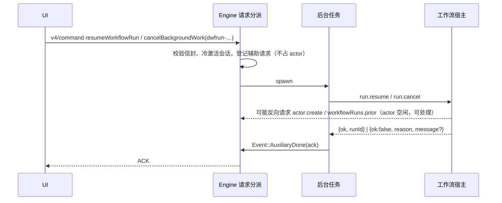
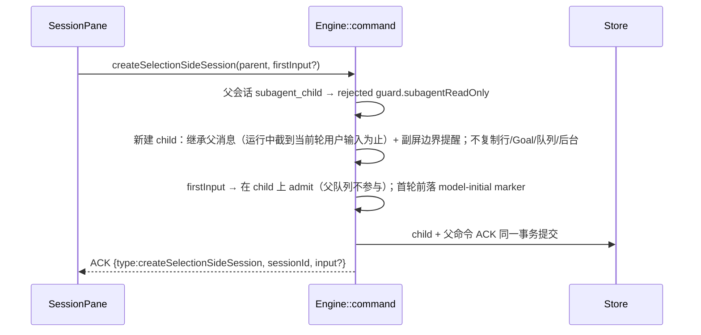

# Rust V4 命令缺口（2026-10-03 复查）

把共享协议 `commandPayloadSchemas`（`packages/shared/src/zcode-protocol-v4/command.ts`）的全部命令类型与 Rust
`crates/core` 的处理逐条比对，App 在用、Rust 完全没有处理的命令共 5 个——Rust 对未知命令一律
`rejected / guard.capabilityUnsupported`，UI 动作直接失败。

| 命令                         | App 入口                                                 | 状态                                 |
| ---------------------------- | -------------------------------------------------------- | ------------------------------------ |
| `setAssistantFeedback`       | 助手回复点赞 / 点踩（`v4/SessionPane.tsx`）              | **已实现**，差分一致                 |
| `createSelectionSideSession` | 框选「问一问」副屏（`v4/SessionPane.tsx`）               | **已实现**，差分一致（已知差异见下） |
| `startSavedWorkflow`         | 设置页「已保存工作流」启动（`useSavedWorkflowLauncher`） | 待实现                               |
| `resumeWorkflowRun`          | 工作流运行侧栏「恢复」（`WorkflowRunSidePane`）          | **已实现**，差分一致                 |
| `amendWorkflowRunSettings`   | 工作流运行设置弹层（`useWorkflowRunPaneSettings`）       | 待实现                               |

Workspace hook 的四个命令（`requestWorkspaceHookReview` 等）经 `kind.contains("WorkspaceHook")` 整体转发给工具层，已覆盖。

另有一个「命令存在、语义缺失」的缺口：`cancelBackgroundWork {workId: dwfrun-…}`（run 卡 / 详情页的「取消」，三个入口
同一实现）——Rust 只认子代理与后台 Bash，对工作流 run 回 `noop`，取消按钮无效。**已修**，见下节。

## 工作流 run 的取消与恢复

TS：`runtime.cancelBackgroundTask`（initiator = user，非 strict）与 `app.resumeWorkflowRun`（`port.resume` + 追踪重臂）。
Rust 的 run 由工作流宿主（`__zcode-workflow-host`）执行，新增宿主方法 `run.cancel` / `run.resume`
（`apps/zcode-cli/packages/cli/src/workflow-host-runs.ts`），Engine 侧 `workflow_run_commands.rs`。

- 宿主处理中会反向请求会话 owner，Engine 不能在 actor 里同步等应答，故走 `mcp/list` 同款辅助请求。
- 恢复拒绝：`failed / fault.command.workflowRunResumeRejected.<reason>`，`message` 为宿主诊断或
  `workflow run resume rejected: <reason>`；取消拒绝（未找到 / 已终态）：`failed /
  fault.command.backgroundWorkCancelRejected.<not_found|not_running>`，`message` 为
  `background work <id> was not cancelled: <reason>`——均与 Node 原文一致。
- 验收：`zcode-cli-rust-workflow-run-commands.test.ts`（actor 挂住时 UI 取消 → 停止通知 → UI 恢复 → actor 重跑结算 →
  完成通知；未知 run 的恢复 / 取消、已完结 run 的取消，两侧 ACK 与通知逐字一致）。

## setAssistantFeedback

TS 以 transcript metadata 为持久权威、事件推进投影。Rust 的会话行本身随会话落库，反馈直接写在 assistantText 行的
`feedback` 字段（`null` 删除字段），推送 `row.upserted`，与命令 ACK 同一次提交，冷恢复随行还原。

- CAS 命令：缺 `baseRevision` 报错；stale 在命令入口判定。
- 目标行不存在 → `stale / proto.staleTarget`；不是 assistantText → `rejected / guard.actionUnavailable`；同值反馈仍 `accepted`。
- 验收：`zcode-cli-rust-assistant-feedback.test.ts`（like / 重复 like / dislike / 清除 / userInput 行 / 不存在行 / 重启恢复，两侧逐字一致）。

## createSelectionSideSession

TS：handler + core `createSelectionSideConversation`。Rust `selection_side_session.rs`：

- child：`sess_` 前缀 id、`taskType = selection_side_chat`、标题 `Selection side chat`（generated，不生成标题）、
  `listed = false`（不进任务列表）、继承父模式 / plan / followup、附件、Skill 目录与提示快照；模型取 firstInput
  的 `modelSelection`，缺省继承父会话。
- 副屏内 `sendGoalCommand / pauseGoal / resumeGoal / editUserQuery / retryTurn / forkAssistant / discardSharedContext`
  → `failed / guard.selectionSideChatRestrictedCommand`。
- 验收：`zcode-cli-rust-selection-side-session.test.ts`（ACK、子会话行、模型请求会话部分、sessionKind/标题、列表不可见、
  受限命令、无首条输入的副屏，两侧逐字一致）。

### 已知差异

- marker 的 `toThought`：Node 副屏 child 投影的 `config.thought` 为空串，Rust 填实际档位。
- shell 环境变更提醒：Node 恢复 runtime（副屏、fork、跨进程冷恢复）且 shell 快照未还原时注入
  `The Bash tool shell is …`（Windows 自动检测 Git Bash 时必注入），Rust 尚未实现该提醒，属跨路径缺口，单独处理。

## 其他顺带发现（待处理）

- Rust `forkAssistant` 的 child：`task_type` 为 `interactive`（Node `fork`，影响 `sessionKind`），id 无 `sess_` 前缀
  （`#sess_*` 引用与 ReadSessionContext 只认该格式），且不追加 Node 的 fork 提示消息。
